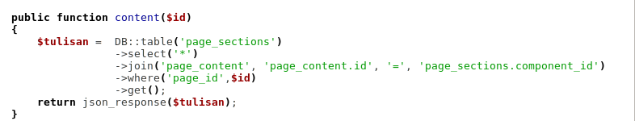
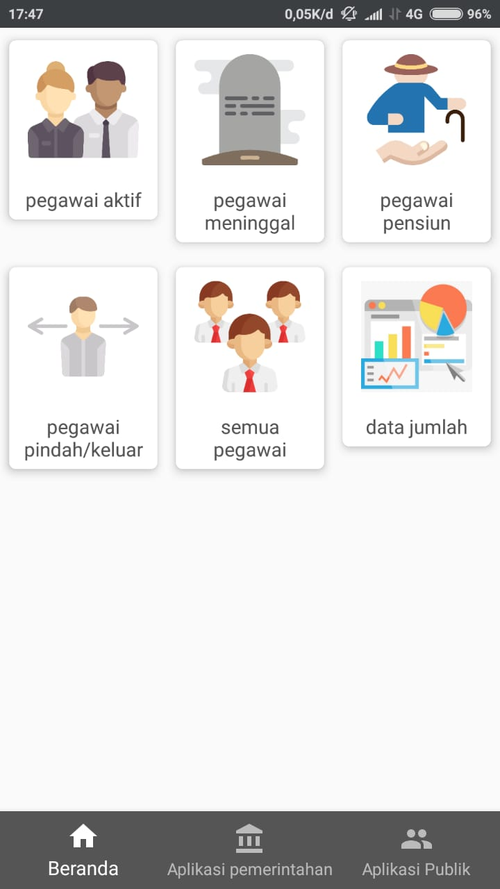
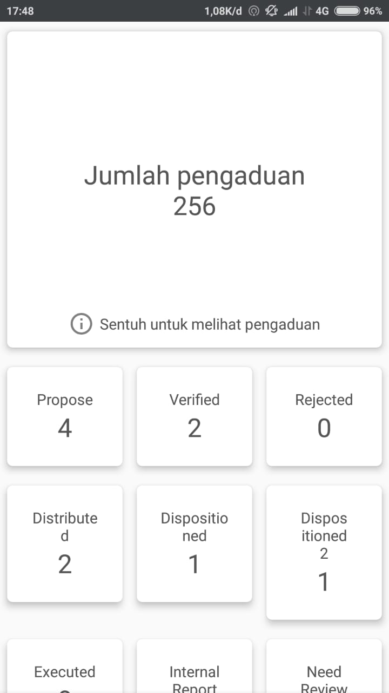
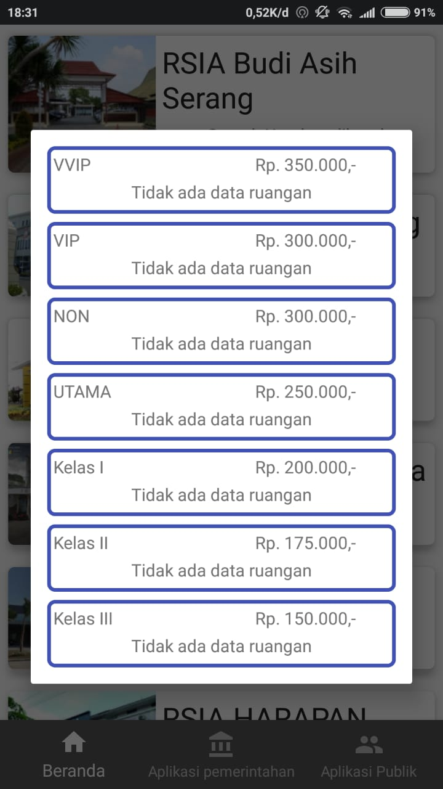

## DAFTAR ISI
* Will be replaced with the ToC, excluding the "Contents" header
{:toc}

## Integrasi dan Pengujian Banten Satu Data JAWARA e-Gov

Banten Satu Data JAWARA e-Gov adalah sebuah aplikasi sistem informasi Provinsi Banten yang berbasis android yang dikeluarkan oleh pemerintah Provinsi Banten untuk memudahkan bagi masyarakat dalam melakukan pencarian informasi serta menjadi satu pintu bagi semua aplikasi dan pelayanan yang tersedia pada Pemerintahan Provinsi Banten.

## 1. Integrasi JAWARA e-Gov
Integrasi aplikasi dilakukan dengan:
1. melalui antar muka aplikasi atau melalui method
2. *focus method level*
3. method di*share* dengan meletakannnya pada sebuah server pusat / dengan mengakses *method* pada aplikasi.

*Application Programming Interface*
mekanisme terdefinisi dibuat untuk berhubungan dengan sumber daya seperti server aplikasi, *middleware*, dan basis data.

Dibawah ini adalah pengintegrasian yang terdapat didalam Banten Satu data JAWARA e-Gov:

### 1.1 Public Function Content

### 1.2 Public Function Index

#### 1.3 Public Function Menu

### 1.4 Public Function Submenu

Pada Integrasi ini semua response baik *Success Response* maupun *Error Response* hasilnya akan ditampilkan dalam bentuk Json. 

## 2. Pengujian JAWARA e-Gov

Pada pengujian ini akan menggunakan User Acceptance Test (UAT).

Dibawah ini adalah pengujian yang dilakukan didalam aplikasi Banten Satu Data JAWARA e-Gov:

### 2.1 Loading JAWARA e-Gov

| Akses                | URL/ Image                               | Ada  | Tidak |
| -------------------- | ---------------------------------------- | ---- | ----- |
| Loading JAWARA e-Gov |  |      |       |

Dalam tabel ini *user* dapat melakukan test kepada aplikasi apakah **Loading JAWARA e-Gov** sudah dapat diakses oleh *user* atau tidak. Untuk mengecek dapat diakses tidaknya konten ini *user* dapat membuka aplikasi Jawara e-Gov, jika sudah dapat diakses *user* dapat meceklis pada kolom "Ada" sedangkan jika belum dapat diakses maka *user* dapat menceklis pada kolom "tidak".

### 2.2 Dashboard JAWARA e-Gov

| Akses                  | URL/ Image                               | Ada  | Tidak |
| ---------------------- | ---------------------------------------- | ---- | ----- |
| Dashboard JAWARA e-Gov |  |      |       |

Pada tampilan ini user dapat melihat layanan - layanan yang tersedia pada aplikasi Banten Satu Data JAWARA e-Gov,dalam tampilan dashboard ini *user* dapat mengakses beberapa layanan yang sudah disediakan seperti layanan kesehatan, layanan bantuan, layanan informasi, layanan kepegawaian, dll. Untuk mengecek dapat diakses tidaknya konten ini *user* dapat melihat di aplikasi android JAWARA e-Gov, jika sudah dapat diakses *user* dapat meceklis pada kolom "Ada" sedangkan jika belum dapat diakses maka *user* dapat menceklis pada kolom "tidak".

#### 2.2.1 Layanan Kepegawaian

| Akses                  | URL/ Image                               | Ada  | Tidak |
| ---------------------- | ---------------------------------------- | ---- | ----- |
| Layanan Kepegawaian |  |      |       |

Pada tampilan Layanan Kepegawaian ini dapat diakses dengan mengklik icon Layanan Kepegawaian, pada Layanan Kepegawaian terdapat beberapa informasi yang dapat diakses oleh *user* seperti Pegawai Aktif, Pegawai Meninggal, Pegawai Pensiun, Pegawai Pindah/Keluar,Semua Pegawai dan Data Jumlah. Untuk mengecek dapat diakses tidaknya konten ini *user* dapat melihat di aplikasi android JAWARA e-Gov, jika sudah dapat diakses *user* dapat meceklis pada kolom "Ada" sedangkan jika belum dapat diakses maka *user* dapat menceklis pada kolom "tidak".

##### 2.2.1.1 Pegawai Aktif

| Akses                  | URL/ Image                               | Ada  | Tidak |
| ---------------------- | ---------------------------------------- | ---- | ----- |
| Pegawai Aktif |  |      |       |

Halaman Pegawai Aktif ini dapat oleh *user* dengan mengklik icon Pegawai Aktif pada menu Layanan Pegawai, pada tampilan ini *user* dapat melihat data pegawai yang masih aktif dalam pemerintahan Provinsi Bnaten. Untuk mengecek dapat diakses tidaknya konten ini *user* dapat melihat di aplikasi android JAWARA e-Gov, jika sudah dapat diakses *user* dapat meceklis pada kolom "Ada" sedangkan jika belum dapat diakses maka *user* dapat menceklis pada kolom "tidak".

#### 2.2.2 Layanan Pengaduan

| Akses                  | URL/ Image                               | Ada  | Tidak |
| ---------------------- | ---------------------------------------- | ---- | ----- |
| Layanan Pengaduan |  |      |       |

Pada tampilan Layanan Pengaduan ini dapat diakses dengan mengklik icon Layanan Pengaduan ini *user* dapat melihat informasi mengenai data pengaduan yang telah dikirum melalui aplikasi Epormas. Untuk mengecek dapat diakses tidaknya konten ini *user* dapat melihat di aplikasi android JAWARA e-Gov, jika sudah dapat diakses *user* dapat meceklis pada kolom "Ada" sedangkan jika belum dapat diakses maka *user* dapat menceklis pada kolom "tidak".

##### 2.2.2.1 Lihat Pengaduan

| Akses                  | URL/ Image                               | Ada  | Tidak |
| ---------------------- | ---------------------------------------- | ---- | ----- |
| Lihat Pengaduan |  |      |       |

Lihat Pengaduan ini dapat diakses dengan mengklik kotak Jumlah Pengaduan, pada tampilan ini *user* dapat melihat data pengaduan yang telah masuk kedalam aplikasi eEpormas. Untuk mengecek dapat diakses tidaknya konten ini *user* dapat melihat di aplikasi android JAWARA e-Gov, jika sudah dapat diakses *user* dapat meceklis pada kolom "Ada" sedangkan jika belum dapat diakses maka *user* dapat menceklis pada kolom "tidak".

#### 2.2.3 Layanan Kesehatan

| Akses                  | URL/ Image                               | Ada  | Tidak |
| ---------------------- | ---------------------------------------- | ---- | ----- |
| Layanan Kesehatan |  |      |       |

Pada tampilan Layanan Kesehatan ini dapat diakses dengan mengklik icon Layanan Kesehatan, pada tampilan ini *user* dapat melihat informasi mengenai layanan - layanan kesehatan yang tersedia pada pemerintahan Provinsi Banten, pada tampilan ini *user* dapat mengakses informasi mengenai Rumah Sakit,Kamar Inap, Dokter, Data Yankes dan Data Rekapitulasi Puskesmas. Untuk mengecek dapat diakses tidaknya konten ini *user* dapat melihat di aplikasi android JAWARA e-Gov, jika sudah dapat diakses *user* dapat meceklis pada kolom "Ada" sedangkan jika belum dapat diakses maka *user* dapat menceklis pada kolom "tidak".

##### 2.2.3.1 Kamar Inap

| Akses                  | URL/ Image                               | Ada  | Tidak |
| ---------------------- | ---------------------------------------- | ---- | ----- |
| Kamar Inap |  |      |       |

Pada tampilan Kamar Inap ini *user* dapat melihat data - data kamar inap yang tersedia pada rumah sakit - rumah sakit yang berada di Provinsi Banten. Untuk mengecek dapat diakses tidaknya konten ini *user* dapat melihat di aplikasi android JAWARA e-Gov, jika sudah dapat diakses *user* dapat meceklis pada kolom "Ada" sedangkan jika belum dapat diakses maka *user* dapat menceklis pada kolom "tidak".

###### 2.2.3.1.1 Detail Kamar Inap

| Akses                  | URL/ Image                               | Ada  | Tidak |
| ---------------------- | ---------------------------------------- | ---- | ----- |
| Detail Kamar Inap |  |      |       |

Pada tampilan Detal Kamar Inap ini dapat diakses dengan mengklik gambar rumah sakit yang berada pada Layanan Kamar Inap, pada layanan ini *user* dapat melihat data kamar inap yang berada pada rumah sakit tersebut beserta list harga kamar inap yang berada pada rumah sakit tersebut. Untuk mengecek dapat diakses tidaknya konten ini *user* dapat melihat di aplikasi android JAWARA e-Gov, jika sudah dapat diakses *user* dapat meceklis pada kolom "Ada" sedangkan jika belum dapat diakses maka *user* dapat menceklis pada kolom "tidak".

### 2.3 Aplikasi Pemerintah

| Akses               | URL/ Image                               | Ada  | Tidak |
| ------------------- | ---------------------------------------- | ---- | ----- |
| Aplikasi Pemerintah |  |      |       |

Tampilan Aplikasi Pemerintah dapat diakses dengan mengklik icon Aplikasi Pemerintah pada menu dibawah aplikasi, pada tampilan Aplikasi Pemerintah ini *user* dapat melihat aplikasi - aplikasi pemerintah yang terdapat pada pemerintahan Provinsi Banten. Untuk mengecek dapat diakses tidaknya konten ini *user* dapat melihat di aplikasi android JAWARA e-Gov, jika sudah dapat diakses *user* dapat meceklis pada kolom "Ada" sedangkan jika belum dapat diakses maka *user* dapat menceklis pada kolom "tidak".

### 2.4 Aplikasi Publik

| Akses           | URL/ Image                               | Ada  | Tidak |
| --------------- | ---------------------------------------- | ---- | ----- |
| Apliaksi Publik |  |      |       |

Tampilan Apliaksi Publik ini dapat diakses dengan mengklik icon Aplikasi Publik pada daftra menu yang berada pada bagian bawah aplikasi, pada tampilan ini *user* dapat melihat aplikasi - aplikasi layanan publik yang terdapat pada pemerintahan Provinsi Banten. Untuk mengecek dapat diakses tidaknya konten ini *user* dapat melihat di aplikasi android JAWARA e-Gov, jika sudah dapat diakses *user* dapat meceklis pada kolom "Ada" sedangkan jika belum dapat diakses maka *user* dapat menceklis pada kolom "tidak".
