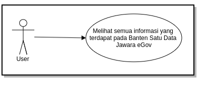
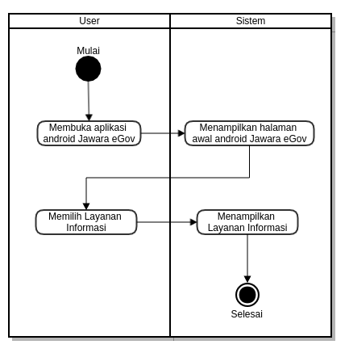
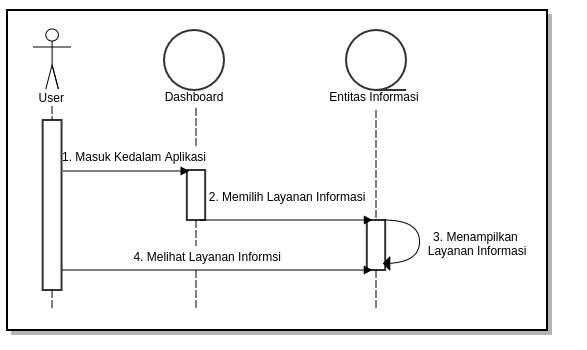
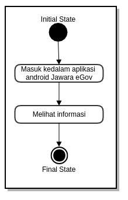
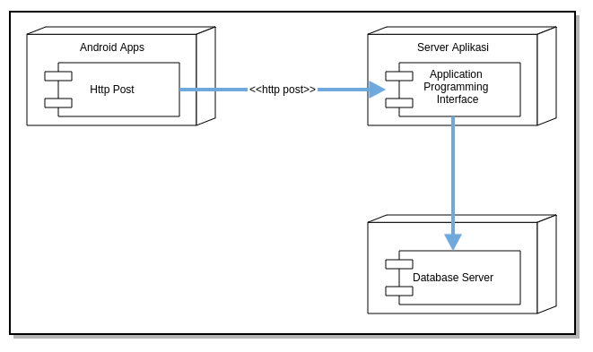
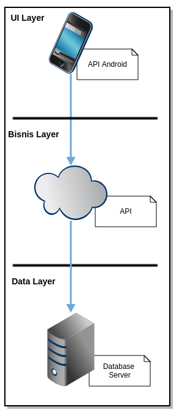
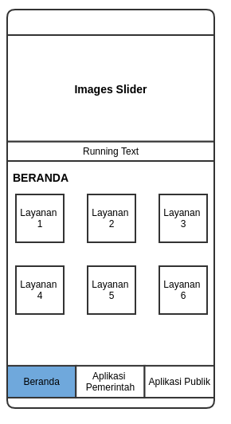
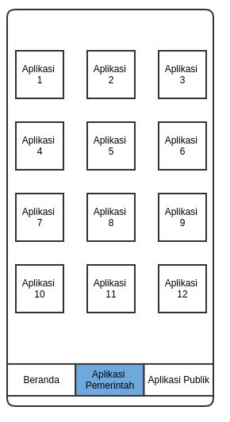
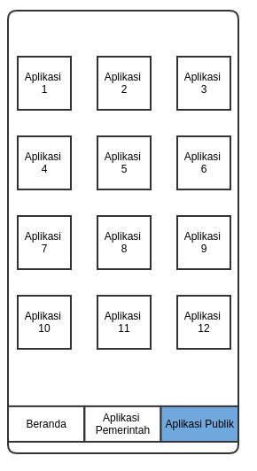

## Abstrak

Seiring dengan perkembangan zaman, saat ini kita telah memasuki era dimana informasi sangat penting untuk masyarakat. Demi membantu masyarakat dalam mencari segala informasi pemerintahan yang terdapat pada pemerintahan Provinsi Banten sehingga dibutuhkannya sebuah wadah bagi masyarakat dalam mencari informasi khususnya dalam ruang lingkup Provinsi Banten. 

pada saat ini perangkat seluler merupakan kebutuhan yang wajib dimiliki oleh setiap orang untuk melakukan berbagai hal seperti komunikasi, bertukar informasi dan melakukan hal-hal lainnya. Salah satu sistem operasi perangkat seluler yang banyak digunakan dan perkembangannya
sangat pesat saat ini adalah android.

Android merupakan sebuah sistem operasi yang bersifat open source. Artinya programmer diizinkan oleh pengembang sistem operasi untuk membuat, mengubah, mengembangkan dan menyebarluaskan aplikasi. Dengan memanfaatkan teknologi telepon seluler yang
menggunakan sistem operasi android, sangat memungkinkan dibuat sebuah aplikasi yang dapat mengerjakan proses yang telah diceritakan di atas dan harusnya memenuhi

## Daftar Isi

* Will be replaced with the ToC, excluding the "Contents" header
{:toc}

## 1. Pendahuluan

### 1.1 Latar Beakang

Banten Satu Data *E-government* menjadi proses pemanfaatan tekhnologi informasi sebagai media untuk membantu menjalankan sistem pemerintahan secara lebih efektif dan efisien. Sebagai wujud dari penerapan e-government di Indonesia salah satunya adalah dengan pembuatan android pemerintah daerah.

Pemerintahan yang baik harus memiliki sebuah wadah informasi yang dapat menjadi prasarana bagi masyarakat untuk mengetahui kegiatan kepemerintahan maupun info yang meliputi Profil Pemerintah, Profil Provinsi dan informasi-informasi lainnya yang dapat dibuka untuk umum yang nantinya akan terhubung langsung  terhubung dengan website yang ada.

Saat ini belum terdapat aplikasi android yang menampung informasi yang ada di Banten sehingga jika masyarakat ingin mencari suatu informasi ia harus mencari website terkait dengan informasi yang dicari, sehingga agak merepotkan bagi masyarakat. Dengan adanya Banten Satu Data JAWARA E-gov ini diharapkan dapat membantu masyarakat dalam mencari informasi yang terdapat didalam pemerintahan Provinsi Banten khususnya dalam penggunaan android.

### 1.2 Tujuan

Tujuan dari perancangan android Banten Satu Data Jawara eGov ini adalah sebagai berikut:

 1. Mempermudah masyarakat dalam mencari informasi
 2. Untuk satu pintu bagi semua apliaksi OPD yang terdapat dipemerintahan Banten

### 1.3 Karakteristik Produk

 1. dapat menyajikan informasi mengenai pemerintahan Provinsi Banten
 2. Dikembangkan menggunakan *native*
 3. *User Friendly* (menggunakan *interface* / antarmuka yang mudah digunakan oleh *user*)

### 1.4 Keluaran yang diinginkan

 1. Tersedianya aplikasi android yang dapat membantu masyarakat dalam pencarian informasi khususnya dalam ruang lingkup Provinsi Banten.
 2. Tersedianya dokumentasi API yang digunakan

## 2. METODE PENELITIAN

Untuk memperoleh data yang dapat menunjang aplikasi ini, maka di perlukan data teoritis dan data dinas terkait untuk mendapatkan data dan informasi yang berhubungan dengan aplikasi ini.
Adapun penyusun melakukan beberapa penelitian yang dilakukan dengan :

### 2.1 Metode yang Digunakan

Menggunakan metode *Prototyping* untuk melakukan perancangan sistem informasi berbasis web.

Ilustrasi alur *Prototyping*

### 2.2 Metode Pengumpulan Data

Untuk mengumpulkan data yang diperlukan untuk membangun sistem ini diadakan wawancara dan studi pustaka. Pengumpulan data ini dilakukan untuk mengetahui permasalahan dan gambaran sistem yang sedang berjalan sehingga dapat mengembangkannya untuk membentuk sistem baru yang dapat mendukung sistem yang sedang berjalan.

* Wawancara ini dilakukan kepada Pemprov Banten. Wawancara dilakukan kepada sistem analist Pemprov Banten untuk mengetahui permasalahan dalam proses pendataan yang sedang berjalan sekarang.
* Studi pustaka, melakukan pengumpulan informasi dari buku text, internet sebagai referensi.

### 2.3 Metode Analisis

Tim pengembang aplikasi akan melakukan analisis jika diperlukan dapat dilakukan survey pendahuluan untuk melihat sejauh mana kebutuhan pengguna akan sistem yang akan dibangun, fasilitas yang akan dibangun, data-data yang dibutuhkan, dll. Dalam analisis ini dilakukan diskusi-diskusi baik dengan bagian terkait pada satuan kerja.

### 2.4 Ruang Lingkup Sistem Informasi / Aplikasi

 1. Menyediakan aplikasi android pemerintah sebagai wadah bagi masyarakat dalam mencari informasi.
 2. Menyediakan aplikasi android pemerintah sebagai wadah untuk semua informasi aplikasi yang terdapat di setiap dinas / OPD dilingkungan pemerintah provinsi Banten

### 2.5 Waktu dan Jadwal Pelaksanaan dan Lokasi Kegiatan

 1. Waktu Pelaksanaan kegiatan : 4 bulan sejak dikeluarkan SPK sampai dengan Pemakaian
 2. Lokasi Kegiatan : Kantor OPD terkait dan Dinas Komunikasi Informasi Statistika dan Persandian Pemerintah Provinsi Banten

## 3. Hasil dan Pembahasan

### 3.1  Perencanaan Aplikasi

**Banten Satu Data JAWARA E-gov** adalah wadah untuk mengumpulkan informasi-informasi pada Provinsi Banten, yang dmana sistem ini akan mempermudah masyarakat dalam mencari informasi yang ada di Provinsi Banten.

### 3.2 Perancangan Sistem

Permodelan rancangan sistem yang digunakan adalah UML *(Unified Modeling Language)*. Menurut Whitten dan Bentley (2007, p.381), Unified Modeling Language adalah kumpulan rancangan diagram untuk membangun sebuah sistem atau aplikasi yang dimana setiap diagram menyediakan sistem informasi kepada tim pengembang dengan berbagai sudut pandang yang berbeda – beda. UML yang digunakan terdiri dari use case diagram, activity diagram, sequence diagram, state chart diagram, deployment diagram dan technology stack diagram.

#### 3.2.1 *Use Case Diagram*

#### 3.2.2 *Activity Diagram*

#### 3.2.3 *Sequence Diagram*

#### 3.2.4. *State Chart Diagram*

#### 3.2.5 Deployment Diagram

#### 3.2.6 Technology Stack Diagram

### 3.3 Tahapan Pekerjaan

Tahap-tahap atau langkah yang dilakukan dalam mengembangkan Android Banten Satu Data Jawara eGov adalah sebagai berikut:

#### 3.3.1 Analisis dan Perancangan

**Analisis**

Tim pengembang aplikasi akan melakukan analisis jika diperlukan dapat dilakukan survey pendahuluan untuk melihat sejauh mana kebutuhan pengguna akan sistem yang akan dibangun, fasiitas yang akan dibangun, data-data yang dibutuhkan, dll. Dalam analisis ini akan dilakukan diskusi-diskusi dengan bagian terkait pada satuan kerja.

**Perancangan Sistem**

Perancangan sistem dilaksanakan setelah proses analisis dilaksanakan dan telah disepakati modul dan prosedur-prosedur yang akan diterapkan dalam sistem.

#### 3.3.2 Pembangunan Sistem

Setelah proses analisis dan perancangan sistem selesai dilakukan, tahapan selanjutnya adalah pembangunan sistem, yang meliputi kegiatan: pembuatan struktur database, pembuatan kode program/coding, pembuatan laporan-laporan.

#### 3.3.3 Integrasi dan Pengujian

**Integrasi**

Setelah proses pengembangan sistem selesai dilakukan, tahapan selanjutnya adalah Integrasi sistem, yang meliputi kegiatan: pembuatan struktur database terkait integrasi, pembuatan kode program/coding terkait integrasi, pembuatan laporan-laporan terkait integrasi.

**Pengujian**

Sistem yang telah selesai dibuat akan diuji coba menggunakan data test sebelum sistem dijalankan. Dalam uji coba sistem ini akan diterapkan metode *prototype*, yaitu jika terjadi kesalahan/kekurangan baik proses maupun *output* sistem, maka kesalahan/kekurangan tersebut akan diperbaiki/ditambahkan,
sehingga memungkinkan pengembang untuk kembali ke tahapan pertama yaitu analisa (jika kekurangan sistem memang tidak terdefinisikan dalam dokumen perancangan sistem).

### 3.4 Hasil

Berikut ini adalah hasil eksekusi Android Banten Satu Data Jawara eGov

#### 3.4.1 Layout Tampilan Beranda

Layout ini akan tampil ketika *user* masuk kedalam aplikasi Banten Satu Data Jawara eGov, pada tampilan ini berisi informasi layanan - layanan yang telah disediakan oleh pemerintah Provinsi Banten.

#### 3.4.2 Layout Tampilan Aplikasi Pemerintah

Layout tampilan dapat diakses oleh *user* dengan mengklik menu Aplikasi Pemerintah pada list menu aplikasi Banten Satu Data, pada tampilan ini *user* dapat melihat aplikasi - aplikasi pemerintahan Provinsi Banten. Di tampilan ini *user* dapat pindah ke aplikasi - aplikasi pemerintahan dengan mengklik *icon* aplikasi yang terdapat pada menu ini.

#### 3.4.3 Layout Tampilan Aplikasi Publik

Layout tampilan dapat diakses oleh *user* dengan mengklik menu Aplikasi Publik pada list menu aplikasi Banten Satu Data, pada tampilan ini *user* dapat melihat aplikasi - aplikasi untuk publik pada pemerintahan Provinsi Banten. Di tampilan ini *user* dapat pindah ke aplikasi - aplikasi tersebut dengan mengklik *icon* aplikasi yang terdapat pada menu ini.

## 4. Penutup

Dengan adanya pembuatan dari aplikasi Banten Satu Data Jawara eGov  ini dapat membantu masyarakat dalam mencari informasi atau laporan yang terdapat di pemerintahan Banten, sehingga masyarakat tidak bingung jika ingin mencari informasi atau laporan yang ada.
