## ABSTRAK
Media Ruang merupakan jenis reklame yang terbuat dari papan atau besi atau aluminium. Reklame ini biasanya ditempatkan di lokasi yang dapat dilihat dan dibaca oleh masyarakat umum. Masalah yang sering dihadapi oleh pihak penyewa adalah menentukan lokasi titik reklame papan yang masih kosong, karena para penyewa selama ini harus melakukan survey secara langsung. Sedangkan masalah yang dihadapi oleh pihak pengelola (dalam hal ini pihak Pemerintah) adalah kesulitan dalam mengawasi dan mengontrol Media Ruang yang ada, mengingat lokasi titik Media Ruang yang sangat luas dan banyak.

Media Ruang adalah aplikasi yang disiapkan oleh pemerintah Provinsi Banten untuk memudahkan pengguna dalam mengetahui informasi tentang lokasi, status, serta demografi Media Ruang yang terdapat pada Provinsi Banten. Sehingga memudahkan bagi pihak pengelola (Pemerintah Provinsi Banten) dan penyewa dalam mencari informasi tentang Media Ruang yang tersedia pada Provinsi Banten.

## Daftar Isi
* Will be replaced with the ToC, excluding the "Contents" header
{:toc}

## 1. PENDAHULUAN

### 1.1 Latar Belakang
Banyaknya Media Ruang yang terdapat pada pemerintahan Provinsi Banten membuat pihak pemerintah dan masyarakat kesulitan dalam mencari informasi Media Ruang yang terdapat di Provinsi Banten.
Agar terdapatnya sebuah sistem yang baik dalam pendataan Media Ruang yang terdapat pada Provinsi Banten maka perlu dibuatnya sebuah wadah informasi untuk pemetaan dan pemberian informasi mengenai Media Ruang yang terdapat pada Provinsi Banten.

### 1.2 Maksud dan Tujuan

#### a) Maksud
Maksud dari kegiatan ini adalah untuk melakukan kegiatan pembuatan aplikasi Media Ruang yang berbasis website dan android.

#### b) Tujuan
Sistem Media Ruang Provinsi Banten dibangun dengan tujuan untuk memudahkan pemerintah dan masyarakat dalam mencari informasi mengenai lokasi, status, serta demografi Media Ruang yang terdapat pada Provinsi Banten.

### 1.3 Ruang Lingkup Pekerjaan
Ruang lingkup pekerjaan pada pembuiatan sistem informasi ini dilakukan di Dinas Komunikasi Informasi Statistika dan Persandian Provinsi Banten, adapun hasil dari kegiatan ini untuk dapat digunakan pada instansi dan masyarakat dilingkungan Pemerintah Provinsi Banten.

### 1.4 Ruang Lingkup Sistem Informasi / Aplikasi
* Menyediakan situs bagi seluruh Organisasi Perangkat Daerah yang ada dilingkungan Pemerintah Provinsi Banten untuk menyimpan Prosedur Operasional Baku yang berlaku dilingkungannya secara digital,

* Menyediakan proses pengadaan / pengembangan sistem informasi / aplikasi / website dan android secara digital untuk seluruh Organisasi Perangkat Daerah dilingkungan Pemeritah Provinsi Banten.

### 1.5 Keluaran yang diinginkan
* Tersedianya sistem informasi Media Ruang bagi sistem informasi / aplikasi / website dan android,

b) Tersedianya dokumen yang digunakan.

### 1.6 Waktu dan Jadwal Pelaksanaan dan Lokasi Kegiatan
a) Waktu pelaksanaan kegiatan : 3 bulan sejak dikeluarkan SPK sampai dengan pemakaian,
b) Lokasi kegiatan : Kantor OPD terkait dan Dinas Komunikasi Informasi Statistika dan Persandian Pemerintah Provinsi Banten.

## 2. METODE PENELITIAN
Untuk memperoleh data yang dapat menunjang aplikasi ini, maka di perlukan data teoritis dan data dinas terkait untuk mendapatkan data dan informasi yang berhubungan dengan aplikasi ini.
Adapun penyusun melakukan beberapa penelitian yang dilakukan dengan :

### 2.1 Metode Yang digunakan
Menggunakan metode *prototyping* untuk melakukan perancangan sistem informasi berbasis web.
Ilustrasi alur *prototyping*

### 2.2 Metode Pengumpulan Data
Untuk mengumpulkan data yang diperlukan untuk membangun sistem ini diadakan wawancara dan studi pustaka. Pengumpulan data ini diperlukan untuk mengetahui permasalahan dan gambaran sistem yang sedang berjalan sehingga dapat mengembangkannya untuk membentuk sistem baru yang dapat mendukung sistem yang sedang berjalan.
a). Wawancara ini dilakukan kepada Pemprov Banten. Wawancara dilakukan kepada sistem analist Pemprov Banten untuk mengetahui permasalahan dalam proses pendataan yang sedang berjalan sekarang.
b). Studi Pustaka, Melakukan pengumpulan melalui buku text, internet sebagai referensi.

## 3. HASIL PEMBAHASAN
### 3.1 Perencanaan Aplikasi
Sistem informasi Media Ruang adalah untuk mempermudah pemerintah dan masyarakat dalam mengawasi dan mengontrol Media Ruang yang ada.

### 3.2 Perancangan Sistem
Permodelan rancangan sistem yang digunakan adalah UML (Unified Modeling Language). Menurut Whitten dan Bentley (2007, p.381), Unified Modeling Language adalah kumpulan rancangan diagram untuk membangun sebuah sistem atau aplikasi yang dimana setiap diagram menyediakan sistem informasi kepada tim pengembang dengan berbagai sudut pandang yang berbeda-beda. UML yang kami gunakan terdiri dari use case diagram, activity diagram, sequence diagram, state chart diagram, class diagram, deploymen diagram dan technology diagram.

#### 3.2.1 Use Case Diagram
##### 3.2.1.1 Use Case Diagram Superadmin
[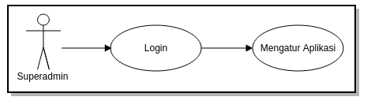](../images/billboard/desain-dan-perancangan/20180807_use-case_superadmin.png)

##### 3.2.1.2 Use Case Diagram OPD
[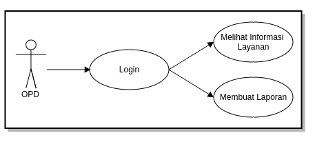](../images/billboard/desain-dan-perancangan/20180807_use-case_opd.png)

##### 3.2.1.3 Use Case Diagram User
[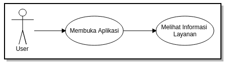](../images/billboard/desain-dan-perancangan/20180807_use-case_user.png)

#### 3.2.2 Activity Diagram
##### 3.2.2.1 Activity Diagram Superadmin
[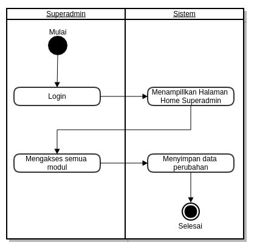](../images/billboard/desain-dan-perancangan/20180807_activity-diagram_superadmin.png)

##### 3.2.2.2 Activity Diagram OPD
[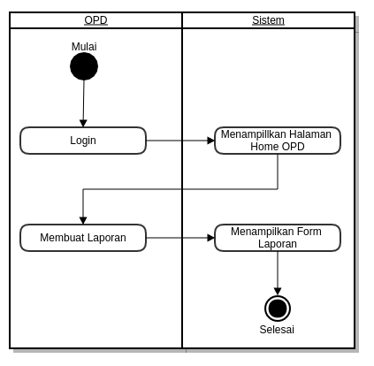](../images/billboard/desain-dan-perancangan/20180807_activity-diagram_opd.png)

##### 3.2.2.3 Activity Diagram User
[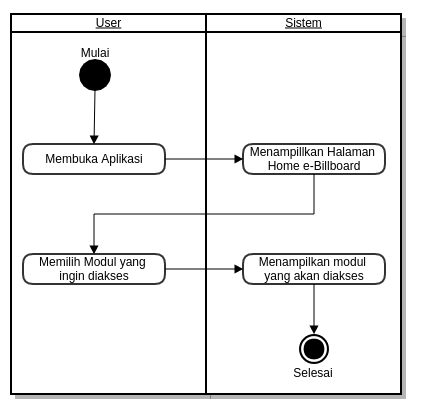](../images/billboard/desain-dan-perancangan/20180807_activity-diagram_user.png)

#### 3.2.3 Sequence Diagram
##### 3.2.3.1 Sequence Diagram Superadmin
[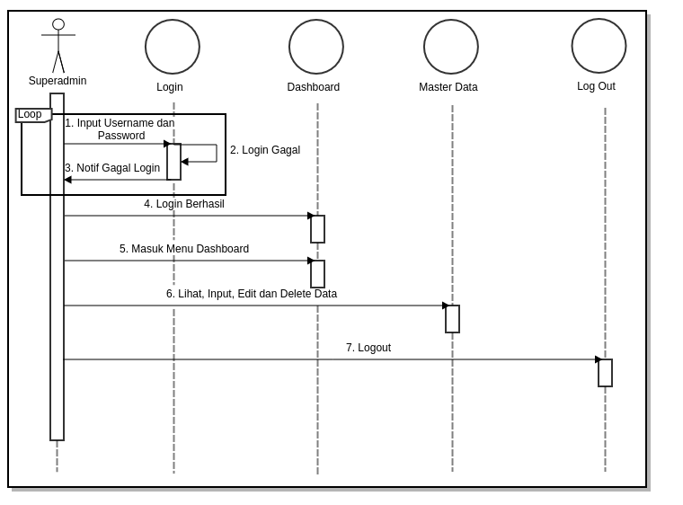](../images/billboard/desain-dan-perancangan/20180807_sequence_superadmin.png)

##### 3.2.3.2 Sequence Diagram OPD
[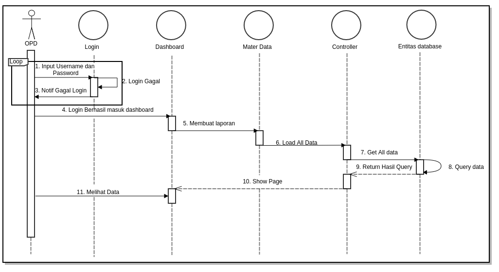](../images/billboard/desain-dan-perancangan/20180807_sequence_opd.png)

##### 3.2.3.3 Sequence Diagram User
[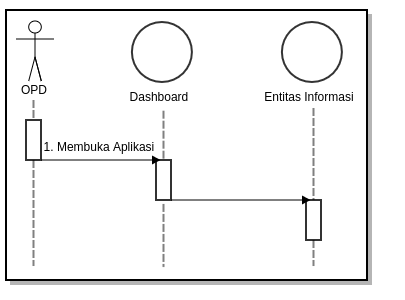](../images/billboard/desain-dan-perancangan/20180807_sequence_user.png)

#### 3.2.4 State Chart Diagram
##### 3.2.4.1 State Chart Diagram Superadmin

##### 3.2.4.2 State Chart Diagram OPD
[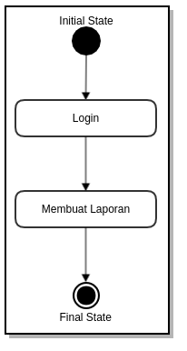](../images/billboard/desain-dan-perancangan/20180807_state-chart_opd.png)

#### 3.2.5 Deployment Diagram

#### 3.2.6 Technology Stack Diagram
[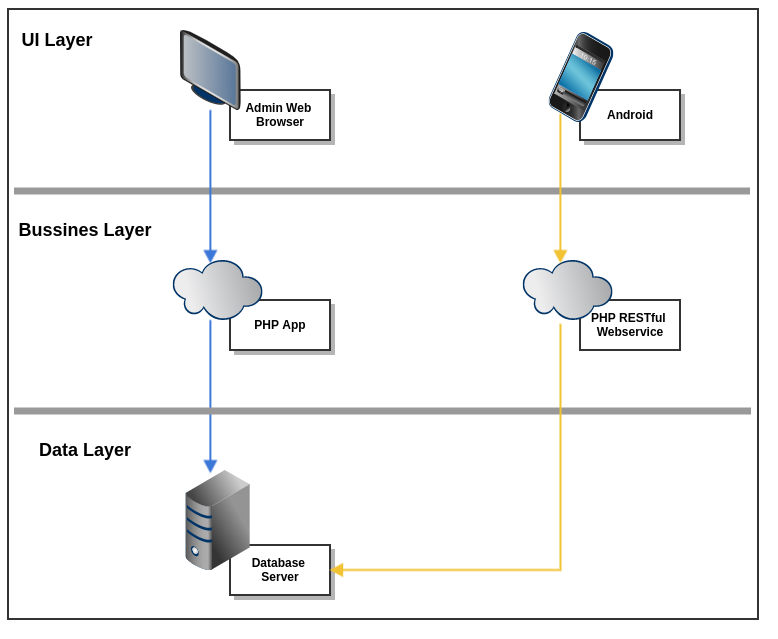](../images/new_ehibahbansos/desain-dan-perancangan/20180801_technology-stack-diagram.png)

### 3.3 Tahapan Pekerjaan :
Tahap-tahap atau langkah yang dilakukan dalam mengembangkan Sistem Informasi Media Ruang adalah sebagai berikut:

#### 3.3.1 Analisis dan Perancangan
1). Analisis
Tim pengembang aplikasi akan melakukan analisis jika diperlukan dapat dilakukan survey pendahuluan untuk melihat sejauh mana kebutuhan pengguna akan sistem yang akan dibangun, data-data yang dibutuhkan, dll. Dalam analisis ini dilakukana diskusi-diskusi baik dengan bagian terkait pada satuan kerja.

2). Perancangan Sistem
Perancangan sistem dilaksanakan setelah proses analisis dilaksanakan dan telah disepakati modul dan prosedur-prosedur yang akan diterapkan dalam sistem. Perancangan sistem meliputi kegiatan: penetapan alur data/dokumen, penetapan prosedur, perancangan database, perancangan form dan perancangan interface/dialog layar.

#### 3.3.2 Pembangunan Sistem
Setelah proses analisis dan perancangan sistem selesai dilakukan, tahapan selanjutnya adalah pembangunan sistem, yang meliputi kegiatan. Pembuatan struktur database, pembuatan kode program/koding, pembuatan laporan-laporan.

#### 3.3.3 Pengujian
Sistem yang telah selesai dibuat akan diuji coba menggunakan data test sebelum sistem dijalankan. Dalam uji coba sistem ini akan diterapkan metode prototye, yaitu jika terjadi kesalahan/kekurangan baik proses maupuan output sistem, maka kesalahan/kekurangan tersebut akan diperbaiki/ditambahkan, sehingga memungkinkan pengembang untuk kembali ke tahapan pertama yaitu analisa (jika kekurangan sistem memang tidak terdefinisikan dalam dokumen perancangan sistem).

### 3.4 Hasil
Berikut ini adalah hasil eksekusi sistem informasi Media Ruang dalam website dan android:

#### 3.4.1 Tampilan Awal Website

##### 3.4.1.1 Layout Home
[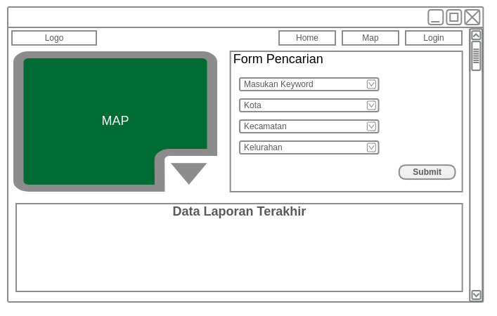](../images/billboard/desain-dan-perancangan/20180808_awal_home.png)

##### 3.4.1.2 Layout Map
[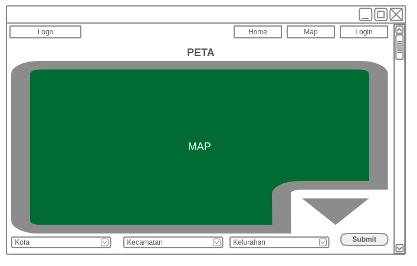](../images/billboard/desain-dan-perancangan/20180808_awal_map.png)

##### 3.4.1.3 Layout Login
[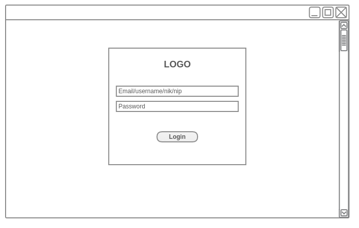](../images/billboard/desain-dan-perancangan/20180808_awal_login.png)

#### 3.4.2 Tampilan OPD

##### 3.4.2.1 Layout Home
[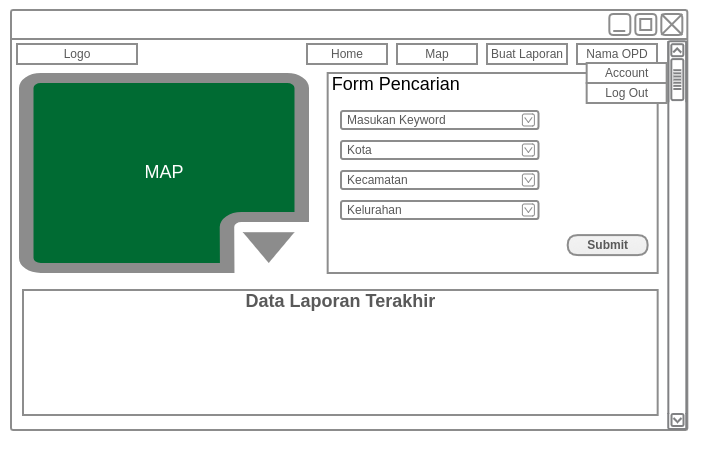](../images/billboard/desain-dan-perancangan/20180808_opd_home.png)

##### 3.4.2.2 layout Buat Laporan
[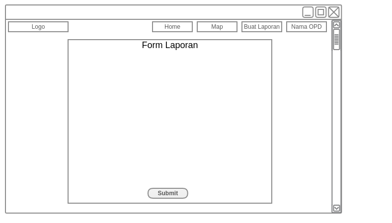](../images/billboard/desain-dan-perancangan/20180808_opd_form-laporan.png)

##### 3.4.2.3 Tampilan Accout OPD
[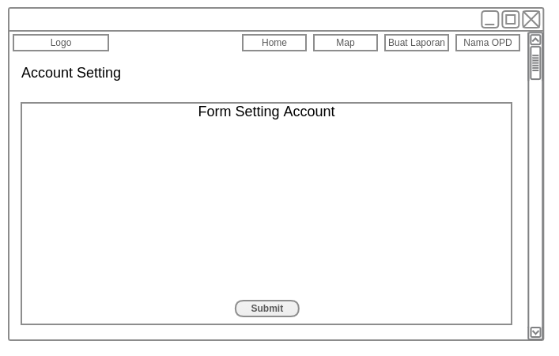](../images/billboard/desain-dan-perancangan/20180808_opd_account.png)

#### 3.4.3 Tampilan Superadmin

##### 3.4.3.1 Layout Dashboard
[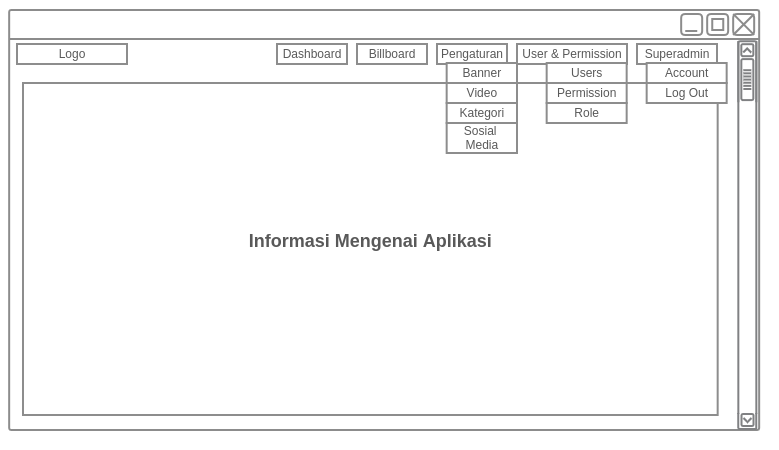](../images/billboard/desain-dan-perancangan/20180808_sa_home.png)

##### 3.4.3.2 Layout Media Ruang
[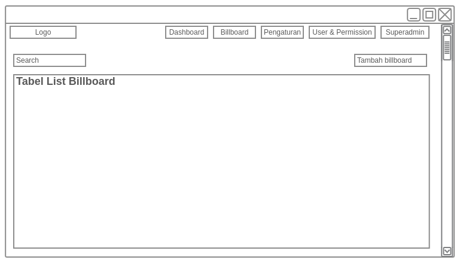](../images/billboard/desain-dan-perancangan/20180808_sa_billboard.png)

* **Layout Tambah Media Ruang**

##### 3.4.3.3 Layout Pengaturan

###### 3.4.3.3.1 Layout Banner
[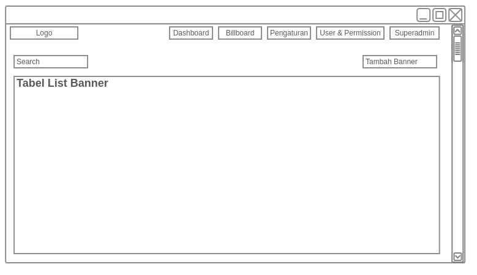](../images/billboard/desain-dan-perancangan/20180808_sa_pengaturan_banner.png)

* **Layout Tambah Banner**
  [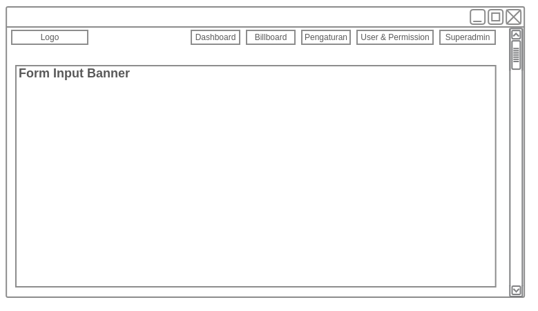](../images/billboard/desain-dan-perancangan/20180808_sa_pengaturan_banner_tambah.png)

###### 3.4.3.3.2 Layout Video
[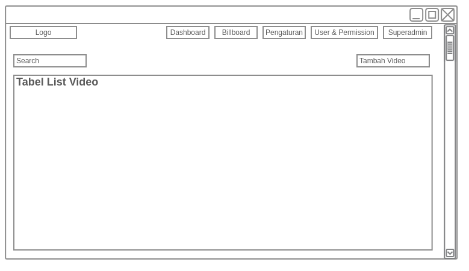](../images/billboard/desain-dan-perancangan/20180808_sa_pengaturan_video.png)

* **Layout Tambah Video**
  

###### 3.4.3.3.3 Layout Kategori

* **Layout Tambah Kategori**
  [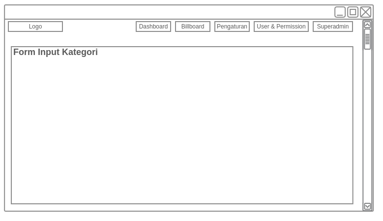](../images/billboard/desain-dan-perancangan/20180808_sa_pengaturan_kategori_tambah.png)

###### 3.4.3.3.4 Layout Sosial Media

* **Layout Tambah Sosial Media**
  [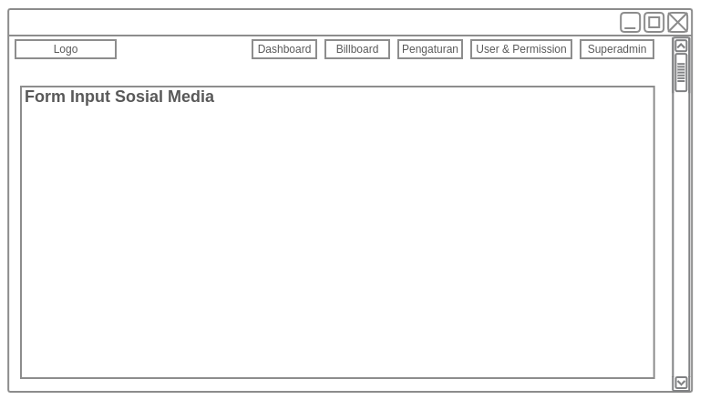](../images/billboard/desain-dan-perancangan/20180808_sa_pengaturan_sosial-media_tambah.png)

##### 3.4.3.4 Layout Users & Permission

###### 3.4.3.4.1 Layout User

* **Layout Tambah User**
  [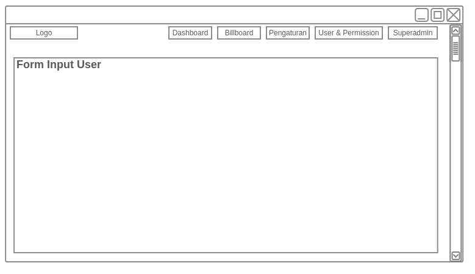](../images/billboard/desain-dan-perancangan/20180808_sa_user-and-permission_user_tambah.png)

###### 3.4.3.4.2 Layout Permission

* **Layout Tambah Permission**
  [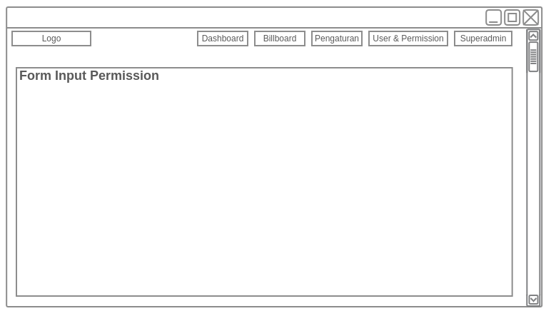](../images/billboard/desain-dan-perancangan/20180808_sa_user-and-permission_permission_tambah.png)

###### 3.4.3.4.3 Layout Role

* **Layout Tambah Role**
  

##### 3.4.3.5 Layout Setting Account Superadmin

#### 3.4.4 Tampilan Login Android
[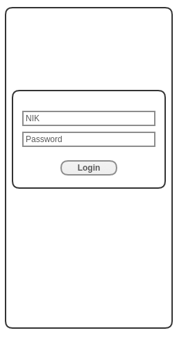](../images/billboard/desain-dan-perancangan/20180808_and_login.png)

#### 3.4.5 Tampilan View List
[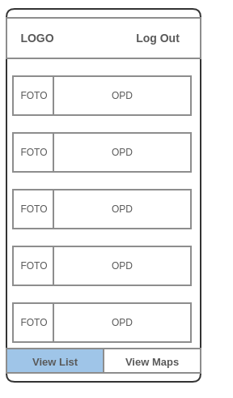](../images/billboard/desain-dan-perancangan/20180808_and_view-list.png)

##### 3.4.5.1 Tampilan View List Detail
[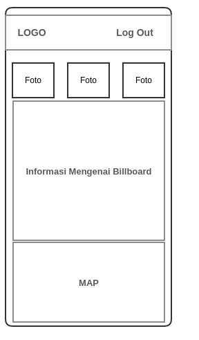](../images/billboard/desain-dan-perancangan/20180808_and_view-list_detail.png)

#### 3.4.6 Tampilan View Maps

##### 3.4.6.1 Tampilan Tambah Media Ruang
[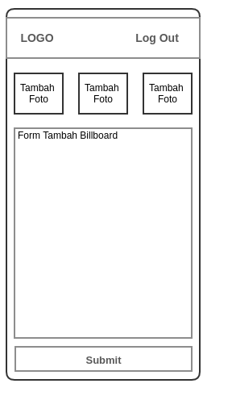](../images/billboard/desain-dan-perancangan/20180808_and_view-maps_tambah.png)

## 4. Penutup
Dengan adanya pembuatan dari aplikasi Media Ruang  ini dapat membantu pemerintah Provinsi Banten dalam mencari informasi mengenai lokasi, status, serta demografi Media Ruang yang terdapat pada Provinsi Banten sehingga memudahkan pemerintah dalam mengontrol dan mengawasi Media Ruang yang terdapat pada Provinsi Banten.
