## Daftar Isi

[TOC]

## e-Billboard

e-Billboard adalah sistem pada pemerintahan Provinsi Banten yang digunakan untuk mempermudah pemerintah dan masyarakat dalam mencari informasi mengenai lokasi, status serta demografi billboard yang terdapat pada Provinsi Banten.

## 1. Pendahuluan

### 1.1 Tujuan Pembuatan Implementasi

Dokumen User Manual Aplikasi e-Billboard ini dibuat untuk tujuan sebagai berikut:

1. Menggambarkan dan menjelaskan penggunaan aplikasi e-Billboard.
2. Sebagai panduan konfigurasi dan penggunaan aplikasi e-Billboard.

### 1.2 Deskripsi Umum Sistem

1. Deskripsi Umum Aplikasi e-Billboard adalah aplikasi yang berbasis web dan android yang akan dipakai oleh setiap golongan masyarakat dalam memudahkan untuk melakukan pemetaan dan pengumpulan informasi mengenai billboard yang terdapat pada Provinsi Banten.
2. Deskripsi Umum Kebutuhan Aplikasi yang Akan Diimplementasikan meliputi semua informasi yang bersifat teknis dan menjadi acuan dalam pengembangan aplikasi.

## 2. Struktur Menu

Adapun menu yang terdapat pada aplikasi e-Billboard adalah sebagai berikut:

### 2.1 Menu Website

1. Menu Halaman Awal Aplikasi
* Home
* Map
* Login

2. Menu OPD
* Home
* Map
* Buat Laporan
* Profile
	* Account
	* Log Out
  
3. Menu Superadmin
* Dashboard
* Billboard
* Pengaturan
	* Banner
	* Video
	* Sosial Media
* Users & Permission
	* Users
	* Permission
	* Role
* Profile
	* Account
	* Log Out

### 2.2 Menu Android
* View List
* View Map
  
## 3. Penggunaan

Pada bagian ini akan dijelaskan langkah - langkah penggunaan dari menu - menu yang terdapat pada aplikasi e-Billboard.

### 3.1 Website

#### 3.1.1 Halaman Awal e-Billboard

##### 3.1.1.1 Home e-Billboard

Untuk mengakses aplikasi e-Billboard, *user* dapat membuka web browser (IE, Mozila Firefox atau yang lainnya) dengan menulis alamat url https://bilboard.bangunbanten.com kemudian tekan Enter pada tombol keyboard atau klik tombol Go pada browser. Akan muncul tampilan halaman Home e-Billboard seperti gambar dibawah ini.

[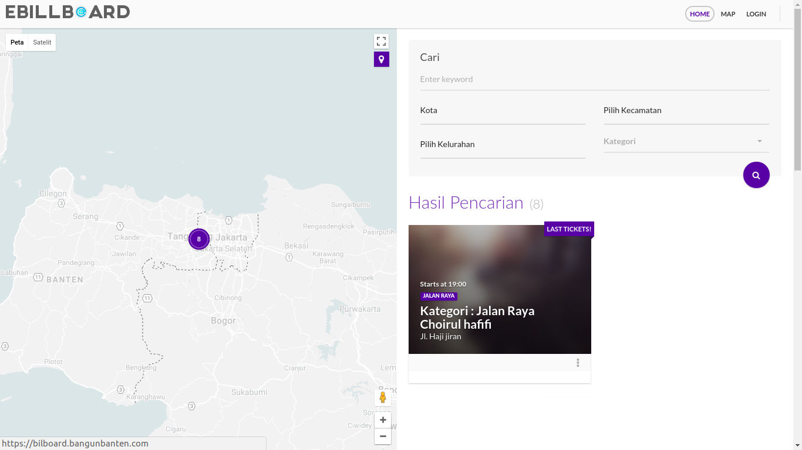](../images/sso/pengembangan/20180809_awal_home.png)
[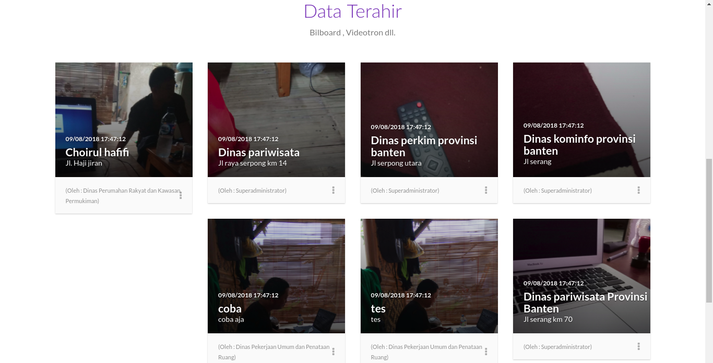](../images/sso/pengembangan/20180809_awal_home1.png)
[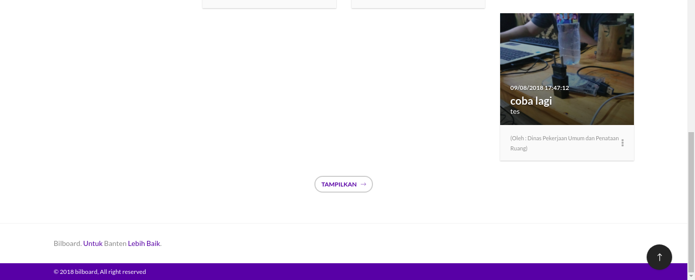](../images/sso/pengembangan/20180809_awal_home2.png)

Pada tampilan ini *user* dapat melihat informasi - informasi yang terdapat pada aplikasi e-Billboard seperti map dan data - data billboard yang sudah terdaftarkan ke dalam aplikasi. Pada halaman ini *user* dapat melakukan pencarian pada form pencarian yang terletak disebelah map.

##### 3.1.1.2 Tampilan Map

[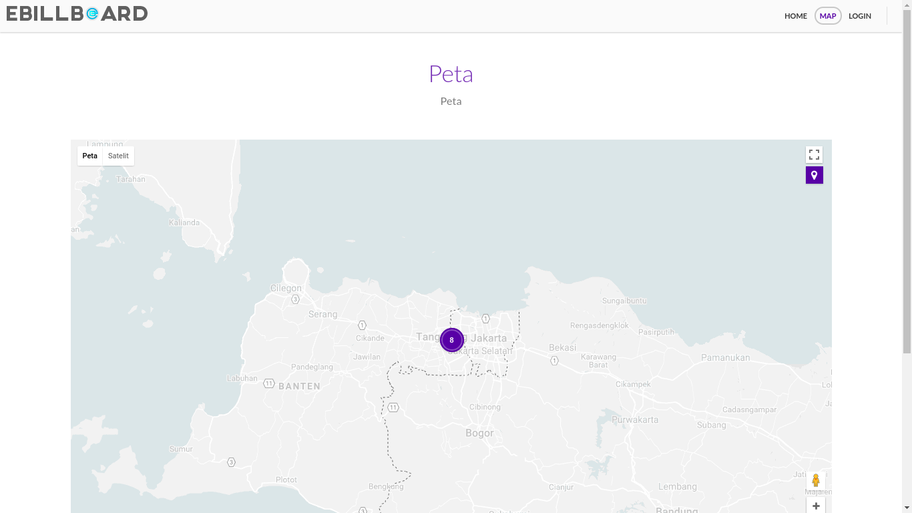](../images/sso/pengembangan/20180809_awal_map.png)
[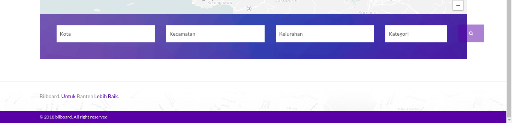](../images/sso/pengembangan/20180809_awal_map1.png)

Tampilan Map ini dapat diakses dengan mengklik tulisan Map pada daftar menu yang terdapat pada bagian atas aplikasi. Pada tampilan Map ini *user* dapat melihat map yang berisikan informasi letak - letak billboard pada daerah Banten. Pada Halaman ini *user* dapat melakukan pencarian billboard berdasarkan lokasi Kota, Kecamatan dan Kelurahan.

##### 3.1.1.3 Tampilan Login

[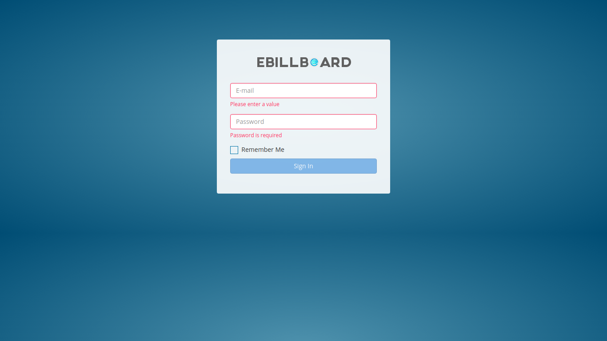](../images/sso/pengembangan/20180809_awal_login.png)

Tampilan Login ini dapat diakses dengan mengklik tulisan Login pada daftar menu yang terdapat pada bagian atas aplikasi. Pada tampilan ini *user* akan disajikan dengan form Login, Form login ini dapat digunakan oleh OPD dan Superadmin untuk masuk kedalam aplikasi e-Billboard sesuai dengan tupoksi nya masing - masing.

#### 3.1.2 Tampilan OPD
Tampilan ini dapat diakses oleh OPD ketika berhasil melakukan Login kedalam aplikasi e-Billboard.

##### 3.1.2.1 Tampilan Home

[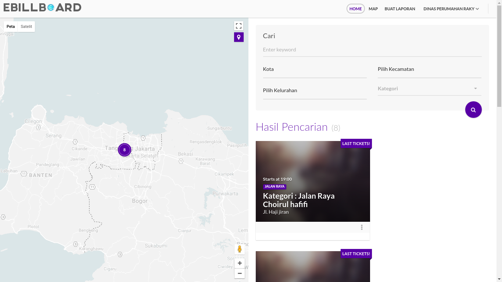](../images/sso/pengembangan/20180809_opd_home.png)

Tampilan Home OPD ini adalah halaman yang pertama kali dilihat oleh *user* ketika berhasil login menggunakan id OPD. Pada tampilan ini OPD dapat melihat informasi - informasi yang terdapat pada aplikasi e-Billboard seperti map dan data - data billboard yang sudah terpetakan dalam aplikasi. pada tampilan ini terdapat beberapa modul yaitu Home, Map dan Buat Laporan. Pada halaman ini *user* dapat melakukan pencarian pada form pencarian yang terletak disebelah map.

##### 3.1.2.2 Tampilan Map

[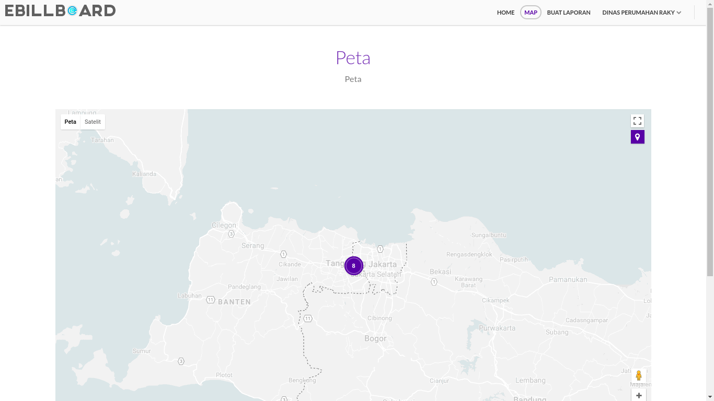](../images/sso/pengembangan/20180809_opd_map.png)
[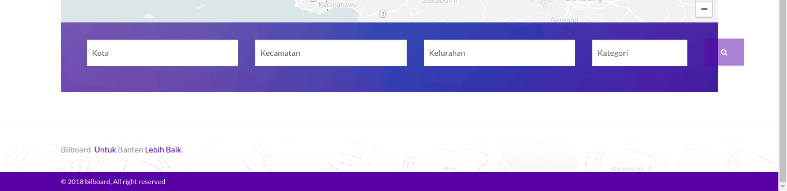](../images/sso/pengembangan/20180809_opd_map1.png)

Tampilan Map ini dapat diakses dengan mengklik tulisan Map pada daftar menu yang terdapat pada bagian atas aplikasi. Pada tampilan Map ini *user* dapat melihat map yang berisikan informasi letak - letak billboard pada daerah Banten. Pada Halaman ini *user* dapat melakukan pencarian billboard berdasarkan lokasi Kota, Kecamatan dan Kelurahan.

##### 3.1.2.3 Tampilan Buat Laporan

[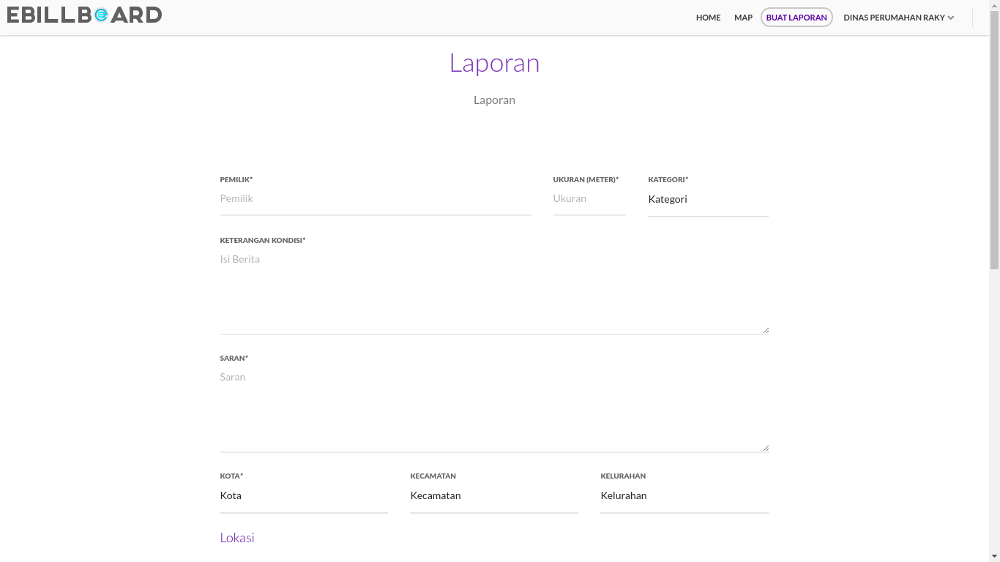](../images/sso/pengembangan/20180809_opd_buat-laporan.png)
[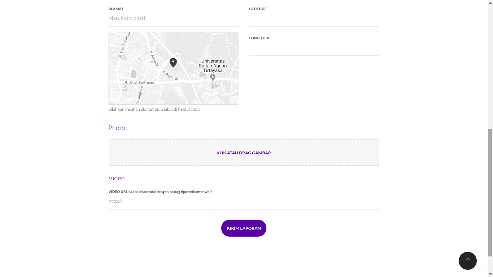](../images/sso/pengembangan/20180809_opd_buat-laporan1.png)

Tampilan Buat Laporan ini dapat diakses dengan mengklik tulisan Buat Laporan pada daftar menu yang terdapat pada bagian atas aplikasi. Pada tampilan Buat Laporan ini OPD dapat membuat laporan data billboard untuk memetakan billboard dengan mengisi form buat laporan seperti pada gambar diatas.

##### 3.1.2.4 Tampilan Profile OPD
Modul Profile OPD ini dapat diakses dengan mengklik tulisan "Nama OPD" pada pojok kanan atas aplikasi, pada modul ini terdapat 2 submodul yaitu :

###### 3.1.2.4.1 Account

[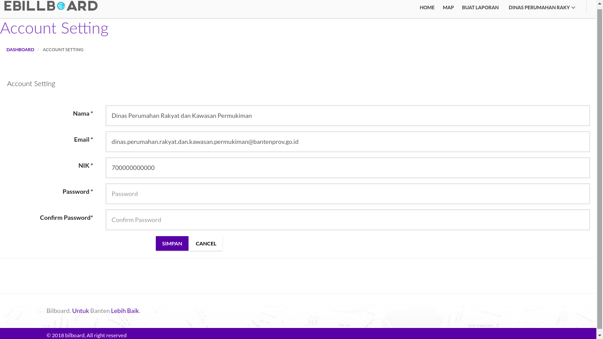](../images/sso/pengembangan/20180809_opd_account.png)

Tampilan ini dapat diakses dengan mengklik tulisan Account pada "Nama OPD". Pada tampilan ini OPD dapat mengedit atau merubah data profile OPD dengan mengisi form Account Setting.

###### 3.1.2.4.2 Log Out

Sub modul Log Out ini dapat diakses dengan mengklik tulisan Log Out pada "Nama OPD". Sub modul ini digunakan OPD untu melakukan Log Out atau keluar dari Tampilan OPD.

#### 3.1.3 Tampilan Superadmin
Tampilan ini dapat diakses oleh Superadmin ketika berhasil melakukan Login kedalam aplikasi e-Billboard.

##### 3.1.3.1 Tampilan Dashboard

[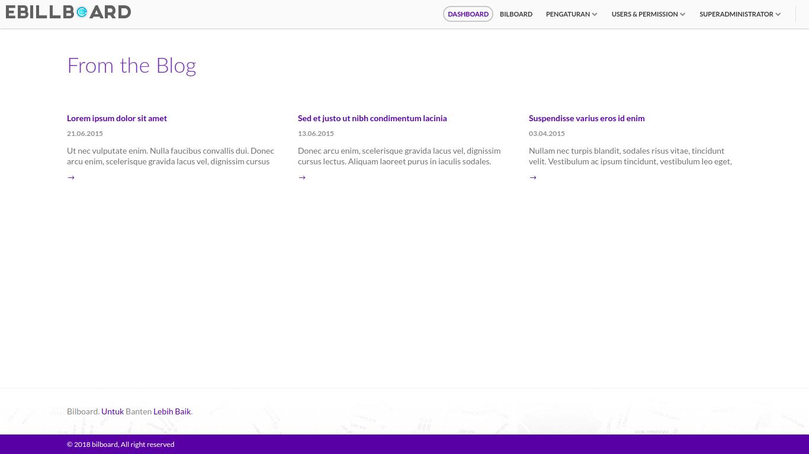](../images/sso/pengembangan/20180809_sa_dashboard.png)

Tampilan Dashboard Superadmin  ini adalah halaman yang pertama kali dilihat oleh *user* ketika berhasil login menggunakan id Superadmin. Pada halaman ini superadmin dapat meilhat informasi - informasi yang terdapat didalam aplikasi e-Billboard, pada tapilan ini terdapat beberapa modul yang terdapat pada bagian atas aplikasi seperti Dashboard, Billboard, Pengaturan dan Users & Permission

##### 3.1.3.2 Tampilan Billboard

[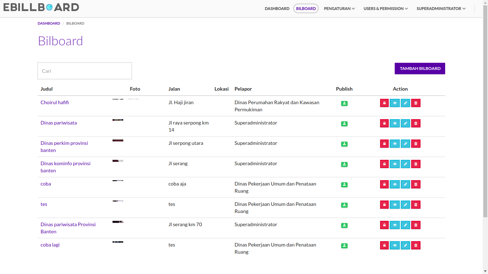](../images/sso/pengembangan/20180809_sa_billboard.png)

Tampilan Billboard ini dapat diakses dengan mengklik tulisan Billboard pada bagian atas aplikasi. pada tampilan ini superadmin dapat melihat tabel data billboard yang telah terinput kedalam aplikasi. pada tampilan ini terdapat beberapa bantuan seperti kolom pencarian, tambah billboard, publish, lihat detail, edit dan delete.

* **Kolom Pencarian**

Kolom Pencarian ini dapat diakses dengan mengetik *keyword* yang di inginkan pada kotak pencarian yang berada di kiri atas tabel billboard.

* ** Tambah Billboard**

[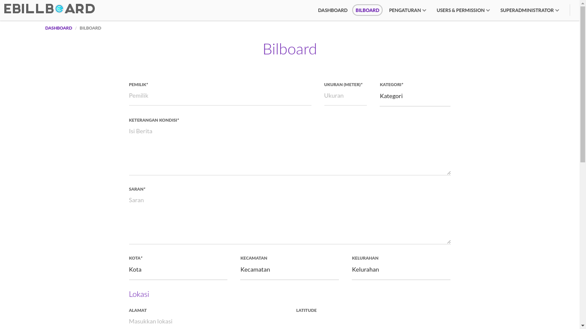](../images/sso/pengembangan/20180809_sa_billboard_tambah.png)
[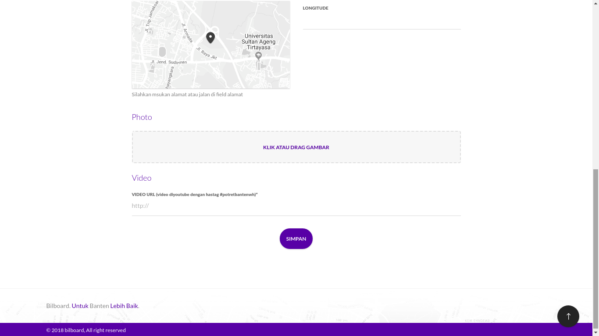](../images/sso/pengembangan/20180809_sa_billboard_tambah1.png)

Tampilan Tambah Billboard ini dapat diakses dengan mengklik tombol Tambah Billboard pada bagian kanan atas tabel billboard. Pada tampilan ini superadmin dapat menambahkan data baru billboard pada aplikasi dengan mengisi form tambah billboard.

* **Publish Billboard**

Publish Billboard ini dapat diakses dengan mengklik icon gembok pada kolom action billboard. pada Publish Billboard ini superadmin dapat mengatur apakah data billboard akan dipublish atau tidak.

* **Lihat Detail Billboard**

[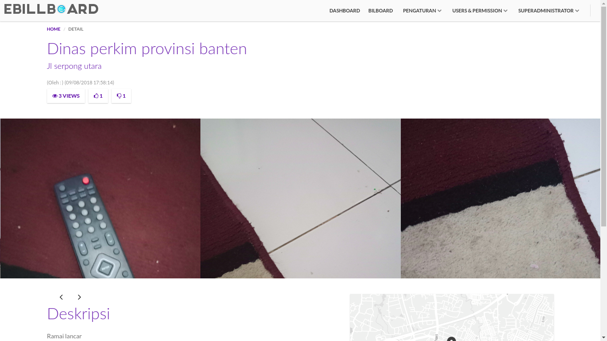](../images/sso/pengembangan/20180809_sa_billboard_detail.png)
[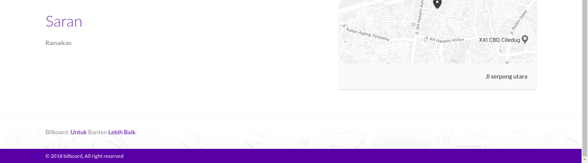](../images/sso/pengembangan/20180809_sa_billboard_detail1.png)

Tampilan Lihat Detail Billboard ini dapat diakses dengan mengklik icon mata pada kolom action di tabel billboard. Pada tampilan ini superadmin dapat melihat detail data billboard.

* **Edit Billboard**

[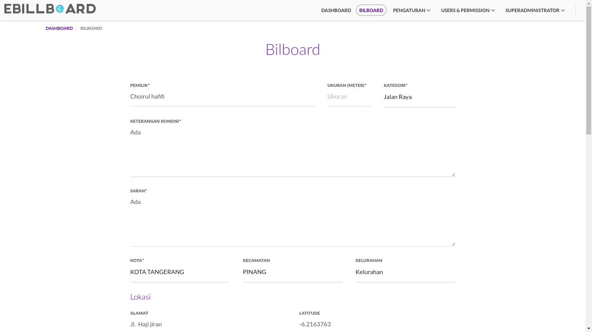](../images/sso/pengembangan/20180809_sa_billboard_edit.png)
[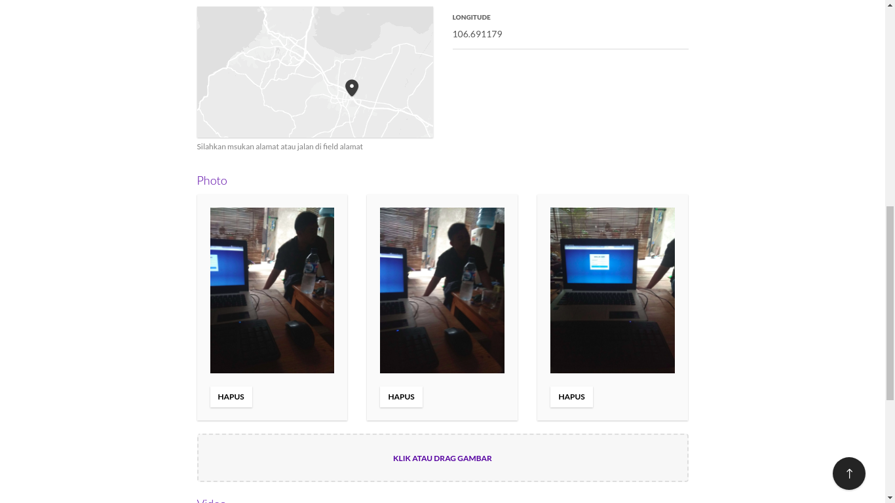](../images/sso/pengembangan/20180809_sa_billboard_edit1.png)
[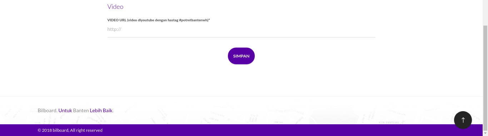](../images/sso/pengembangan/20180809_sa_billboard_edit2.png)

Tampilan Edit Billboard ini dapat diakses dengan mengklik icon pensil pada kolom action di tabel billboard. Pada tampilan ini superadmin dapat mengedit / merubah data billboard.

* **Delete Billboard**

Delete Billboard ini dapat diakses dengan mengklik icon tong sampah pada kolom action billboard. pada Delete Billboard ini superadmin dapat menghapus data billboard.

##### 3.1.3.3 Tampilan Pengaturan

Pada modul Pengaturan ini terdapat beberapa modul yaitu Banner, Video dan Sosial Media.

###### 3.1.3.3.1 Banner

[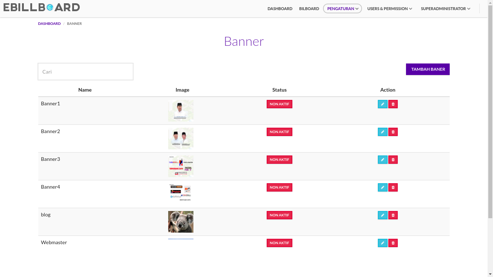](../images/sso/pengembangan/20180809_sa_pengaturan_banner.png)

Tampilan Banner ini dapat diakses dengan mengklik tulisan Banner pada Modul Pengaturan. pada tampilan ini superadmin dapat melihat tabel data banner yang telah terinput kedalam aplikasi. pada tampilan ini terdapat beberapa bantuan seperti kolom pencarian, tambah banner, edit dan delete.

* **Kolom Pencarian**

Kolom Pencarian ini dapat diakses dengan mengetik *keyword* yang di inginkan pada kotak pencarian yang berada di kiri atas tabel banner.

* **Tambah Banner**

[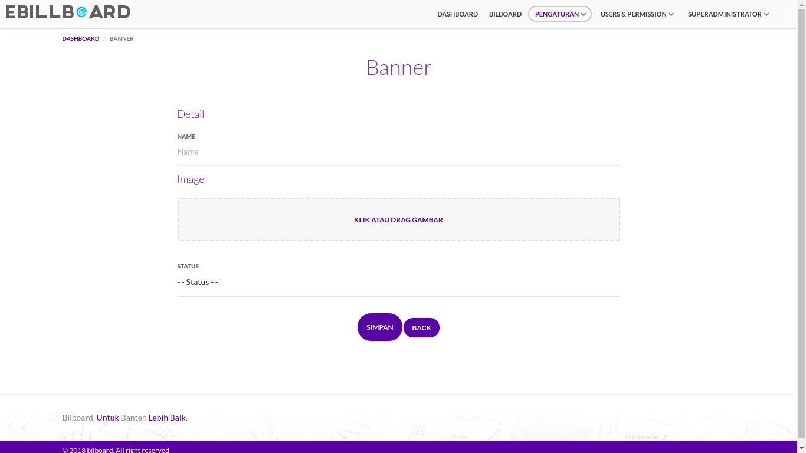](../images/sso/pengembangan/20180809_sa_pengaturan_banner_tambah.png)

Tampilan Tambah Banner ini dapat diakses dengan mengklik tombol Tambah Banner pada bagian kanan atas tabel banner. Pada tampilan ini superadmin dapat menambahkan data baru Banner pada aplikasi dengan mengisi form tambah Banner.

* **Edit Banner**

[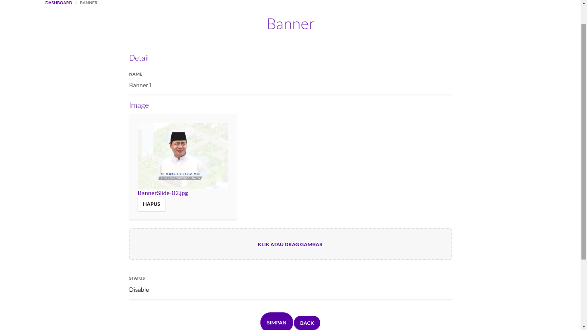](../images/sso/pengembangan/20180809_sa_pengaturan_banner_edit.png)

Tampilan Edit Banner ini dapat diakses dengan mengklik icon pensil pada kolom action di tabel banner. Pada tampilan ini superadmin dapat mengedit / merubah data banner.

* **Delete Banner**

Delete Banner ini dapat diakses dengan mengklik icon tong sampah pada kolom action banner. pada Delete Banner ini superadmin dapat menghapus data banner.

###### 3.1.3.3.2 Video

[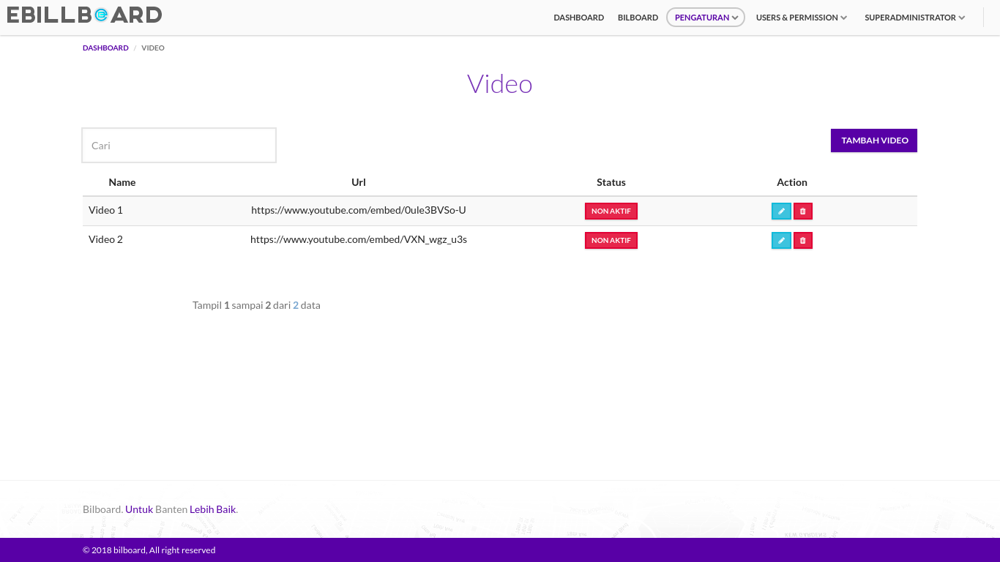](../images/sso/pengembangan/20180809_sa_pengaturan_video.png)

Tampilan Video ini dapat diakses dengan mengklik tulisan Video pada Modul Pengaturan. pada tampilan ini superadmin dapat melihat tabel data video yang telah terinput kedalam aplikasi. pada tampilan ini terdapat beberapa bantuan seperti kolom pencarian, tambah, edit dan delete video.

* **Kolom Pencarian**

Kolom Pencarian ini dapat diakses dengan mengetik *keyword* yang di inginkan pada kotak pencarian yang berada di kiri atas tabel video.

* **Tambah Video**

[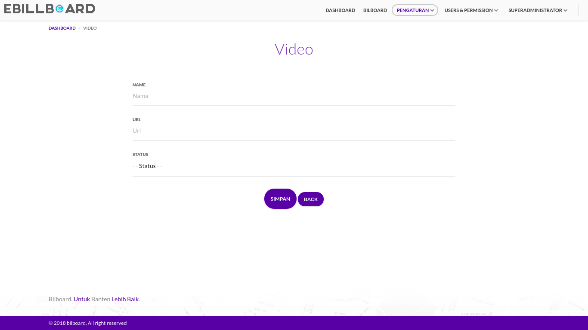](../images/sso/pengembangan/20180809_sa_pengaturan_video_tambah.png)

Tampilan Tambah Video ini dapat diakses dengan mengklik tombol Tambah Video pada bagian kanan atas tabel video. Pada tampilan ini superadmin dapat menambahkan data baru Video pada aplikasi dengan mengisi form tambah Video.

* **Edit Video**

[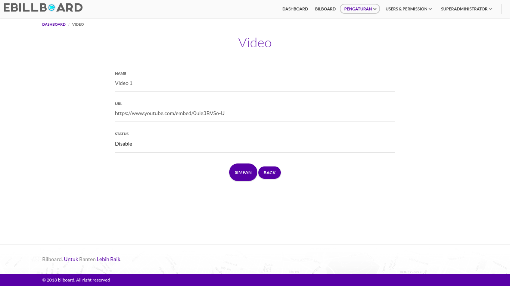](../images/sso/pengembangan/20180809_sa_pengaturan_video_edit.png)

Tampilan Edit Video ini dapat diakses dengan mengklik icon pensil pada kolom action di tabel Video. Pada tampilan ini superadmin dapat mengedit / merubah data Video.

* **Delete Video**

Delete Video ini dapat diakses dengan mengklik icon tong sampah pada kolom action Video. pada Delete Video ini superadmin dapat menghapus data Video.

###### 3.1.3.3.3 Sosial Media

[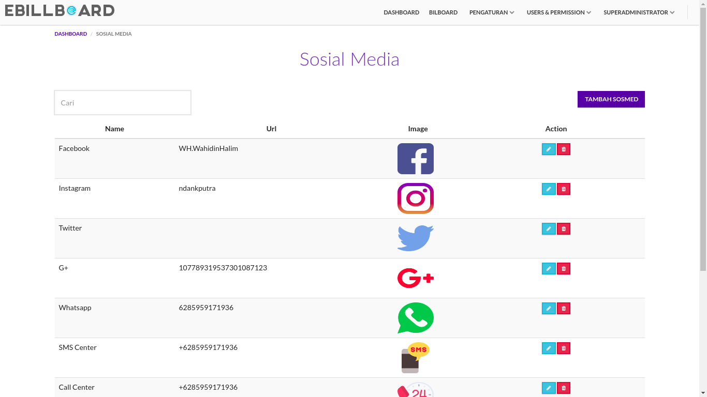](../images/sso/pengembangan/20180809_sa_pengaturan_sosmed.png)

Tampilan Sosial Media ini dapat diakses dengan mengklik tulisan Sosial Media pada Modul Pengaturan. pada tampilan ini superadmin dapat melihat tabel data sosial media yang telah terinput kedalam aplikasi. pada tampilan ini terdapat beberapa bantuan seperti kolom pencarian, tambah, edit dan delete sosial media.

* **Kolom Pencarian**

Kolom Pencarian ini dapat diakses dengan mengetik *keyword* yang di inginkan pada kotak pencarian yang berada di kiri atas tabel sosial media.

* **Tambah Sosial Media**

[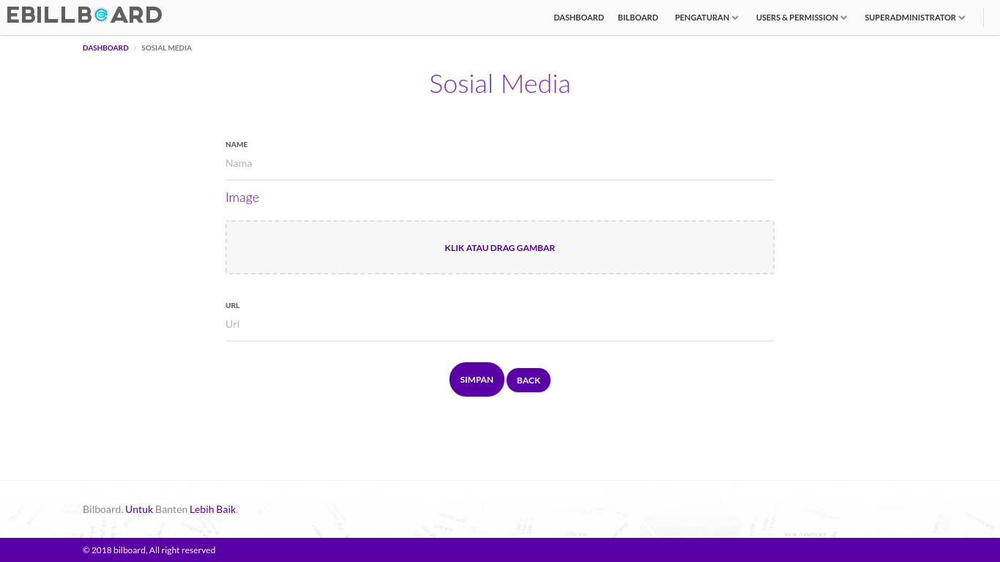](../images/sso/pengembangan/20180809_sa_pengaturan_sosmed_tambah.png)

Tampilan Tambah Sosial Media ini dapat diakses dengan mengklik tombol Tambah Sosmed pada bagian kanan atas tabel sosial media. Pada tampilan ini superadmin dapat menambahkan data baru sosial media pada aplikasi dengan mengisi form tambah sosial media.

* **Edit Sosial Media**

[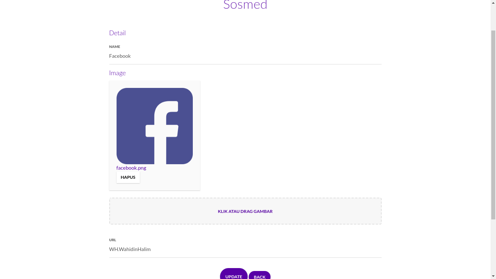](../images/sso/pengembangan/20180809_sa_pengaturan_sosmed_edit.png)

Tampilan Edit Sosial Media ini dapat diakses dengan mengklik icon pensil pada kolom action di tabel sosial media. Pada tampilan ini superadmin dapat mengedit / merubah datasosial media.

* **Delete Sosial Media**

Delete Sosial Media ini dapat diakses dengan mengklik icon tong sampah pada kolom action sosial media. pada Delete Sosial Media ini superadmin dapat menghapus data sosial media.

##### 3.1.3.4 Tampilan Users & Permission

Pada modul Users & Permission ini terdapat beberapa modul yaitu User, Permission dan Role

###### 3.1.3.4.1 Users

[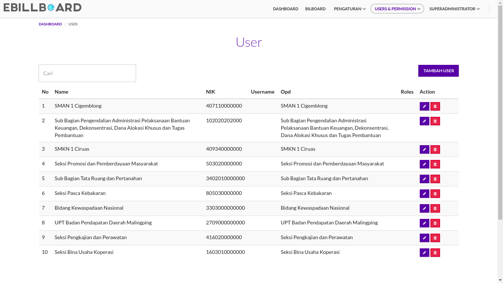](../images/sso/pengembangan/20180809_sa_unp_user.png)

Tampilan Users ini dapat diakses dengan mengklik tulisan User pada Modul Users & Permission. pada tampilan ini superadmin dapat melihat tabel data user yang terdapat pada aplikasi. pada tampilan ini terdapat beberapa bantuan seperti kolom pencarian, tambah, edit dan delete user.

* **Kolom Pencarian**

Kolom Pencarian ini dapat diakses dengan mengetik *keyword* yang di inginkan pada kotak pencarian yang berada di kiri atas tabel user.

* **Tambah User**

[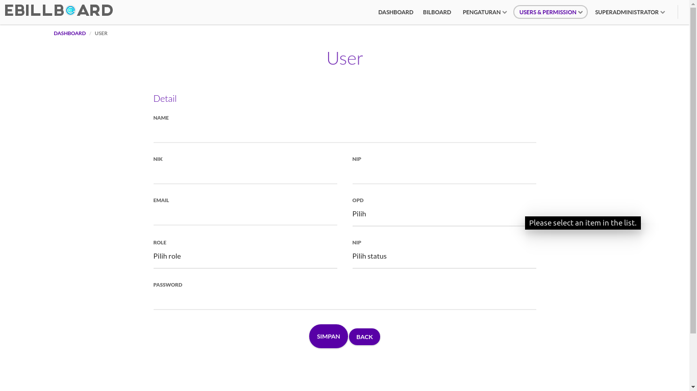](../images/sso/pengembangan/20180809_sa_unp_user_tambah.png)

Tampilan Tambah User ini dapat diakses dengan mengklik tombol Tambah User pada bagian kanan atas tabel user. Pada tampilan ini superadmin dapat menambahkan data baru user pada aplikasi dengan mengisi form tambah user.

* **Edit User**

[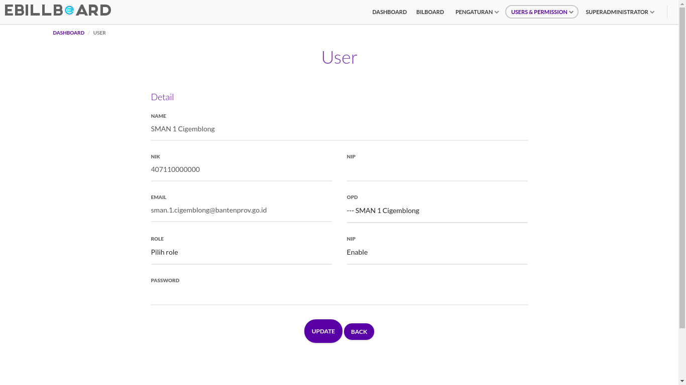](../images/sso/pengembangan/20180809_sa_unp_user_edit.png)

Tampilan Edit User ini dapat diakses dengan mengklik icon pensil pada kolom action di tabel user. Pada tampilan ini superadmin dapat mengedit / merubah data user.

* **Delete User**

Delete User ini dapat diakses dengan mengklik icon tong sampah pada kolom action user. pada Delete User ini superadmin dapat menghapus data user.

###### 3.1.3.4.2 Permission

[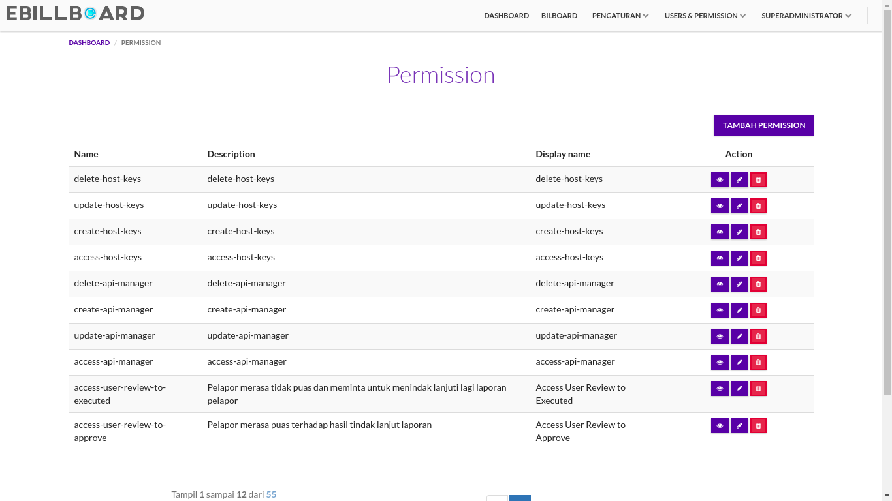](../images/sso/pengembangan/20180809_sa_unp_permission.png)

Tampilan Permission ini dapat diakses dengan mengklik tulisan Permission pada Modul Users & Permission. pada tampilan ini superadmin dapat melihat tabel data permission yang terdapat pada aplikasi. pada tampilan ini terdapat beberapa bantuan seperti kolom pencarian, tambah, lihat detail, edit  dan delete permission

* **Kolom Pencarian**

Kolom Pencarian ini dapat diakses dengan mengetik *keyword* yang di inginkan pada kotak pencarian yang berada di kiri atas tabel permission.

* **Tambah Permission**

[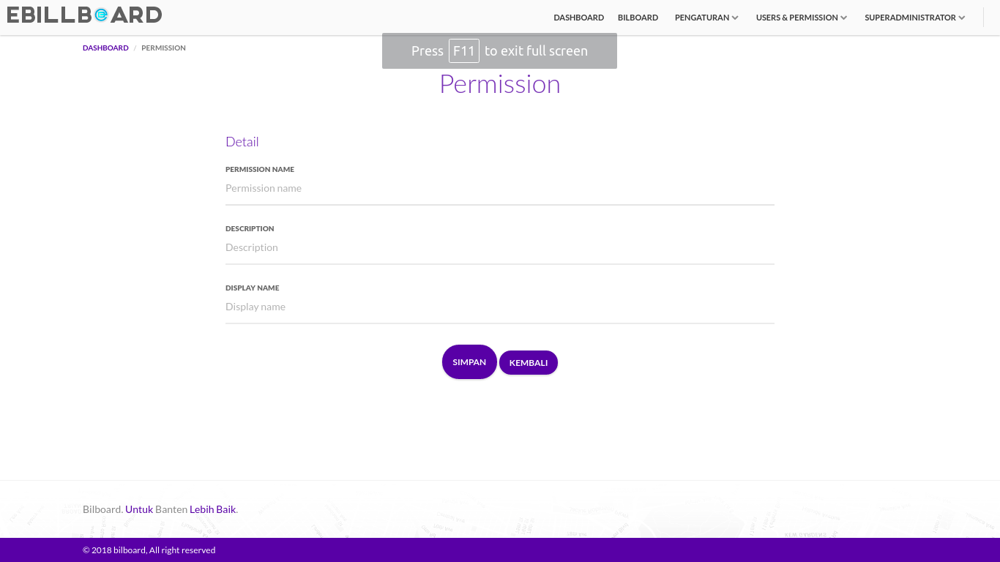](../images/sso/pengembangan/20180809_sa_unp_permission_tambah.png)

Tampilan Tambah Permission ini dapat diakses dengan mengklik tombol Tambah Permission pada bagian kanan atas tabel permission. Pada tampilan ini superadmin dapat menambahkan data baru permission pada aplikasi dengan mengisi form tambah permission.

* **Lihat Detail Permission**

[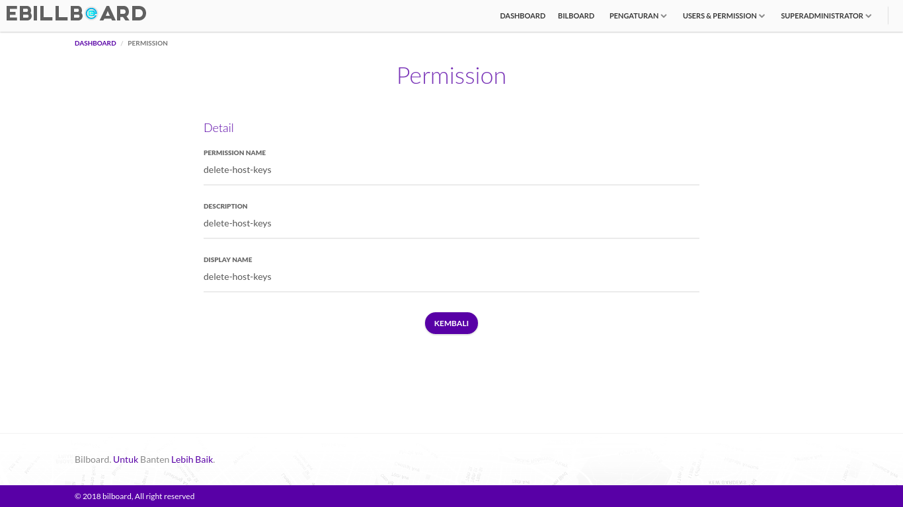](../images/sso/pengembangan/20180809_sa_unp_permission_detail.png)

Tampilan Lihat Detail Permission ini dapat diakses dengan mengklik icon mata pada kolom action di tabel permission. Pada tampilan ini superadmin dapat melihat detail permission.

* **Edit Permission**

[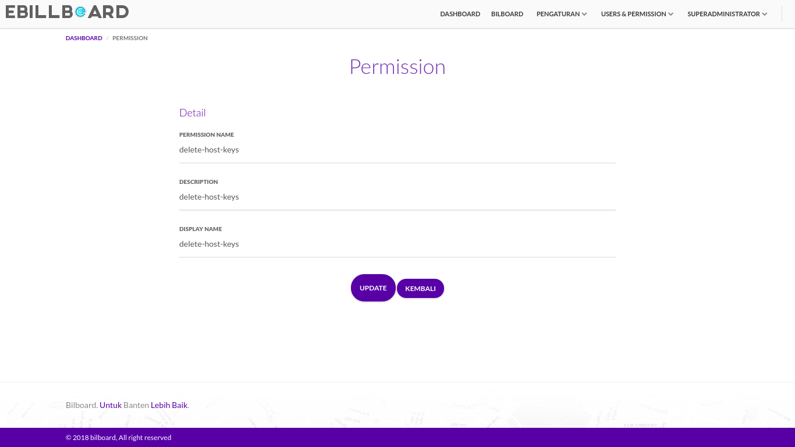](../images/sso/pengembangan/20180809_sa_unp_permission_edit.png)

Tampilan Edit Permission ini dapat diakses dengan mengklik icon pensil pada kolom action di tabel permission. Pada tampilan ini superadmin dapat mengedit / merubah data permission.

* **Delete Permission**

Delete Permission ini dapat diakses dengan mengklik icon tong sampah pada kolom action permission. pada Delete Permission ini superadmin dapat menghapus data permission.

###### 3.1.3.4.3 Role

[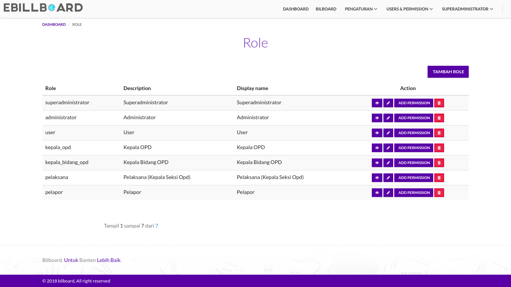](../images/sso/pengembangan/20180809_sa_unp_role.png)

Tampilan Role ini dapat diakses dengan mengklik tulisan Role pada Modul Users & Permission. pada tampilan ini superadmin dapat melihat tabel data role yang terdapat pada aplikasi. pada tampilan ini terdapat beberapa bantuan seperti kolom pencarian, tambah, lihat detail, edit, Add Permission dan delete role.

* **Kolom Pencarian**

Kolom Pencarian ini dapat diakses dengan mengetik *keyword* yang di inginkan pada kotak pencarian yang berada di kiri atas tabel role.

* **Tambah Role**

[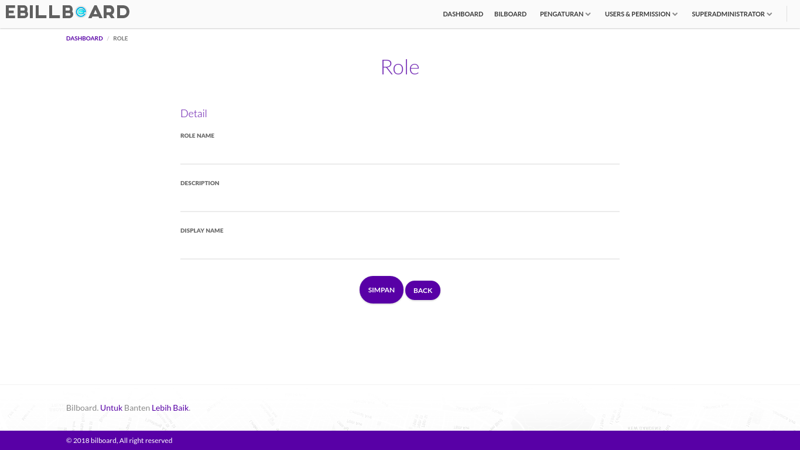](../images/sso/pengembangan/20180809_sa_unp_role_tambah.png)

Tampilan Tambah Role ini dapat diakses dengan mengklik tombol Tambah Role pada bagian kanan atas tabel role. Pada tampilan ini superadmin dapat menambahkan data baru role pada aplikasi dengan mengisi form tambah role.

* **Lihat Detail Role**

[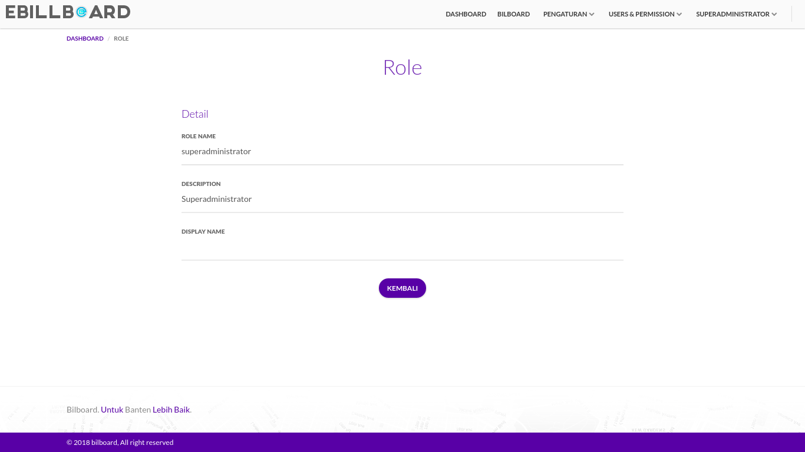](../images/sso/pengembangan/20180809_sa_unp_role_detail.png)

Tampilan Lihat Detail Role ini dapat diakses dengan mengklik icon mata pada kolom action di tabel role. Pada tampilan ini superadmin dapat melihat detail role.

* **Edit Role**

[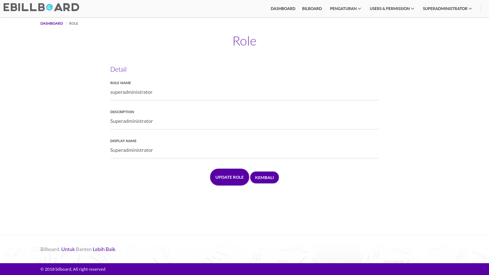](../images/sso/pengembangan/20180809_sa_unp_role_edit.png)

Tampilan Edit Role ini dapat diakses dengan mengklik icon pensil pada kolom action di tabel role. Pada tampilan ini superadmin dapat mengedit / merubah data role.

* **Add Permission**

[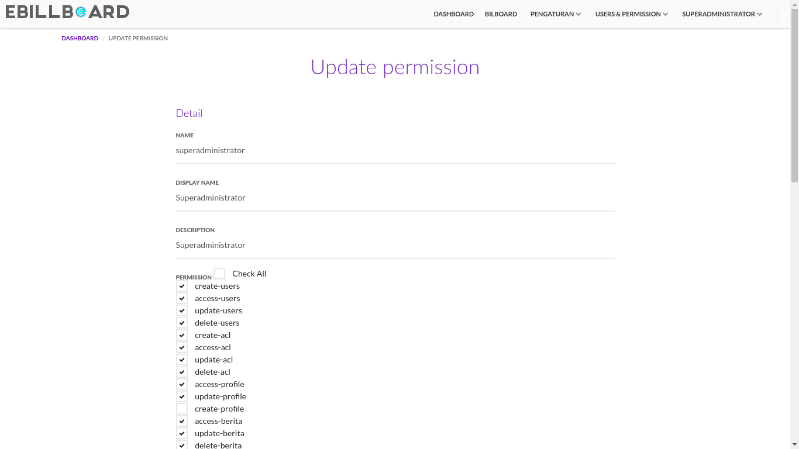](../images/sso/pengembangan/20180809_sa_unp_role_tambah-permission.png)

Tampilan Add Permission ini dapat diakses dengan mengklik tombol Add Permission pada kolom action di tabel role. Pada tampilan ini superadmin dapat memberikan permission / hak akses kepada role yang diinginkan.

* **Delete Role**

Delete Role ini dapat diakses dengan mengklik icon tong sampah pada kolom action role. pada Delete Role ini superadmin dapat menghapus data role.

##### 3.1.3.5 Profile Superadmin

Modul Profile Superadmin ini dapat diakses dengan mengklik tulisan "Superadmin" pada pojok kanan atas aplikasi, pada modul ini terdapat 2 submodul yaitu :

###### 1.3.5.1 Account

[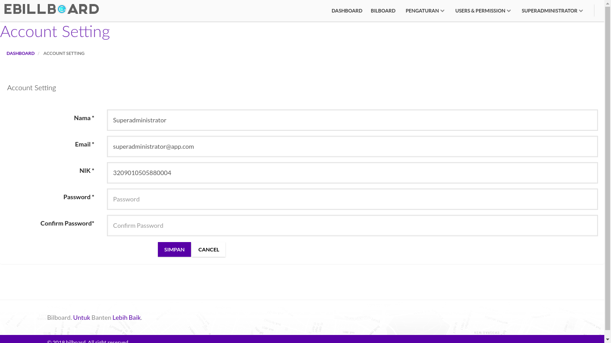](../images/sso/pengembangan/20180809_sa_account.png)

Tampilan ini dapat diakses dengan mengklik tulisan Account pada "Superadmin". Pada tampilan ini Superadmin dapat mengatur data profile Superadmin dengan mengisi form Account Setting.

###### 1.3.5.2 Log Out

Sub modul Log Out ini dapat diakses dengan mengklik tulisan Log Out pada "Superadmin". Sub modul ini digunakan Superadmin untu melakukan Log Out atau keluar dari Tampilan Superadmin.

### 3.2 Android

#### 3.2.1 Login

[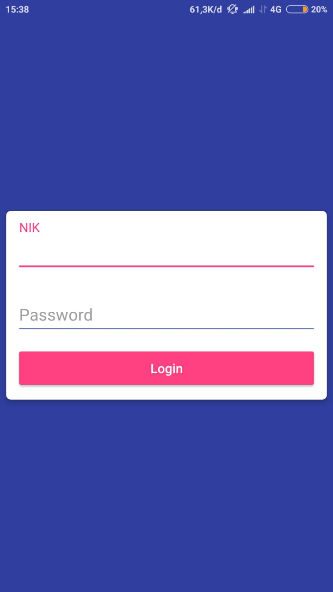](../images/sso/pengembangan/20180809_and_login.jpeg)

Tampilan Login ini akan muncul ketika *user* membuka aplikasi, pada tampilan login ini terdapat 2 (dua) *field* yang harus diisi oleh *user* yaitu NIK dan Password.

#### 3.2.2 View List

[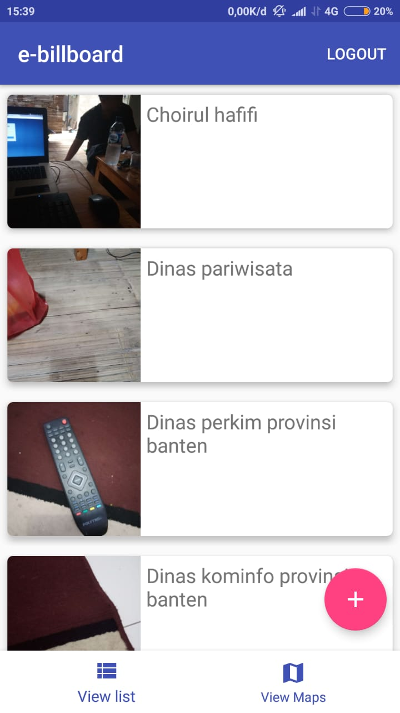](../images/sso/pengembangan/20180809_and_view-list.jpeg)

Tampilan View List ini dapat diakses dengan mengklik View List pada daftar menu yang berada dibagian bawah aplikasi. Pada tampilan View List ini *user* dapat melihat list billboard yang sudag terdaftar pada aplikasi.

##### 3.2.2.1 View List Detail

[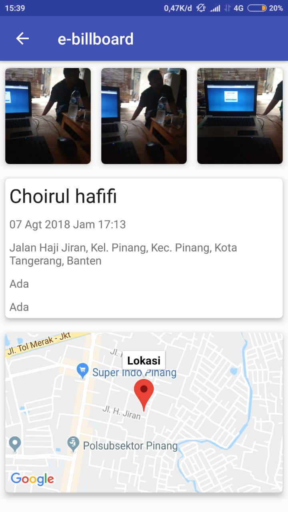](../images/sso/pengembangan/20180809_and_view-list_detail.jpeg)

Tampilan View List Detail ini dapat diakses dengan mengklik billboard yang akan dilihat detailnya pada tampilan View List. Pada tampilan ini *user* dapat melihat detail billboard yang sudah terdaftar pada aplikasi.

#### 3.2.3 View Map

[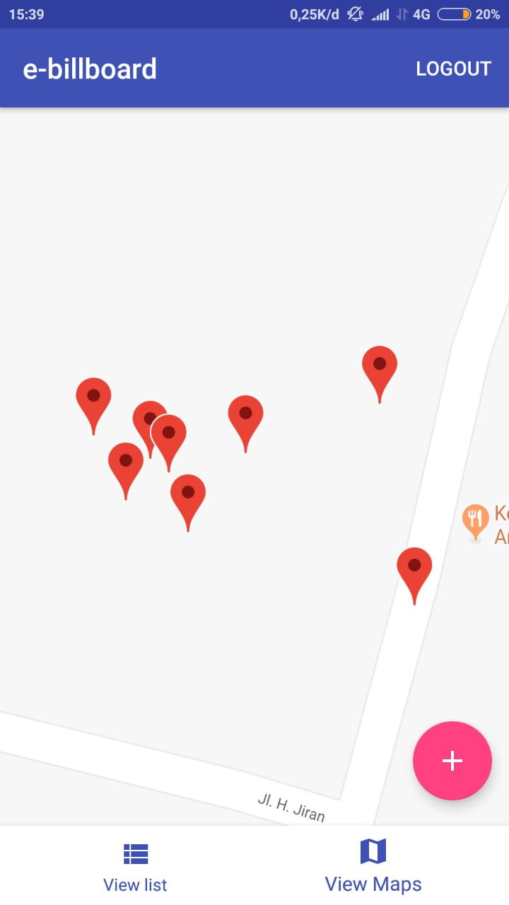](../images/sso/pengembangan/20180809_and_view-maps.jpeg)

Tampilan View Map ini dapat diakses dengan mengklik View Map pada daftar menu yang berada dibagian bawah aplikasi. Pada tampilan View Maps ini *user* dapat melihat denah lokasi billboard pada peta yang disediakan. Pada tampilan ini *user* dapat memfilter pencarian billboard berdasarkan Kota, Kecamatan dan Kelurahan.

#### 3.2.4 Tambah Billboard

[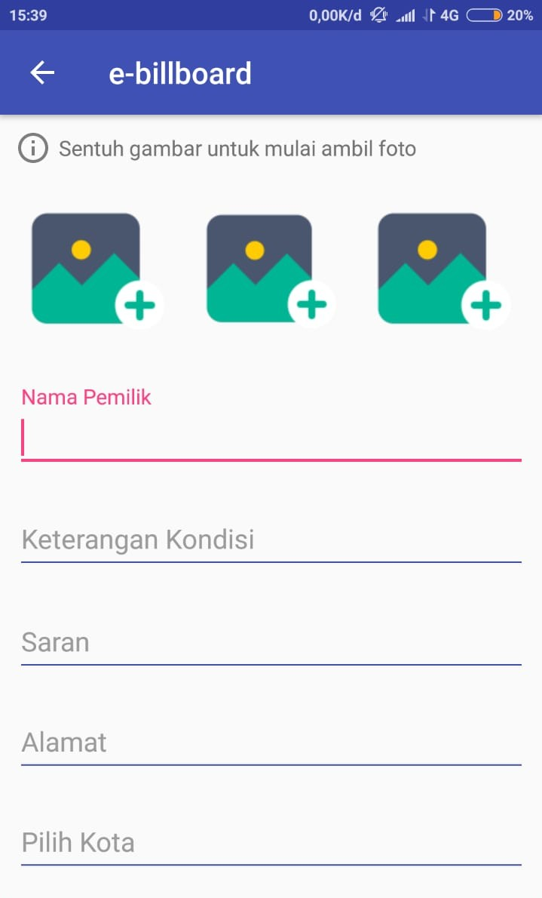](../images/sso/pengembangan/20180809_and_tambah-billboard.jpeg)
[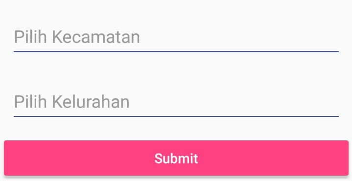](../images/sso/pengembangan/20180809_and_tambah-billboard1.jpeg)

Tampilan Tambah Billboard ini dapat diakses dengan megklik "+" pada lingkaran berwarna pink pada aplikasi. Pada tampilan ini akan ditampilkan form untuk menambah data billboard ke aplikasi e-Billboard.
