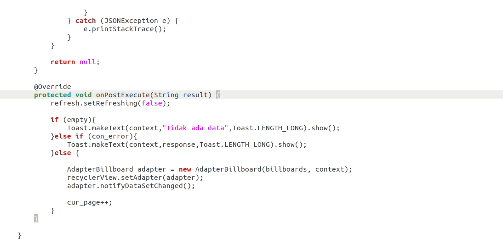
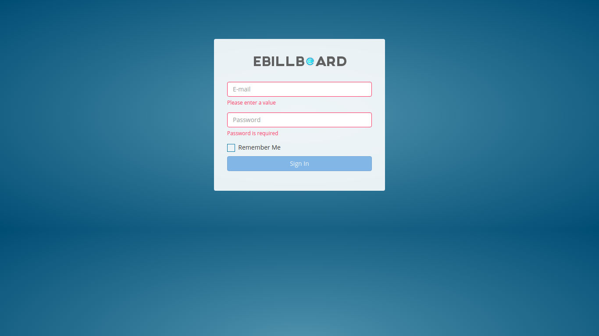
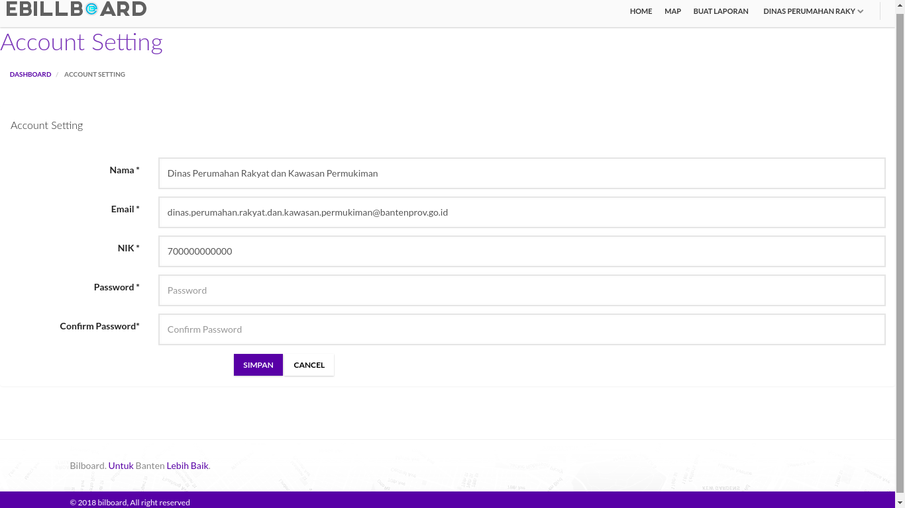
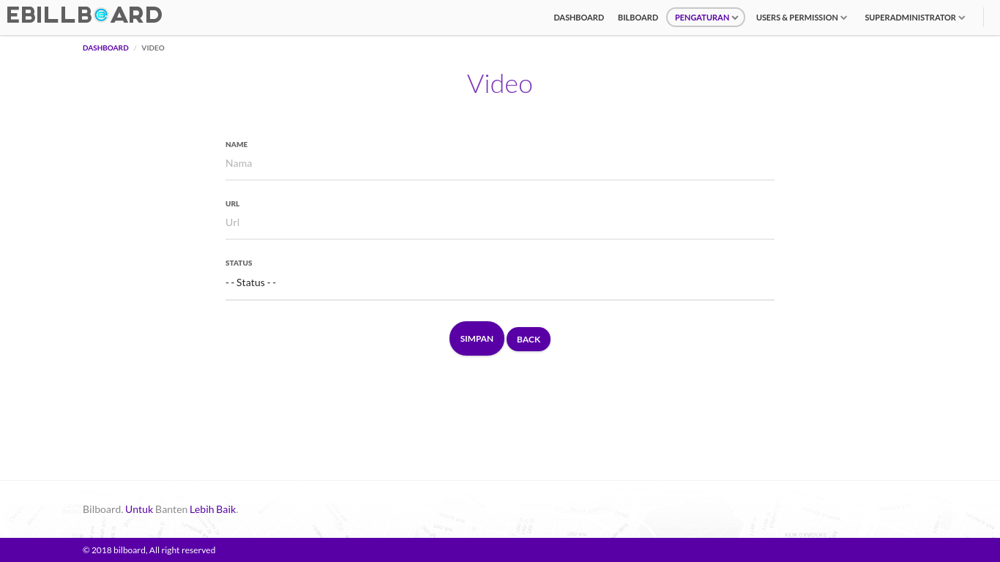
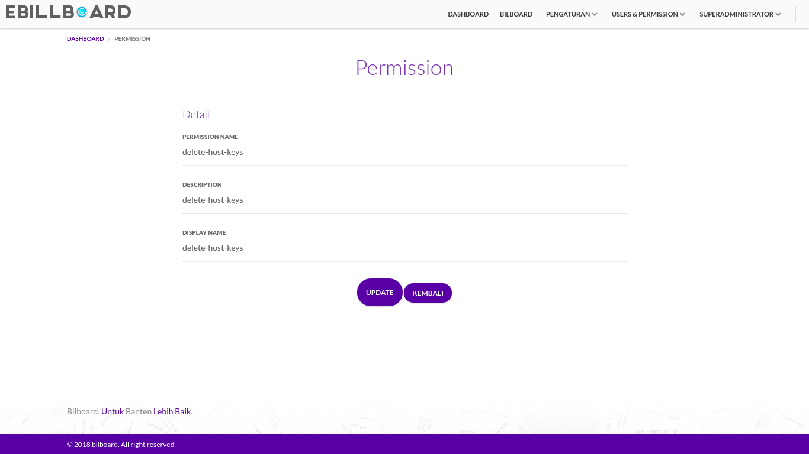
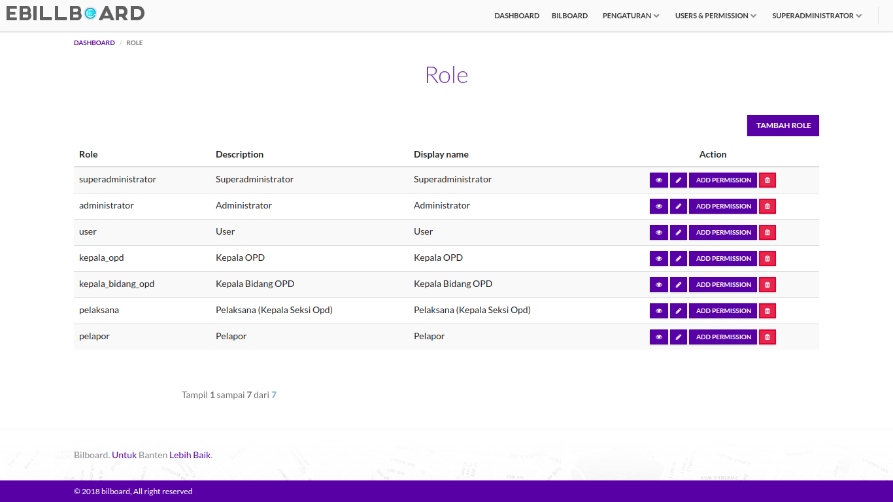
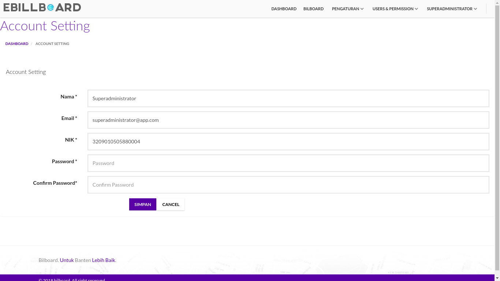
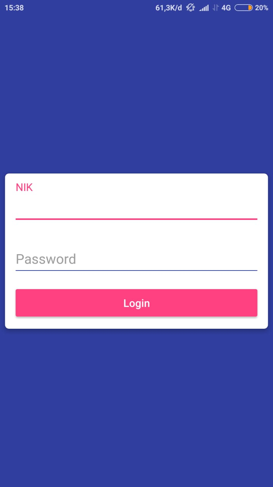

## Daftar Isi

[TOC]

## Integrasi dan Pengujian (UAT) Media Ruang

Pada laporan ini akan membahas tentang Pengujian dan Integrasi aplikasi Media Ruang, untuk pengujiannya menggunakan User Acceptance Test (UAT).

## 1. Integrasi
Sistem Media Ruang Provinsi Banten ini dibangun dengan tujuan untuk memudahkan pemerintah dan masyarakat dalam mencari informasi mengenai lokasi, status, serta demografi Media Ruang yang terdapat pada Provinsi Banten. Deskripsi Umum kebutuhan aplikasi yang akan diimplementasikan meliputi semua informasi yang bersifat teknis dan menjadi acuan dalam pengembangan aplikasi. Dalam kegiatannnya setiap kegiatan akan terdapat integrasi terhadap server yang bertujuan untuk melakukan integrasi aplikasi data, integrasi dilakukan tanpa membuat perubahan signifikan pada aplikasi dan sumber data.

Berikut ini adalah integrasi antara website Media Ruang dengan android Media Ruang

### 1.1 Get Coordinate

### 1.2 Get List

### 1.3 Get Req Handler

### 1.4 Post Req Handler

### 1.5 Send Data

## 2. Pengujian atau *User Acceptance Test* (UAT)

### 2.1 Tampilan Website

#### 2.1.1 Tampilan Awal Aplikasi

##### 2.1.1.1 Home

| Tampilan | URL/ Image                               | Ada  | Tidak |
| -------- | ---------------------------------------- | ---- | ----- |
| Home     |    |      |       |

Pada tampilan ini *user* dapat melihat informasi - informasi yang terdapat pada aplikasi Media Ruang seperti map dan data - data Media Ruang yang sudah terpetakan dalam aplikasi. Untuk mengecek dapat diakses tidaknya, user dapat mengklik menu Home, jika sudah dapat diakses user dapat ceklis pada kolom **Ada**, jika belum dapat diakses maka user dapat ceklis pada kolom **Tidak**.

##### 2.1.1.2 Tampilan Map

| Tampilan     | URL/ Image                               | Ada  | Tidak |
| ------------ | ---------------------------------------- | ---- | ----- |
| Tampilan Map |   |      |       |

Pada tampilan Map ini *user* dapat melihat map yang berisikan informasi letak - letak Media Ruang pada daerah Banten. Pada Halaman ini *user* dapat melakukan pencarian Media Ruang berdasarkan lokasi Kota, Kecamatan dan Kelurahan. Untuk mengecek dapat diakses tidaknya, user dapat mengklik menu Map, jika sudah dapat diakses user dapat ceklis pada kolom **Ada**, jika belum dapat diakses maka user dapat ceklis pada kolom **Tidak**.

##### 2.1.1.3 Tampilan Login

| Tampilan       | URL/ Image                               | Ada  | Tidak |
| -------------- | ---------------------------------------- | ---- | ----- |
| Tampilan Login |  |      |       |

Pada tampilan ini *user* akan disajikan dengan form Login, Form login ini dapat digunakan oleh OPD dan Superadmin untuk masuk kedalam aplikasi Media Ruang sesuai dengan tupoksi nya masing - masing.. Untuk mengecek dapat diakses tidaknya, user dapat mengklik menu Login, jika sudah dapat diakses user dapat ceklis pada kolom **Ada**, jika belum dapat diakses maka user dapat ceklis pada kolom **Tidak**.

#### 2.1.2 Tampilan OPD

##### 2.1.2.1 Tampilan Home

| Tampilan | URL/ Image                               | Ada  | Tidak |
| -------- | ---------------------------------------- | ---- | ----- |
| Home     |    |      |       |

Pada tampilan ini OPD dapat melihat informasi - informasi yang terdapat pada aplikasi Media Ruang seperti map dan data - data Media Ruang yang sudah terpetakan dalam aplikasi. pada tampilan ini terdapat beberapa modul yaitu Home, Map dan Buat Laporan. Untuk mengecek dapat diakses tidaknya, user dapat mengklik menu Home, jika sudah dapat diakses user dapat ceklis pada kolom **Ada**, jika belum dapat diakses maka user dapat ceklis pada kolom **Tidak**.

##### 2.1.2.2 Tampilan Map

| Tampilan | URL/ Image                               | Ada  | Tidak |
| -------- | ---------------------------------------- | ---- | ----- |
| Map      |   |      |       |

Pada tampilan Map ini OPD dapat melihat map yang berisikan informasi letak - letak Media Ruang pada daerah Banten. Pada Halaman ini *user* dapat melakukan pencarian Media Ruang berdasarkan lokasi Kota, Kecamatan dan Kelurahan. Untuk mengecek dapat diakses tidaknya, user dapat mengklik menu Map, jika sudah dapat diakses user dapat ceklis pada kolom **Ada**, jika belum dapat diakses maka user dapat ceklis pada kolom **Tidak**.

##### 2.1.2.3 Tampilan Buat Laporan

| Tampilan     | URL/ Image                               | Ada  | Tidak |
| ------------ | ---------------------------------------- | ---- | ----- |
| Buat Laporan |   |      |       |

Pada tampilan Buat Laporan ini OPD dapat membuat data Media Ruang untuk memetakan Media Ruang dengan mengisi form buat laporan seperti pada gambar diatas. Untuk mengecek dapat diakses tidaknya, user dapat mengklik menu Buat Laporan, jika sudah dapat diakses user dapat ceklis pada kolom **Ada**, jika belum dapat diakses maka user dapat ceklis pada kolom **Tidak**.

##### 2.1.2.4 Tampilan Profile OPD

Modul Profile OPD ini dapat diakses dengan mengklik tulisan "Nama OPD" pada pojok kanan atas aplikasi, pada modul ini terdapat 2 submodul yaitu :

###### 2.1.2.4.1 Account

| Tampilan        | URL/ Image                               | Ada  | Tidak |
| --------------- | ---------------------------------------- | ---- | ----- |
| Account Setting |  |      |       |

Tampilan ini dapat diakses dengan mengklik tulisan Account pada "Nama OPD". Pada tampilan ini OPD dapat mengatur data profile OPD dengan mengisi form Account Setting. Untuk mengecek dapat diakses tidaknya, user dapat mengklik sub menu Account pada menu Tulisan "Nama OPD", jika sudah dapat diakses user dapat ceklis pada kolom **Ada**, jika belum dapat diakses maka user dapat ceklis pada kolom **Tidak**.

###### 2.1.2.4.2 Log Out
Sub modul Log Out ini dapat diakses dengan mengklik tulisan Log Out pada "Nama OPD". Sub modul ini digunakan OPD untu melakukan Log Out atau keluar dari Tampilan OPD. Untuk pengujian nya *user* yang berhasil login bisa melakukan log out pada aplikasi Media Ruang atau tidak.

#### 2.1.3 Tampilan Superadmin

##### 2.1.3.1 Tampilan Dashboard

| Tampilan  | URL/ Image                               | Ada  | Tidak |
| --------- | ---------------------------------------- | ---- | ----- |
| Dashboard |  |      |       |

Tampilan Dashboard ini dapat diakses ketika superadmin berhasil melakukan Login kedalam apilaksi Media Ruang. Pada halam ini superadmin dapat meilhat informasi - informasi yang terdapat didalam aplikasi Media Ruang, pada tapilan ini terdapat beberapa modul yang terdapat pada bagian atas aplikasi seperti Dashboard, Media Ruang, Pengaturan dan Users & Permission. Untuk mengecek dapat diakses tidaknya, user dapat mengklik Dashboard pada menu aplikasi jika sudah dapat diakses user dapat ceklis pada kolom **Ada**, jika belum dapat diakses maka user dapat ceklis pada kolom **Tidak**.

##### 2.1.3.2 Tampilan Media Ruang

| Tampilan    | URL/ Image                               | Ada  | Tidak |
| ----------- | ---------------------------------------- | ---- | ----- |
| Media Ruang |  |      |       |

Tampilan Media Ruang ini dapat diakses dengan mengklik tulisan Media Ruang pada bagian atas aplikasi. pada tampilan ini superadmin dapat melihat tabel data Media Ruang yang telah terinput kedalam aplikasi. pada tampilan ini terdapat beberapa bantuan seperti kolom pencarian, tambah Media Ruang, publish, lihat detail, edit dan delete. Untuk mengecek dapat diakses tidaknya, user dapat mengklik Media Ruang pada menu aplikasi jika sudah dapat diakses user dapat ceklis pada kolom **Ada**, jika belum dapat diakses maka user dapat ceklis pada kolom **Tidak**.

###### 2.1.3.2.1 Kolom Pencarian

Kolom Pencarian ini dapat diakses dengan mengetik *keyword* yang di inginkan pada kotak pencarian yang berada di kiri atas tabel Media Ruang. Untuk pengujian nya *user* dapat mengetik keyword apa saja pada kolom pencarian, apakah data pencarian sesuai dengan kolom pencarian.

###### 2.1.3.2.2 Tambah Media Ruang

| Tampilan           | URL/ Image                               | Ada  | Tidak |
| ------------------ | ---------------------------------------- | ---- | ----- |
| Tambah Media Ruang |   |      |       |

Tampilan Tambah Media Ruang ini dapat diakses dengan mengklik tombol Tambah Media Ruang pada bagian kanan atas tabel Media Ruang. Pada tampilan ini superadmin dapat menambahkan data baru Media Ruang pada aplikasi dengan mengisi form tambah Media Ruang. Untuk mengecek dapat diakses tidaknya, user dapat mengklik Tombol Tambah Media Ruang pada bagian atas tabel Media Ruang, jika sudah dapat diakses user dapat ceklis pada kolom **Ada**, jika belum dapat diakses maka user dapat ceklis pada kolom **Tidak**.

###### 2.1.3.2.3 Publish Media Ruang

Publish Media Ruang ini dapat diakses dengan mengklik icon gembok pada kolom action Media Ruang. pada Publish Media Ruang ini superadmin dapat mengatur apakah data Media Ruang akan dipublish atau tidak.. Untuk pengujian nya *user* dapat mengklik icon gembok apakah ada perubahan atau tidak.

###### 2.1.3.2.4 Lihat Detail Media Ruang

| Tampilan                 | URL/ Image                               | Ada  | Tidak |
| ------------------------ | ---------------------------------------- | ---- | ----- |
| Lihat Detail Media Ruang |   |      |       |

Tampilan Lihat Detail Media Ruang ini dapat diakses dengan mengklik icon mata pada kolom action di tabel Media Ruang. Pada tampilan ini superadmin dapat melihat detail Media Ruang. Untuk mengecek dapat diakses tidaknya, user dapat mengklik icon mata pada kolom action Media Ruang, jika sudah dapat diakses user dapat ceklis pada kolom **Ada**, jika belum dapat diakses maka user dapat ceklis pada kolom **Tidak**.

###### 2.1.3.2.5 Edit Media Ruang

| Tampilan         | URL/ Image                               | Ada  | Tidak |
| ---------------- | ---------------------------------------- | ---- | ----- |
| Edit Media Ruang |    |      |       |

Tampilan Edit Media Ruang ini dapat diakses dengan mengklik icon pensil pada kolom action di tabel Media Ruang. Pada tampilan ini superadmin dapat mengedit / merubah data Media Ruang. Untuk mengecek dapat diakses tidaknya, user dapat mengklik icon pensil pada kolom action Media Ruang, jika sudah dapat diakses user dapat ceklis pada kolom **Ada**, jika belum dapat diakses maka user dapat ceklis pada kolom **Tidak**.

###### 2.1.3.2.6 Delete Media Ruang

Delete Media Ruang ini dapat diakses dengan mengklik icon tong sampah pada kolom action Media Ruang. pada Delete Media Ruang ini superadmin dapat menghapus data Media Ruang. Untuk pengujian nya *user* dapat mengklik icon tong sampah pada kolom action Media Ruang apakah ada data Media Ruang terhapus atau tidak

##### 2.1.3.3 Pengaturan

Pada modul Pengaturan ini terdapat beberapa modul yaitu Banner, Video dan Sosial Media.

###### 2.1.3.3.1 Banner

| Tampilan | URL/ Image                               | Ada  | Tidak |
| -------- | ---------------------------------------- | ---- | ----- |
| Banner   |  |      |       |

Tampilan Banner ini dapat diakses dengan mengklik tulisan Banner pada Modul Pengaturan. pada tampilan ini superadmin dapat melihat tabel data banner yang telah terinput kedalam aplikasi. pada tampilan ini terdapat beberapa bantuan seperti kolom pencarian, tambah banner, edit dan delete. Untuk mengecek dapat diakses tidaknya, user dapat mengklik tulisan Banner pada menu Pengaturan, jika sudah dapat diakses user dapat ceklis pada kolom **Ada**, jika belum dapat diakses maka user dapat ceklis pada kolom **Tidak**.

* **Kolom Pencarian**

Kolom Pencarian ini dapat diakses dengan mengetik *keyword* yang di inginkan pada kotak pencarian yang berada di kiri atas tabel banner. Untuk pengujian nya *user* dapat mengetik keyword apa saja pada kolom pencarian, apakah data pencarian sesuai dengan kolom pencarian.

* **Tambah Banner**

| Tampilan      | URL/ Image                               | Ada  | Tidak |
| ------------- | ---------------------------------------- | ---- | ----- |
| Tambah Banner |  |      |       |

Tampilan Tambah Banner ini dapat diakses dengan mengklik tombol Tambah Banner pada bagian kanan atas tabel banner. Pada tampilan ini superadmin dapat menambahkan data baru Banner pada aplikasi dengan mengisi form tambah Banner.. Untuk mengecek dapat diakses tidaknya, user dapat mengklik Tombol Tambah Banner pada bagian atas tabel banner, jika sudah dapat diakses user dapat ceklis pada kolom **Ada**, jika belum dapat diakses maka user dapat ceklis pada kolom **Tidak**.

* **Edit Banner**

| Tampilan    | URL/ Image                               | Ada  | Tidak |
| ----------- | ---------------------------------------- | ---- | ----- |
| Edit Banner |  |      |       |

Tampilan Edit Banner ini dapat diakses dengan mengklik icon pensil pada kolom action di tabel banner. Pada tampilan ini superadmin dapat mengedit / merubah data banner. Untuk mengecek dapat diakses tidaknya, user dapat mengklik icon pensil pada kolom action banner, jika sudah dapat diakses user dapat ceklis pada kolom **Ada**, jika belum dapat diakses maka user dapat ceklis pada kolom **Tidak**.

* **Delete Banner**

Delete Banner ini dapat diakses dengan mengklik icon tong sampah pada kolom action banner. pada Delete Banner ini superadmin dapat menghapus data banner. Untuk pengujian nya *user* dapat mengklik icon tong sampah pada kolom action banner apakah ada data banner terhapus atau tidak.

###### 2.1.3.3.2 Video

| Tampilan | URL/ Image                               | Ada  | Tidak |
| -------- | ---------------------------------------- | ---- | ----- |
| Video    |  |      |       |

Tampilan Video ini dapat diakses dengan mengklik tulisan Video pada Modul Pengaturan. pada tampilan ini superadmin dapat melihat tabel data video yang telah terinput kedalam aplikasi. pada tampilan ini terdapat beberapa bantuan seperti kolom pencarian, tambah, edit dan delete video. Untuk mengecek dapat diakses tidaknya, user dapat mengklik tulisan Video pada menu Pengaturan, jika sudah dapat diakses user dapat ceklis pada kolom **Ada**, jika belum dapat diakses maka user dapat ceklis pada kolom **Tidak**.

* **Kolom Pencarian**

Kolom Pencarian ini dapat diakses dengan mengetik *keyword* yang di inginkan pada kotak pencarian yang berada di kiri atas tabel video. Untuk pengujian nya *user* dapat mengetik keyword apa saja pada kolom pencarian, apakah data pencarian sesuai dengan kolom pencarian.

* **Tambah Video**

| Tampilan     | URL/ Image                               | Ada  | Tidak |
| ------------ | ---------------------------------------- | ---- | ----- |
| Tambah Video |  |      |       |

Tampilan Tambah Video ini dapat diakses dengan mengklik tombol Tambah Video pada bagian kanan atas tabel video. Pada tampilan ini superadmin dapat menambahkan data baru Video pada aplikasi dengan mengisi form tambah Video. Untuk mengecek dapat diakses tidaknya, user dapat mengklik Tombol Tambah Video pada bagian atas tabel video, jika sudah dapat diakses user dapat ceklis pada kolom **Ada**, jika belum dapat diakses maka user dapat ceklis pada kolom **Tidak**.

* **Edit Video**

| Tampilan   | URL/ Image                               | Ada  | Tidak |
| ---------- | ---------------------------------------- | ---- | ----- |
| Edit Video |  |      |       |

Tampilan Edit Video ini dapat diakses dengan mengklik icon pensil pada kolom action di tabel Video. Pada tampilan ini superadmin dapat mengedit / merubah data Video.. Untuk mengecek dapat diakses tidaknya, user dapat mengklik icon pensil pada kolom action video, jika sudah dapat diakses user dapat ceklis pada kolom **Ada**, jika belum dapat diakses maka user dapat ceklis pada kolom **Tidak**.

* **Delete Video**

Delete Video ini dapat diakses dengan mengklik icon tong sampah pada kolom action video. pada Delete Video ini superadmin dapat menghapus data video. Untuk pengujian nya *user* dapat mengklik icon tong sampah pada kolom action video apakah ada data video terhapus atau tidak.

###### 2.1.3.3.3 Kategori

| Tampilan     | URL/ Image                               | Ada  | Tidak |
| ------------ | ---------------------------------------- | ---- | ----- |
| Kategori |  |      |       |

Tampilan Kategori ini dapat diakses dengan mengklik tulisan Kategori pada Modul Pengaturan. pada tampilan ini superadmin dapat melihat tabel data kategori yang telah terinput kedalam aplikasi. pada tampilan ini terdapat beberapa bantuan seperti kolom pencarian, tambah, edit dan delete kategori. Untuk mengecek dapat diakses tidaknya, user dapat mengklik tulisan Kategori pada menu Pengaturan, jika sudah dapat diakses user dapat ceklis pada kolom **Ada**, jika belum dapat diakses maka user dapat ceklis pada kolom **Tidak**.

* **Kolom Pencarian**

Kolom Pencarian ini dapat diakses dengan mengetik *keyword* yang di inginkan pada kotak pencarian yang berada di kiri atas tabel kategori. Untuk pengujian nya *user* dapat mengetik keyword apa saja pada kolom pencarian, apakah data pencarian sesuai dengan kolom pencarian.

* **Tambah Kategori**

| Tampilan            | URL/ Image                               | Ada  | Tidak |
| ------------------- | ---------------------------------------- | ---- | ----- |
| Tambah Kategori |  |      |       |

Tampilan Tambah Kategori ini dapat diakses dengan mengklik tombol Tambah Kategori pada bagian kanan atas tabel kategori. Pada tampilan ini superadmin dapat menambahkan data baru kategori pada aplikasi dengan mengisi form tambah kategori. Untuk mengecek dapat diakses tidaknya, user dapat mengklik Tombol Tambah Kategori pada bagian atas tabel kategori, jika sudah dapat diakses user dapat ceklis pada kolom **Ada**, jika belum dapat diakses maka user dapat ceklis pada kolom **Tidak**.

* **Edit Kategori**

| Tampilan          | URL/ Image                               | Ada  | Tidak |
| ----------------- | ---------------------------------------- | ---- | ----- |
| Edit Kategori |  |      |       |

Tampilan Edit kategori ini dapat diakses dengan mengklik icon pensil pada kolom action di tabel kategori. Pada tampilan ini superadmin dapat mengedit / merubah data kategori. Untuk mengecek dapat diakses tidaknya, user dapat mengklik icon pensil pada kolom action sosial media, jika sudah dapat diakses user dapat ceklis pada kolom **Ada**, jika belum dapat diakses maka user dapat ceklis pada kolom **Tidak**.

* **Delete Kategori**

Delete Kategori ini dapat diakses dengan mengklik icon tong sampah pada kolom action kategori. pada Delete Kategori ini superadmin dapat menghapus data kategori. Untuk pengujian nya *user* dapat mengklik icon tong sampah pada kolom action kategori apakah ada data kategori atau tidak.

###### 2.1.3.3.4 Sosial Media

| Tampilan     | URL/ Image                               | Ada  | Tidak |
| ------------ | ---------------------------------------- | ---- | ----- |
| Sosial Media |  |      |       |

Tampilan Sosial Media ini dapat diakses dengan mengklik tulisan Sosial Media pada Modul Pengaturan. pada tampilan ini superadmin dapat melihat tabel data Sosial Media yang telah terinput kedalam aplikasi. pada tampilan ini terdapat beberapa bantuan seperti kolom pencarian, tambah, edit dan delete sosial media. Untuk mengecek dapat diakses tidaknya, user dapat mengklik tulisan Sosial Media pada menu Pengaturan, jika sudah dapat diakses user dapat ceklis pada kolom **Ada**, jika belum dapat diakses maka user dapat ceklis pada kolom **Tidak**.

* **Kolom Pencarian**

Kolom Pencarian ini dapat diakses dengan mengetik *keyword* yang di inginkan pada kotak pencarian yang berada di kiri atas tabel sosial media. Untuk pengujian nya *user* dapat mengetik keyword apa saja pada kolom pencarian, apakah data pencarian sesuai dengan kolom pencarian.

* **Tambah Sosial Media**

| Tampilan            | URL/ Image                               | Ada  | Tidak |
| ------------------- | ---------------------------------------- | ---- | ----- |
| Tambah Sosial Media |  |      |       |

Tampilan Tambah Sosial Media ini dapat diakses dengan mengklik tombol Tambah Sosmed pada bagian kanan atas tabel sosial media. Pada tampilan ini superadmin dapat menambahkan data baru sosial media pada aplikasi dengan mengisi form tambah sosial media. Untuk mengecek dapat diakses tidaknya, user dapat mengklik Tombol Tambah Sosmed pada bagian atas tabel sosial media, jika sudah dapat diakses user dapat ceklis pada kolom **Ada**, jika belum dapat diakses maka user dapat ceklis pada kolom **Tidak**.

* **Edit Sosial Media**

| Tampilan          | URL/ Image                               | Ada  | Tidak |
| ----------------- | ---------------------------------------- | ---- | ----- |
| Edit Sosial Media |  |      |       |

Tampilan Edit Sosial Media ini dapat diakses dengan mengklik icon pensil pada kolom action di tabel sosial media. Pada tampilan ini superadmin dapat mengedit / merubah data sosial media. Untuk mengecek dapat diakses tidaknya, user dapat mengklik icon pensil pada kolom action sosial media, jika sudah dapat diakses user dapat ceklis pada kolom **Ada**, jika belum dapat diakses maka user dapat ceklis pada kolom **Tidak**.

* **Delete Sosial Media**

Delete Sosial Media ini dapat diakses dengan mengklik icon tong sampah pada kolom action sosial media. pada Delete Sosial Media ini superadmin dapat menghapus data sosial media. Untuk pengujian nya *user* dapat mengklik icon tong sampah pada kolom action sosial media apakah ada data sosial media terhapus atau tidak.

##### 2.1.3.4 Users & Permission

Pada modul Users & Permission ini terdapat beberapa modul yaitu User, Permission dan Role.

###### 2.1.3.4.1 Users

| Tampilan | URL/ Image                               | Ada  | Tidak |
| -------- | ---------------------------------------- | ---- | ----- |
| Users    |  |      |       |

Tampilan Users ini dapat diakses dengan mengklik tulisan User pada Modul Users & Permission. pada tampilan ini superadmin dapat melihat tabel data user yang terdapat pada aplikasi. pada tampilan ini terdapat beberapa bantuan seperti kolom pencarian, tambah, edit dan delete user. Untuk mengecek dapat diakses tidaknya, user dapat mengklik tulisan Users pada menu Users & Permission, jika sudah dapat diakses user dapat ceklis pada kolom **Ada**, jika belum dapat diakses maka user dapat ceklis pada kolom **Tidak**.

* **Kolom Pencarian**

Kolom Pencarian ini dapat diakses dengan mengetik *keyword* yang di inginkan pada kotak pencarian yang berada di kiri atas tabel users. Untuk pengujian nya *user* dapat mengetik keyword apa saja pada kolom pencarian, apakah data pencarian sesuai dengan kolom pencarian.

* **Tambah Users**

| Tampilan     | URL/ Image                               | Ada  | Tidak |
| ------------ | ---------------------------------------- | ---- | ----- |
| Tambah Users |  |      |       |

Tampilan Tambah User ini dapat diakses dengan mengklik tombol Tambah User pada bagian kanan atas tabel user. Pada tampilan ini superadmin dapat menambahkan data baru user pada aplikasi dengan mengisi form tambah user. Untuk mengecek dapat diakses tidaknya, user dapat mengklik Tombol Tambah User pada bagian atas tabel user, jika sudah dapat diakses user dapat ceklis pada kolom **Ada**, jika belum dapat diakses maka user dapat ceklis pada kolom **Tidak**.

* **Edit Users**

| Tampilan   | URL/ Image                               | Ada  | Tidak |
| ---------- | ---------------------------------------- | ---- | ----- |
| Edit Users |  |      |       |

Tampilan Edit User ini dapat diakses dengan mengklik icon pensil pada kolom action di tabel user. Pada tampilan ini superadmin dapat mengedit / merubah data user. Untuk mengecek dapat diakses tidaknya, user dapat mengklik icon pensil pada kolom action user, jika sudah dapat diakses user dapat ceklis pada kolom **Ada**, jika belum dapat diakses maka user dapat ceklis pada kolom **Tidak**.

* **Delete Users**

Delete User ini dapat diakses dengan mengklik icon tong sampah pada kolom action user. pada Delete User ini superadmin dapat menghapus data user. Untuk pengujian nya *user* dapat mengklik icon tong sampah pada kolom action user apakah ada data permission terhapus atau tidak.

###### 2.1.3.4.2 Permission

| Tampilan   | URL/ Image                               | Ada  | Tidak |
| ---------- | ---------------------------------------- | ---- | ----- |
| Permission |  |      |       |

Tampilan Permission ini dapat diakses dengan mengklik tulisan Permission pada Modul Users & Permission. pada tampilan ini superadmin dapat melihat tabel data permission yang terdapat pada aplikasi. pada tampilan ini terdapat beberapa bantuan seperti kolom pencarian, tambah, lihat detail, edit  dan delete permission. Untuk mengecek dapat diakses tidaknya, user dapat mengklik tulisan Permission pada menu Users & Permission, jika sudah dapat diakses user dapat ceklis pada kolom **Ada**, jika belum dapat diakses maka user dapat ceklis pada kolom **Tidak**.

* **Kolom Pencarian**

Kolom Pencarian ini dapat diakses dengan mengetik *keyword* yang di inginkan pada kotak pencarian yang berada di kiri atas tabel permission. Untuk pengujian nya *user* dapat mengetik keyword apa saja pada kolom pencarian, apakah data pencarian sesuai dengan kolom pencarian.

* **Tambah Permission**

| Tampilan          | URL/ Image                               | Ada  | Tidak |
| ----------------- | ---------------------------------------- | ---- | ----- |
| Tambah permission |  |      |       |

Tampilan Tambah Permission ini dapat diakses dengan mengklik tombol Tambah Permission pada bagian kanan atas tabel permission. Pada tampilan ini superadmin dapat menambahkan data baru permission pada aplikasi dengan mengisi form tambah permission. Untuk mengecek dapat diakses tidaknya, user dapat mengklik Tombol Tambah Permission pada bagian atas tabel permission, jika sudah dapat diakses user dapat ceklis pada kolom **Ada**, jika belum dapat diakses maka user dapat ceklis pada kolom **Tidak**.

* **Lihat Detail Permission**

| Tampilan                | URL/ Image                               | Ada  | Tidak |
| ----------------------- | ---------------------------------------- | ---- | ----- |
| Lihat Detail Permission |  |      |       |

Tampilan Lihat Detail Permission ini dapat diakses dengan mengklik icon mata pada kolom action di tabel permission. Pada tampilan ini superadmin dapat melihat detail permission. Untuk mengecek dapat diakses tidaknya, user dapat mengklik icon mata pada kolom action permission, jika sudah dapat diakses user dapat ceklis pada kolom **Ada**, jika belum dapat diakses maka user dapat ceklis pada kolom **Tidak**.

* **Edit Permission**

| Tampilan        | URL/ Image                               | Ada  | Tidak |
| --------------- | ---------------------------------------- | ---- | ----- |
| Edit Permission |  |      |       |

Tampilan Edit Permission ini dapat diakses dengan mengklik icon pensil pada kolom action di tabel permission. Pada tampilan ini superadmin dapat mengedit / merubah data permission. Untuk mengecek dapat diakses tidaknya, user dapat mengklik icon pensil pada kolom action permission, jika sudah dapat diakses user dapat ceklis pada kolom **Ada**, jika belum dapat diakses maka user dapat ceklis pada kolom **Tidak**.

* **Delete Permission**

Delete Permission ini dapat diakses dengan mengklik icon tong sampah pada kolom action permission. pada Delete Permission ini superadmin dapat menghapus data permission. Untuk pengujian nya *user* dapat mengklik icon tong sampah pada kolom action permission apakah ada data permission terhapus atau tidak.

###### 2.1.3.4.3 Role

| Tampilan | URL/ Image                               | Ada  | Tidak |
| -------- | ---------------------------------------- | ---- | ----- |
| Role     |  |      |       |

Tampilan Role ini dapat diakses dengan mengklik tulisan Role pada Modul Users & Permission. pada tampilan ini superadmin dapat melihat tabel data role yang terdapat pada aplikasi. pada tampilan ini terdapat beberapa bantuan seperti kolom pencarian, tambah, lihat detail, edit, Add Permission dan delete role. Untuk mengecek dapat diakses tidaknya, user dapat mengklik tulisan Role pada menu Users & Permission, jika sudah dapat diakses user dapat ceklis pada kolom **Ada**, jika belum dapat diakses maka user dapat ceklis pada kolom **Tidak**.

* **Kolom Pencarian**

Kolom Pencarian ini dapat diakses dengan mengetik *keyword* yang di inginkan pada kotak pencarian yang berada di kiri atas tabel role. Untuk pengujian nya *user* dapat mengetik keyword apa saja pada kolom pencarian, apakah data pencarian sesuai dengan kolom pencarian.

* **Tambah Role**

| Tampilan    | URL/ Image                               | Ada  | Tidak |
| ----------- | ---------------------------------------- | ---- | ----- |
| Tambah Role |  |      |       |

Tampilan Tambah Role ini dapat diakses dengan mengklik tombol Tambah Role pada bagian kanan atas tabel role. Pada tampilan ini superadmin dapat menambahkan data baru role pada aplikasi dengan mengisi form tambah role. Untuk mengecek dapat diakses tidaknya, user dapat mengklik Tombol Tambah Role pada bagian atas tabel role, jika sudah dapat diakses user dapat ceklis pada kolom **Ada**, jika belum dapat diakses maka user dapat ceklis pada kolom **Tidak**.

* **Lihat Detail Role**

| Tampilan          | URL/ Image                               | Ada  | Tidak |
| ----------------- | ---------------------------------------- | ---- | ----- |
| Lihat Detail Role |  |      |       |

Tampilan Lihat Detail Role ini dapat diakses dengan mengklik icon mata pada kolom action di tabel role. Pada tampilan ini superadmin dapat melihat detail role. Untuk mengecek dapat diakses tidaknya, user dapat mengklik icon mata pada kolom action role, jika sudah dapat diakses user dapat ceklis pada kolom **Ada**, jika belum dapat diakses maka user dapat ceklis pada kolom **Tidak**.

* **Edit Role**

| Tampilan  | URL/ Image                               | Ada  | Tidak |
| --------- | ---------------------------------------- | ---- | ----- |
| Edit role |  |      |       |

Tampilan Edit Role ini dapat diakses dengan mengklik icon pensil pada kolom action di tabel role. Pada tampilan ini superadmin dapat mengedit / merubah data role. Untuk mengecek dapat diakses tidaknya, user dapat mengklik icon pensil pada kolom action role, jika sudah dapat diakses user dapat ceklis pada kolom **Ada**, jika belum dapat diakses maka user dapat ceklis pada kolom **Tidak**.

* **Add Permission**

| Tampilan       | URL/ Image                               | Ada  | Tidak |
| -------------- | ---------------------------------------- | ---- | ----- |
| Add Permission |  |      |       |

Tampilan Add Permission ini dapat diakses dengan mengklik tombol Add Permission pada kolom action di tabel role. Pada tampilan ini superadmin dapat memberikan permission / hak akses kepada role yang diinginkan. Untuk mengecek dapat diakses tidaknya, user dapat mengklik tombol Add Permission pada kolom action role, jika sudah dapat diakses user dapat ceklis pada kolom **Ada**, jika belum dapat diakses maka user dapat ceklis pada kolom **Tidak**.

* **Delete Role**

Delete Role ini dapat diakses dengan mengklik icon tong sampah pada kolom action role. pada Delete Role ini superadmin dapat menghapus data role. Untuk pengujian nya *user* dapat mengklik icon tong sampah pada kolom action role apakah ada data role terhapus atau tidak.

##### 2.1.3.5 Tampilan Profile Superadmin

Modul Profile Superadmin ini dapat diakses dengan mengklik tulisan "Superadmin" pada pojok kanan atas aplikasi, pada modul ini terdapat 2 submodul yaitu :

###### 2.1.3.5.1 Account

| Tampilan        | URL/ Image                               | Ada  | Tidak |
| --------------- | ---------------------------------------- | ---- | ----- |
| Account Setting |  |      |       |

Tampilan ini dapat diakses dengan mengklik tulisan Account pada "Superadmin". Pada tampilan ini Superadmin dapat mengatur data profile Superadmin dengan mengisi form Account Setting. Untuk mengecek dapat diakses tidaknya, user dapat mengklik sub menu Account pada menu Tulisan "Superadmin", jika sudah dapat diakses user dapat ceklis pada kolom **Ada**, jika belum dapat diakses maka user dapat ceklis pada kolom **Tidak**.

###### 2.1.3.5.2 Log Out

Sub modul Log Out ini dapat diakses dengan mengklik tulisan Log Out pada Menu "Superadmin". Sub modul ini digunakan Superadmin untu melakukan Log Out atau keluar dari Tampilan Superadmin. Untuk pengujian nya *user* yang berhasil login bisa melakukan log out pada aplikasi Media Ruang atau tidak.

### 2.2 Tampilan Android

#### 2.2.1 Tampilan Login

| Tampilan | URL/ Image                               | Ada  | Tidak |
| -------- | ---------------------------------------- | ---- | ----- |
| Login    |  |      |       |

Tampilan Login ini akan muncul ketika *user* membuka aplikasi, pada tampilan login ini terdapat 2 (dua) *field* yang harus diisi oleh *user* yaitu NIK dan Password. Untuk pengujiannya *user* dapat membuka aplikasi Media Ruang melalui android, jika form login dapat diakses oleh *user*, user dapat ceklis pada kolom **Ada**, jika belum dapat diakses maka user dapat ceklis pada kolom **Tidak**.

#### 2.2.2 View List

| Tampilan  | URL/ Image                               | Ada  | Tidak |
| --------- | ---------------------------------------- | ---- | ----- |
| View List |  |      |       |

Pada tampilan View List ini *user* dapat melihat list Media Ruang yang sudag terdaftar pada aplikasi. Untuk pengujiannya *user* dapat mengklik tombol View List pada bagian bawah aplikasi. Jika menu View List ini dapat diakses, *user* dapat ceklis pada kolom **Ada**, jika belum dapat diakses maka user dapat ceklis pada kolom **Tidak**.

##### 2.2.2.1 View List Detail

| Tampilan         | URL/ Image                               | Ada  | Tidak |
| ---------------- | ---------------------------------------- | ---- | ----- |
| View List Detail |  |      |       |

Tampilan View List Detail ini dapat diakses dengan mengklik Media Ruang yang akan dilihat detailnya pada tampilan View List. Pada tampilan ini *user* dapat melihat detail Media Ruang yang sudah terdaftar pada aplikasi. Untuk pengujiannya *user* dapat mengklik gambar Media Ruang yang akan dilihat pada list View List. Jika menu View List Detailini dapat diakses, *user* dapat ceklis pada kolom **Ada**, jika belum dapat diakses maka user dapat ceklis pada kolom **Tidak**.

#### 2.2.3 View Map

| Tampilan | URL/ Image                               | Ada  | Tidak |
| -------- | ---------------------------------------- | ---- | ----- |
| View Map |  |      |       |

Pada tampilan View Maps ini *user* dapat melihat denah lokasi Media Ruang pada peta yang disediakan. Pada tampilan ini *user* dapat memfilter pencarian Media Ruang berdasarkan Kota, Kecamatan dan Kelurahan. Untuk pengujiannya *user* dapat mengklik tombol View Map pada bagian bawah aplikasi. Jika menu View Map ini dapat diakses, *user* dapat ceklis pada kolom **Ada**, jika belum dapat diakses maka user dapat ceklis pada kolom **Tidak**.

#### 2.2.4 Tambah Media Ruang

| Tampilan           | URL/ Image                               | Ada  | Tidak |
| ------------------ | ---------------------------------------- | ---- | ----- |
| Tambah Media Ruang |   |      |       |

Tampilan Tambah Media Ruang ini dapat diakses dengan megklik "+" pada lingkaran berwarna pink pada aplikasi. Pada tampilan ini akan ditampilkan form untuk menambah data Media Ruang ke aplikasi Media Ruang. Untuk pengujiannya *user* dapat mengklik "+" pada lingkaran berwarna pink di aplikasi. Jika menu Tambah Media Ruang ini dapat diakses, *user* dapat ceklis pada kolom **Ada**, jika belum dapat diakses maka user dapat ceklis pada kolom **Tidak**.
