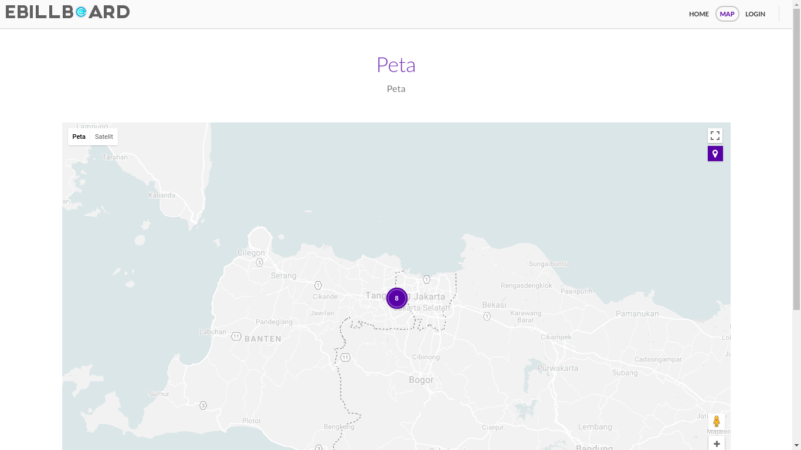
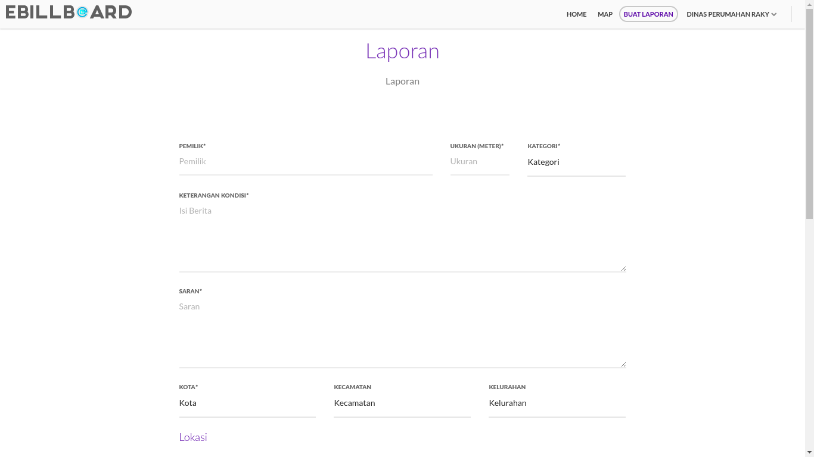
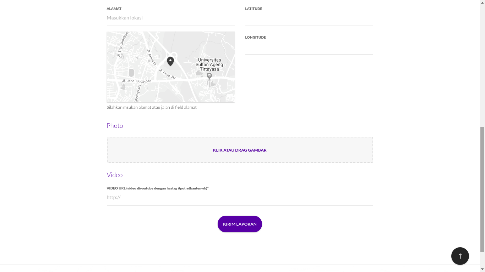
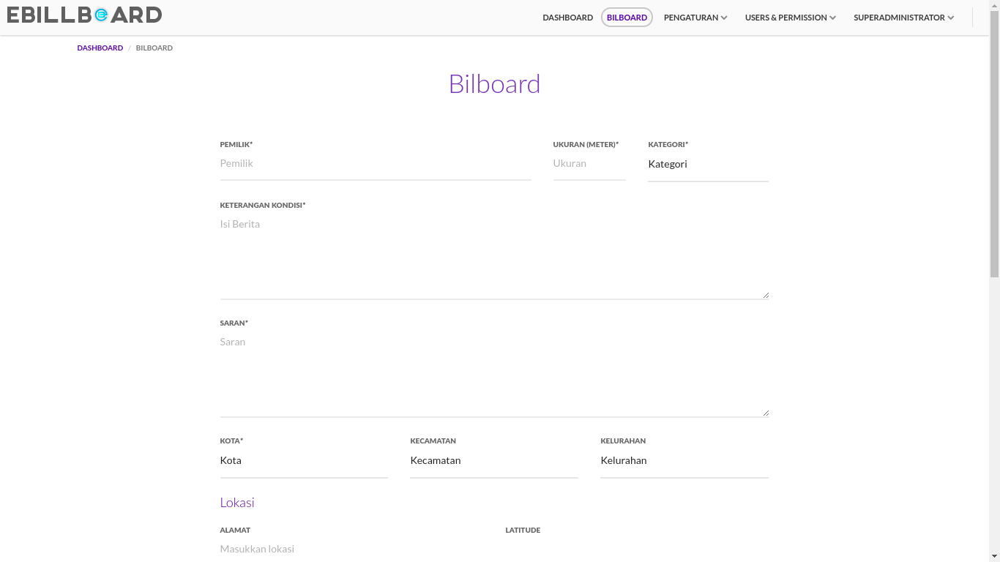
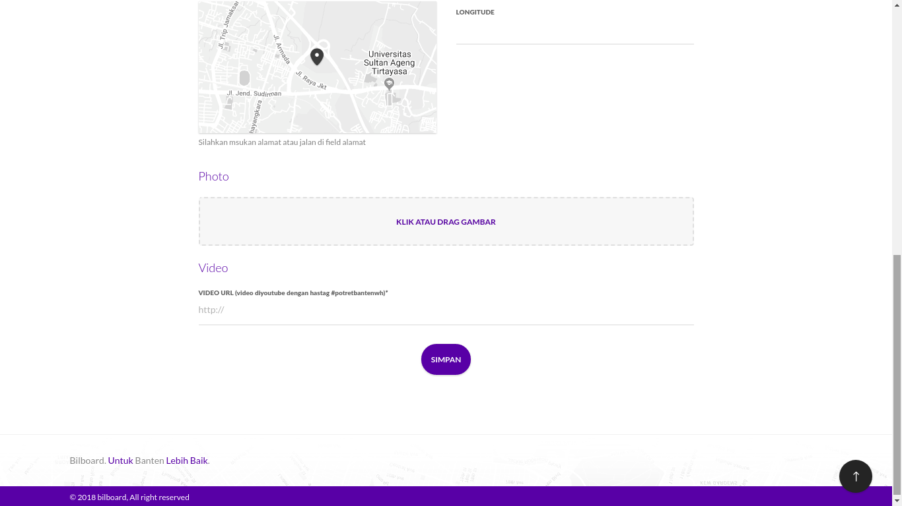
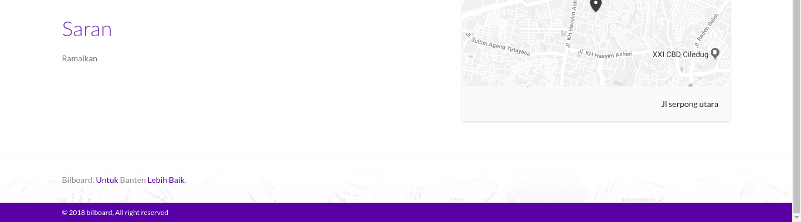
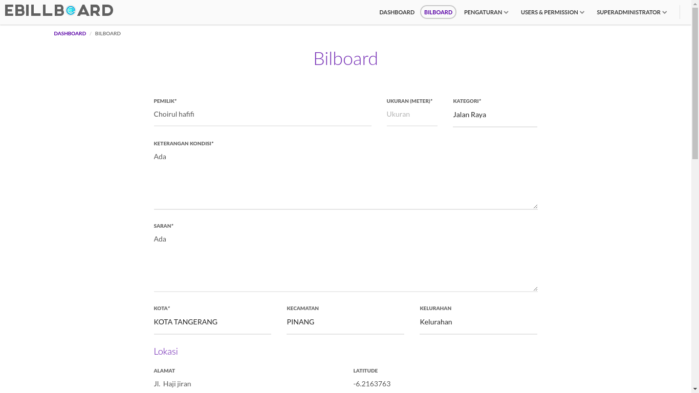

## Daftar Isi

[TOC]

Sistem e-Billboard Provinsi Banten ini dibangun dengan tujuan untuk memudahkan pemerintah dan masyarakat dalam mencari informasi mengenai lokasi, status, serta demografi billboard yang terdapat pada Provinsi Banten. Deskripsi Umum kebutuhan aplikasi yang akan diimplementasikan meliputi semua informasi yang bersifat teknis dan menjadi acuan dalam pengembangan apliksi.

Berikut ini adalah tampilan - tampilan yang terdapat didalam apliaksi e-Billboard:

## 1. Tampilan Website

### 1.1. Tampilan Awal e-Billboard

Untuk memulai akses terhadap aplikasi e-Billboard ini *user* dapat membuka web browser (IE, Mozila Firefox atau yang lainnya) dengan menulis alamat url https://bilboard.bangunbanten.com/ kemudian tekan Enter pada tombol keyboard atau klik tombol Go pada browser. Sehingga akan muncul tampilan seperti dibawah ini :

#### 1.1.1 Tampilan Home

Pada tampilan ini *user* dapat melihat informasi - informasi yang terdapat pada aplikasi e-Billboard seperti map dan data - data billboard yang sudah terpetakan dalam aplikasi.

#### 1.1.2 Tampilan Map

Pada tampilan Map ini *user* dapat melihat map yang berisikan informasi letak - letak billboard pada daerah Banten. Pada Halaman ini *user* dapat melakukan pencarian billboard berdasarkan lokasi Kota, Kecamatan dan Kelurahan

#### 1.1.3 Tampilan Login

Pada tampilan ini *user* akan disajikan dengan form Login, Form login ini dapat digunakan oleh OPD dan Superadmin untuk masuk kedalam aplikasi e-Billboard sesuai dengan tupoksi nya masing - masing.

### 1.2. Tampilan OPD

Tampilan ini dapat diakses oleh OPD ketika berhasil melakukan Login kedalam aplikasi e-Billboard.

#### 1.2.1 Tampilan Home

Pada tampilan ini OPD dapat melihat informasi - informasi yang terdapat pada aplikasi e-Billboard seperti map dan data - data billboard yang sudah terpetakan dalam aplikasi. pada tampilan ini terdapat beberapa modul yaitu Home, Map dan Buat Laporan.

#### 1.2.2 Tampilan Map

Pada tampilan Map ini OPD dapat melihat map yang berisikan informasi letak - letak billboard pada daerah Banten. Pada Halaman ini *user* dapat melakukan pencarian billboard berdasarkan lokasi Kota, Kecamatan dan Kelurahan

#### 1.2.3 Tampilan Buat Laporan

Pada tampilan Buat Laporan ini OPD dapat membuat data billboard untuk memetakan billboard dengan mengisi form buat laporan seperti pada gambar diatas.

#### 1.2.4 Profile OPD

Modul Profile OPD ini dapat diakses dengan mengklik tulisan "Nama OPD" pada pojok kanan atas aplikasi, pada modul ini terdapat 2 submodul yaitu :

##### 1.2.4.1 Account

Tampilan ini dapat diakses dengan mengklik tulisan Account pada "Nama OPD". Pada tampilan ini OPD dapat mengatur data profile OPD dengan mengisi form Account Setting.

##### 1.2.4.2 Log Out

Sub modul Log Out ini dapat diakses dengan mengklik tulisan Log Out pada "Nama OPD". Sub modul ini digunakan OPD untu melakukan Log Out atau keluar dari Tampilan OPD.

### 1.3. Tampilan Superadmin

Tampilan ini dapat diakses oleh Superadmin ketika berhasil melakukan Login kedalam aplikasi e-Billboard.

#### 1.3.1 Dashboard

Tampilan Dashboard ini dapat diakses ketika superadmin berhasil melakukan Login kedalam apilaksi e-Billboard. Pada halam ini superadmin dapat meilhat informasi - informasi yang terdapat didalam aplikasi e-Billboard, pada tapilan ini terdapat beberapa modul yang terdapat pada bagian atas aplikasi seperti Dashboard, Billboard, Pengaturan dan Users & Permission

#### 1.3.2 Billboard

Tampilan Billboard ini dapat diakses dengan mengklik tulisan Billboard pada bagian atas aplikasi. pada tampilan ini superadmin dapat melihat tabel data billboard yang telah terinput kedalam aplikasi. pada tampilan ini terdapat beberapa bantuan seperti kolom pencarian, tambah billboard, publish, lihat detail, edit dan delete

##### 1.3.2.1 Kolom Pencarian

Kolom Pencarian ini dapat diakses dengan mengetik *keyword* yang di inginkan pada kotak pencarian yang berada di kiri atas tabel billboard.

##### 1.3.2.2 Tambah Billboard

Tampilan Tambah Billboard ini dapat diakses dengan mengklik tombol Tambah Billboard pada bagian kanan atas tabel billboard. Pada tampilan ini superadmin dapat menambahkan data baru billboard pada aplikasi dengan mengisi form tambah billboard.

##### 1.3.2.3 Publish Billboard

Publish Billboard ini dapat diakses dengan mengklik icon gembok pada kolom action billboard. pada Publish Billboard ini superadmin dapat mengatur apakah data billboard akan dipublish atau tidak.

##### 1.3.2.4 Lihat Detail Billboard

Tampilan Lihat Detail Billboard ini dapat diakses dengan mengklik icon mata pada kolom action di tabel billboard. Pada tampilan ini superadmin dapat melihat detail billboard.

##### 1.3.2.5 Edit Billboard

Tampilan Edit Billboard ini dapat diakses dengan mengklik icon pensil pada kolom action di tabel billboard. Pada tampilan ini superadmin dapat mengedit / merubah data billboard.

##### 1.3.2.6 Delete Billboard

Delete Billboard ini dapat diakses dengan mengklik icon tong sampah pada kolom action billboard. pada Delete Billboard ini superadmin dapat menghapus data billboard.

#### 1.3.3 Pengaturan

Pada modul Pengaturan ini terdapat beberapa modul yaitu Banner, Video dan Sosial Media.

##### 1.3.3.1 Banner

Tampilan Banner ini dapat diakses dengan mengklik tulisan Banner pada Modul Pengaturan. pada tampilan ini superadmin dapat melihat tabel data banner yang telah terinput kedalam aplikasi. pada tampilan ini terdapat beberapa bantuan seperti kolom pencarian, tambah banner, edit dan delete

###### 1.3.3.1.1 Kolom Pencarian

Kolom Pencarian ini dapat diakses dengan mengetik *keyword* yang di inginkan pada kotak pencarian yang berada di kiri atas tabel banner.

###### 1.3.3.1.2 Tambah Banner

Tampilan Tambah Banner ini dapat diakses dengan mengklik tombol Tambah Banner pada bagian kanan atas tabel banner. Pada tampilan ini superadmin dapat menambahkan data baru Banner pada aplikasi dengan mengisi form tambah Banner.

###### 1.3.3.1.3 Edit Banner

Tampilan Edit Banner ini dapat diakses dengan mengklik icon pensil pada kolom action di tabel banner. Pada tampilan ini superadmin dapat mengedit / merubah data banner.

###### 1.3.3.1.4 Delete Banner

Delete Banner ini dapat diakses dengan mengklik icon tong sampah pada kolom action banner. pada Delete Banner ini superadmin dapat menghapus data banner.

##### 1.3.3.2 Video

Tampilan Video ini dapat diakses dengan mengklik tulisan Video pada Modul Pengaturan. pada tampilan ini superadmin dapat melihat tabel data video yang telah terinput kedalam aplikasi. pada tampilan ini terdapat beberapa bantuan seperti kolom pencarian, tambah, edit dan delete video.

###### 1.3.3.2.1 Kolom Pencarian

Kolom Pencarian ini dapat diakses dengan mengetik *keyword* yang di inginkan pada kotak pencarian yang berada di kiri atas tabel video.

###### 1.3.3.2.2 Tambah Video

Tampilan Tambah Video ini dapat diakses dengan mengklik tombol Tambah Video pada bagian kanan atas tabel video. Pada tampilan ini superadmin dapat menambahkan data baru Video pada aplikasi dengan mengisi form tambah Video.

###### 1.3.3.2.3 Edit Video

Tampilan Edit Video ini dapat diakses dengan mengklik icon pensil pada kolom action di tabel Video. Pada tampilan ini superadmin dapat mengedit / merubah data Video.

###### 1.3.3.2.4 Delete Video

Delete Video ini dapat diakses dengan mengklik icon tong sampah pada kolom action Video. pada Delete Video ini superadmin dapat menghapus data Video.

##### 1.3.3.3 Sosial Media

Tampilan Sosial Media ini dapat diakses dengan mengklik tulisan Sosial Media pada Modul Pengaturan. pada tampilan ini superadmin dapat melihat tabel data sosial media yang telah terinput kedalam aplikasi. pada tampilan ini terdapat beberapa bantuan seperti kolom pencarian, tambah, edit dan delete sosial media.

###### 1.3.3.3.1 Kolom Pencarian

Kolom Pencarian ini dapat diakses dengan mengetik *keyword* yang di inginkan pada kotak pencarian yang berada di kiri atas tabel sosial media.

###### 1.3.3.3.2 Tambah Sosial Media

Tampilan Tambah Sosial Media ini dapat diakses dengan mengklik tombol Tambah Sosmed pada bagian kanan atas tabel sosial media. Pada tampilan ini superadmin dapat menambahkan data baru sosial media pada aplikasi dengan mengisi form tambah sosial media.

###### 1.3.3.3.3 Edit Sosial Media

Tampilan Edit Sosial Media ini dapat diakses dengan mengklik icon pensil pada kolom action di tabel sosial media. Pada tampilan ini superadmin dapat mengedit / merubah datasosial media.

###### 1.3.3.3.4 Delete Sosial Media

Delete Sosial Media ini dapat diakses dengan mengklik icon tong sampah pada kolom action sosial media. pada Delete Sosial Media ini superadmin dapat menghapus data sosial media.

#### 1.3.4 Users & Permission

Pada modul Users & Permission ini terdapat beberapa modul yaitu User, Permission dan Role

##### 1.3.4.1 Users

Tampilan Users ini dapat diakses dengan mengklik tulisan User pada Modul Users & Permission. pada tampilan ini superadmin dapat melihat tabel data user yang terdapat pada aplikasi. pada tampilan ini terdapat beberapa bantuan seperti kolom pencarian, tambah, edit dan delete user.

###### 1.3.4.1.1 Kolom Pencarian

Kolom Pencarian ini dapat diakses dengan mengetik *keyword* yang di inginkan pada kotak pencarian yang berada di kiri atas tabel user.

###### 1.3.4.1.2 Tambah User

Tampilan Tambah User ini dapat diakses dengan mengklik tombol Tambah User pada bagian kanan atas tabel user. Pada tampilan ini superadmin dapat menambahkan data baru user pada aplikasi dengan mengisi form tambah user.

###### 1.3.4.1.3 Edit User

Tampilan Edit User ini dapat diakses dengan mengklik icon pensil pada kolom action di tabel user. Pada tampilan ini superadmin dapat mengedit / merubah data user.

###### 1.3.4.1.4 Delete User

Delete User ini dapat diakses dengan mengklik icon tong sampah pada kolom action user. pada Delete User ini superadmin dapat menghapus data user.

##### 1.3.4.2 Permission

Tampilan Permission ini dapat diakses dengan mengklik tulisan Permission pada Modul Users & Permission. pada tampilan ini superadmin dapat melihat tabel data permission yang terdapat pada aplikasi. pada tampilan ini terdapat beberapa bantuan seperti kolom pencarian, tambah, lihat detail, edit  dan delete permission

###### 1.3.4.2.1 Kolom Pencarian

Kolom Pencarian ini dapat diakses dengan mengetik *keyword* yang di inginkan pada kotak pencarian yang berada di kiri atas tabel permission.

###### 1.3.4.2.2 Tambah Permission

Tampilan Tambah Permission ini dapat diakses dengan mengklik tombol Tambah Permission pada bagian kanan atas tabel permission. Pada tampilan ini superadmin dapat menambahkan data baru permission pada aplikasi dengan mengisi form tambah permission.

###### 1.3.4.2.3 Lihat Detail Permission

Tampilan Lihat Detail Permission ini dapat diakses dengan mengklik icon mata pada kolom action di tabel permission. Pada tampilan ini superadmin dapat melihat detail permission.

###### 1.3.4.2.4 Edit Permission

Tampilan Edit Permission ini dapat diakses dengan mengklik icon pensil pada kolom action di tabel permission. Pada tampilan ini superadmin dapat mengedit / merubah data permission.

###### 1.3.4.2.5 Delete Permission

Delete Permission ini dapat diakses dengan mengklik icon tong sampah pada kolom action permission. pada Delete Permission ini superadmin dapat menghapus data permission.

##### 1.3.4.3 Role

Tampilan Role ini dapat diakses dengan mengklik tulisan Role pada Modul Users & Permission. pada tampilan ini superadmin dapat melihat tabel data role yang terdapat pada aplikasi. pada tampilan ini terdapat beberapa bantuan seperti kolom pencarian, tambah, lihat detail, edit, Add Permission dan delete role.

###### 1.3.4.3.1 Kolom Pencarian

Kolom Pencarian ini dapat diakses dengan mengetik *keyword* yang di inginkan pada kotak pencarian yang berada di kiri atas tabel role.

###### 1.3.4.3.2 Tambah Role

Tampilan Tambah Role ini dapat diakses dengan mengklik tombol Tambah Role pada bagian kanan atas tabel role. Pada tampilan ini superadmin dapat menambahkan data baru role pada aplikasi dengan mengisi form tambah role.

###### 1.3.4.3.3 Lihat Detail Role

Tampilan Lihat Detail Role ini dapat diakses dengan mengklik icon mata pada kolom action di tabel role. Pada tampilan ini superadmin dapat melihat detail role.

###### 1.3.4.3.4 Edit Role

Tampilan Edit Role ini dapat diakses dengan mengklik icon pensil pada kolom action di tabel role. Pada tampilan ini superadmin dapat mengedit / merubah data role.

###### 1.3.4.3.5 Add Permission

Tampilan Add Permission ini dapat diakses dengan mengklik tombol Add Permission pada kolom action di tabel role. Pada tampilan ini superadmin dapat memberikan permission / hak akses kepada role yang diinginkan.

###### 1.3.4.3.6 Delete Role

Delete Role ini dapat diakses dengan mengklik icon tong sampah pada kolom action role. pada Delete Role ini superadmin dapat menghapus data role.

#### 1.3.5 Profile Superadmin

Modul Profile Superadmin ini dapat diakses dengan mengklik tulisan "Superadmin" pada pojok kanan atas aplikasi, pada modul ini terdapat 2 submodul yaitu :

##### 1.2.4.1 Account

Tampilan ini dapat diakses dengan mengklik tulisan Account pada "Superadmin". Pada tampilan ini Superadmin dapat mengatur data profile Superadmin dengan mengisi form Account Setting.

##### 1.2.4.2 Log Out

Sub modul Log Out ini dapat diakses dengan mengklik tulisan Log Out pada "Superadmin". Sub modul ini digunakan Superadmin untu melakukan Log Out atau keluar dari Tampilan Superadmin.
