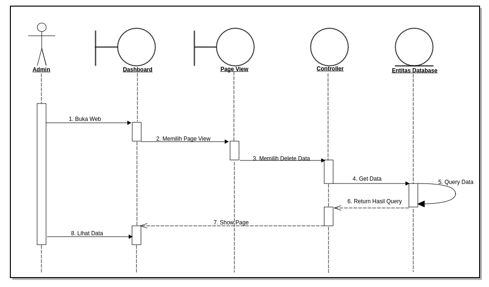
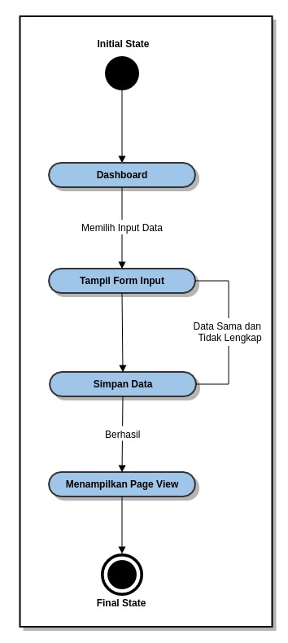
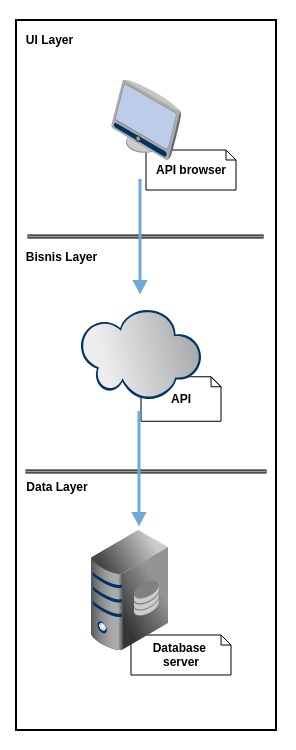

website,
c) Tersedianya dokumen API yang digunakan.
### 1.6 Waktu dan Jadwal Pelaksanaan dan Lokasi Kegiatan
a) Waktu pelaksanaan kegiatan : 3 bulan sejak dikeluarkan SPK sampai dengan pemakaian,
b) Lokasi kegiatan : Kantor OPD terkait dan Dinas Komunikasi Informasi Statistika dan Persandian Pemerintah Provinsi Banten.
## 2. METODE PENELITIAN
Untuk memperoleh data yang dapat menunjang aplikasi ini, maka di perlukan data teoritis dan data dinas terkait untuk mendapatkan data dan informasi yang berhubungan dengan aplikasi ini.
Adapun penyusun melakukan beberapa penelitian yang dilakukan dengan :
### 2.1 Metode Yang digunakan
Menggunakan metode *prototyping* untuk melakukan perancangan sistem informasi berbasis web.
Ilustrasi alur *prototyping*

### 2.2 Metode Pengumpulan Data
Untuk mengumpulkan data yang diperlukan untuk membangun sistem ini diadakan wawancara dan studi pustaka. Pengumpulan data ini diperlukan untuk mengetahui permasalahan dan gambaran sistem yang sedang berjalan sehingga dapat mengembangkannya untuk membentuk sistem baru yang dapat mendukung sistem yang sedang berjalan.
1). Wawancara ini dilakukan kepada Pemprov Banten. Wawancara dilakukan kepada sistem analist Pemprov Banten untuk mengetahui permasalahan dalam proses pendataan yang sedang berjalan sekarang.
2). Studi Pustaka, Melakukan pengumpulan melalui buku text, internet sebagai referensi.
## 3. HASIL PEMBAHASAN
### 3.1 Perencanaan Aplikasi
Sistem informasi dashboard adalah untuk mempermudah pimpinan memonitoring kinerja SKPD ( Satuan Kerja Perangkat daerah).
### 3.2. Perancangan Sistem
Permodelan rancangan sistem yang digunakan adalah UML (Unified Modeling Language). Menurut Whitten dan Bentley (2007, p.381), Unified Modeling Language adalah kumpulan rancangan diagram untuk membangun sebuah sistem atau aplikasi yang dimana setiap diagram menyediakan sistem informasi kepada tim pengembang dengan berbagai sudut pandang yang berbeda-beda. UML yang kami gunakan terdiri dari use case diagram, activity diagram, sequence diagram, state chart diagram, class diagram, deploymen diagram dan technology diagram.

### 3.2.1 Use Cace Diagram
#### 3.2.1.1 Use Case Diagram Super Admin

#### 3.2.1.1 Use Case Diagram Admin

#### 3.2.1.2 Use Case Diagram Dinas

### 3.2.2 Activity Diagram

#### 3.2.2.1 Activity Diagram Super Admin

#### 3.2.2.2 Activity Diagram Input Data Super Admin

#### 3.2.2.3 Activity Diagram Edit Data Super Admin

#### 3.2.2.4 Activity Diagram Delete Data Super Admin

#### 3.2.2.5 Activity Diagram View Data Super Admin

#### 3.2.2.6 Activity Diagram Admin

#### 3.2.2.7. Activity Diagram Input Data Admin

#### 3.2.2.8 Activity Diagram Edit Data Admin

#### 3.2.2.9 Activity Diagram Delete Data Admin

#### 3.2.2.10 Activity Diagram View Data Admin

### 3.2.3 Sequence Diagram
#### 3.2.3.1 Sequence Diagram Login Super Admin

#### 3.2.3.2 Sequence Diagram Input Data Super Admin

#### 3.2.3.3 Sequence Diagram Edit Data Super Admin

#### 3.2.3.4 Sequence Diagram Delete Data Super Admin

#### 3.2.3.5 Sequence Diagram View Data Super Admin

#### 3.2.3.6 Sequence Diagram Login Admin

#### 3.2.3.7 Sequence Diagram Input Data Admin

#### 3.2.3.8 Sequence Diagram Edit Data Admin

#### 3.2.3.9 Sequence Diagram Delete Data Admin

#### 3.2.3.10 Sequence Diagram View Data Admin

### 3.2.4 State Chart Diagram
#### 3.2.4.1 State Chart Diagram Login Super Admin

#### 3.2.4.2 State Chart Diagram Input Data Super Admin

#### 3.2.4.3 State Chart Diagram Edit Data Super Admin

#### 3.2.4.4 State Chart Diagram Delete Data Super Admin

#### 3.2.4.5 State Chart Diagram View Data Super Admin

#### 3.2.4.6 State Chart Diagram Login Admin

#### 3.2.4.7 State Chart Diagram Input Data Admin

#### 3.2.4.8 State Chart Diagram Edit Data Admin

#### 3.2.4.9 State Chart Diagram Delete data Admin

#### 3.2.4.10 State Chart Diagram View Data Admin

### 3.2.5 Deployment Diagram

### 3.2.6 Technology Stack Diagram

### 3.3 Tahapan Pekerjaan :
Tahap-tahap atau langkah yang dilakukan dalam mengembangkan Sistem Informasi Dashboard Pimpinan adalah sebagai berikut:
#### a) Analisis dan Perancangan
1). Analisis
Tim pengembang aplikasi akan melakukan analisis jika diperlukan dapat dilakukan survey pendahuluan untuk melihat sejauh mana kebutuhan pengguna akan sistem yang akan dibangun, data-data yang dibutuhkan, dll. Dalam analisis ini dilakukana diskusi-diskusi baik dengan bagian terkait pada satuan kerja.
2). Perancangan Sistem
Perancangan sistem dilaksanakan setelah proses analisis dilaksanakan dan telah disepakati modul dan prosedur-prosedur yang akan diterapkan dalam sistem. Perancangan sistem meliputi kegiatan: penetapan alur data/dokumen, penetapan prosedur, perancangan database, perancangan form dan perancangan interface/dialog layar.
#### b) Pembangunan Sistem
Setelah proses analisis dan perancangan sistem selesai dilakukan, tahapan selanjutnya adalah pembangunan sistem, yang meliputi kegiatan. Pembuatan struktur database, pembuatan kode program/koding, pembuatan laporan-laporan.
#### c) Integrasi dan Pengujian
1). Integrasi
Setelah proses pengembangan sistem selasai dilakukan, tahap selanjutnya adalah Integrasi sistem, yang meliputi kegiatan: pembuatan struktur database terkait integrasi, pembuatan kode program/coding terkait integrasi, pembuatan laporan-laporan terkait integrasi.
Penggunaan webservices / API yang telah disiapkan oleh sistem informasi / aplikasi yang ada.
2). Pengujian
Sistem yang telah selesai dibuat akan diuji coba menggunakan data test sebelum sistem dijalankan. Dalam uji coba sistem ini akan diterapkan metode prototype, yaitu jika terjadi kesalahan/kekurangan baik proses maupuan output sistem, maka kesalahan/kekurangan tersebut akan diperbaiki/ditambahkan, sehingga memungkinkan pengembang untuk kembali ke tahapan pertama yaitu analisa (jika kekurangan sistem memang tidak terdefinisikan dalam dokumen perancangan sistem).

### 3.4 Hasil
Berikut ini adalah hasil eksekusi sistem informasi Dashboard
#### 3.4.1 Struktur Menu Dashboard Pimpinan

#### 3.4.2 Layout Tampilan Depan

#### 3.4.3 Layout Tampilan Login

#### 3.4.4 Layout Tampilan Super Admin

#### 3.4.5 Layout Tampilan Admin

#### 3.4.6 Layout Dashboard Kepegawaian

#### 3.4.7 Layout Dashboard Fasilitas Kesehatan

## 4.PENUTUP
Dengan adanya pembuatan dari sistem informasi dashboard ini dapat membantu dalam mencari informasi atau laporan yang terdapat di pemerintahan Banten, sehingga pimpinan tidak sulit jika ingin mencari informasi atau laporan yang ada dan dapat mempermudah pimpinan memonitoring kinerja para pegawai SKPD (Satuan Kerja Perangkat Daerah).
