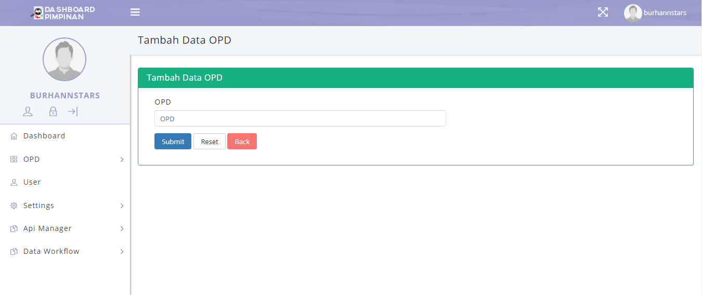
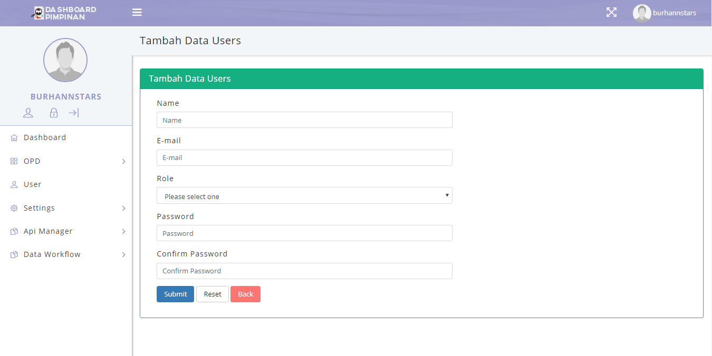
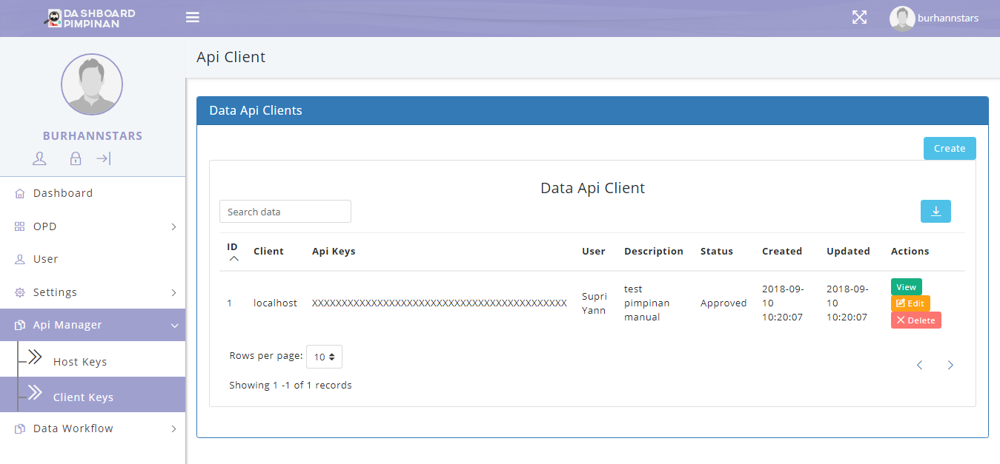

## Daftar Isi
* Will be replaced with the ToC, excluding the "Contents" header
{:toc}

## Implementasi Dashboard Pimpinan
Implementasi aplikasi Dashboard Pimpinan merupakan hasil perancangan dan desain dari apliksi Dashboard Pimpinan yang telah dibuat. Didalam implementasi aplikasi ini nantinya akan dijelaskan langkah-langkah penggunaan dari tipa-tiap menu yang ada pada aplikasi Dashboard Pimpinan yang sudah terintegrasi tersebut.

Untuk memulai akses terhadap web aplikasi **Dashboard Pimpinan**. Buka web browser (IE, Mozila Firefox atau yang lainnya) dengan menulis alamat url http://dashboard-01.dev.bantenprov.go.id kemudian tekan **Enter** pada tombol keyboard atau klik tombol **Go** pada browser. Akan muncul tampilan halaman depan Dashboard Pimpinan seperti gambar dibawah ini.

### 1. Halaman Depan Dashboard Pimpinan

Gambar 1. Halaman Depan Dashboard Pimpinan

Sedangkan untuk memulai akses terhadap aplikasi **Dashboard Pimpinan**. Dapat mendowlonad dan install aplikasi Android Jawara Dashboard di Google Playstore https://play.google.com/store/apps/details?id=com.banten.pimpinan. Setelah itu muncul tampilan halaman depan Dashboard Pimpinan seperti gambar dibawah ini.

Gambar 2. Halaman Depan Aplikasi Android Dashboard Pimpinan

### 2. Tampilan Login
Untuk masuk kedalam aplikasi maka admin perlu untuk  login kedalam aplikasi Dashboard Pimpinan dengan mengklik LOGIN seperti gambar dibawah ini:

Sehingga akan menampilkan tampilan seperti dibawah ini:

Gambar 3. Tampilan Login di Web

Gambar 4. Tampilan Login di Android

Masukkan Email dan Password, Setelah di isi lengkap dan benar, klik button **Masuk** atau tekan tombol **Enter** pada keyboard. Sehingga akan menampilkan halaman utama sebagai berikut.

### 3. Tampilan Awal (Menu Dashboard)

Gambar 5. Tampilan Awal Web

Gambar 6. Tampilan Awal Aplikasi Android

### 4. Menu Dashboard
Konten Dashboard untuk melihat dashboard apa saja yang sudah terintegrasi dengan Dashboard Pimpinan, Berikut ini adalah Dashboard-Dashboard yang sudah terintegrasi dengan Dashboard Pimpinan :

#### 4.1 Data Kepegawaian
Didalam menu dashboard ada beberapa cakupan diantaranya *Data Kepegawaian* (yang didalamnya mencakup Total Pegawai, Pegawai Aktif, Pegawai Pensiun, Pindah/Keluar, Dan Pegawai Meninggal Dunia). Seperti yang ditunjukan pada gambar dibawah ini:

##### 4.1.1 Prosentase dan Grafik Data Kepegawaian

Gambar 7. Tampilan Prosentase dan Grafik Data Kepegawaian di Web

Gambar 8. Tampilan Prosentase dan Grafik Data Kepegawaian di Android

Pada *page* ini *user* dapat melihat data Total Pegawai, Pegawai Aktif, Pegawai Pensiun, Pindah/Keluar, dan Meninggal Dunia dalam bentuk prosentase dan grafik

#### 4.2 Fasilitas Kesehatan

##### 4.2.1 Prosentase dan Grafik Jumlah Fasilitas Kesehatan

Gambar 9. Tampilan Prosentase dan Grafik Jumlah Fasilitas Kesehatan di Web

Gambar 10. Tampilan Prosentase dan Grafik Jumlah Fasilitas Kesehatan di Android

Pada *page* ini *user* dapat melihat data Jumlah Fasilitas Kesehatan dalam bentuk prosentase dan grafik

### 5.  Menu OPD
Menu OPD adalah tampilan aplikasi yang dipergunakan untuk Superadmin dan Admin, di mana bisa untuk Input, Hapus, Edit, Update, View data yang ada, dengan menekan atau klik tombol **create** akan tampil form tabel untuk penambahan data. 

#### 5.1. List OPD

Gambar 11. Tampilan List OPD

Didalam *page* terdapat *list OPD* yang terdapat pada aplikasi Dashboard Pimpinan. Didalam *page* ini admin dapat menambahkan *OPD* dengan cara mengklik tombol "Create", dan sistem aplikasi akan menampilkan gambar di bawah ini.

##### 5.1.1. Form Tabel Tambah Data OPD

Gambar 12. Tampilan Form Tabel Tambah Data OPD

Didalam *page* ini terdapat *form Tambah Data OPD* yang berisi *field* untuk menambahkan *Data OPD* pada aplikasi. Jika sudah mengisi *field* admin dapat memilih tombol "submit" untuk menambahkan *OPD*, tombol "reset" untuk membersihkan *field* menjadi kosong lagi atau tombol "back" untuk membatalkan menambahkan *user*.

### 6. Menu User

Menu User adalah tampilan aplikasi yang dipergunakan untuk Superadmin dan Admin, di mana bisa untuk Input, Hapus, Edit, Update, View data yang ada, dengan menekan atau klik tombol **create** akan tampil form tabel untuk penambahan data.

#### 6.1 Users List

Gambar 13. Tampilan Users List

Didalam *page* terdapat *Users List* yang terdapat pada aplikasi Dashboard Pimpinan. Didalam *page* ini admin dapat menambahkan *user* baru dengan cara mengklik tombol "Create", dan sistem aplikasi akan menampilkan gambar di bawah ini:

##### 6.1.1 Form Tabel Tambah Data Users

Gambar 14. Tampilan Form Tabel Tambah Data Users

Didalam *page* ini terdapat *form tambah data users* yang berisi beberapa *field* untuk menambahkan *User* Baru pada aplikasi. Jika sudah mengisi semua *field* admin dapat memilih tombol "submit" untuk menambahkan *user*, tombol "reset" untuk membersihkan *field* menjadi kosong lagi atau tombol "back" untuk membatalkan menambahkan *user*.

### 7. Menu Settings

Menu Settings adalah tampilan aplikasi yang dipergunakan untuk Superadmin dan Admin, di mana bisa untuk Input, Hapus, Edit, Update, View data yang ada, dengan menekan atau klik tombol **create** akan tampil form tabel untuk penambahan data. Didalam menu settings ada beberapa bagian menu, diantaranya adalah dengan tampilan gambar seperti dibawah ini:

#### 7.1 Roles

Gambar 15. Tampilan Form List Data Role User

Didalam *page* terdapat *roles* yang terdapat pada aplikasi Dashboard Pimpinan. Didalam *page* ini admin dapat menambahkan *role user* dengan cara mengklik tombol "Create", dan sistem aplikasi akan menampilkan gambar di bawah ini:

##### 7.1.1 Form Tabel Tambah Data Roles

Gambar 16. Tampilan Form Tabel Tambah Data Roles User

Didalam *page* ini terdapat *form Tambah Data Roles* yang berisi beberapa *field* untuk menambahkan *Role User* pada aplikasi. Jika sudah mengisi semua *field* admin dapat memilih tombol "submit" untuk menambahkan *Role*, tombol "reset" untuk membersihkan *field* menjadi kosong lagi atau tombol "back" untuk membatalkan menambahkan *role*.

#### 7.2 Permission

Gambar 17. Tampilan Form List Data Permissions

Didalam *page* terdapat *permissions* yang terdapat pada aplikasi Dashboard Pimpinan. Didalam *page* ini admin dapat menambahkan *permission* dengan cara mengklik tombol "Create", dan sistem aplikasi akan menampilkan gambar di bawah ini:

##### 7.2.1 Form Tabel Tambah Data Permissions

Gambar 18. Tampilan Form Tabel Tambah Data Permissions

Didalam *page* ini terdapat *form Tambah Permissions* yang berisi beberapa *field* untuk menambahkan *Permissions* pada aplikasi. Jika sudah mengisi semua *field* admin dapat memilih tombol "submit" untuk menambahkan *Permissions*, tombol "reset" untuk membersihkan *field* menjadi kosong lagi atau tombol "back" untuk membatalkan menambahkan *permissions*.

#### 7.3 Menu Permission

Gambar 19. Tampilan Form List Data Menu Permissions

Didalam *page* terdapat *menu permissions* yang terdapat pada aplikasi Dashboard Pimpinan. Didalam *page* ini admin dapat menambahkan *menu permission* dengan cara mengklik tombol "Create", dan sistem aplikasi akan menampilkan gambar di bawah ini:

##### 7.3.1 Form Tabel Tambah Menu Permission

Gambar 20. Tampilan Form Tabel Tambah Menu Permission

Didalam *page* ini terdapat *form Tambah Menu Permission* yang berisi beberapa *field* untuk menambahkan *Menu Permission* pada aplikasi. Jika sudah mengisi semua *field* admin dapat memilih tombol "submit" untuk menambahkan *Menu Permission*, tombol "reset" untuk membersihkan *field* menjadi kosong lagi atau tombol "back" untuk membatalkan menambahkan *menu permission*.

### 8. Menu Api Manager

Menu Api Manager adalah tampilan aplikasi yang dipergunakan untuk Superadmin dan Admin, di mana bisa untuk Input, Hapus, Edit, Update, View data yang ada, dengan menekan atau klik tombol **create** akan tampil form tabel untuk penambahan data. Didalam menu settings ada beberapa bagian menu, diantaranya adalah dengan tampilan gambar seperti dibawah ini:

#### 8.1 Host Keys

Gambar 21. Tampilan Form List Host Keys

Didalam *page* terdapat *table Host Keys* yang terdapat pada aplikasi Dashboard Pimpinan. Didalam *page* ini admin dapat menambahkan *Host Keys* dengan cara mengklik tombol "Request", dan sistem aplikasi akan menampilkan gambar di bawah ini:

##### 8.1.1 Form Tabel Request Host Keys

Gambar 22. Tampilan Form Tabel Tambah Request Host Keys

Didalam *page* ini terdapat *form Tambah Menu Permission* yang berisi beberapa *field* untuk menambahkan *Host Keys* pada aplikasi. Jika sudah mengisi semua *field* admin dapat memilih tombol "submit" untuk menambahkan *Host Keys*, tombol "reset" untuk membersihkan *field* menjadi kosong lagi atau tombol "back" untuk membatalkan menambahkan *host keys*.

#### 8.2 Client Keys

Gambar 23. Tampilan Form Tabel List Api Client

Didalam *page* terdapat *table List Client Keys* yang terdapat pada aplikasi Dashboard Pimpinan. Didalam *page* ini admin dapat menambahkan *Client Keys* dengan cara mengklik tombol "Create", dan sistem aplikasi akan menampilkan gambar di bawah ini:

##### 8.1.1 Form Tabel Tambah Api Client

Gambar 24. Tampilan Form Tabel Tambah Api Client

Didalam *page* ini terdapat *form Tambah Api Client* yang berisi beberapa *field* untuk menambahkan *Client Keys* pada aplikasi. Jika sudah mengisi semua *field* admin dapat memilih tombol "submit" untuk menambahkan *Client Keys*, tombol "reset" untuk membersihkan *field* menjadi kosong lagi atau tombol "back" untuk membatalkan menambahkan *client keys*.

### 9. Data Workflow

Menu Data Workflow adalah tampilan aplikasi yang dipergunakan untuk Superadmin dan Admin, di mana bisa untuk Input, Hapus, Edit, Update, Mengaktifkan/Non aktif Workflow, View data yang ada, dengan menekan atau klik tombol **create** akan tampil form tabel untuk penambahan data. Didalam menu settings ada beberapa bagian menu, diantaranya adalah dengan tampilan gambar seperti dibawah ini:

#### 9.1 Workflow

Gambar 25. Tampilan Form List Workflow

Didalam *page* terdapat *table Workflow* yang terdapat pada aplikasi Dashboard Pimpinan. Didalam *page* ini admin dapat menambahkan *Workflow* dengan cara mengklik tombol "Create", dan sistem aplikasi akan menampilkan gambar di bawah ini:

##### 9.1.1 Form Tabel Tambah Workflow

Gambar 26. Tampilan Form Tabel Tambah Workflow

Didalam *page* ini terdapat *form Tambah Workflow* yang berisi beberapa *field* untuk menambahkan *Workflow* pada aplikasi. Jika sudah mengisi semua *field* admin dapat memilih tombol "submit" untuk menambahkan *Workflow*, tombol "reset" untuk membersihkan *field* menjadi kosong lagi atau tombol "back" untuk membatalkan menambahkan *workflow*.

#### 9.2 Workflow State

Gambar 27. Tampilan Form List Workflow State

Didalam *page* terdapat *table Workflow State*  yang terdapat pada aplikasi Dashboard Pimpinan. Didalam *page* ini admin dapat menambahkan *Workflow State* dengan cara mengklik tombol "Create", dan sistem aplikasi akan menampilkan gambar di bawah ini:

##### 9.2.1 Form Tabel Tambah Workflow State

Gambar 28. Tampilan Form Tabel Tambah Workflow State

Didalam *page* ini terdapat *form Tambah Workflow State* yang berisi beberapa *field* untuk menambahkan *Workflow State* pada aplikasi. Jika sudah mengisi semua *field* admin dapat memilih tombol "submit" untuk menambahkan *Workflow State*, tombol "reset" untuk membersihkan *field* menjadi kosong lagi atau tombol "back" untuk membatalkan menambahkan *workflow state*.

#### 9.3 Workflow Transition

Gambar 29. Tampilan Form List Workflow Transition

Didalam *page* terdapat *table Workflow Transition*  yang terdapat pada aplikasi Dashboard Pimpinan. Didalam *page* ini admin dapat menambahkan *Workflow Transition* dengan cara mengklik tombol "Create", dan sistem aplikasi akan menampilkan gambar di bawah ini:

##### 9.3.1 Form Tabel Tambah Workflow Transition

Gambar 30. Form Tabel Tambah Workflow Transition

Didalam *page* ini terdapat *form Tambah Workflow Transition* yang berisi beberapa *field* untuk menambahkan *Workflow Transition* pada aplikasi. Jika sudah mengisi semua *field* admin dapat memilih tombol "submit" untuk menambahkan *Workflow Transition*, tombol "reset" untuk membersihkan *field* menjadi kosong lagi atau tombol "back" untuk membatalkan menambahkan *workflow transition*.

#### 9.2 Workflow History

Gambar 31. Tampilan Form List Workflow History

Didalam *page* terdapat *table Workflow History*  yang terdapat pada aplikasi Dashboard Pimpinan. 
