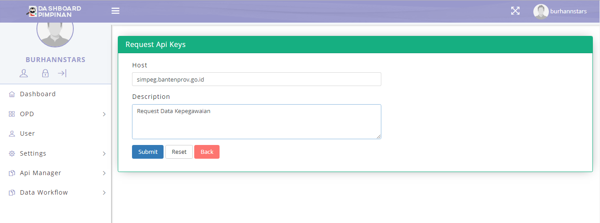
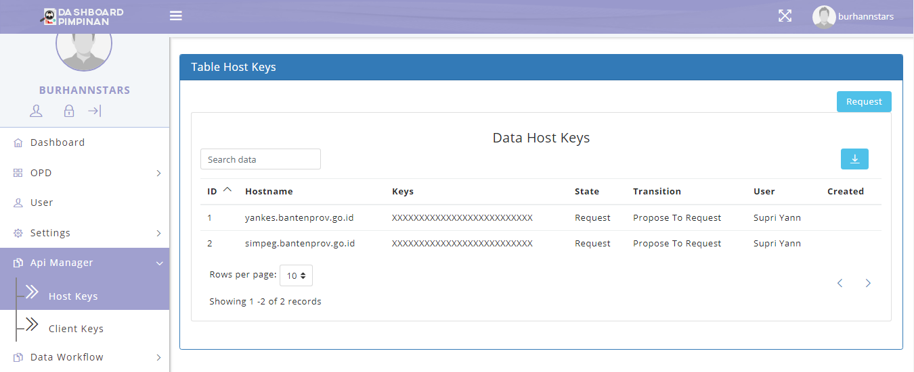
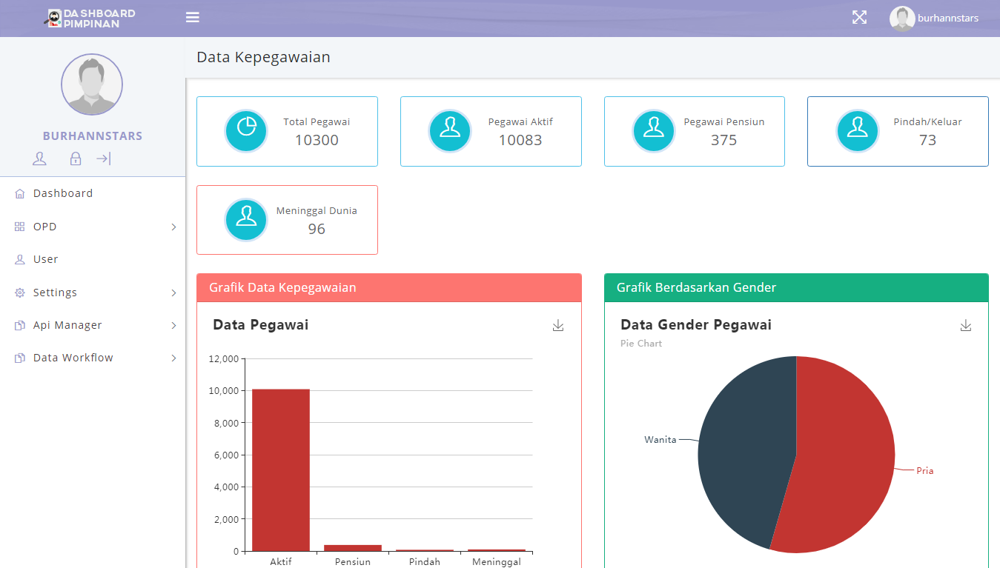
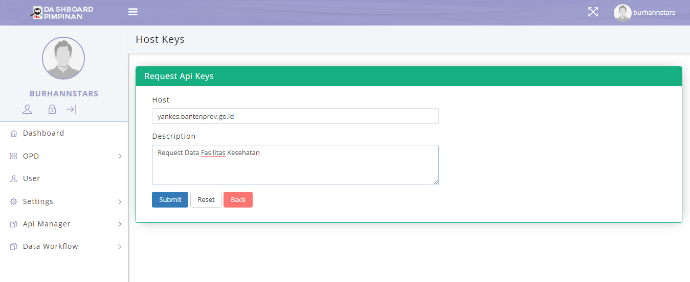
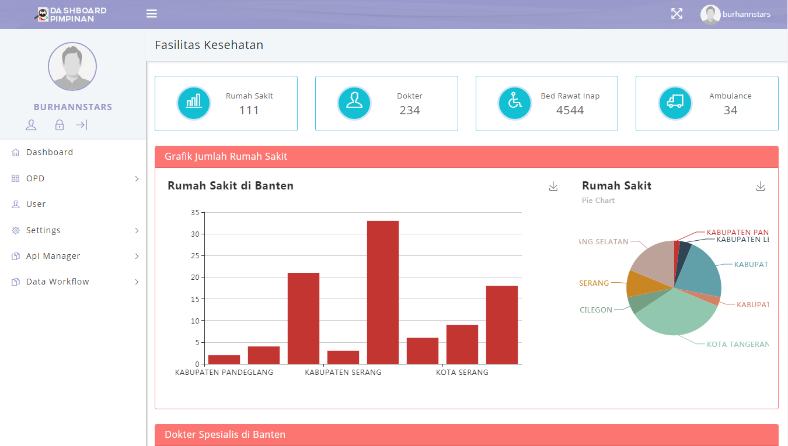
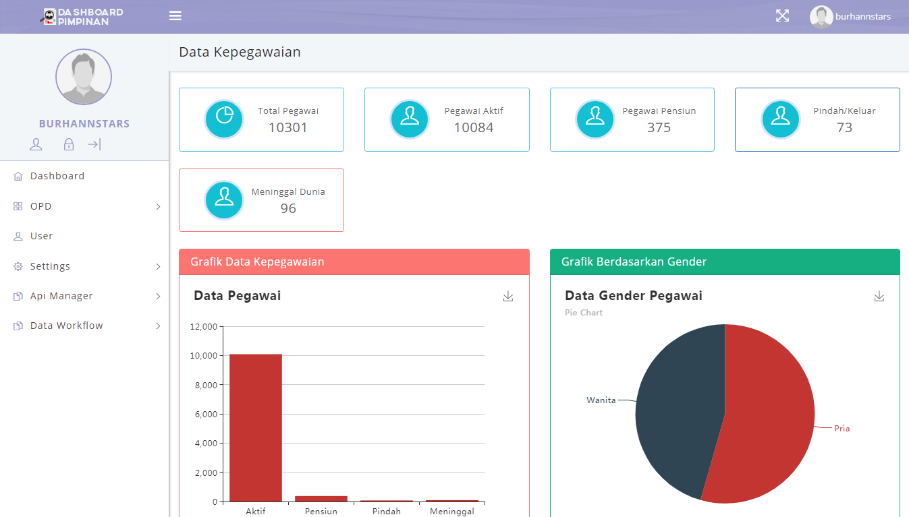

## Integrasi dan Pengujian Dashboard Pimpinan
Pada laporan ini akan membahas tentang Pengujian dan Integrasi Dashboard Pimpinan, untuk pengujiannya menggunakan *User Acceptance Test*.

## Daftar Isi
* Will be replaced with the ToC, excluding the "Contents" header
{:toc}

### 1. Integrasi
Dashboard Pimpinan adalah suatu aplikasi untuk memantau setiap OPD (Organisasi perangkat Daerah) di pemerintahan Banten.

Dalam kegiatannnya setiap kegiatan admin akan terdapat integrasi terhadap server yang bertujuan untuk melakukan integrasi aplikasi data sehingga mudah untuk di*share*, integrasi dilakukan tanpa membuat perubahan signifikan pada aplikasi dan sumber data.

Integrasi aplikasi dilakukan dengan:
1. melalui antar muka aplikasi atau melalui method
2. *focus method level*
3. method di*share* dengan meletakannnya pada sebuah server pusat / dengan mengakses *method* pada aplikasi.

*Application Programming Interface*
mekanisme terdefinisi dibuat untuk berhubungan dengan sumber daya seperti server aplikasi, *middleware*, dan basis data.

Dibawah ini adalah contoh method, parameter dan *response* yang terdapat didalam Dashboard Pimpinan:
#### 1.1 Data Kepegawaian
##### 1.1.1 Request Data Kepegawaian

Pada *page* ini terdapat *method* yang berupa tombol "GET" dan link url untuk merequest Data Kepegawaian dari Aplikasi SIMPEG, method ini digunakan untuk menambahkan data baru aplikasi ke server. Parameter yang terdapat didalam konten ini berisi *Hostname dan Keys*.

##### 1.1.2 Menampilkan Data Kepegawaian di Dashboard

Pada *page* ini akan ditampilkan hasil dari Request ke Aplikasi SIMPEG, data yang diperoleh berupa Data Kepegawaian berdasarkan Status, Gender, Jabatan, Pendidikan, Agama, Golongan dan Usia yang disajikan dalam bentuk Grafik.

#### 2.1 Fasilitas Kesehatan

##### 2.1.1 Request Data Fasilitas Kesehatan

Pada *page* ini terdapat *method* yang berupa tombol "GET" dan link url untuk merequest Data Kepegawaian dari Aplikasi YANKES, method ini digunakan untuk menambahkan data baru aplikasi ke server. Parameter yang terdapat didalam konten ini berisi *Hostname dan Keys*.

##### 2.1.2 Menampilkan Data Fasilitas Kesehatan di Dashboard

Pada *page* ini akan ditampilkan hasil dari Request ke Aplikasi YANKES, data yang diperoleh berupa Data Fasilitas Kesehatan berdasarkan Jumlah Rumah Sakit, Dokter, Bed Rawat Inap, dan Ambulance yang disajikan dalam bentuk Grafik.

### 2. User Acceptance Test (UAT)

#### 2.1 Dashboard Data Kepegawaian

##### 2.1.1 Subkonten Grafik Data Kepegawaian

| Dashboard    | URL/ Image                                                   | Ada  | Tidak |
| ------------ | ------------------------------------------------------------ | ---- | ----- |
| Data Pegawai |  |      |       |

Dalam tabel ini *user* dapat melakukan test kepada aplikasi apakah subkonten grafik data pegawai sudah dapat diakses oleh *user* atau tidak. Untuk mengecek dapat diakses tidaknya subkonten ini *user* dapat membuka link url http://dashboard.bantenprov.go.id/#/data-pegawai/2 , jika sudah dapat diakses *user* dapat meceklis pada kolom "Ada" sedangkan jika belum dapat diakses maka *user* dapat menceklis pada kolom "tidak".

#### 2.2 Dashboard Fasilitas Kesehatan

##### 2.2.1 Subkonten Grafik Data Fasilitas Kesehatan

| Dashboard           | URL/ Image                                                   | Ada  | Tidak |
| ------------------- | ------------------------------------------------------------ | ---- | ----- |
| Fasilitas Kesehatan |  |      |       |

Dalam tabel ini *user* dapat melakukan test kepada aplikasi apakah subkonten grafik data fasilitas kesehatan sudah dapat diakses oleh *user* atau tidak. Untuk mengecek dapat diakses tidaknya subkonten ini *user* dapat membuka link url http://dashboard.bantenprov.go.id/#/fasilitas-kesehatan/1 , jika sudah dapat diakses *user* dapat meceklis pada kolom "Ada" sedangkan jika belum dapat diakses maka *user* dapat menceklis pada kolom "tidak".
