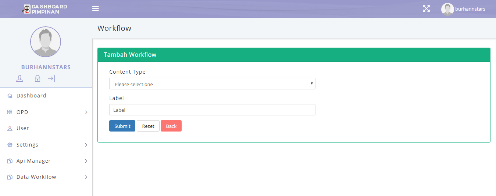

Document manual book ini dibuat untuk memberikan panduan penggunaan aplikasi **Dashboard Pimpinan**, dimana Aplikasi Dashboar Pimpinan adalah aplikasi antar muka untuk monitoring dan mempermudah Pimpinan untuk melihat dan menilai kinerja SKPD (Satuan Kerja Perangkat Daerah). Perangkat lunak yang di butuhkan untuk pengujian aplikasi adalah Ubuntu 17 sebagai Operasi System. Sumber daya manusia untuk menggunakan aplikasi ini terutama dari Pimpinan dinas Provinsi Banten, penggunaan aplikasi ini terlebih dahulu diberikan pengenalan dan pelatihan yang cukup untuk menggunakan aplikasi *Dashboard Pimpinan*.

### 1. Struktur Menu
Adapun struktur menu pada aplikasi Dashboard Pimpinan adalah sebagai berikut:
#### 1.1 Menu Dashboard
- **Data Pegawai**
- **Fasilitas Kesehatan**

#### 1.2 Menu Data OPD
- **Data OPD**

#### 1.3 **Menu User**

#### **1.4 Menu Settings**

- **Roles**
- **Permission**
- **Menu Permission**

#### **1.5 Menu Api Manager**

- **Host Keys**
- **Client Keys**

#### **1.6 Menu Data Workflow**

- **Workflow**
- **Workflow State**
- **Workflow Transition**
- **Workflow History**

Untuk memulai akses terhadap aplikasi **Dashboard Pimpinan**. Buka web browser (IE, Mozilla Firefox atau yang lainnya) dengan menulis alamat url http://103.83.198.5/#/login (***Dev Version***) kemudian tekan Enter** pada tombol keyboard atau klik tombol **Go** pada browser. Akan muncul tampilan halaman login aplikasi dashboard seperti gambar dibawah ini.

**Gambar 1. Tampilan Login**

Masukkan User Id dan Password, Setelah di isi lengkap dan benar, klik button **Sign in** atau tekan tombol **Enter** pada keyboard. Sehingga akan menampilkan halaman utama sebagai berikut.

**Gambar 2. Tampilan Awal**

#### 2. Menu Dashboard
Halaman muka Dashboard Pimpinan Menampilkan 2 grafik:

- *Dashboard Kepegawaian*
- *Dashboard Fasilitas Kesehatan*

Seperti ditunjukan pada gambar berikut ini:

**Gambar 3. Halaman Utama (Home)**

Untuk menampilkan detail dashboard Data Pegawai dengan mengklik tombol **Data Pegawai**.
maka akan ditampilkan jumlah Pegawai Aktif, Pegawai Pensiun, Pindah/Keluar, dan Meninggal Dunia. Seperti ditunjukan pada gambar berikut ini:

**Gambar 4. Detail Prosentase dan Grafik Data Kepegawaian**

Untuk menampilkan detail dashboard Fasilitas Kesehatan dengan mengklik tombol **Fasilitas Kesehatan**. maka akan ditampilkan data Jumlah Rumah Sakit, Dokter, Bed Rawat Inap, dan Ambulance. Seperti ditunjukan pada gambar berikut ini:

**Gambar 5. Detail Prosentase dan Grafik Fasilitas Kesehatan**

#### 3. Menu OPD
Menu OPD adalah tampilan aplikasi yang dipergunakan untuk Superadmin dan Admin, di mana bisa untuk Input, Hapus, Edit, Update, View data OPD yang ada, dengan menekan atau klik tombol **create** akan tampil form tabel untuk penambahan data. Seperti yang ditunjukan pada gambar berikut ini:

**Data OPD**

**Gambar 6. List Data OPD**

Klik tombol Create sistem aplikasi akan menampilakan gambar di bawah ini

**Gambar 7. Form Tabel Tambah Data OPD**

#### **4. Menu User**

Menu User adalah tampilan aplikasi yang dipergunakan untuk Superadmin dan Admin, di mana bisa untuk Input, Hapus, Edit, Update, View data yang ada, dengan menekan atau klik tombol **create** akan tampil form tabel untuk penambahan data. Seperti pada gambar dibawah ini:

**User List**

**Gambar 8. List Tabel Users**

Klik tombol Create sistem aplikasi akan menampilakan gambar di bawah ini

**Gambar 9. Form Tabel Add User**

#### **5. Menu Settings**

Menu Settings adalah tampilan aplikasi yang dipergunakan untuk Superadmin dan Admin, di mana bisa untuk Input, Hapus, Edit, Update, View data yang ada, dengan menekan atau klik tombol **create** akan tampil form tabel untuk penambahan data. Didalam menu settings ada beberapa bagian menu, diantaranya adalah dengan tampilan gambar seperti dibawah ini:

**Roles**

**Gambar 10. List Role User**

#### **6. Menu Api Manager**

Menu Api Manager adalah tampilan aplikasi yang dipergunakan untuk Superadmin dan Admin untuk mengelola *request* API. Didalam menu Api Manager ada beberapa bagian menu, diantaranya adalah dengan tampilan gambar seperti dibawah ini:

**Host Keys**

**Gambar 11. List Host Keys**

Klik tombol Request, sistem aplikasi akan menampilkan gambar di bawah ini

**Gambar 12. Form Tabel Tambah Host Keys**

**Client Keys**

**Gambar 13. List Data Api Clients**

Klik tombol Create, sistem aplikasi akan menampilkan gambar di bawah ini

**Gambar 14. Form Tabel Tambah Api Client**

#### **7. Menu Data Workflow**

Menu Data Workflow adalah tampilan aplikasi yang dipergunakan untuk Superadmin dan Admin untuk melihat alur status API Request. Didalam menu Data Workflow terdapat beberapa bagian menu, diantaranya adalah dengan tampilan gambar seperti dibawah ini:

**Workflow**

**Gambar 15. List Tabel Data Workflow**

Klik tombol Create sistem aplikasi akan menampilakan gambar di bawah ini

**Gambar 16. Form Tabel  Tambah Workflow**

**Workflow State**

**Gambar 17. List Tabel Data Workflow State**

Klik tombol Create sistem aplikasi akan menampilakan gambar di bawah ini

**Gambar 18. Form Tabel Tambah Workflow State**

**Workflow Transition**

**Gambar 19. List Tabel Data Workflow Transition**

Klik tombol Create sistem aplikasi akan menampilakan gambar di bawah ini

**Gambar 20. Form Tabel Tambah Workflow Transition**

**Workflow History**

**Gambar 21. List Tabel Data Workflow History**
