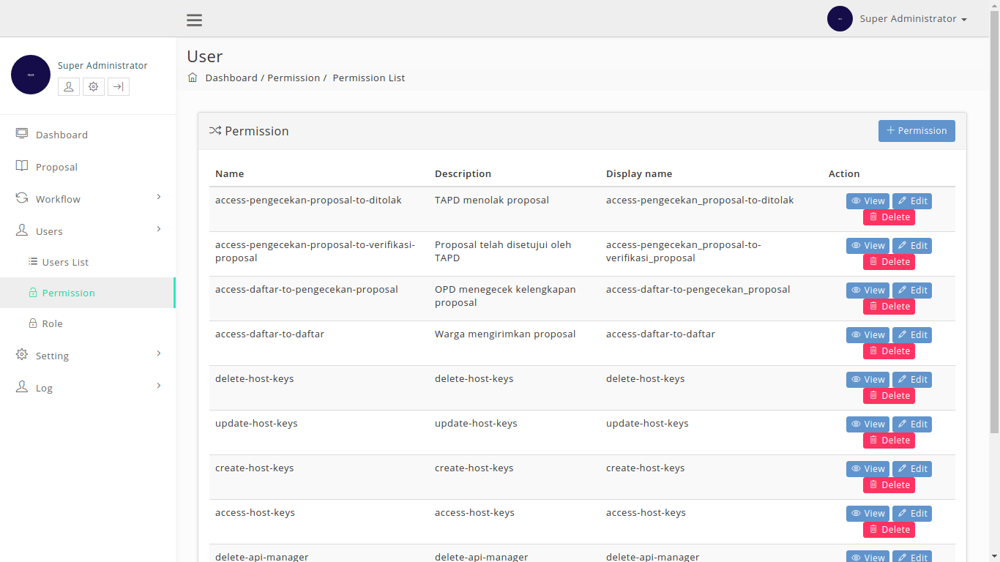
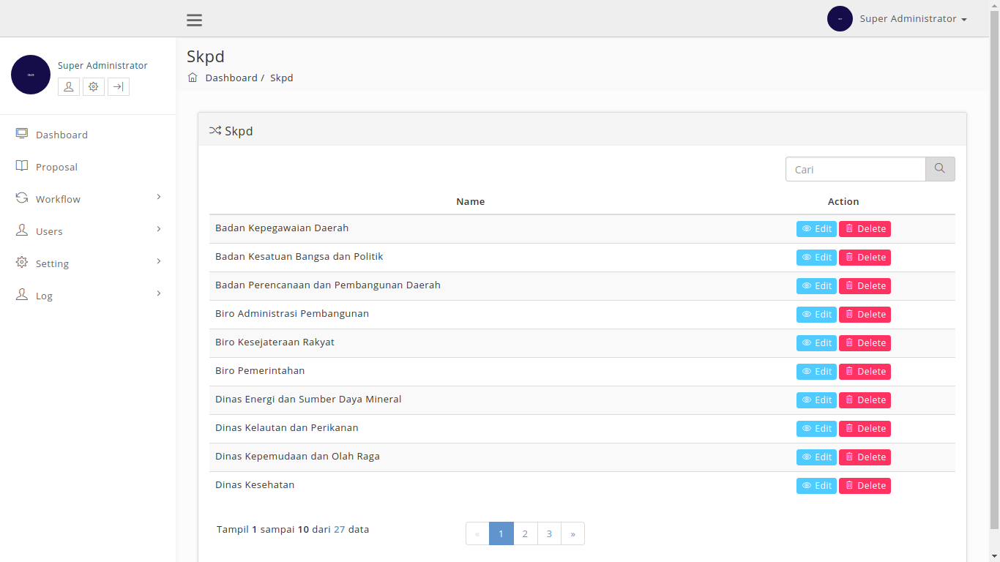

## Integrasi dan Pengujian Ehibahbansos

Pada laporan ini akan membahas tentang Pengujian dan Integrasi Ehibahbansos, untuk pengujiannya menggunakan User Acceptance Test.

## Daftar Isi

[TOC]

## 1. Integrasi Ehibahbansos

Integrasi aplikasi dilakukan dengan:

1. melalui antar muka aplikasi atau melalui method
2. focus method level
3. method dishare dengan meletakannnya pada sebuah server pusat / dengan mengakses method pada aplikasi.

Application Programming Interface mekanisme terdefinisi dibuat untuk berhubungan dengan sumber daya seperti server aplikasi, middleware, dan basis data.

Dibawah ini adalah contoh method, parameter dan response yang terdapat didalam aplikasi e-Hibahabansos:

### 1.1 Request Berita Information

### 1.2 Get All Data

## 2.  User Acceptance Test
Pada pengujian ini akan menggunakan User Acceptance Test (UAT).

Pada pengujian website ini akan menguji yang terdapat di dalam aplikasi e-HibahBansos.

### 2.1 Tampilan Website

#### 2.1.1 Tampilan Umum

##### 2.1.1.1  Home
| Tampilan      | URL/ Image                               | Ada  | Tidak |
| ------------- | ---------------------------------------- | ---- | ----- |
| Tampilan Home |  |      |       |

Pada saat membuka aplikasi maka *user* akan ditampilkan halaman Home aplikasi yang berisikan mengenai info-info mengenai aplikasi E-hibahbansos. Jika modul ini dapat diakses oleh *user*, maka user dapat menceklis pada kolom **Ada** sedangkan jika belum dapat diakses maka *user* dapat meceklis pada kolom **Tidak Ada**.

##### 2.1.1.2 Proposal
| Tampilan          | URL/ Image                               | Ada  | Tidak |
| ----------------- | ---------------------------------------- | ---- | ----- |
| Tampilan Proposal |  |      |       |

Pada modul PROPOSAL ini *user* dapat melihat proposal-proposal yang sudah terinput kedalam apliaksi E-hibahbansos dan sudah berada pada tahapan mana proposal tersebut. Pada modul ini terdapat tombol Show pada kolom action untuk melihat detail proposal. Jika modul ini dapat diakses oleh *user*, maka user dapat menceklis pada kolom **Ada** sedangkan jika belum dapat diakses maka *user* dapat meceklis pada kolom **Tidak Ada**.

###### 2.1.1.2.1 Detail Proposal
| Tampilan                 | URL/ Image                               | Ada  | Tidak |
| ------------------------ | ---------------------------------------- | ---- | ----- |
| Tampilan Detail Proposal |  |      |       |

Pada Halaman ini user dapat melihat detail dari proposal yang ingin dilihat. Jika modul ini dapat diakses oleh *user*, maka user dapat menceklis pada kolom **Ada** sedangkan jika belum dapat diakses maka *user* dapat meceklis pada kolom **Tidak Ada**.

##### 2.1.1.3 Tentang
| Tampilan         | URL/ Image                               | Ada  | Tidak |
| ---------------- | ---------------------------------------- | ---- | ----- |
| Tampilan Tentang |  |      |       |

Pada modul TENTANG ini *user* dapat mengetahui informasi mengenai aplikasi E-hibahbansos seperti apa itu e-hibahbansos, tujuan dan tahapan-tahapan yang terdapat di dalam aplikasi E-hibahbansos. Jika modul ini dapat diakses oleh *user*, maka user dapat menceklis pada kolom **Ada** sedangkan jika belum dapat diakses maka *user* dapat meceklis pada kolom **Tidak Ada**.

##### 2.1.1.4 Peraturan
| Tampilan           | URL/ Image                               | Ada  | Tidak |
| ------------------ | ---------------------------------------- | ---- | ----- |
| Tampilan Peraturan |  |      |       |

Pada modul PERATURAN ini *user* dapat melihat peraturan-peraturan yang menjadi dasar dalam pembuatan aplikasi E-hibahbansos. Jika modul ini dapat diakses oleh *user*, maka user dapat menceklis pada kolom **Ada** sedangkan jika belum dapat diakses maka *user* dapat meceklis pada kolom **Tidak Ada**.

##### 2.1.1.5 Pengumuman
| Tampilan            | URL/ Image                               | Ada  | Tidak |
| ------------------- | ---------------------------------------- | ---- | ----- |
| Tampilan Pengumuman |  |      |       |

Pada modul PENGUMUMAN ini *user* dapat melihat pengumuman yang  dikeluarkan oleh operator E-hibahbansos. Jika modul ini dapat diakses oleh *user*, maka user dapat menceklis pada kolom **Ada** sedangkan jika belum dapat diakses maka *user* dapat meceklis pada kolom **Tidak Ada**.

##### 2.1.1.6 Login Operator
| Tampilan                | URL/ Image                               | Ada  | Tidak |
| ----------------------- | ---------------------------------------- | ---- | ----- |
| Tampilan Login Operator |  |      |       |

ogin Operator hanya dapat diakses oleh admin dan OPD yang sudah terdaftar didalam aplikasi e-Hibahbansos. Jika modul ini dapat diakses oleh *user*, maka user dapat menceklis pada kolom **Ada** sedangkan jika belum dapat diakses maka *user* dapat meceklis pada kolom **Tidak Ada**.

#### 2.1.2 Tampilan Superadmin

##### 2.1.2.1 Dashboard
| Tampilan           | URL/ Image                               | Ada  | Tidak |
| ------------------ | ---------------------------------------- | ---- | ----- |
| Tampilan Dashboard |  |      |       |

Tampilan Dashboard superadmin ini dapat diakses ketika superadmin berhasil melakukan login pada Login Operator. didalam tampilan ini terdapat beberapa modul seperti Dashboard, Proposal, Workflow, Users, Setting dan Log. Jika modul ini dapat diakses oleh *user*, maka user dapat menceklis pada kolom **Ada** sedangkan jika belum dapat diakses maka *user* dapat meceklis pada kolom **Tidak Ada**.

##### 2.1.2.2 Proposal
| Tampilan          | URL/ Image                               | Ada  | Tidak |
| ----------------- | ---------------------------------------- | ---- | ----- |
| Tampilan Proposal |  |      |       |

Tampilan Proposal ini dapat diakses dengan mengklik Proposal pada list menu superadmin, pada tampilan propoasl ini superadmin dapat mengakses koreksi dan arsip pada kolom action. Jika modul ini dapat diakses oleh *user*, maka user dapat menceklis pada kolom **Ada** sedangkan jika belum dapat diakses maka *user* dapat meceklis pada kolom **Tidak Ada**.

###### 2.1.2.2.1 Proposal koreksi
| Tampilan                  | URL/ Image                               | Ada  | Tidak |
| ------------------------- | ---------------------------------------- | ---- | ----- |
| Tampilan Proposal Koreksi |  |      |       |

Pada submodul koreksi ini admin dapat mengkoreksi proposal yang telah terdaftar pada aplikasi e-Hibahbansos. Jika modul ini dapat diakses oleh *user*, maka user dapat menceklis pada kolom **Ada** sedangkan jika belum dapat diakses maka *user* dapat meceklis pada kolom **Tidak Ada**.

###### 2.1.2.2.1 Proposal Arsip
| Tampilan                | URL/ Image                               | Ada  | Tidak |
| ----------------------- | ---------------------------------------- | ---- | ----- |
| Tampilan Proposal Arsip |   |      |       |

Pada submodul Arsip ini admin dapat mengupload foto dan dokumen yang berkaitan dengan proposal yang didaftarkan. Jika modul ini dapat diakses oleh *user*, maka user dapat menceklis pada kolom **Ada** sedangkan jika belum dapat diakses maka *user* dapat meceklis pada kolom **Tidak Ada**.

##### 2.1.2.3 Workflow

###### 2.1.2.3.1 Workflow
| Tampilan          | URL/ Image                               | Ada  | Tidak |
| ----------------- | ---------------------------------------- | ---- | ----- |
| Tampilan Workflow |  |      |       |

Submodul ini dapat diakses dengan mengklik Workflow pada modul Workflow, pada submodul ini admin dapat melihat, menambahkan, mengedit dan menghapus data workflow yang terdapat pada aplikasi e-Hibahbansos. Jika modul ini dapat diakses oleh *user*, maka user dapat menceklis pada kolom **Ada** sedangkan jika belum dapat diakses maka *user* dapat meceklis pada kolom **Tidak Ada**.

* **Add New Workflow**

| Tampilan                  | URL/ Image                               | Ada  | Tidak |
| ------------------------- | ---------------------------------------- | ---- | ----- |
| Tampilan Add New Workflow |  |      |       |

Halaman Add New Workflow ini dapat diakses dengan mengklik tombol Add New Workflow. Sehingga akan memunculkan Workflow Add Form, pada form ini admin dapat menambahkan workflow pada aplikasi e-Hibahbansos. Jika modul ini dapat diakses oleh *user*, maka user dapat menceklis pada kolom **Ada** sedangkan jika belum dapat diakses maka *user* dapat meceklis pada kolom **Tidak Ada**.

* **Edit Workflow**

| Tampilan               | URL/ Image                               | Ada  | Tidak |
| ---------------------- | ---------------------------------------- | ---- | ----- |
| Tampilan Edit Workflow |  |      |       |

Halaman Edit Workflow ini dapat diakses dengan mengklik tombol Edit pada kolom action. Sehingga akan memunculkan Form Edit Workflow, pada form ini admin dapat merubah data workflow pada aplikasi e-Hibahbansos. Jika modul ini dapat diakses oleh *user*, maka user dapat menceklis pada kolom **Ada** sedangkan jika belum dapat diakses maka *user* dapat meceklis pada kolom **Tidak Ada**.

###### 2.1.2.3.2 State List
| Tampilan            | URL/ Image                               | Ada  | Tidak |
| ------------------- | ---------------------------------------- | ---- | ----- |
| Tampilan State List |  |      |       |

Submodul ini dapat diakses dengan mengklik State List pada modul Workflow, pada submodul ini admin dapat melihat, menambahkan, mengedit dan menghapus data state list yang terdapat pada aplikasi e-Hibahbansos. Jika modul ini dapat diakses oleh *user*, maka user dapat menceklis pada kolom **Ada** sedangkan jika belum dapat diakses maka *user* dapat meceklis pada kolom **Tidak Ada**.

* **Add New State**

| Tampilan               | URL/ Image                               | Ada  | Tidak |
| ---------------------- | ---------------------------------------- | ---- | ----- |
| Tampilan Add New State |  |      |       |

Halaman Add New State ini dapat diakses dengan mengklik tombol Add New State. Sehingga akan memunculkan State Add Form, pada form ini admin dapat menambahkan State pada aplikasi e-Hibahbansos. Jika modul ini dapat diakses oleh *user*, maka user dapat menceklis pada kolom **Ada** sedangkan jika belum dapat diakses maka *user* dapat meceklis pada kolom **Tidak Ada**.

* **Edit State**

| Tampilan            | URL/ Image                               | Ada  | Tidak |
| ------------------- | ---------------------------------------- | ---- | ----- |
| Tampilan Edit State |  |      |       |

Halaman Edit State ini dapat diakses dengan mengklik tombol Edit pada kolom action. Sehingga akan memunculkan Form Edit State, pada form ini admin dapat merubah data State pada aplikasi e-Hibahbansos. Jika modul ini dapat diakses oleh *user*, maka user dapat menceklis pada kolom **Ada** sedangkan jika belum dapat diakses maka *user* dapat meceklis pada kolom **Tidak Ada**.

###### 2.1.2.3.3 Transition List
| Tampilan                 | URL/ Image                               | Ada  | Tidak |
| ------------------------ | ---------------------------------------- | ---- | ----- |
| Tampilan Transition List |  |      |       |

Submodul ini dapat diakses dengan mengklik Transition List pada modul Workflow, pada submodul ini admin dapat melihat, menambahkan, mengedit dan menghapus data Transition yang terdapat pada aplikasi e-Hibahbansos. Jika modul ini dapat diakses oleh *user*, maka user dapat menceklis pada kolom **Ada** sedangkan jika belum dapat diakses maka *user* dapat meceklis pada kolom **Tidak Ada**.

* **Add New Transition**

| Tampilan                    | URL/ Image                               | Ada  | Tidak |
| --------------------------- | ---------------------------------------- | ---- | ----- |
| Tampilan Add New Transition |  |      |       |

Halaman Add New Transition ini dapat diakses dengan mengklik tombol Add New Transition. Sehingga akan memunculkan Transition Form, pada form ini admin dapat menambahkan Transition pada aplikasi e-Hibahbansos. Jika modul ini dapat diakses oleh *user*, maka user dapat menceklis pada kolom **Ada** sedangkan jika belum dapat diakses maka *user* dapat meceklis pada kolom **Tidak Ada**.

* **Edit Transition**

| Tampilan                 | URL/ Image                               | Ada  | Tidak |
| ------------------------ | ---------------------------------------- | ---- | ----- |
| Tampilan Edit Transition |  |      |       |

Halaman Edit Transition ini dapat diakses dengan mengklik tombol Edit pada kolom action. Sehingga akan memunculkan Form Edit Transition, pada form ini admin dapat merubah data Transition pada aplikasi e-Hibahbansos. Jika modul ini dapat diakses oleh *user*, maka user dapat menceklis pada kolom **Ada** sedangkan jika belum dapat diakses maka *user* dapat meceklis pada kolom **Tidak Ada**.

###### 2.1.2.3.4 Workflow Guard

| Tampilan                | URL/ Image                               | Ada  | Tidak |
| ----------------------- | ---------------------------------------- | ---- | ----- |
| Tampilan Workflow Guard |  |      |       |

Submodul ini dapat diakses dengan mengklik Workflow Guard pada modul Workflow, pada submodul ini admin dapat melihat, menambahkan dan mengedit data Workflow Guard yang terdapat pada aplikasi e-Hibahbansos. Jika modul ini dapat diakses oleh *user*, maka user dapat menceklis pada kolom **Ada** sedangkan jika belum dapat diakses maka *user* dapat meceklis pada kolom **Tidak Ada**.

* **Add New Guard**

| Tampilan               | URL/ Image                               | Ada  | Tidak |
| ---------------------- | ---------------------------------------- | ---- | ----- |
| Tampilan Add New Guard |  |      |       |

Halaman Add New Guard ini dapat diakses dengan mengklik tombol Add New Guard. Sehingga akan memunculkan Guard Add Form, pada form ini admin dapat menambahkan Guard yang baru pada aplikasi e-Hibahbansos. Jika modul ini dapat diakses oleh *user*, maka user dapat menceklis pada kolom **Ada** sedangkan jika belum dapat diakses maka *user* dapat meceklis pada kolom **Tidak Ada**.

* **Edit Guard**

| Tampilan            | URL/ Image                               | Ada  | Tidak |
| ------------------- | ---------------------------------------- | ---- | ----- |
| Tampilan Edit Guard |  |      |       |

Halaman Edit Guard ini dapat diakses dengan mengklik tombol Edit pada kolom action. Sehingga akan memunculkan Form Edit Guard, pada form ini admin dapat merubah data Guard pada aplikasi e-Hibahbansos. Jika modul ini dapat diakses oleh *user*, maka user dapat menceklis pada kolom **Ada** sedangkan jika belum dapat diakses maka *user* dapat meceklis pada kolom **Tidak Ada**.

###### 2.1.2.3.5 Workflow Notification
| Tampilan                       | URL/ Image                               | Ada  | Tidak |
| ------------------------------ | ---------------------------------------- | ---- | ----- |
| Tampilan Workflow Notification |  |      |       |

Submodul ini dapat diakses dengan mengklik Workflow Notification pada modul Workflow, pada submodul ini admin dapat melihat, menambahkan, mengedit dan menghapus data Workflow Notification yang terdapat pada aplikasi e-Hibahbansos. Jika modul ini dapat diakses oleh *user*, maka user dapat menceklis pada kolom **Ada** sedangkan jika belum dapat diakses maka *user* dapat meceklis pada kolom **Tidak Ada**.

* **Add New Notification**

| Tampilan                      | URL/ Image                               | Ada  | Tidak |
| ----------------------------- | ---------------------------------------- | ---- | ----- |
| Tampilan Add New Notification |  |      |       |

Halaman Add New Notification ini dapat diakses dengan mengklik tombol Add Notification. Sehingga akan memunculkan Notification Add Form, pada form ini admin dapat menambahkan Notification yang baru pada aplikasi e-Hibahbansos. Jika modul ini dapat diakses oleh *user*, maka user dapat menceklis pada kolom **Ada** sedangkan jika belum dapat diakses maka *user* dapat meceklis pada kolom **Tidak Ada**.

* **Edit Notification**

| Tampilan                   | URL/ Image                               | Ada  | Tidak |
| -------------------------- | ---------------------------------------- | ---- | ----- |
| Tampilan Edit Notification |  |      |       |

Halaman Edit Notification ini dapat diakses dengan mengklik tombol Edit pada kolom action. Sehingga akan memunculkan Form Edit Notification, pada form ini admin dapat merubah data Notification pada aplikasi e-Hibahbansos. Jika modul ini dapat diakses oleh *user*, maka user dapat menceklis pada kolom **Ada** sedangkan jika belum dapat diakses maka *user* dapat meceklis pada kolom **Tidak Ada**.

##### 2.1.2.4 User

###### 2.1.2.4.1 User List
| Tampilan           | URL/ Image                               | Ada  | Tidak |
| ------------------ | ---------------------------------------- | ---- | ----- |
| Tampilan User List |  |      |       |

Submodul ini dapat diakses dengan mengklik User List pada modul User, pada submodul ini admin dapat melihat, menambahkan, mengedit dan menghapus data user yang terdapat pada aplikasi e-Hibahbansos. Jika modul ini dapat diakses oleh *user*, maka user dapat menceklis pada kolom **Ada** sedangkan jika belum dapat diakses maka *user* dapat meceklis pada kolom **Tidak Ada**.

* **Add New User**

| Tampilan              | URL/ Image                               | Ada  | Tidak |
| --------------------- | ---------------------------------------- | ---- | ----- |
| Tampilan Add New User |  |      |       |

Halaman Add New User ini dapat diakses dengan mengklik tombol + User. Sehingga akan memunculkan Form User, pada form ini admin dapat menambahkan User yang baru pada aplikasi e-Hibahbansos. Jika modul ini dapat diakses oleh *user*, maka user dapat menceklis pada kolom **Ada** sedangkan jika belum dapat diakses maka *user* dapat meceklis pada kolom **Tidak Ada**.

* **Edit User**

| Tampilan           | URL/ Image                               | Ada  | Tidak |
| ------------------ | ---------------------------------------- | ---- | ----- |
| Tampilan Edit User |  |      |       |

Halaman Edit User ini dapat diakses dengan mengklik tombol Edit pada kolom action. Sehingga akan memunculkan Form Edit User, pada form ini admin dapat merubah data User pada aplikasi e-Hibahbansos. Jika modul ini dapat diakses oleh *user*, maka user dapat menceklis pada kolom **Ada** sedangkan jika belum dapat diakses maka *user* dapat meceklis pada kolom **Tidak Ada**.

###### 2.1.2.4.2 Permission
| Tampilan            | URL/ Image                               | Ada  | Tidak |
| ------------------- | ---------------------------------------- | ---- | ----- |
| Tampilan Permission |  |      |       |

Submodul ini dapat diakses dengan mengklik Permission pada modul User, pada submodul ini admin dapat melihat, menambahkan, mengedit dan menghapus data permission yang terdapat pada aplikasi e-Hibahbansos. Jika modul ini dapat diakses oleh *user*, maka user dapat menceklis pada kolom **Ada** sedangkan jika belum dapat diakses maka *user* dapat meceklis pada kolom **Tidak Ada**.

* **Add New Permission**

| Tampilan                    | URL/ Image                               | Ada  | Tidak |
| --------------------------- | ---------------------------------------- | ---- | ----- |
| Tampilan Add New Permission |  |      |       |

Halaman Add New Permission ini dapat diakses dengan mengklik tombol + Permission. Sehingga akan memunculkan Form Permission, pada form ini admin dapat menambahkan Permission yang baru pada aplikasi e-Hibahbansos. Jika modul ini dapat diakses oleh *user*, maka user dapat menceklis pada kolom **Ada** sedangkan jika belum dapat diakses maka *user* dapat meceklis pada kolom **Tidak Ada**.

* **Edit Permission**

| Tampilan                 | URL/ Image                               | Ada  | Tidak |
| ------------------------ | ---------------------------------------- | ---- | ----- |
| Tampilan Edit Permission |  |      |       |

Halaman Edit Permission ini dapat diakses dengan mengklik tombol Edit pada kolom action. Sehingga akan memunculkan Form Edit Permission, pada form ini admin dapat merubah data Permission pada aplikasi e-Hibahbansos. Jika modul ini dapat diakses oleh *user*, maka user dapat menceklis pada kolom **Ada** sedangkan jika belum dapat diakses maka *user* dapat meceklis pada kolom **Tidak Ada**.

###### 2.1.2.4.3 Role
| Tampilan      | URL/ Image                               | Ada  | Tidak |
| ------------- | ---------------------------------------- | ---- | ----- |
| Tampilan Role |  |      |       |

Submodul ini dapat diakses dengan mengklik Role pada modul User, pada submodul ini admin dapat melihat, menambahkan, mengedit, menghapus data role dan mengatur permission pada role yang terdapat pada aplikasi e-Hibahbansos. Jika modul ini dapat diakses oleh *user*, maka user dapat menceklis pada kolom **Ada** sedangkan jika belum dapat diakses maka *user* dapat meceklis pada kolom **Tidak Ada**.

* **Add New Role**

| Tampilan              | URL/ Image                               | Ada  | Tidak |
| --------------------- | ---------------------------------------- | ---- | ----- |
| Tampilan Add New Role |  |      |       |

Halaman Add New Role ini dapat diakses dengan mengklik tombol + New Role. Sehingga akan memunculkan Form Role, pada form ini admin dapat menambahkan Role yang baru pada aplikasi e-Hibahbansos. Jika modul ini dapat diakses oleh *user*, maka user dapat menceklis pada kolom **Ada** sedangkan jika belum dapat diakses maka *user* dapat meceklis pada kolom **Tidak Ada**.

* **Edit Role**

| Tampilan           | URL/ Image                               | Ada  | Tidak |
| ------------------ | ---------------------------------------- | ---- | ----- |
| Tampilan Edit Role |  |      |       |

Halaman Edit Role ini dapat diakses dengan mengklik tombol Edit pada kolom action. Sehingga akan memunculkan Form Edit Role, pada form ini admin dapat merubah data Role pada aplikasi e-Hibahbansos. Jika modul ini dapat diakses oleh *user*, maka user dapat menceklis pada kolom **Ada** sedangkan jika belum dapat diakses maka *user* dapat meceklis pada kolom **Tidak Ada**.

* **Add Permission**

| Tampilan                | URL/ Image                               | Ada  | Tidak |
| ----------------------- | ---------------------------------------- | ---- | ----- |
| Tampilan Add Permission |  |      |       |

Halaman Add Permission ini dapat diakses dengan mengklik tombol Add Permission pada kolom action. Sehingga akan memunculkan Form Update Role Permission, pada form ini admin dapat permision pada role yang terdapat pada aplikasi e-Hibahbansos. Jika modul ini dapat diakses oleh *user*, maka user dapat menceklis pada kolom **Ada** sedangkan jika belum dapat diakses maka *user* dapat meceklis pada kolom **Tidak Ada**.

##### 2.1.2.5 Setting

###### 2.1.2.5.1 Tentang
| Tampilan         | URL/ Image                               | Ada  | Tidak |
| ---------------- | ---------------------------------------- | ---- | ----- |
| Tampilan Tentang |  |      |       |

Submodul ini dapat diakses dengan mengklik Tentang pada modul Setting, pada submodul ini admin dapat melihat, menambahkan, mengedit dan menghapus data tampilan tentang yang terdapat pada aplikasi e-Hibahbansos. Jika modul ini dapat diakses oleh *user*, maka user dapat menceklis pada kolom **Ada** sedangkan jika belum dapat diakses maka *user* dapat meceklis pada kolom **Tidak Ada**.

* **Add New Tentang**

| Tampilan                 | URL/ Image                               | Ada  | Tidak |
| ------------------------ | ---------------------------------------- | ---- | ----- |
| Tampilan Add New Tentang |  |      |       |

Halaman Add New Tentang ini dapat diakses dengan mengklik tombol + Add Tentang. Sehingga akan memunculkan Form Tentang, pada form ini admin dapat menambahkan data Tentang yang baru pada aplikasi e-Hibahbansos. Jika modul ini dapat diakses oleh *user*, maka user dapat menceklis pada kolom **Ada** sedangkan jika belum dapat diakses maka *user* dapat meceklis pada kolom **Tidak Ada**.

* **Edit Tentang**

| Tampilan              | URL/ Image                               | Ada  | Tidak |
| --------------------- | ---------------------------------------- | ---- | ----- |
| Tampilan Edit Tentang |  |      |       |

Halaman Edit Tentang ini dapat diakses dengan mengklik tombol Edit pada kolom action. Sehingga akan memunculkan Form Edit Tentang, pada form ini admin dapat merubah data Tentang pada aplikasi e-Hibahbansos. Jika modul ini dapat diakses oleh *user*, maka user dapat menceklis pada kolom **Ada** sedangkan jika belum dapat diakses maka *user* dapat meceklis pada kolom **Tidak Ada**.

###### 2.1.2.5.2 Peraturan
| Tampilan           | URL/ Image                               | Ada  | Tidak |
| ------------------ | ---------------------------------------- | ---- | ----- |
| Tampilan Peraturan |  |      |       |

Submodul ini dapat diakses dengan mengklik Peraturan pada modul Setting, pada submodul ini admin dapat melihat, menambahkan, mengedit dan menghapus data tampilan Peraturan yang terdapat pada aplikasi e-Hibahbansos. Jika modul ini dapat diakses oleh *user*, maka user dapat menceklis pada kolom **Ada** sedangkan jika belum dapat diakses maka *user* dapat meceklis pada kolom **Tidak Ada**.

* **Add New Peraturan**

| Tampilan                   | URL/ Image                               | Ada  | Tidak |
| -------------------------- | ---------------------------------------- | ---- | ----- |
| Tampilan Add New Peraturan |  |      |       |

Halaman Add New Peraturan ini dapat diakses dengan mengklik tombol + Add Peraturan. Sehingga akan memunculkan Form Perauran, pada form ini admin dapat menambahkan data Peraturan yang baru pada aplikasi e-Hibahbansos. Jika modul ini dapat diakses oleh *user*, maka user dapat menceklis pada kolom **Ada** sedangkan jika belum dapat diakses maka *user* dapat meceklis pada kolom **Tidak Ada**.

* **Edit Peraturan**

| Tampilan                | URL/ Image                               | Ada  | Tidak |
| ----------------------- | ---------------------------------------- | ---- | ----- |
| Tampilan Edit Peraturan |  |      |       |

Halaman Edit Peraturan ini dapat diakses dengan mengklik tombol Edit pada kolom action. Sehingga akan memunculkan Form Edit Peraturan, pada form ini admin dapat merubah data Peraturan pada aplikasi e-Hibahbansos. Jika modul ini dapat diakses oleh *user*, maka user dapat menceklis pada kolom **Ada** sedangkan jika belum dapat diakses maka *user* dapat meceklis pada kolom **Tidak Ada**.

###### 2.1.2.5.3 Pengumuman
| Tampilan            | URL/ Image                               | Ada  | Tidak |
| ------------------- | ---------------------------------------- | ---- | ----- |
| Tampilan Pengumuman |  |      |       |

Submodul ini dapat diakses dengan mengklik Pengumuman pada modul Setting, pada submodul ini admin dapat melihat, menambahkan dan mengedit data Pengumumanyang terdapat pada aplikasi e-Hibahbansos. Jika modul ini dapat diakses oleh *user*, maka user dapat menceklis pada kolom **Ada** sedangkan jika belum dapat diakses maka *user* dapat meceklis pada kolom **Tidak Ada**.

* **Add New Pengumuman**

| Tampilan                    | URL/ Image                               | Ada  | Tidak |
| --------------------------- | ---------------------------------------- | ---- | ----- |
| Tampilan Add New Pengumuman |  |      |       |

Halaman Add New Pengumuman ini dapat diakses dengan mengklik tombol + Add Pengumuman. Sehingga akan memunculkan Form Pengumuman, pada form ini admin dapat menambahkan data Pengumuman yang baru pada aplikasi e-Hibahbansos. Jika modul ini dapat diakses oleh *user*, maka user dapat menceklis pada kolom **Ada** sedangkan jika belum dapat diakses maka *user* dapat meceklis pada kolom **Tidak Ada**.

* **Edit Pengumuman**

| Tampilan                 | URL/ Image                               | Ada  | Tidak |
| ------------------------ | ---------------------------------------- | ---- | ----- |
| Tampilan Edit Pengumuman |  |      |       |

Halaman Edit Pengumuman ini dapat diakses dengan mengklik tombol Edit pada kolom action. Sehingga akan memunculkan Form Edit Pengumuman, pada form ini admin dapat merubah data Pengumuman pada aplikasi e-Hibahbansos. Jika modul ini dapat diakses oleh *user*, maka user dapat menceklis pada kolom **Ada** sedangkan jika belum dapat diakses maka *user* dapat meceklis pada kolom **Tidak Ada**.

###### 2.1.2.5.4 Checklist
| Tampilan           | URL/ Image                               | Ada  | Tidak |
| ------------------ | ---------------------------------------- | ---- | ----- |
| Tampilan Checklist |  |      |       |

Submodul ini dapat diakses dengan mengklik Checklist pada modul Setting, pada submodul ini admin dapat melihat, menambahkan, mengedit dan menghapus data Checklist yang terdapat pada aplikasi e-Hibahbansos. Jika modul ini dapat diakses oleh *user*, maka user dapat menceklis pada kolom **Ada** sedangkan jika belum dapat diakses maka *user* dapat meceklis pada kolom **Tidak Ada**.

* **Add New Checklist**

| Tampilan                   | URL/ Image                               | Ada  | Tidak |
| -------------------------- | ---------------------------------------- | ---- | ----- |
| Tampilan Add New Checklist |  |      |       |

Halaman Add New Checklist ini dapat diakses dengan mengklik tombol + Add Checklist. Sehingga akan memunculkan Form Checklist, pada form ini admin dapat menambahkan data Checklist yang baru pada aplikasi e-Hibahbansos. Jika modul ini dapat diakses oleh *user*, maka user dapat menceklis pada kolom **Ada** sedangkan jika belum dapat diakses maka *user* dapat meceklis pada kolom **Tidak Ada**.

* **Edit Checklist**

| Tampilan                | URL/ Image                               | Ada  | Tidak |
| ----------------------- | ---------------------------------------- | ---- | ----- |
| Tampilan Edit Checklist |  |      |       |

Halaman Edit Checklist ini dapat diakses dengan mengklik tombol Edit pada kolom action. Sehingga akan memunculkan Form Edit Checklist, pada form ini admin dapat merubah data Checklist pada aplikasi e-Hibahbansos. Jika modul ini dapat diakses oleh *user*, maka user dapat menceklis pada kolom **Ada** sedangkan jika belum dapat diakses maka *user* dapat meceklis pada kolom **Tidak Ada**.

###### 2.1.2.5.5 Banner
| Tampilan        | URL/ Image                               | Ada  | Tidak |
| --------------- | ---------------------------------------- | ---- | ----- |
| Tampilan Banner |  |      |       |

Submodul ini dapat diakses dengan mengklik Banner pada modul Setting, pada submodul ini admin dapat melihat, menambahkan, mengedit dan menghapus data Banner yang terdapat pada aplikasi e-Hibahbansos. Jika modul ini dapat diakses oleh *user*, maka user dapat menceklis pada kolom **Ada** sedangkan jika belum dapat diakses maka *user* dapat meceklis pada kolom **Tidak Ada**.

* **Add New Banner**

| Tampilan                | URL/ Image                               | Ada  | Tidak |
| ----------------------- | ---------------------------------------- | ---- | ----- |
| Tampilan Add New Banner |  |      |       |

Halaman Add New Banner ini dapat diakses dengan mengklik tombol + Add Banner. Sehingga akan memunculkan Form Banner, pada form ini admin dapat menambahkan data Banner yang baru pada aplikasi e-Hibahbansos. Jika modul ini dapat diakses oleh *user*, maka user dapat menceklis pada kolom **Ada** sedangkan jika belum dapat diakses maka *user* dapat meceklis pada kolom **Tidak Ada**.

* **Edit Banner**

| Tampilan             | URL/ Image                               | Ada  | Tidak |
| -------------------- | ---------------------------------------- | ---- | ----- |
| Tampilan Edit Banner |  |      |       |

Halaman Edit Banner ini dapat diakses dengan mengklik tombol Edit pada kolom action. Sehingga akan memunculkan Form Edit Banner, pada form ini admin dapat merubah data Banner pada aplikasi e-Hibahbansos. Jika modul ini dapat diakses oleh *user*, maka user dapat menceklis pada kolom **Ada** sedangkan jika belum dapat diakses maka *user* dapat meceklis pada kolom **Tidak Ada**.

###### 2.1.2.5.6 Video
| Tampilan       | URL/ Image                               | Ada  | Tidak |
| -------------- | ---------------------------------------- | ---- | ----- |
| Tampilan Video |  |      |       |

Submodul ini dapat diakses dengan mengklik Video pada modul Setting, pada submodul ini admin dapat melihat, menambahkan, mengedit dan menghapus data Video yang terdapat pada aplikasi e-Hibahbansos. Jika modul ini dapat diakses oleh *user*, maka user dapat menceklis pada kolom **Ada** sedangkan jika belum dapat diakses maka *user* dapat meceklis pada kolom **Tidak Ada**.

* **Add New Video**

| Tampilan               | URL/ Image                               | Ada  | Tidak |
| ---------------------- | ---------------------------------------- | ---- | ----- |
| Tampilan Add New Video |  |      |       |

Halaman Add New Video ini dapat diakses dengan mengklik tombol + Add Video. Sehingga akan memunculkan Form Video, pada form ini admin dapat menambahkan data Video yang baru pada aplikasi e-Hibahbansos. Jika modul ini dapat diakses oleh *user*, maka user dapat menceklis pada kolom **Ada** sedangkan jika belum dapat diakses maka *user* dapat meceklis pada kolom **Tidak Ada**.

* **Edit Video**

| Tampilan            | URL/ Image                               | Ada  | Tidak |
| ------------------- | ---------------------------------------- | ---- | ----- |
| Tampilan Edit Video |  |      |       |

Halaman Edit Video ini dapat diakses dengan mengklik tombol Edit pada kolom action. Sehingga akan memunculkan Form Edit Video, pada form ini admin dapat merubah data Video pada aplikasi e-Hibahbansos. Jika modul ini dapat diakses oleh *user*, maka user dapat menceklis pada kolom **Ada** sedangkan jika belum dapat diakses maka *user* dapat meceklis pada kolom **Tidak Ada**.

###### 2.1.2.5.7 Sosial Media
| Tampilan              | URL/ Image                               | Ada  | Tidak |
| --------------------- | ---------------------------------------- | ---- | ----- |
| Tampilan Sosial Media |  |      |       |

Submodul ini dapat diakses dengan mengklik Sosial Media pada modul Setting, pada submodul ini admin dapat melihat, menambahkan, mengedit dan menghapus data Sosial Media yang terdapat pada aplikasi e-Hibahbansos. Jika modul ini dapat diakses oleh *user*, maka user dapat menceklis pada kolom **Ada** sedangkan jika belum dapat diakses maka *user* dapat meceklis pada kolom **Tidak Ada**.

* **Add Sosial Media**

| Tampilan                  | URL/ Image                               | Ada  | Tidak |
| ------------------------- | ---------------------------------------- | ---- | ----- |
| Tampilan Add Sosial Media |  |      |       |

Halaman Add New Sosial Media ini dapat diakses dengan mengklik tombol + Add Sosial Media. Sehingga akan memunculkan Form Sosial Media, pada form ini admin dapat menambahkan data Sosial Media yang baru pada aplikasi e-Hibahbansos. Jika modul ini dapat diakses oleh *user*, maka user dapat menceklis pada kolom **Ada** sedangkan jika belum dapat diakses maka *user* dapat meceklis pada kolom **Tidak Ada**.

* **Edit Sosial Media**

| Tampilan                   | URL/ Image                               | Ada  | Tidak |
| -------------------------- | ---------------------------------------- | ---- | ----- |
| Tampilan Edit Sosial Media |  |      |       |

Halaman Edit Sosial Media ini dapat diakses dengan mengklik tombol Edit pada kolom action. Sehingga akan memunculkan Form Edit Sosial Media, pada form ini admin dapat merubah data Sosial Media pada aplikasi e-Hibahbansos. Jika modul ini dapat diakses oleh *user*, maka user dapat menceklis pada kolom **Ada** sedangkan jika belum dapat diakses maka *user* dapat meceklis pada kolom **Tidak Ada**.

###### 2.1.2.5.8 SKPD
| Tampilan      | URL/ Image                               | Ada  | Tidak |
| ------------- | ---------------------------------------- | ---- | ----- |
| Tampilan SKPD |  |      |       |

Submodul ini dapat diakses dengan mengklik SKPD pada modul Setting, pada submodul ini admin dapat melihat, mengedit dan menghapus data SKPD yang terdapat pada aplikasi e-Hibahbansos. Jika modul ini dapat diakses oleh *user*, maka user dapat menceklis pada kolom **Ada** sedangkan jika belum dapat diakses maka *user* dapat meceklis pada kolom **Tidak Ada**.

* **Edit SKPD**

| Tampilan           | URL/ Image                               | Ada  | Tidak |
| ------------------ | ---------------------------------------- | ---- | ----- |
| Tampilan Edit SKPD |  |      |       |

Halaman Edit SKPD ini dapat diakses dengan mengklik tombol Edit pada kolom action. Sehingga akan memunculkan Form Edit SKPD, pada form ini admin dapat merubah data SKPD pada aplikasi e-Hibahbansos. Jika modul ini dapat diakses oleh *user*, maka user dapat menceklis pada kolom **Ada** sedangkan jika belum dapat diakses maka *user* dapat meceklis pada kolom **Tidak Ada**.

###### 2.1.2.5.9 API Manager
| Tampilan             | URL/ Image                               | Ada  | Tidak |
| -------------------- | ---------------------------------------- | ---- | ----- |
| Tampilan API Manager |  |      |       |

Submodul ini dapat diakses dengan mengklik Api Manager pada modul Setting, pada submodul ini admin dapat melihat, menambahkan dan mengupdate data Api Manager yang terdapat pada aplikasi e-Hibahbansos. Jika modul ini dapat diakses oleh *user*, maka user dapat menceklis pada kolom **Ada** sedangkan jika belum dapat diakses maka *user* dapat meceklis pada kolom **Tidak Ada**.

* **Add API Manager**

| Tampilan                 | URL/ Image                               | Ada  | Tidak |
| ------------------------ | ---------------------------------------- | ---- | ----- |
| Tampilan Add API Manager |  |      |       |

Halaman Add New Api Manager ini dapat diakses dengan mengklik tombol + Add. Sehingga akan memunculkan Form Api Manager, pada form ini admin dapat menambahkan data Api Manager yang baru pada aplikasi e-Hibahbansos. Jika modul ini dapat diakses oleh *user*, maka user dapat menceklis pada kolom **Ada** sedangkan jika belum dapat diakses maka *user* dapat meceklis pada kolom **Tidak Ada**.

* **Update API Manager**

| Tampilan                    | URL/ Image                               | Ada  | Tidak |
| --------------------------- | ---------------------------------------- | ---- | ----- |
| Tampilan Update API Manager |  |      |       |

Halaman Update Api Manager ini dapat diakses dengan mengklik tombol Action pada kolom action. Sehingga akan memunculkan Form Update Api Keys, pada form ini admin dapat merubah data Api Manager pada aplikasi e-Hibahbansos. Jika modul ini dapat diakses oleh *user*, maka user dapat menceklis pada kolom **Ada** sedangkan jika belum dapat diakses maka *user* dapat meceklis pada kolom **Tidak Ada**.

###### 2.1.2.5.10 Host Keys
| Tampilan           | URL/ Image                               | Ada  | Tidak |
| ------------------ | ---------------------------------------- | ---- | ----- |
| Tampilan Host Keys |  |      |       |

Submodul ini dapat diakses dengan mengklik Host Keys pada modul Setting, pada submodul ini admin dapat melihat dan menambahkan data Host Keys yang terdapat pada aplikasi e-Hibahbansos. Jika modul ini dapat diakses oleh *user*, maka user dapat menceklis pada kolom **Ada** sedangkan jika belum dapat diakses maka *user* dapat meceklis pada kolom **Tidak Ada**.

* **Add Host Key**

| Tampilan              | URL/ Image                               | Ada  | Tidak |
| --------------------- | ---------------------------------------- | ---- | ----- |
| Tampilan Add Host Key |  |      |       |

Halaman Add New Host Keys ini dapat diakses dengan mengklik tombol + Add. Sehingga akan memunculkan Form Request API Keys, pada form ini admin dapat menambahkan data Host Keys yang baru pada aplikasi e-Hibahbansos. Jika modul ini dapat diakses oleh *user*, maka user dapat menceklis pada kolom **Ada** sedangkan jika belum dapat diakses maka *user* dapat meceklis pada kolom **Tidak Ada**.

##### 2.1.2.6 Log

###### 2.1.2.6.1 Log Activitas
| Tampilan               | URL/ Image                               | Ada  | Tidak |
| ---------------------- | ---------------------------------------- | ---- | ----- |
| Tampilan Log Activitas |  |      |       |

Submodul ini dapat diakses dengan mengklik Log Activitas pada modul Log, pada submodul ini admin dapat melihat data log activitas pada aplikasi e-Hibahbansos. Jika modul ini dapat diakses oleh *user*, maka user dapat menceklis pada kolom **Ada** sedangkan jika belum dapat diakses maka *user* dapat meceklis pada kolom **Tidak Ada**

###### 2.1.2.6.2 Log Login
| Tampilan           | URL/ Image                               | Ada  | Tidak |
| ------------------ | ---------------------------------------- | ---- | ----- |
| Tampilan Log Login |  |      |       |

Submodul ini dapat diakses dengan mengklik Log Login pada modul Log, pada submodul ini admin dapat melihat data Log Login pada aplikasi e-Hibahbansos. Jika modul ini dapat diakses oleh *user*, maka user dapat menceklis pada kolom **Ada** sedangkan jika belum dapat diakses maka *user* dapat meceklis pada kolom **Tidak Ada**

#### 2.1.3 Tampilan User
Tampilan User sebagian besar sama seperti tampilan awal yang membedakan pada tampilan user ini adalah user dapat mendaftarkan proposal dan mengedit proposal.

##### 2.1.3.1 Form Input Proposal
| Tampilan                     | URL/ Image                               | Ada  | Tidak |
| ---------------------------- | ---------------------------------------- | ---- | ----- |
| Tampilan Form Input Proposal |   |      |       |

Tampilan Form Proposal ini dapat diakses dengan mengklik Create Proposal pada Menu Tampilan Proposal. Jika modul ini dapat diakses oleh *user*, maka user dapat menceklis pada kolom **Ada** sedangkan jika belum dapat diakses maka *user* dapat meceklis pada kolom **Tidak Ada**.

##### 2.1.3.2 Form Edit Proposal
| Tampilan                    | URL/ Image                               | Ada  | Tidak |
| --------------------------- | ---------------------------------------- | ---- | ----- |
| Tampilan Form Edit Proposal |   |      |       |

Tampilan Form Proposal ini dapat diakses dengan mengklik Edit pada kolom action di tabel proposal pada Menu Tampilan Proposal. Jika modul ini dapat diakses oleh *user*, maka user dapat menceklis pada kolom **Ada** sedangkan jika belum dapat diakses maka *user* dapat meceklis pada kolom **Tidak Ada**.

#### 2.1.4 Tampilan OPD
Tampilan User sebagian besar sama seperti tampilan awal yang membedakan pada tampilan user ini adalah user dapat mendaftarkan proposal dan mengedit proposal.

##### 2.1.4.1 Form Input Proposal (Frontend)
| Tampilan                     | URL/ Image                               | Ada  | Tidak |
| ---------------------------- | ---------------------------------------- | ---- | ----- |
| Tampilan Form Input Proposal |   |      |       |

Tampilan Form Proposal ini dapat diakses dengan mengklik Create Proposal pada Menu Tampilan Proposal. Jika modul ini dapat diakses oleh *user*, maka user dapat menceklis pada kolom **Ada** sedangkan jika belum dapat diakses maka *user* dapat meceklis pada kolom **Tidak Ada**.

##### 2.1.4.2 Form Edit Proposal (Frontend)
| Tampilan                    | URL/ Image                               | Ada  | Tidak |
| --------------------------- | ---------------------------------------- | ---- | ----- |
| Tampilan Form Edit Proposal |   |      |       |

Tampilan Form Proposal ini dapat diakses dengan mengklik Edit pada kolom action di tabel proposal pada Menu Tampilan Proposal. Jika modul ini dapat diakses oleh *user*, maka user dapat menceklis pada kolom **Ada** sedangkan jika belum dapat diakses maka *user* dapat meceklis pada kolom **Tidak Ada**.

##### 2.1.4.3 Dashboard (Backend)
| Tampilan           | URL/ Image                               | Ada  | Tidak |
| ------------------ | ---------------------------------------- | ---- | ----- |
| Tampilan Dashboard |  |      |       |

Tampilan Dashboard ini akan timbul ketika OPD sukses login, halaman dashboard ini merupakan halaman backend dari OPD. Jika modul ini dapat diakses oleh *user*, maka user dapat menceklis pada kolom **Ada** sedangkan jika belum dapat diakses maka *user* dapat meceklis pada kolom **Tidak Ada**.

##### 2.1.4.4 Proposal (Backend)
| Tampilan          | URL/ Image                               | Ada  | Tidak |
| ----------------- | ---------------------------------------- | ---- | ----- |
| Tampilan Proposal |  |      |       |

Tampilan Proposal ini dapat diakses dengan mengklik Tulisan Proposal pada main menu backend OPD. Jika modul ini dapat diakses oleh *user*, maka user dapat menceklis pada kolom **Ada** sedangkan jika belum dapat diakses maka *user* dapat meceklis pada kolom **Tidak Ada**.

##### 2.1.4.5 Add Proposal (Backend)
| Tampilan              | URL/ Image                               | Ada  | Tidak |
| --------------------- | ---------------------------------------- | ---- | ----- |
| Tampilan Add Proposal |    |      |       |

Tampilan Add Proposal ini dapat diakses dengan mengklik tombol + Add Proposal pada tampilan Proposal. Jika modul ini dapat diakses oleh *user*, maka user dapat menceklis pada kolom **Ada** sedangkan jika belum dapat diakses maka *user* dapat meceklis pada kolom **Tidak Ada**.

##### 2.1.4.6 Koreksi Proposal (Backend)
| Tampilan                  | URL/ Image                               | Ada  | Tidak |
| ------------------------- | ---------------------------------------- | ---- | ----- |
| Tampilan Koreksi Proposal |  |      |       |

Tampilan Koreksi Proposal ini dapat diakses dengan mengklik tombol Koreksi pada main kolom action proposal. Jika modul ini dapat diakses oleh *user*, maka user dapat menceklis pada kolom **Ada** sedangkan jika belum dapat diakses maka *user* dapat meceklis pada kolom **Tidak Ada**.

##### 2.1.4.7 Arsip Proposal (Backend)
| Tampilan                | URL/ Image                               | Ada  | Tidak |
| ----------------------- | ---------------------------------------- | ---- | ----- |
| Tampilan Arsip Proposal |  |      |       |

Tampilan Arsip Proposal ini dapat diakses dengan mengklik tombol Arsip pada main kolom action proposal. Jika modul ini dapat diakses oleh *user*, maka user dapat menceklis pada kolom **Ada** sedangkan jika belum dapat diakses maka *user* dapat meceklis pada kolom **Tidak Ada**.

### 2.2 Tampilan Android

#### 2.2.1 Tampilan Umum

##### 2.2.1.1  Home
| Tampilan      | URL/ Image                               | Ada  | Tidak |
| ------------- | ---------------------------------------- | ---- | ----- |
| Tampilan Home |  |      |       |

Pada saat membuka aplikasi android e-Hibahbansos maka *user* akan ditampilkan halaman Home aplikasi yang berisikan mengenai info-info mengenai aplikasi E-hibahbansos. Jika modul ini dapat diakses oleh *user*, maka user dapat menceklis pada kolom **Ada** sedangkan jika belum dapat diakses maka *user* dapat meceklis pada kolom **Tidak Ada**.

##### 2.2.1.2  Proposal
| Tampilan          | URL/ Image                               | Ada  | Tidak |
| ----------------- | ---------------------------------------- | ---- | ----- |
| Tampilan Proposal |  |      |       |

Tampilan Proposal ini dapat diakses dengan mengklik icon proposal pada dashboard e-Hibahbansos. Jika modul ini dapat diakses oleh *user*, maka user dapat menceklis pada kolom **Ada** sedangkan jika belum dapat diakses maka *user* dapat meceklis pada kolom **Tidak Ada**.

##### 2.2.1.2.1 Detail  Proposal
| Tampilan                 | URL/ Image                               | Ada  | Tidak |
| ------------------------ | ---------------------------------------- | ---- | ----- |
| Tampilan Detail Proposal |  |      |       |

Tampilan Detail Proposal ini dapat diakses dengan mengklik tombol Baca pada proposal. Jika modul ini dapat diakses oleh *user*, maka user dapat menceklis pada kolom **Ada** sedangkan jika belum dapat diakses maka *user* dapat meceklis pada kolom **Tidak Ada**.

##### 2.2.1.3  Pengumuman
| Tampilan            | URL/ Image                               | Ada  | Tidak |
| ------------------- | ---------------------------------------- | ---- | ----- |
| Tampilan Pengumuman |  |      |       |

Tampilan Pengumuman ini dapat diakses dengan mengklik icon Pengumuman pada dashboard e-Hibahbansos. Jika modul ini dapat diakses oleh *user*, maka user dapat menceklis pada kolom **Ada** sedangkan jika belum dapat diakses maka *user* dapat meceklis pada kolom **Tidak Ada**.

##### 2.2.1.3.1 Detail  Pengumuman
| Tampilan                   | URL/ Image                               | Ada  | Tidak |
| -------------------------- | ---------------------------------------- | ---- | ----- |
| Tampilan Detail Pengumuman |  |      |       |

Tampilan Detail Pengumuman ini dapat diakses dengan mengklik tombol Baca pada pengumuman. Jika modul ini dapat diakses oleh *user*, maka user dapat menceklis pada kolom **Ada** sedangkan jika belum dapat diakses maka *user* dapat meceklis pada kolom **Tidak Ada**

##### 2.2.1.4 Daftar
| Tampilan        | URL/ Image                               | Ada  | Tidak |
| --------------- | ---------------------------------------- | ---- | ----- |
| Tampilan Daftar |  |      |       |

Tampilan Registrasi ini dapat diakses dengan mengklik icon Registrasi pada dashboard e-Hibahbansos. Jika modul ini dapat diakses oleh *user*, maka user dapat menceklis pada kolom **Ada** sedangkan jika belum dapat diakses maka *user* dapat meceklis pada kolom **Tidak Ada**.

##### 2.2.1.5 Log In
| Tampilan        | URL/ Image                               | Ada  | Tidak |
| --------------- | ---------------------------------------- | ---- | ----- |
| Tampilan Log In |  |      |       |

Tampilan Log In ini dapat diakses dengan mengklik icon Log In pada dashboard e-Hibahbansos. Jika modul ini dapat diakses oleh *user*, maka user dapat menceklis pada kolom **Ada** sedangkan jika belum dapat diakses maka *user* dapat meceklis pada kolom **Tidak Ada**.

#### 2.2.2 Tampilan User

##### 2.2.2.1  Dashboard
| Tampilan      | URL/ Image                               | Ada  | Tidak |
| ------------- | ---------------------------------------- | ---- | ----- |
| Tampilan Home |  |      |       |

Pada saat berhasil log in pada  aplikasi android e-Hibahbansos maka *user* akan ditampilkan halaman Home aplikasi yang berisikan mengenai info-info mengenai aplikasi E-hibahbansos. Jika modul ini dapat diakses oleh *user*, maka user dapat menceklis pada kolom **Ada** sedangkan jika belum dapat diakses maka *user* dapat meceklis pada kolom **Tidak Ada**.

##### 2.2.2.2 Proposal

| Tampilan      | URL/ Image                               | Ada  | Tidak |
| ------------- | ---------------------------------------- | ---- | ----- |
| Tampilan Home |  |      |       |

Tampilan Proposal ini dapat diakses dengan mengklik icon proposal pada dashboard e-Hibahbansos. Pada menu ini akan menampilkan proposal - proposal yang telah dibuat oleh *user* saja. Jika modul ini dapat diakses oleh *user*, maka user dapat menceklis pada kolom **Ada** sedangkan jika belum dapat diakses maka *user* dapat meceklis pada kolom **Tidak Ada**.

###### 2.2.2.2.1 Detail Proposal

| Tampilan      | URL/ Image                               | Ada  | Tidak |
| ------------- | ---------------------------------------- | ---- | ----- |
| Tampilan Home | |      |       |

Tampilan Detail Proposal ini dapat diakses dengan mengklik tombol Baca pada proposal. Pada tampilan ini *user* dapat melihat detail proposal yang dipilih oleh *user*. Jika modul ini dapat diakses oleh *user*, maka user dapat menceklis pada kolom **Ada** sedangkan jika belum dapat diakses maka *user* dapat meceklis pada kolom **Tidak Ada**.

##### 2.2.2.3 Pengumuman

| Tampilan      | URL/ Image                               | Ada  | Tidak |
| ------------- | ---------------------------------------- | ---- | ----- |
| Tampilan Home | |      |       |

Tampilan Pengumuman ini dapat diakses dengan mengklik icon Pengumuman pada dashboard e-Hibahbansos. Pada tampilan ini *user* dapat melihat pengumuman - pengumuman yang dikeluarkan oleh admin aplikasi e-Hibahbansos. Jika modul ini dapat diakses oleh *user*, maka user dapat menceklis pada kolom **Ada** sedangkan jika belum dapat diakses maka *user* dapat meceklis pada kolom **Tidak Ada**.

###### 2.2.2.3.1 Detail Pengumuman

| Tampilan      | URL/ Image                               | Ada  | Tidak |
| ------------- | ---------------------------------------- | ---- | ----- |
| Tampilan Home | |      |       |

Tampilan Detail Pengumuman ini dapat diakses dengan mengklik tombol Baca pada pengumuman. Pada tampilan ini *user* dapat melihat detail laporan yang telah dibuat oleh admin aplikasi e-Hibahbansos. Jika modul ini dapat diakses oleh *user*, maka user dapat menceklis pada kolom **Ada** sedangkan jika belum dapat diakses maka *user* dapat meceklis pada kolom **Tidak Ada**.

##### 2.2.2.4 Profile

| Tampilan      | URL/ Image                               | Ada  | Tidak |
| ------------- | ---------------------------------------- | ---- | ----- |
| Tampilan Home | |      |       |

Menu Profile ini dapat diakses dengan mengklik icon profile pada list menu yang terdapat pada aplikasi e-Hibahbansos. Pada menu ini *user* dapat melihat informasi mengenai *user* itu sendiri. Jika modul ini dapat diakses oleh *user*, maka user dapat menceklis pada kolom **Ada** sedangkan jika belum dapat diakses maka *user* dapat meceklis pada kolom **Tidak Ada**.

##### 2.2.2.5 Log Out

Menu Logout ini dapat diakses dengan mengklik icon Logout pada list menu aplikasi. Menu Logout ini digunakan *user* untuk kelura dari accout user pada aplikasi e-Hibahbansos.
