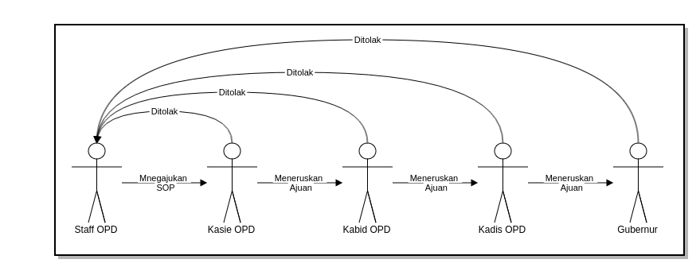
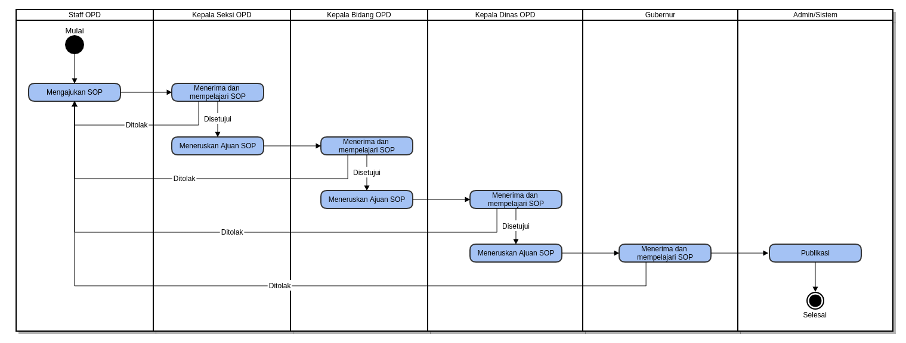
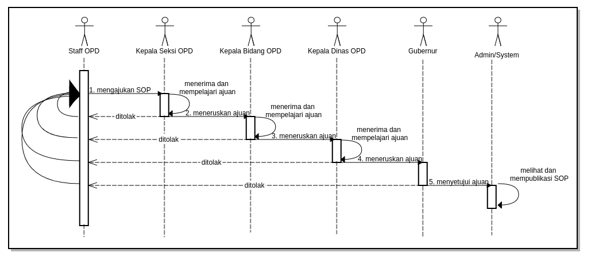
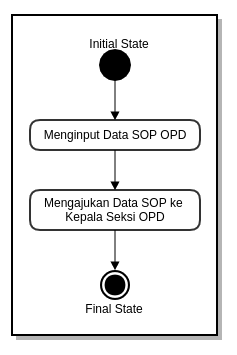
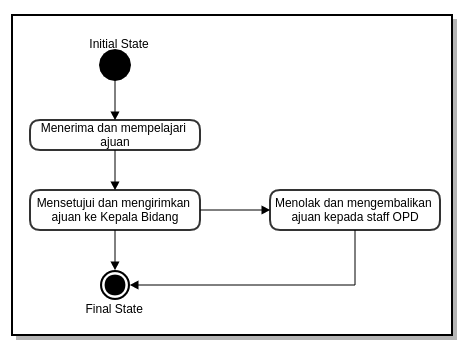
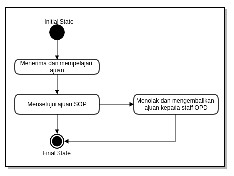
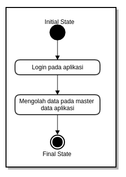
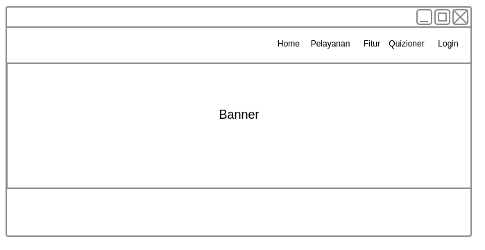
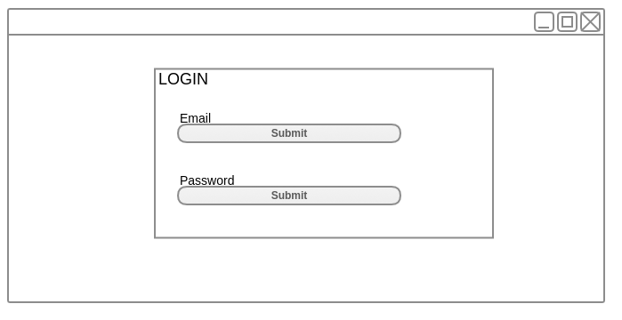
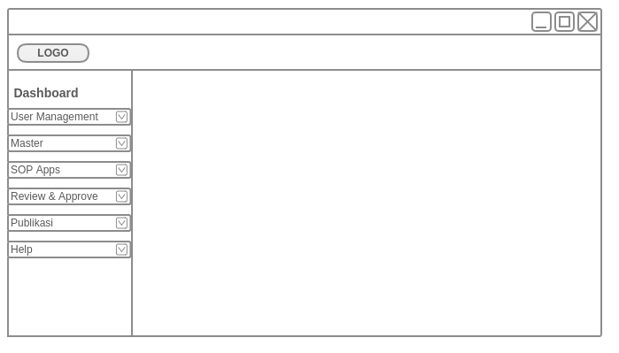

## ABSTRAK

Pengembangan aplikasi, atau bisa disebut sebagai pengembangan *software* atau desain *software*, kerap kali disalahartikan sebagai kegiatan dimana seorang *programmer* melakukan *coding*, tetapi sebenarnya yang dimaksud pengembangan aplikasi merupakan serangkaian proses yang dilakukan dari saat pembuatan kosep aplikasi hingga aplikasi tersebut selesai dan siap digunakan.

SOP Online adalah prosedur yang dilakukan secara kronologis untuk menyelesaikan suatu pekerjaan yang bertujuan untuk memperoleh hasil kerja yang paling efektif dari para pekerja dengan biaya yang serendah-rendahnya.

## DAFTAR ISI

* Will be replaced with the ToC, excluding the "Contents" header
{:toc}

## 1.  PENDAHULUAN

### 1.1 Latar Belakang

Salah satu sasaran Dinas Komunikasi, Informasi, Statistika dan Persandian adalah membuat sebuah sistem yang terkelola rapi dalam segala hal, baik dalam bidang IT maupun bidang yang lainnya agar mampu menyelenggarakan seluruh kegiatannya secara mandiri dan sesuai dengan ketentuan yang berlaku.

Untuk mencapai hal tersebut, diperlukan suatu prosedur operasional yang jelas dan standar bagi semua pihak yang terlibat dalam mencapai sasaran tersebut. Praktik-praktik baik yang telah berlangsung di KOMINFO Banten perlu distandarisasi dan didokumentasikan agar menjadi acuan bagi manejemen dalam menjalankan tugas dan fungsinya serta menjamin keberlangsungan implementasi praktik-praktik tersebut.

Terkait dengan sasaran tersebut kami bertujuan akan membangun standarisasi sistem pengembangan apliaksi yang dapat meningkatkan efisiensi dan efektifitas kinerja dinas terkait serta mampu mebagikan informasi yang dibutuhkan oleh berbagai pihak untuk kepentingan proses pengambilan keputusan. Untuk menuju kepada standarisasi dalam pengembangan aplikasi perlu diciptakan terlebih dahulu sistem manual  terstandar atau semacam *Standar Operating Procedur* (SOP) untuk seluruh pengembangan aplikasi yang ada sehingga dapat dipahami oleh semua pihak yang terlibat.

### 1.2 Tujuan

*Standard Operating Prosedur (SOP)* pada dasarnya adalah pedoman yang berisi prosedur-prosedur operasioanl standar yang ada dalam suatu instansi yang digunakan untuk memastikan bahwa semua keputusan  dan tindakan, serta penggunaan fasilitas-fasilitas proses yang dilakukan oleh orang-orang dalam instansi  berjalan dengan efisien dan efektif , konsisten, standar dan sistematis. Dengan adanya sistem manual standar atau (SOP) diharapkan dapat meningkatkan efisiensi dan efektifitas kinerja dalam pengembangan aplikasi yang diberikan oleh KOMINFO. Dengan adanya instruksi kerja yang terstandarisasi  maka semua kegiatan pengembangan aplikasi dapat dilakukan secara konsisten oleh siapapun yang sedang mengajukan pengembangan aplikasi. Hal ini dapat meningkatkan efisien dan efektifitas kerja serta meminimalisir prosedur operasi yang tidak jelas. Dengan demikian dapat dipastikan melalui SOP ini akan dapat meningkatkan efisiensi dan efektifitas kerja pihak-pihak yang terkait.

## 2. DESKRIPSI DAN RUANG LINGKUP

Pembuatan aplikasi ini akan dilaksanakan pada ruang lingkup Dinas KOMINFO dengan proses dari pengajuan SOP oleh Staff OPD hingga publikasi setelah mendapatkan persetujuan dari Gubernur

Dalam jurnal ini akan mengembangkan standarisasi pengembangan aplikasi dari mulai proses pengajuan pengembangan aplikasi hingga proses pembuatan aplikasi menggunakan alur prototyping.

*Ilustrasi Alur Prototyping*

## 3 Hasil Pembahasan

### 3.1 Kebutuhan Software dan Hardware

Adapun alat bantu *software* dan *hardware* dalam melakukan analisis dan desain perancanangan ini adalah sebagai berikut:

#### 3.1.1 *Software*

* Ubuntu 17.04
* Typora (markdown)
* Gliffy Diagram

#### 3.1.2 *Hardware*

Laptop dengan spesifikasi sebagai berikut:

* Intel Celeron N2830 *Speed* 2.16 Ghz *Turbo Boost* 2.41 Ghz
* Memori DDR3 2Gb
* Hard disk 500 Gb

### 3.2 Analisis Permasalahan

Permasalahan yang terjadi saat ini adalah sebagai berikut:

1. Masih banyaknya staff OPD yang belum mengetahui tentang tata cara penggunaan aplikasi yang terdapat pada OPD tersebut
2. Belum tersusunnya sebuah wadah penyimpanan SOP aplikasi OPD

### 3.3 Solusi

Solusi yang kami tawarkan adalah pembuatan desain perancangan sistem informasi SOP pengembangan aplikasi adalah:

1. Memberikan informasi SOP yang terdapat pada OPD sehingga semua staff OPD dapat mengakses SOP aplikasi pada OPD tersebut

### 3.4 Perancangan Database

pada database yang digunakan oleh single user atau hanya beberapa user saja, perancangan database tidak sulit. tetapi jika ukuran database yang sedang atau besar ( 25 - ratusan user yang berisikan jutaan bytes informasi dan melibatkan ratusan query dan program program aplikasi) perancangan database menjadi sangat komplek. Oleh karena itu para pemakai mengharapkan penggunaan database yang sedemikian rupa sehingga sistem harus dapat memenuhi kebutuhan-kebutuhan seluruh user tersebut.

#### 3.4.1 Tujuan perancangan database:

* Untuk memenuhi informasi yang diberisikan kebutuhan-kebutuhan user secara khusus dan aplikasi-aplikasinya.
* Memudahkan pengertian struktur informasi
* Mendukung kebutuhan-kebutuhan pemrosesan dan beberapa obyek penampilan (*response time, processing time dan storage space*)

#### 3.4.2 Proses Perancangan Database

proses perancangan database terdiri dari 6 tahap:

* Tahap 1, Pengumpulan data dan analisis
* Tahap 2, Perancangan database secara konseptual
* tahap 3, Pemilihan DBMS
* Tahap 4, Perancangan Database secara logika (*data model mapping*)
* Tahap 5, Perancangan database secara fisik
* Tahap 6, Implementasi sistem database

### 3.5 Perancangan Sistem

Permodelan rancangan sistem yang digunakan adalah UML (*Unified Modeling Language*). Menurut Whitten dan Bentley , *Unified Modeling Language* adalah kumpulan rancangan diagram untuk membangun sebuah sistem atau aplikasi yang dimana setiap diagram menyediakan sistem informasi kepada tim pengembang dengan berbagai sudut pandang yang berbeda-beda. UML yang digunakan terdiri dari *Use Case Diagram*, *Activity Diagram*, *Sequence Diagram** dan *State Chart Diagram*.

#### 3.5.1. Use Case SOP Online

#### 3.5.2 Activity Diagram SOP Online

#### 3.5.3 Sequence Diagram SOP Online

#### 3.5.4 State Chart Diagram SOP Online

* State Chart Diagram Staff OPD

* State Chart Diagram Kepala Seksi OPD

* State Chart Diagram Kepala Bidang OPD

* State Chart Diagram Kepala Dinas OPD

* State Chart Diagram Gubernur

* State Chart Diagram Superadmin

#### 3.5.5 Deployment Diagram

#### 3.5.6 Technology Stack Diagram

### 3.6 Tahapan Pekerjaan :
Tahap-tahap atau langkah yang dilakukan dalam mengembangkan Sistem Informasi SOP Online adalah sebagai berikut:
#### a) Analisis dan Perancangan
1). Analisis
Tim pengembang aplikasi akan melakukan analisis jika diperlukan dapat dilakukan survey pendahuluan untuk melihat sejauh mana kebutuhan pengguna akan sistem yang akan dibangun, data-data yang dibutuhkan, dll. Dalam analisis ini dilakukana diskusi-diskusi baik dengan bagian terkait pada satuan kerja.
2). Perancangan Sistem
Perancangan sistem dilaksanakan setelah proses analisis dilaksanakan dan telah disepakati modul dan prosedur-prosedur yang akan diterapkan dalam sistem. Perancangan sistem meliputi kegiatan: penetapan alur data/dokumen, penetapan prosedur, perancangan database, perancangan form dan perancangan interface/dialog layar.
#### b) Pembangunan Sistem
Setelah proses analisis dan perancangan sistem selesai dilakukan, tahapan selanjutnya adalah pembangunan sistem, yang meliputi kegiatan. Pembuatan struktur database, pembuatan kode program/koding, pembuatan laporan-laporan.
#### c) Integrasi dan Pengujian
1). Integrasi
Setelah proses pengembangan sistem selasai dilakukan, tahap selanjutnya adalah Integrasi sistem, yang meliputi kegiatan: pembuatan struktur database terkait integrasi, pembuatan kode program/coding terkait integrasi, pembuatan laporan-laporan terkait integrasi.
Penggunaan webservices / API yang telah disiapkan oleh sistem informasi / aplikasi yang ada.
2). Pengujian
Sistem yang telah selesai dibuat akan diuji coba menggunakan data test sebelum sistem dijalankan. Dalam uji coba sistem ini akan diterapkan metode prototye, yaitu jika terjadi kesalahan/kekurangan baik proses maupuan output sistem, maka kesalahan/kekurangan tersebut akan diperbaiki/ditambahkan, sehingga memungkinkan pengembang untuk kembali ke tahapan pertama yaitu analisa (jika kekurangan sistem memang tidak terdefinisikan dalam dokumen perancangan sistem).

### 3.7 Hasil

#### 3.7.1 Layout Tampilan Frontend Aplikasi

#### 3.7.2 Layout Tampilan Form Login

#### 3.7.3 Layout Tampilan Superadmin

##### 3.7.3.1 Dashboard Superadmin

##### 3.7.3.2 Modul User Management

###### 3.7.3.2.1 Sub modul User

