## Daftar Isi
* will be replaced with the ToC, excluing the "Contents" header
{:toc}

### Implementasi

Untuk memulai akses terhadap aplikasi **SOP Online**. Buka web browser (IE, Mozila Firefox atau yang lainnya) dengan menulis alamat url http://sop.bantenprov.go.id/ (*dev version*) kemudian tekan **Enter** pada tombol keyboard atau klik tombol **Go** pada browser. Akan muncul tampilan halaman login aplikasi aop online seperti gambar dibawah ini.

### 1. Tampilan Front End

Halaman ini akan muncul ketika *user* berhasil masuk kedalam aplikasi SOP Online, pada tampilan home ini terdapat beberapa menu yang dapat diakses oleh user yaitu:
1. Home
2. Pelayanan
3. Fitur
4. Quizioner
5. Login

#### 1.1 Pelayanan

Menu Pelayanan ini dapat diakses dengan mengklik Pelayanan pada list menu di bagian atas aplikasi. Pada menu pelayanan ini *user* dapat melihat pelayanan-pelayanan yang diberikan oleh aplikasi SOP Online.

#### 1.2 Fitur

Menu Fitur ini dapat diakses dengan mengklik Fitur pada list menu di bagian atas aplikasi. Pada menu fitur ini terdapat fitur-fitur yang disajikan didalam aplikasi SOP Online.

#### 1.4 Quizioner

[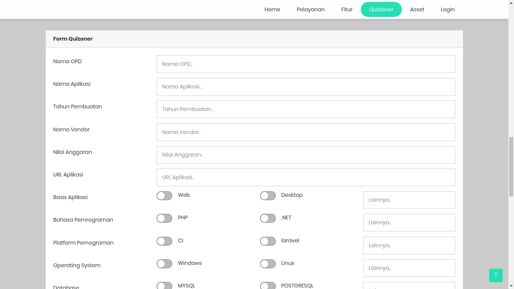](../images/sop-online/pengembangan/20181029_fe-quiz.png)

Menu Quizioner ini dapat diakses dengan mengklik Quizioner pada list menu dibagian atas aplikasi. Pada menu quizioner ini *user* dapat mengisi form kuisoner yang terdapat pada aplikasi mengenai data aplikasi OPD yang terdapat pada pemerintahan Provinsi Banten.

#### 1.5 Login 

Menu Login ini dapat diakses dengan mengklik Login pada list menu di bagian atas aplikasi atau mengklik Login pada bagian  tengah banner aplikasi. Pada menu login ini terdapat 2 (dua) field yang hatus diisi oleh *user* yaitu email dan password yang dapat diisi oleh *user* untuk masuk kedalam backend aplikasi sesuai dengan tupoksinya masing-masing

### 2. Tampilan Superadmin

Pada tampilan superadmin terdapat beberapa modul dan submodul yaitu:
1. Dashboard
2. User Management
  Users
  Roles
  Permissions
3. Master
  OPD
4. SOP Apps
  SOP
5. Review & Approve
  KASI
  KABID
  KADIS
  GUBERNUR
6. Publikasi
  Dashboard
  SOP (Semua OPD)
  Info Grafis
7. Laporan
  Laporan SOP

#### 2.1 Dashboard Superadmin

[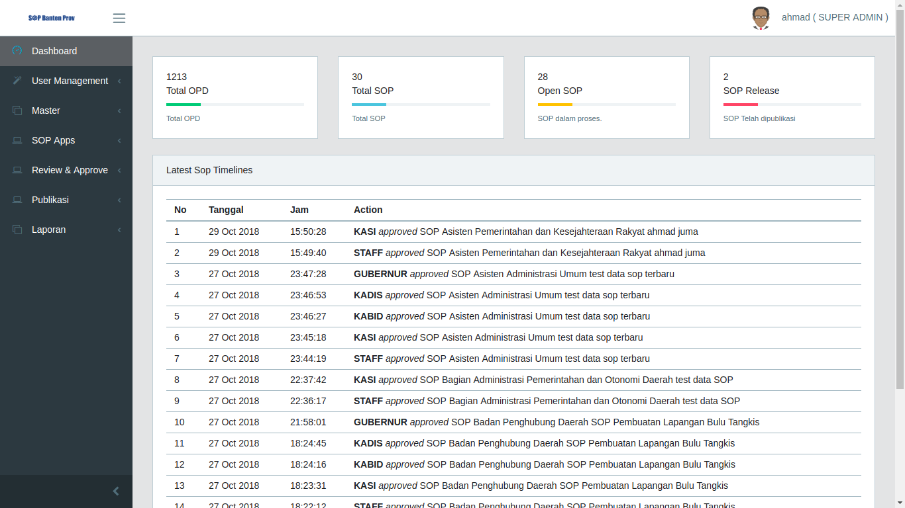](../images/sop-online/pengembangan/20181029_sa_dashboard.png)

Halaman Dashboard superadmin ini akan muncul ketika *user* berhasil melakukan login sebagai superadmin, pada dashboard superadmin ini *user* dapat melihat Total OPD, Total SOP, Open SOP, Release SOP dan Timeline Log user

#### 2.2 User Management

##### 2.2.1 Users

[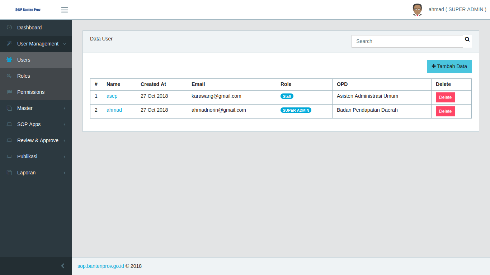](../images/sop-online/pengembangan/20181029_sa_um_users.png)

Halaman Users ini dapat diakses dengan mengklik submodul Users pada modul Users Management. Pada halaman Users ini *user* dapat melihat tabel yang berisikan data user yang telah terinput kedalam aplikasi, pada halaman Users ini *user* jg dapat melakukan pencarian dengan mengetik nama user pada kolom pencarian, menambahkan data user dengan mengklik tombol tambah data pada atas tabel users, merubah data user dengan mengklik nama user pada kolom name dan menghapus user dengan mengklik delete pada kolom action tabel users.

###### 2.2.1.1 Tambah Data

Halaman tambah data ini dapat diakses oleh user dengan mengklik "+ Tambah Data" pada bagian atas tabel Users. Pada halaman tambah data ini user dapat menambahkan user pada aplikasi SOP Online dengan mengisi form create user lalu klik submit untuk menyimpan data, klik cancel jika ingin menggagalkan pengisian form (menghapus semua data yang telah diketik) atau klik back untuk kembali ke submodul user

###### 2.2.1.2 Edit User

Halaman edit user ini dapat diakses dengan mengklik nama user pada kolom "Name" di tabel Users. Pada halaman ini user dapat mengedit user dengan mengganti data user sesuai dengan yang akan dirubah pada form edit user lalu klik submit untuk menyimpan data, klik cancel jika ingin menggagalkan pengisian form (menghapus semua data yang telah diketik) atau klik back untuk kembali ke submodul user.

##### 2.2.2 Roles

[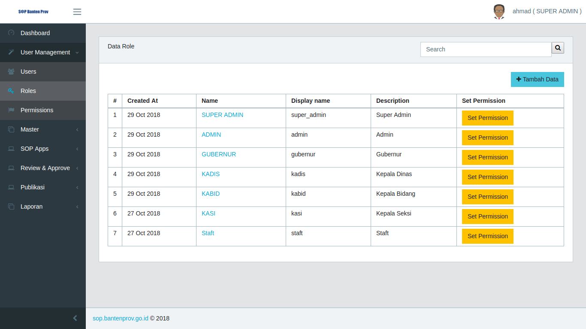](../images/sop-online/pengembangan/20181029_sa_um_roles.png)

Halaman Roles ini dapat diakses oleh user dengan mengklik submodul Roles pada modul User Management. Pada halaman Roles ini user dapat melihat tabel yang berisikan data role-role yang telah terinput kedalam aplikasi, pada submodul ini user dapat melakukan pencarian data role pada kolom pencarian yang berada diatas tabel role, menambahkan data role dengan mengklik Tambah Data pada bagian atas tabel role, memberikan permission kepada role yang diinginkan dengan mengklik set permission pada kolom set permission di tabel role dan merubah data role dengan mengklik nama role pada kolom name.

###### 2.2.2.1 Tambah Data

[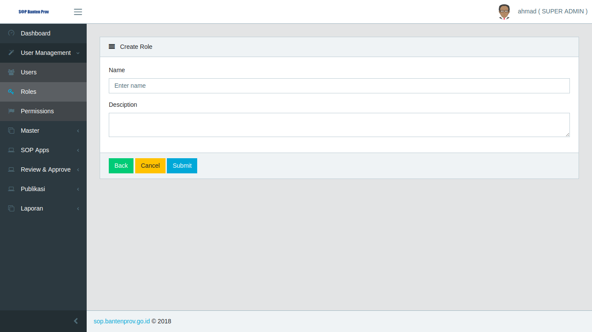](../images/sop-online/pengembangan/20181029_sa_um_role-create.png)

Tambah Data Role ini dapat diakses user dengan cara mengklik "+ Tambah Data" pada bagian atas tabel Role. Pada halaman Tambah Data ini user dapat menambahkan data role pada aplikasi dengan mengisi form create role yang telah disediakan lalu klik submit untuk menyimpan data, klik cancel jika ingin menggagalkan pengisian form (menghapus semua data yang telah diketik) atau klik back untuk kembali ke submodul Role

###### 2.2.2.2. Set Permission

[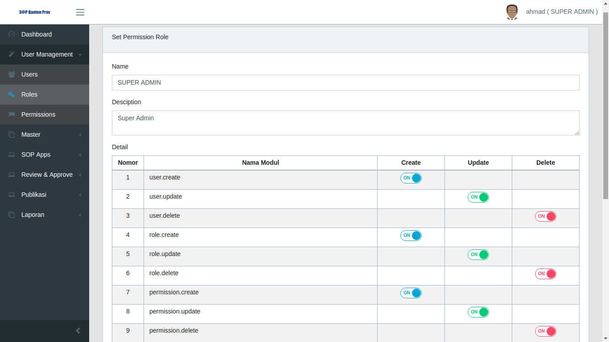](../images/sop-online/pengembangan/20181029_sa_um_role_set-1.png)

Halaman Set Permission ini dapat diakses oleh user dengan cara mengklik tombol Set Permission pada kolom Set Permission di tabel Role. Pada halaman Set Permission ini user dapat menambahkan permission kepada role yang diinginkan pada form Set Permission Role yang telah disediakan dengan mengklik icon on/off pada kolom yang telah ditentukan.

###### 2.2.2.3 Edit Role

[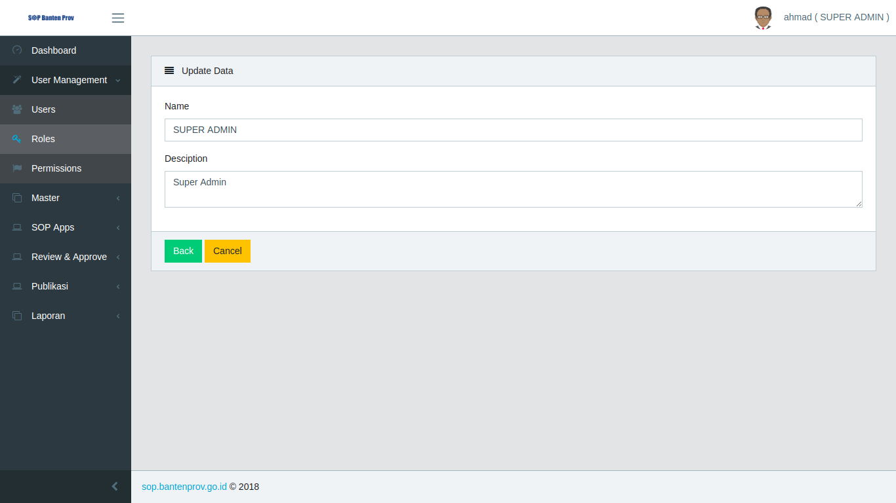](../images/sop-online/pengembangan/20181029_sa_um_role-edit.png)

Edit Role ini dapat diakses oleh user dengan cara mengklik nama role pada kolom "Name" di tabel Role. Pada halaman ini user dapat mengedit role dengan mengganti data role sesuai dengan yang akan dirubah pada form edit role lalu klik submit untuk menyimpan data, klik cancel jika ingin menggagalkan pengisian form (menghapus semua data yang telah diketik) atau klik back untuk kembali ke submodul roles.

##### 2.2.3 Permissions

Halaman Permissions ini dapat diakses dengan cara mengklik submodul Permissions pada modul Users Management. Pada halaman Permissions ini user dapat melihat data-data permission yang telah terinput kedalam aplikasi dalam bentuk tabel, pada submodul ini user juga dapat melakukan pencarian data permission dengan mengetik permission yang akan dicari, menambah data dengan mengklik Tambah Data pada bagian atas tabel permission dan merubah data permission dengan mengklik nama permission pada kolom name pada tabel permissions.

###### 2.2.3.1 Tambah Data

[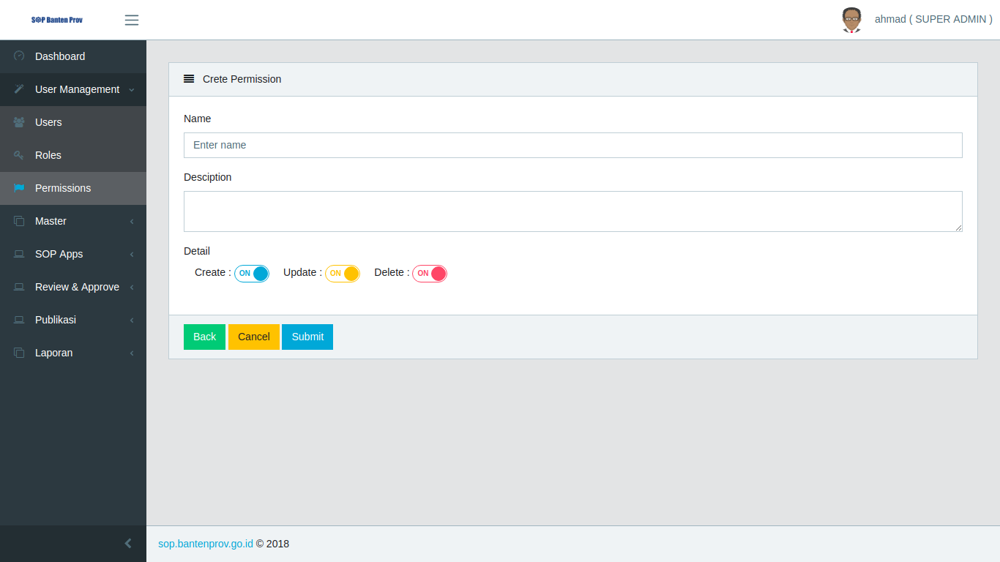](../images/sop-online/pengembangan/20181029_sa_um_perm-create.png)

Halaman tambah data ini dapat diakses dengan cara mengklik "+ Tambah Data" pada bagian atas tabel permission. Pada halaman Tambah Data ini user dapat menambahkan data permission pada aplikasi dengan mengisi form create permission yang telah disediakan lalu klik submit untuk menyimpan data, klik cancel jika ingin menggagalkan pengisian form (menghapus semua data yang telah diketik) atau klik back untuk kembali ke submodul Permissions.

###### 2.2.3.2 Edit Permission

Halaman Edit Permission ini dapat diakses dengan cara mengklik nama permission pada kolom "Name" ditabel permissions. Pada halaman ini user dapat mengedit permission dengan mengganti data permission sesuai dengan yang akan dirubah pada form edit permission lalu klik submit untuk menyimpan data, klik cancel jika ingin menggagalkan pengisian form (menghapus semua data yang telah diketik) atau klik back untuk kembali ke submodul permission.

#### 2.3 Master

##### 2.3.1 OPD

[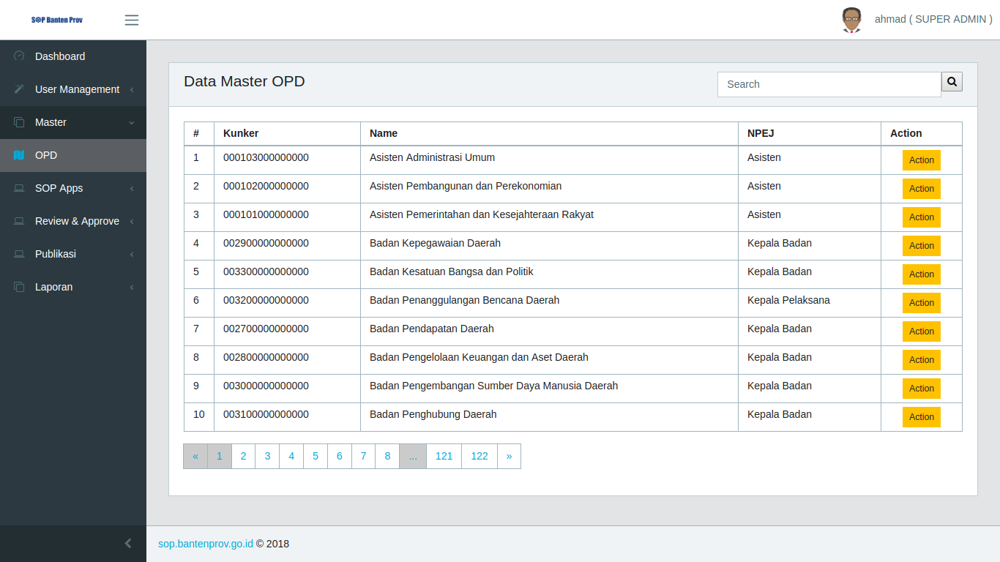](../images/sop-online/pengembangan/20181029_sa_master_opd.png)

Halaman OPD ini dapat diakses dengan cara mengklik submodul OPD pada modul Master. Pada submodul OPD ini user dapat melihat data-data OPD yang telah terinput kedalam aplikasi dalam bentuk tabel, pada submodul ini user juga dapat melakukan pencarian pada OPD dengan mengetik nama OPD pada kolom pencarian yang berada di atas tabel OPD dan melihat detail OPD dengan mengklik tombol action pada kolom action pada tabel OPD.

###### 2.3.1.1 Detail OPD

Halaman Detail OPD ini dapat diakses dengan cara mengklik tombol action pada kolom action tabel OPD. Pada halaman ini user dapat melihat detail dari data OPD yang telah dipilih pada tabel OPD.

#### 2.4 SOP Apps

##### 2.4.1 SOP

Halaman SOP ini dapat diakses dengan cara mengklik submodul SOP pada modul SOP Apps. Pada submodul ini user dapat melihat data SOP yang telah terinput kedalam aplikasi beserta status SOP tersebut sudah pada bagian apa, pada submodul ini user juga dapat memfilter SOP berdasarkan status dan OPD, melakukan pencarian pada kolom pencarian, menambahkan data SOP dengan mengklik tombol Tambah Data pada bagian atas tabel SOP dan mengedit data SOP dengan mengklik edit pada kolom action tabel SOP

###### 2.4.1.1 Tambah Data

[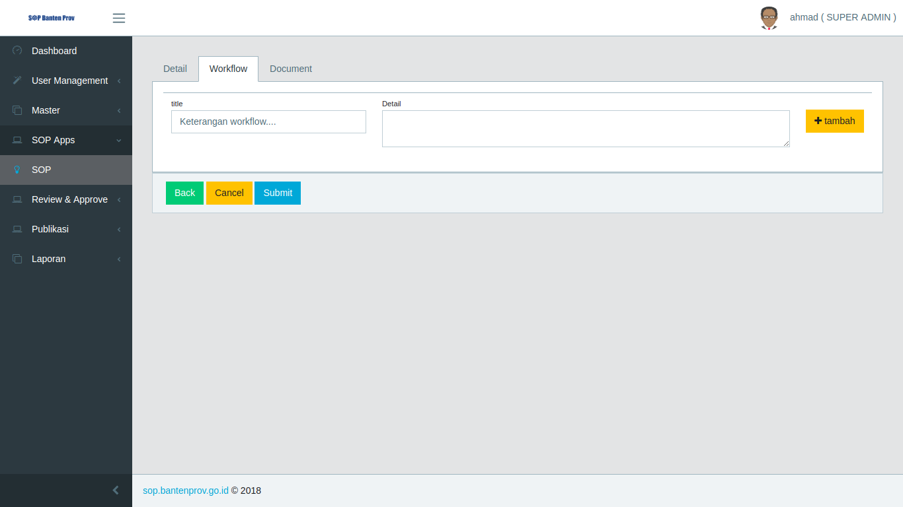](../images/sop-online/pengembangan/20181029_sa_sopa_create_wf.png)

[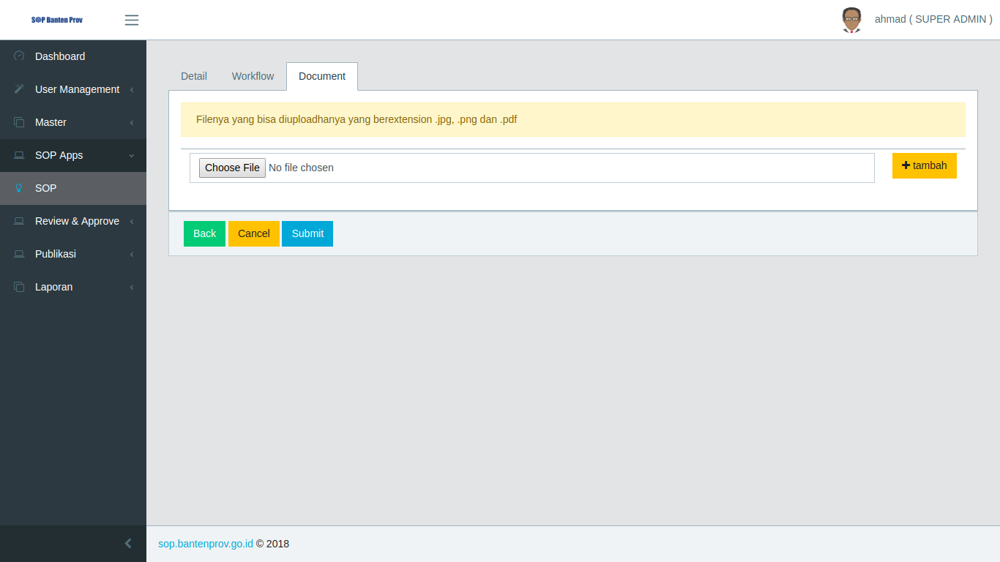](../images/sop-online/pengembangan/20181029_sa_sopa_create_doc.png)

Halaman tambah data SOP ini dapat diakses dengan cara mengklik "+ Tambah Data" pada bagian atas tabel SOP. Pada halaman tambah data SOP ini user dapat menambahkan data SOP dengan melakukan 3 tahap yaitu menginput detail SOP, menginput Workflow SOP dan mengupload dokumen SOP (dalam bentuk PDF, jpg dan png) lalu klik submit untuk menyimpan data, klik cancel jika ingin menggagalkan pengisian form (menghapus semua data yang telah diketik) atau klik back untuk kembali ke submodul SOP.

###### 2.4.1.2 Edit Data

Halaman Edit Data SOP ini dapat diakses dengan cara mengklik tombol "Edit" pada kolom "Action" tabel SOP. Pada halaman edit data SOP ini user akan menginput dengan tahapan yang sama seperti waktu pembuatan SOP, pada halaman ini user dapat memberikan review ke KASI (pengajuan SOP) dan melihat timeline SOP ketika di approve atau ditolak oleh KASI, KABID, KADIS atau Gubernur.

#### 2.5 Review & Approve

##### 2.5.1 KASI

[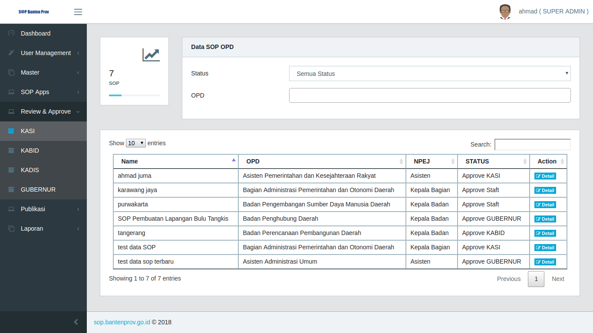](../images/sop-online/pengembangan/20181030_rna_kasi.png)

Halaman KASI ini dapat diakses dengan cara mengklik submodul KASI pada modul Review & Approve. Pada submodul user (kepala seksi OPD) dapat melihat data-data SOP yang telah terinput kedalam aplikasi danmelihat status SOP tersebut sedang berada dimana dalam bentuk tabel informasi, pada submodul ini user dapat memfilter SOP berdasarkan status dan OPD yang terletak pada kotak data SOP OPD dan dapat menolak atau menyetujui ajuan SOP dengan mengklik menu detail pada kolom action tabel OPD.

###### 2.5.1.1 Detail SOP

[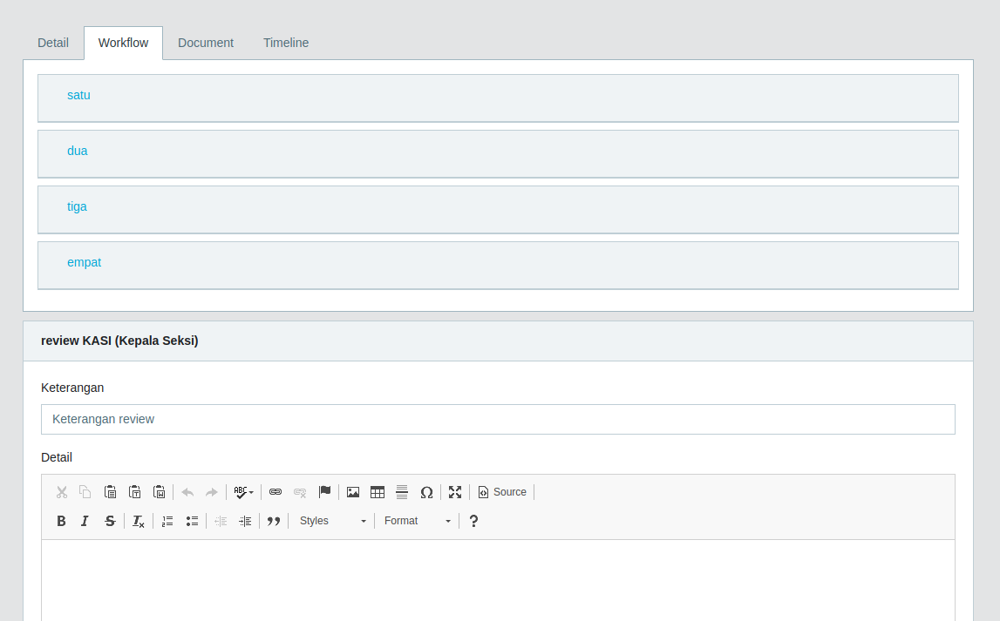](../images/sop-online/pengembangan/20181030_rna_kasi_wf-1.png)
[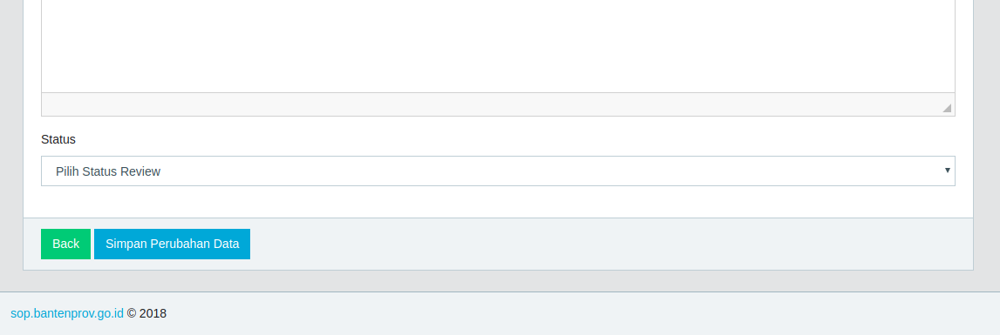](../images/sop-online/pengembangan/20181030_rna_kasi-wf-2.png)

[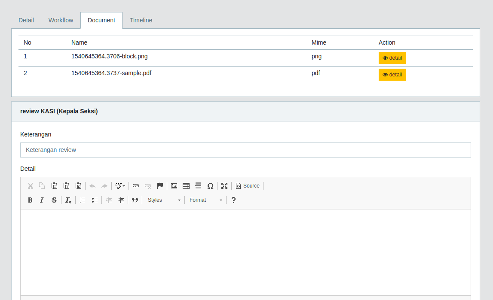](../images/sop-online/pengembangan/20181030_rna_kasi_doc-1.png)

[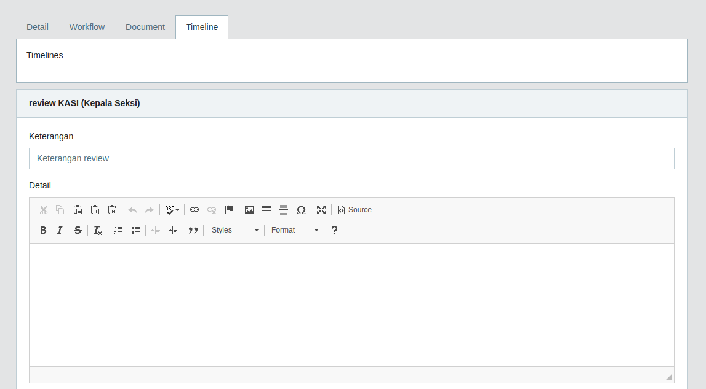](../images/sop-online/pengembangan/20181030_rna_kasi_tl-1.png)

Halaman Detail SOP ini dapat diakses dengan cara mengklik tombol "Detail" pada kolom "Action" di tabel Ajuan SOP. Pada detail SOP ini KASI dapat mereview ajuan SOP dan menuliskan hasil reviewnya pada kotak review KASI yang telah disediakan, KASI dapat mereview dari detail ajuan, workflow, dokumen  ajuan dan Timeline ajuan SOP. Pada detail SOP ini KASI dapat menolak atau menyetujui ajuan SOP dengan mengklik field status lalu memilih Tolak Pengajuan untuk mengembalikan ajuan kepada staff atau Approve Ajuan untuk melanjutkan ajuan kepada Kepala Bidang OPD. Setelah melakukan review dan memberikan persetujuan/penolakan kepada ajuan SOP, KASI dapat mengklik Simpan Perubahan Data untuk menyimpan data perubahan ke database aplikasi atau mengklik Back untuk kembali ke submodul KASI tanpa menyimpan hasil perubahan.

##### 2.5.2 KABID

[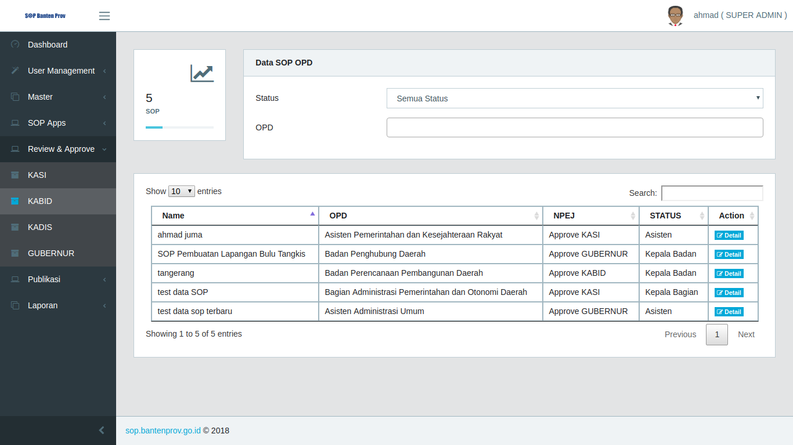](../images/sop-online/pengembangan/20181030_rna_kabid.png)

Halaman KABID ini dapat diakses dengan cara mengklik submodul KABID pada modul Review & Approve. Pada submodul user (kepala Bidang OPD) dapat melihat data-data SOP yang telah terinput kedalam aplikasi dan melihat status SOP tersebut sedang berada dimana dalam bentuk tabel informasi, pada submodul ini user dapat memfilter SOP berdasarkan status dan OPD yang terletak pada kotak data SOP OPD dan dapat menolak atau menyetujui ajuan SOP dengan mengklik menu detail pada kolom action tabel OPD.

###### 2.5.2.1 Detail SOP

[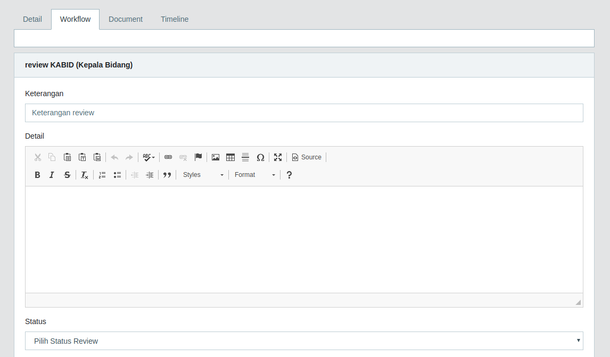](../images/sop-online/pengembangan/20181030_rna_kabid_wf-1.png)

[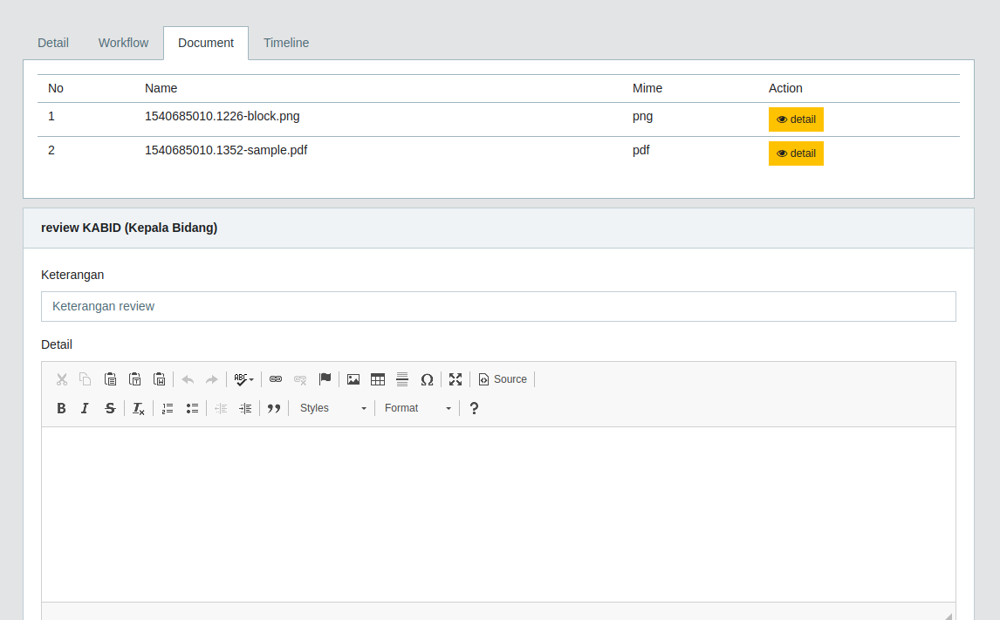](../images/sop-online/pengembangan/20181030_rna_kabid_doc-1.png)
[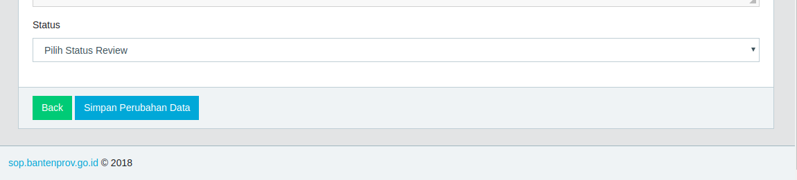](../images/sop-online/pengembangan/20181030_rna_kabid_doc-2.png)

[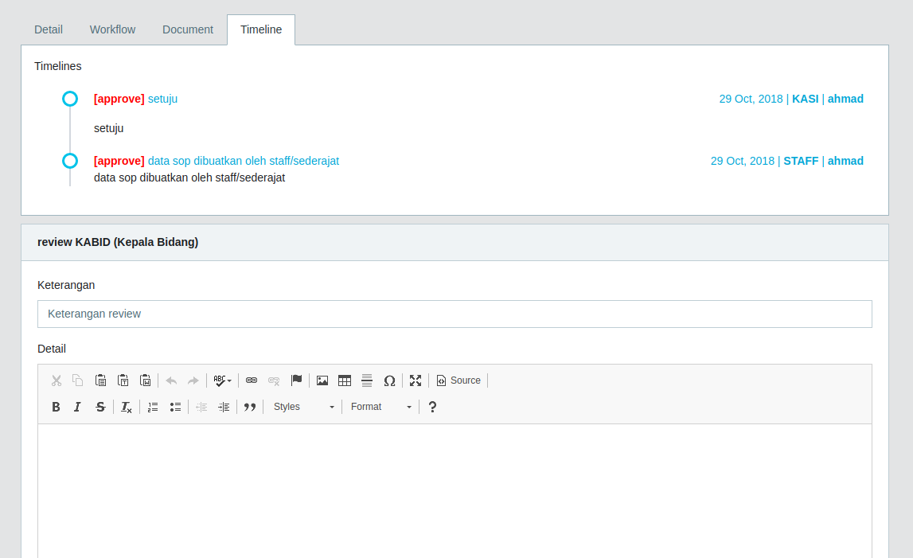](../images/sop-online/pengembangan/20181030_rna_kabid_tl-1.png)

Halaman Detail SOP ini dapat diakses dengan cara mengklik tombol "Detail" pada kolom "Action" di tabel Ajuan SOP. Pada detail SOP ini KABID dapat mereview ajuan SOP dan menuliskan hasil reviewnya pada kotak review KABID yang telah disediakan, KABID dapat mereview dari detail ajuan, workflow, dokumen  ajuan dan Timeline ajuan SOP. Pada detail SOP ini KABID dapat menolak atau menyetujui ajuan SOP dengan mengklik field status lalu memilih Tolak Pengajuan untuk mengembalikan ajuan kepada staff atau Approve Ajuan untuk melanjutkan ajuan kepada Kepala Dinas OPD. Setelah melakukan review dan memberikan persetujuan/penolakan kepada ajuan SOP, KABID dapat mengklik Simpan Perubahan Data untuk menyimpan data perubahan ke database aplikasi atau mengklik Back untuk kembali ke submodul KABID tanpa menyimpan hasil perubahan.

##### 2.5.3 KADIS

Halaman KADIS ini dapat diakses dengan cara mengklik submodul KADIS pada modul Review & Approve. Pada submodul ini, user (kepala Dinas OPD) dapat melihat data-data SOP yang telah terinput kedalam aplikasi dan melihat status SOP tersebut sedang berada dimana dalam bentuk tabel informasi, pada submodul ini user dapat memfilter SOP berdasarkan status dan OPD yang terletak pada kotak data SOP OPD dan dapat menolak atau menyetujui ajuan SOP dengan mengklik menu detail pada kolom action tabel OPD.

###### 2.5.3.1 Detail SOP

[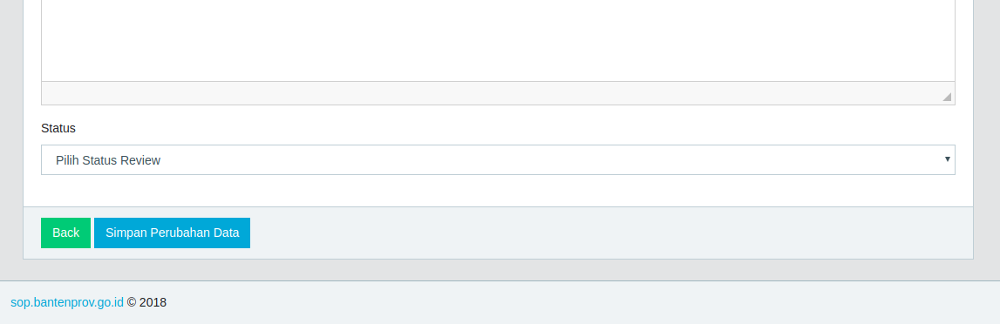](../images/sop-online/pengembangan/20181030_rna_kadis_detail-2.png)

[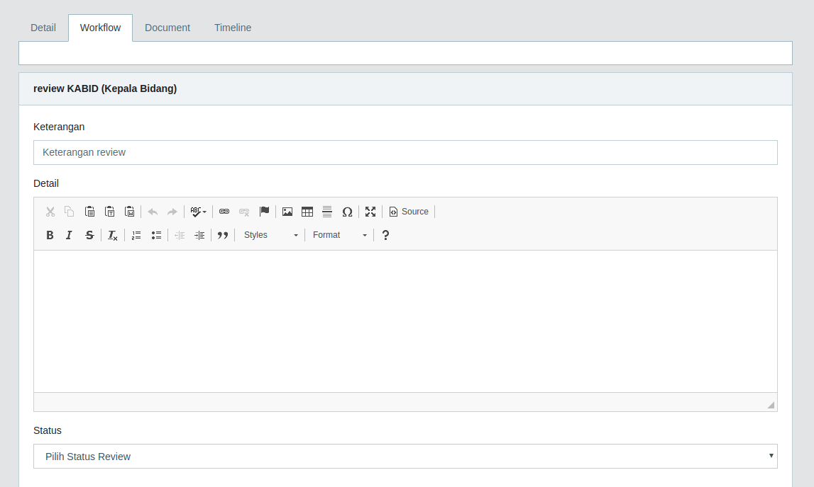](../images/sop-online/pengembangan/20181030_rna_kadis_wf-1.png)
[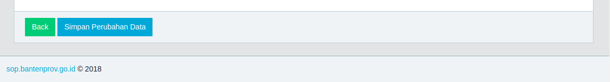](../images/sop-online/pengembangan/20181030_rna_kadis_wf-2.png)

[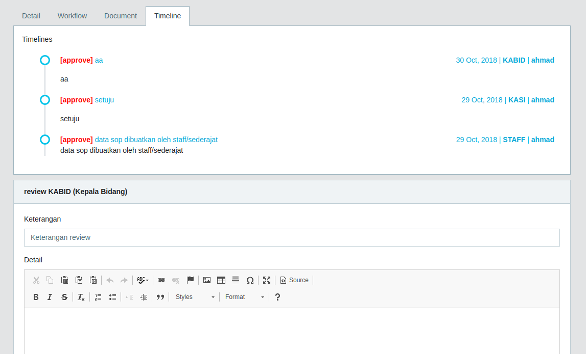](../images/sop-online/pengembangan/20181030_rna_kabid_tl-1.png)

Halaman Detail SOP ini dapat diakses dengan cara mengklik tombol "Detail" pada kolom "Action" di tabel Ajuan SOP. Pada detail SOP ini KADIS dapat mereview ajuan SOP dan menuliskan hasil reviewnya pada kotak review KADIS yang telah disediakan, KADIS dapat mereview dari detail ajuan, workflow, dokumen  ajuan dan Timeline ajuan SOP. Pada detail SOP ini KADIS dapat menolak atau menyetujui ajuan SOP dengan mengklik field status lalu memilih Tolak Pengajuan untuk mengembalikan ajuan kepada staff atau Approve Ajuan untuk melanjutkan ajuan kepada Gubernur. Setelah melakukan review dan memberikan persetujuan/penolakan kepada ajuan SOP, KADIS dapat mengklik Simpan Perubahan Data untuk menyimpan data perubahan ke database aplikasi atau mengklik Back untuk kembali ke submodul KADIS tanpa menyimpan hasil perubahan.

##### 2.5.4 Gubernur

[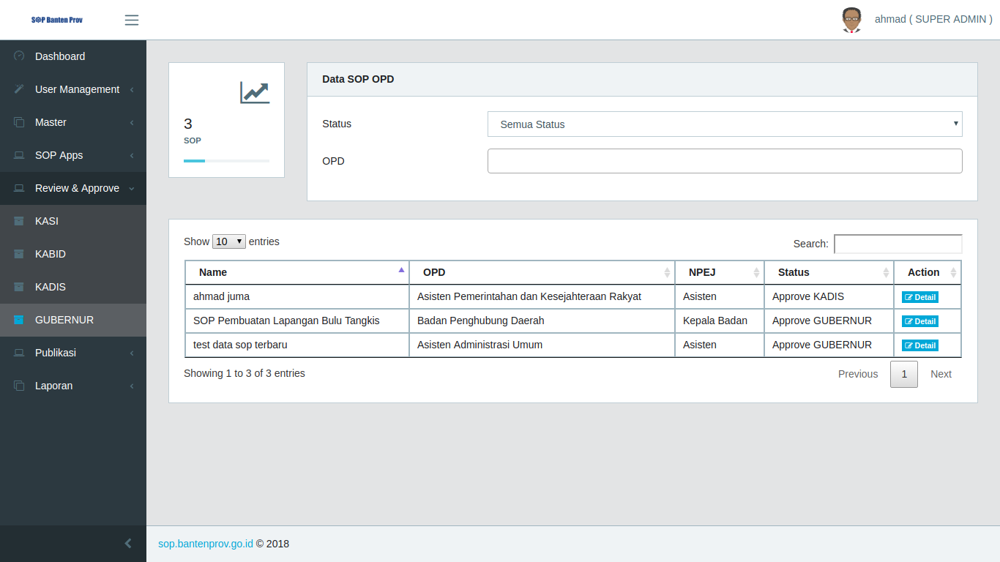](../images/sop-online/pengembangan/20181030_rna_gub.png)

Halaman Gubernur ini dapat diakses dengan cara mengklik submodul Gubernur pada modul Review & Approve. Pada submodul ini, user (Gubernur) dapat melihat data-data SOP yang telah terinput kedalam aplikasi dan melihat status SOP tersebut sedang berada dimana dalam bentuk tabel informasi, pada submodul ini user dapat memfilter SOP berdasarkan status dan OPD yang terletak pada kotak data SOP OPD dan dapat menolak atau menyetujui ajuan SOP dengan mengklik menu detail pada kolom action tabel OPD.

###### 2.5.4.1 Detail SOP

[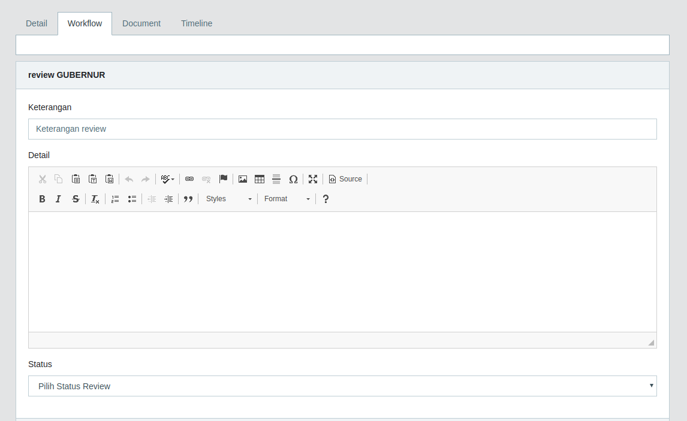](../images/sop-online/pengembangan/20181030_rna_gub_wf-1.png)

[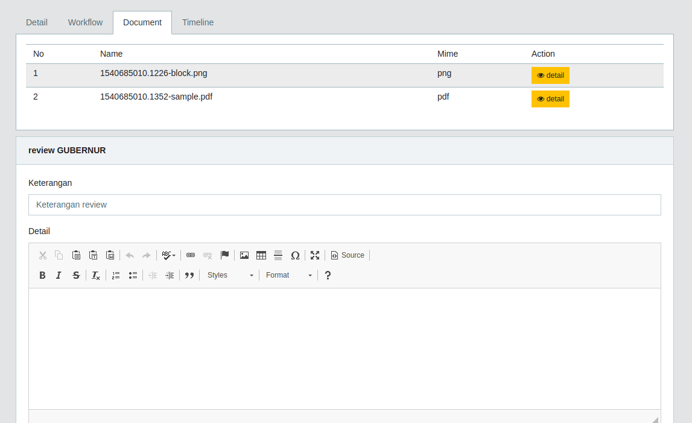](../images/sop-online/pengembangan/20181030_rna_gub_doc-1.png)

[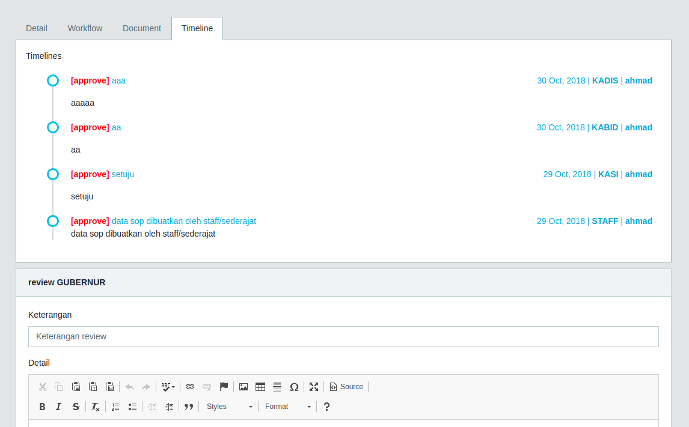](../images/sop-online/pengembangan/20181030_rna_gub_tl-1.png)
[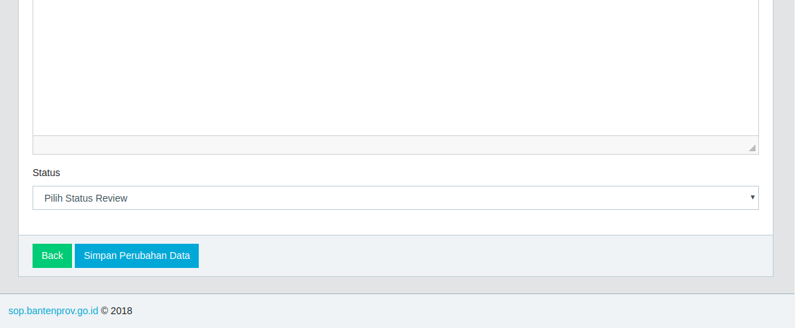](../images/sop-online/pengembangan/20181030_rna_gub_tl-2.png)

Halaman Detail SOP ini dapat diakses dengan cara mengklik tombol "Detail" pada kolom "Action" di tabel Ajuan SOP. Pada detail SOP ini Gubernur dapat mereview ajuan SOP dan menuliskan hasil reviewnya pada kotak review Gubernur yang telah disediakan, Gubernur dapat mereview dari detail ajuan, workflow, dokumen  ajuan dan Timeline ajuan SOP. Pada detail SOP ini Gubernur dapat menolak atau menyetujui ajuan SOP dengan mengklik field status lalu memilih Tolak Pengajuan untuk mengembalikan ajuan kepada staff atau Approve Ajuan untuk melanjutkan ajuan kepada tahapan Publikasi. Setelah melakukan review dan memberikan persetujuan/penolakan kepada ajuan SOP, Gubernur dapat mengklik Simpan Perubahan Data untuk menyimpan data perubahan ke database aplikasi atau mengklik Back untuk kembali ke submodul Gubernur tanpa menyimpan hasil perubahan.

#### 2.6 Publikasi

##### 2.6.1 Dashboard

Halaman Dashboard ini dapat diakses dengan cara mengklik submodul Dashboard pada modul Publikasi. Pada submodul Dashboard ini *user* dapat melihat Total OPD, Total SOP, Open SOP, Release SOP dan Timeline Log user

##### 2.6.2 SOP (Semua OPD)

[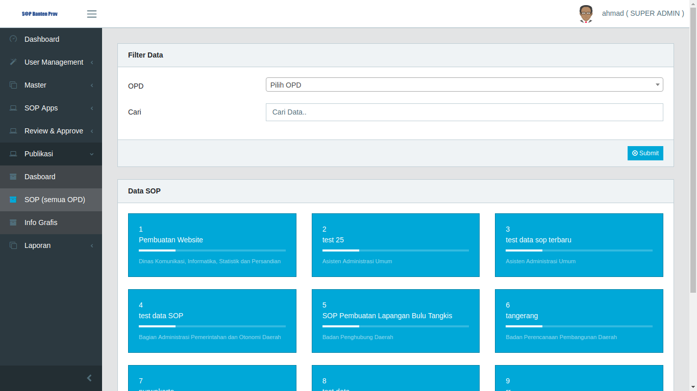](../images/sop-online/pengembangan/20181030_pub_sop.png)

Halaman SOP (Semua OPD) ini dapat diakses dengan cara mengklik submodul SOP (Semua OPD) pada modul Publikasi. Pada submodul SOP (Semua OPD) ini user dapat melihat banyaknya SOP yang telah diinput didalam aplikasi berdasarkan OPD pada kotak Data SOP, pada submodul ini user juga dapat memfilter SOP berdasarkan OPD dan nama SOP pada kotak Filter Data.

##### 2.6.3 Info Grafis

[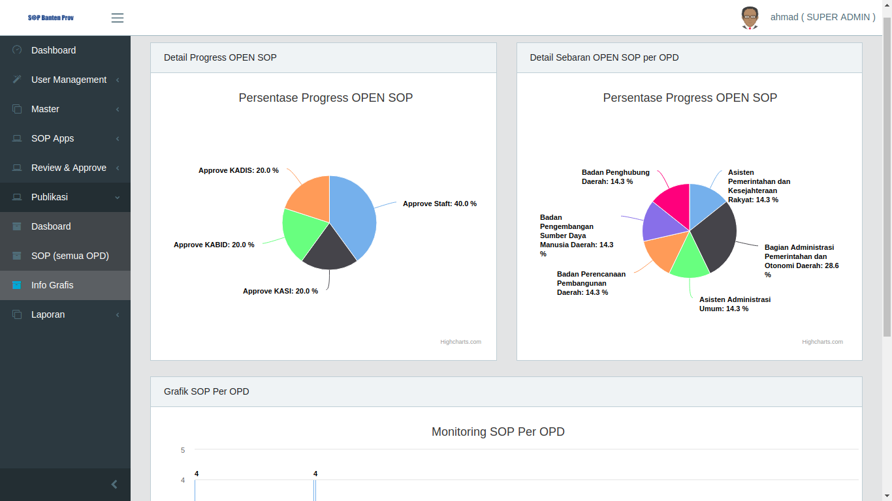](../images/sop-online/pengembangan/20181030_pub_graf.png)

Halaman Info Grafis ini dapat diakses dengan cara mengklik submodul Info Grafis pada modul Publikasi. Pada submodul Indo Grafis ini user dapat melihat grafik SOP falam bentuk diagram pie dan diagram tabung yang berisikan informasi mengenai Detail Progress Open SOP, Detail Sebaran open SOP per OPD dan Grafik SOP per OPD.

#### 2.7 Laporan

##### 2.7.1 Laporan SOP

[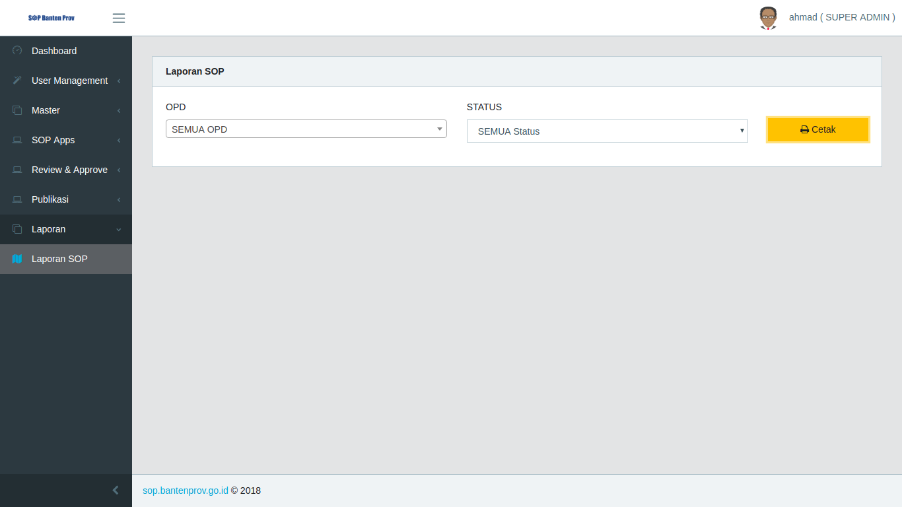](../images/sop-online/pengembangan/20181030_lap_lap-sop.png)

Halaman Laporan SOP ini dapat diakses dengan cara mengklik submodul Laporan SOP pada modul Laporan. Pada submodul ini user dapat mencetak laporan pengajuan SOP yang telah dibuat, pencetakan laporan ini dapat berdasarkan semua OPD maupun persatu OPD, jika telah memilih OPD atau ingin mencetak semua ajuan SOP OPD user dapat mengklik tombol cetak sehingga kan menampilkan tampilan cetak seperti dibawah ini:

[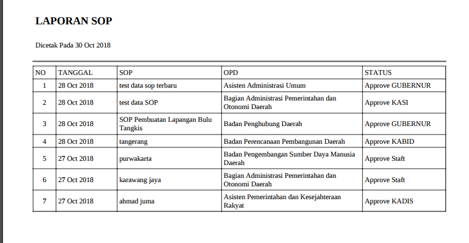](../images/sop-online/pengembangan/20181030_hasil-cetak.png)
