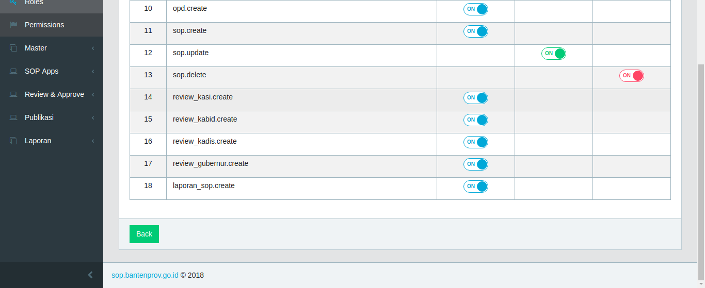
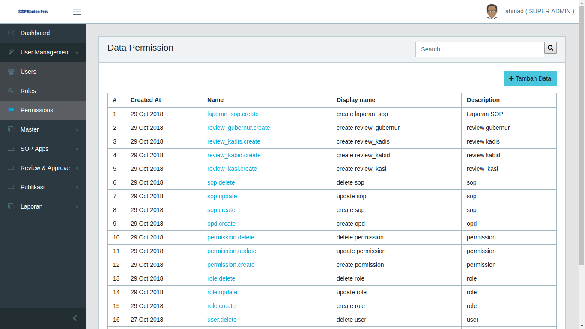
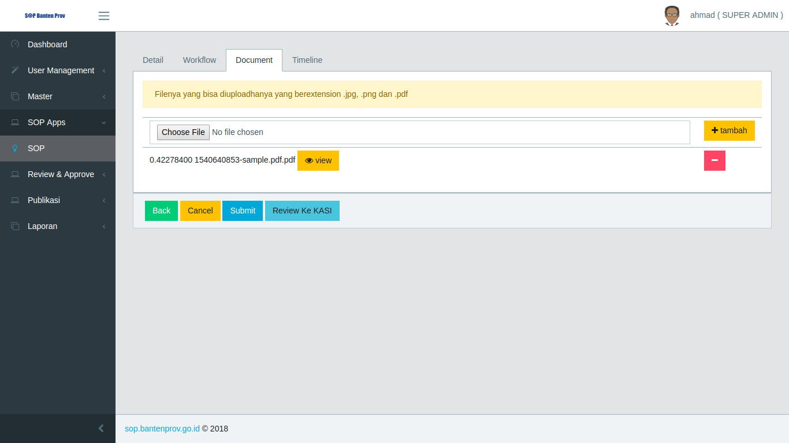

## Daftar Isi
* will be replaced with the ToC, excluing the "Contents" header
{:toc}

### Integrasi dan Pengujian SOP Online
Pada laporan ini akan membahas tentang Integrasi dan Pengujian SOP Online, untuk pengujiannya menggunakan User Acceptance Test.

### 1. Integrasi SOP Online

Salah satu sasaran Dinas Komunikasi, Informasi, Statistika dan Persandian adalah membuat sebuah sistem yang terkelola rapi dalam segala hal, baik dalam bidang IT maupun bidang yang lainnya agar mampu menyelenggarakan seluruh kegiatannya secara mandiri dan sesuai dengan ketentuan yang berlaku.

Untuk mencapai hal tersebut, diperlukan suatu prosedur operasional yang jelas dan standar bagi semua pihak yang terlibat dalam mencapai sasaran tersebut. Praktik-praktik baik yang telah berlangsung di KOMINFO Banten perlu distandarisasi dan didokumentasikan agar menjadi acuan bagi manejemen dalam menjalankan tugas dan fungsinya serta menjamin keberlangsungan implementasi praktik-praktik tersebut.

Terkait dengan sasaran tersebut kami bertujuan akan membangun standarisasi sistem pengembangan apliaksi yang dapat meningkatkan efisiensi dan efektifitas kinerja dinas terkait serta mampu mebagikan informasi yang dibutuhkan oleh berbagai pihak untuk kepentingan proses pengambilan keputusan. Untuk menuju kepada standarisasi dalam pengembangan aplikasi perlu diciptakan terlebih dahulu sistem manual  terstandar atau semacam *Standar Operating Procedur* (SOP) untuk seluruh pengembangan aplikasi yang ada sehingga dapat dipahami oleh semua pihak yang terlibat.

Integrasi aplikasi dilakukan dengan:

1. melalui antar muka aplikasi atau melalui method
2. focus method level
3. method dishare dengan meletakannnya pada sebuah server pusat / dengan mengakses method pada aplikasi.

Application Programming Interface mekanisme terdefinisi dibuat untuk berhubungan dengan sumber daya seperti server aplikasi, middleware, dan basis data.
Dibawah ini adalah contoh method, parameter dan response yang terdapat didalam SOP Online:

#### 1.1 Tampilan Permission

Pada page ini terdapat method yang berupa tombol **GET** dan link url untuk konten get permission, method ini digunakan untuk menambahkan data baru aplikasi ke server. Parameter yang terdapat didalam konten ini berisi field, type dan description. Terdapat 2 response didalam page ini yaitu:

1. *Success Response* yang ditampilkan dalam "Success 200" dan hasilnya ditampilkan dalam bentuk Json.
2. *Error Response* yang ditampilkan dalam "Error 4xx" dan hasilnya akan ditampilkan dalam bentuk Json

#### 1.2 Tampilan Role

Pada page ini terdapat method yang berupa tombol **GET** dan link url untuk konten get role, method ini digunakan untuk menambahkan data baru aplikasi ke server. Parameter yang terdapat didalam konten ini berisi field, type dan description. Terdapat 2 response didalam page ini yaitu:

1. *Success Response* yang ditampilkan dalam "Success 200" dan hasilnya ditampilkan dalam bentuk Json.
2. *Error Response* yang ditampilkan dalam "Error 4xx" dan hasilnya akan ditampilkan dalam bentuk Json

### 2. Pengujian SOP Online
Sistem informasi saat ini semakin berkembang pesat membuat semua pekerjaan dikehidupan ini banyak yang sudah beralih dibantu oleh teknologi informasi. Teknologi yang dapat membantu lebih mudah, cepat, aman dan efektif jelas sangatlah membantu siapa saja yang memanfaatkannya, document dibuat untuk memberikan panduan penggunaan aplikasi SOP Online.

Untuk memulai akses aplikasi SOP Online. Buka web browser (IE, Mozila Firefox atau yang lainnya) dengan menulis alamat url http://http://sop.bantenprov.go.id/ (*dev version*) kemudian tekan Enter pada tombol keyboard atau klik tombol Go pada browser.

#### 2.1 Tampilan Awal

##### 2.1.1 Tampilan Awal Aplikasi

| Tampilan | URL/ Image                               | Ada  | Tidak |
| -------- | ---------------------------------------- | ---- | ----- |
| Front End    |  |      |       |

Dalam tabel ini *user* dapat melakukan test kepada aplikasi apakah tampilan awal aplikasi sudah dapat diakses oleh *user* atau tidak dengan masuk kedalam aplikasi. Jika sudah dapat diakses *user* dapat meceklis pada kolom "Ada" sedangkan jika belum dapat diakses maka *user* dapat menceklis pada kolom "tidak".

##### 2.1.2 Tampilan Pelayanan

| Tampilan  | URL/ Image                               | Ada  | Tidak |
| --------- | ---------------------------------------- | ---- | ----- |
| Pelayanan |  |      |       |

Dalam tabel ini *user* dapat melakukan test kepada aplikasi apakah tampilan pelayanan sudah dapat diakses oleh *user* atau tidak dengan mengklik menu pelayanan pada bagian atas halaman awal aplikasi. Jika sudah dapat diakses *user* dapat meceklis pada kolom "Ada" sedangkan jika belum dapat diakses maka *user* dapat menceklis pada kolom "tidak".

##### 2.1.3 Tampilan Fitur

| Tampilan | URL/ Image                               | Ada  | Tidak |
| -------- | ---------------------------------------- | ---- | ----- |
| Fitur      |  |      |       |

Dalam tabel ini *user* dapat melakukan test kepada aplikasi apakah tampilan Fitur sudah dapat diakses oleh *user* atau tidak dengan cara mengklik menu fitur pada list menu halaman awal aplikasi. Jika sudah dapat diakses *user* dapat meceklis pada kolom "Ada" sedangkan jika belum dapat diakses maka *user* dapat menceklis pada kolom "tidak".

##### 2.1.4 Tampilan Quizioner

| Tampilan    | URL/ Image                               | Ada  | Tidak |
| ----------- | ---------------------------------------- | ---- | ----- |
| Quizioner |  |      |       |

Dalam tabel ini *user* dapat melakukan test kepada aplikasi apakah tampilan Quizioner sudah dapat diakses oleh *user* atau tidak dengan cara mengklik menu Quizioner pada list menu halaman awal aplikasi. Jika sudah dapat diakses *user* dapat meceklis pada kolom "Ada" sedangkan jika belum dapat diakses maka *user* dapat menceklis pada kolom "tidak".

##### 2.1.5 Tampilan Login

| Tampilan      | URL/ Image                               | Ada  | Tidak |
| ------------- | ---------------------------------------- | ---- | ----- |
| Login |  |      |       |

Dalam tabel ini *user* dapat melakukan test kepada aplikasi apakah tampilan Login sudah dapat diakses oleh *user* atau tidak dengan cara mengklik menu Login pada list menu halaman awal aplikasi. Jika sudah dapat diakses *user* dapat meceklis pada kolom "Ada" sedangkan jika belum dapat diakses maka *user* dapat menceklis pada kolom "tidak".

#### 2.2 Tampilan Superadmin

##### 2.2.1 Tampilan Dashboard Superadmin

| Konten     | URL/ Image                               | Ada  | Tidak |
| ---------- | ---------------------------------------- | ---- | ----- |
| Dashboard Superadmin |  |      |       |

Dalam tabel ini *user* dapat melakukan test kepada aplikasi apakah tampilan Dashboard sudah dapat diakses oleh *user* atau tidak dengan login menggunakan id Superadmin apakah dashboard muncul atau tidak. Jika sudah dapat diakses *user* dapat meceklis pada kolom "Ada" sedangkan jika belum dapat diakses maka *user* dapat menceklis pada kolom "tidak".

##### 2.2.2 Tampilan User Management

###### 2.2.2.1 Users

| Tampilan       | URL/ Image                               | Ada  | Tidak |
| -------------- | ---------------------------------------- | ---- | ----- |
| Users |  |      |       |

Dalam tabel ini *user* dapat melakukan test kepada aplikasi apakah tampilan Users sudah dapat diakses oleh *user* atau tidak dengan cara mengklik modul User Management lalu memilih submodul Users. Jika sudah dapat diakses *user* dapat meceklis pada kolom "Ada" sedangkan jika belum dapat diakses maka *user* dapat menceklis pada kolom "tidak".

* Tampilan Tambah Users

| Subkonten       | URL/ Image                               | Ada  | Tidak |
| --------------- | ---------------------------------------- | ---- | ----- |
| Form Create User |  |      |       |

Dalam tabel ini *user* dapat melakukan test kepada aplikasi apakah form Create User sudah dapat diakses oleh *user* atau tidak dengan cara mnegklik tombol Tambah Data pada bagian atas tabel Users. Jika sudah dapat diakses *user* dapat meceklis pada kolom "Ada" sedangkan jika belum dapat diakses maka *user* dapat menceklis pada kolom "tidak".

* Tampilan Edit Users

| Tampilan        | URL/ Image                               | Ada  | Tidak |
| --------------- | ---------------------------------------- | ---- | ----- |
| Form edit Users |  |      |       |

Dalam tabel ini *user* dapat melakukan test kepada aplikasi apakah tampilan edit user sudah dapat diakses oleh *user* atau tidak dengan cara mengkli nama user pada kolom Name di tabel Users akan memunculkan Form Edit User atau tidak. Jika sudah dapat diakses *user* dapat meceklis pada kolom "Ada" sedangkan jika belum dapat diakses maka *user* dapat menceklis pada kolom "tidak".

###### 2.2.2.2 Tampilan Roles

| Subkonten | URL/ Image                               | Ada  | Tidak |
| --------- | ---------------------------------------- | ---- | ----- |
| Roles |  |      |       |

Dalam tabel ini *user* dapat melakukan test kepada aplikasi apakah tampilan Roles sudah dapat diakses oleh *user* atau tidak dengan cara mengklik submodul Roles pada modul User Management. Jika sudah dapat diakses *user* dapat meceklis pada kolom "Ada" sedangkan jika belum dapat diakses maka *user* dapat menceklis pada kolom "tidak".

* Tampilan Tambah data

| Tampilan         | URL/ Image                               | Ada  | Tidak |
| ---------------- | ---------------------------------------- | ---- | ----- |
| Form Create Roles |  |      |       |

Dalam tabel ini *user* dapat melakukan test kepada aplikasi apakah tampilan Form Create Roles sudah dapat diakses oleh *user* atau tidak dengan mengklik Tambah Data pada bagian atas tabel role. Jika sudah dapat diakses *user* dapat meceklis pada kolom "Ada" sedangkan jika belum dapat diakses maka *user* dapat menceklis pada kolom "tidak".

* Tampilan Set Permission

| Tampilan      | URL/ Image                               | Ada  | Tidak |
| ------------- | ---------------------------------------- | ---- | ----- |
| Set Permission |  
 |      |       |

Dalam tabel ini *user* dapat melakukan test kepada aplikasi apakah tampilan Set Permission sudah dapat diakses oleh *user* atau tidak dengan mengklik set permission pada kolom set permission di tabel role. Jika sudah dapat diakses *user* dapat meceklis pada kolom "Ada" sedangkan jika belum dapat diakses maka *user* dapat menceklis pada kolom "tidak".

* Tampilan edit Role

| Tampilan   | URL/ Image                               | Ada  | Tidak |
| ---------- | ---------------------------------------- | ---- | ----- |
| Edit Role |  |      |       |

Dalam tabel ini *user* dapat melakukan test kepada aplikasi apakah tampilan Edit Role sudah dapat diakses oleh *user* atau tidak dengan mengklik nama role pada kolom name. Jika sudah dapat diakses *user* dapat meceklis pada kolom "Ada" sedangkan jika belum dapat diakses maka *user* dapat menceklis pada kolom "tidak".

###### 2.2.2.3 Tampilan Permissions

| Tampilan      | URL/ Image                               | Ada  | Tidak |
| ------------- | ---------------------------------------- | ---- | ----- |
| Permissions |  |      |       |

Dalam tabel ini *user* dapat melakukan test kepada aplikasi apakah tampilan Permissions sudah dapat diakses oleh *user* atau tidak dengan cara mengklik submodul Permissions pada modul Users Managament. Jika sudah dapat diakses *user* dapat meceklis pada kolom "Ada" sedangkan jika belum dapat diakses maka *user* dapat menceklis pada kolom "tidak".

* Tampilan Tambah Permission

| Tampilan   | URL/ Image                               | Ada  | Tidak |
| ---------- | ---------------------------------------- | ---- | ----- |
| Form Create Permissions |  |      |       |

Dalam tabel ini *user* dapat melakukan test kepada aplikasi apakah tampilan Create Permission sudah dapat diakses oleh *user* atau tidak dengan mengklik Tambah Data pada bagian atas tabel permission. Jika sudah dapat diakses *user* dapat meceklis pada kolom "Ada" sedangkan jika belum dapat diakses maka *user* dapat menceklis pada kolom "tidak".

* Tampilan Edit Permission

| Tampilan        | URL/ Image                               | Ada  | Tidak |
| --------------- | ---------------------------------------- | ---- | ----- |
| Edit Permissions | |      |       |

Dalam tabel ini *user* dapat melakukan test kepada aplikasi apakah tampilan Edit Permissions sudah dapat diakses oleh *user* atau tidak dengan mengklik nama permission pada kolom name pada tabel permissions. Jika sudah dapat diakses *user* dapat meceklis pada kolom "Ada" sedangkan jika belum dapat diakses maka *user* dapat menceklis pada kolom "tidak".

##### 2.2.3 Master

###### 2.2.3.1 OPD

| Tampilan           | URL/ Image                               | Ada  | Tidak |
| ------------------ | ---------------------------------------- | ---- | ----- |
| OPD |  |      |       |

Dalam tabel ini *user* dapat melakukan test kepada aplikasi apakah tampilan OPD sudah dapat diakses oleh *user* atau tidak dengan mengklik submodul OPD pada modul Master. Jika sudah dapat diakses *user* dapat meceklis pada kolom "Ada" sedangkan jika belum dapat diakses maka *user* dapat menceklis pada kolom "tidak".

* Tampilan Detail OPD

| Tampilan        | URL/ Image                               | Ada  | Tidak |
| --------------- | ---------------------------------------- | ---- | ----- |
| Detail OPD |  |      |       |

Dalam tabel ini *user* dapat melakukan test kepada aplikasi apakah tampilan Detail OPD sudah dapat diakses oleh *user* atau tidak dengan mengklik tombol action pada kolom action pada tabel OPD. Jika sudah dapat diakses *user* dapat meceklis pada kolom "Ada" sedangkan jika belum dapat diakses maka *user* dapat menceklis pada kolom "tidak".

##### 2.2.4 Tampilan SOP Apps

###### 2.2.4.1 SOP

| Tampilan      | URL/ Image                               | Ada  | Tidak |
| ------------- | ---------------------------------------- | ---- | ----- |
| SOP |  |      |       |

Dalam tabel ini *user* dapat melakukan test kepada aplikasi apakah tampilan SOP sudah dapat diakses oleh *user* atau tidak dengan mengklik submodul SOP pada modul SOP Apps. Jika sudah dapat diakses *user* dapat meceklis pada kolom "Ada" sedangkan jika belum dapat diakses maka *user* dapat menceklis pada kolom "tidak".

* Tampilan Tambah Data

| Konten     | URL/ Image                               | Ada  | Tidak |
| ---------- | ---------------------------------------- | ---- | ----- |
| Form Create SOP | 

|      |       |

Dalam tabel ini *user* dapat melakukan test kepada aplikasi apakah tampilan Create SOP sudah dapat diakses oleh *user* atau tidak dengan mengklik tombol Tambah Data pada bagian atas tabel SOP. Jika sudah dapat diakses *user* dapat meceklis pada kolom "Ada" sedangkan jika belum dapat diakses maka *user* dapat menceklis pada kolom "tidak".

* Tampilan Edit SOP

| Tampilan            | URL/ Image                               | Ada  | Tidak |
| ------------------- | ---------------------------------------- | ---- | ----- |
| Edit SOP | 

 |      |       |

Dalam tabel ini *user* dapat melakukan test kepada aplikasi apakah tampilan Edit SOP sudah dapat diakses oleh *user* atau tidak dengan mengklik edit pada kolom action tabel SOP. Jika sudah dapat diakses *user* dapat meceklis pada kolom "Ada" sedangkan jika belum dapat diakses maka *user* dapat menceklis pada kolom "tidak".

##### 2.2.5 Tampilan Review & Approve

###### 2.2.5.1 Tampilan KASI

| Tampilan           | URL/ Image                               | Ada  | Tidak |
| ------------------ | ---------------------------------------- | ---- | ----- |
| KASI |  |      |       |

Dalam tabel ini *user* dapat melakukan test kepada aplikasi apakah tampilan KASI sudah dapat diakses oleh *user* atau tidak submodul KASI pada modul Review & Approve. Jika sudah dapat diakses *user* dapat meceklis pada kolom "Ada" sedangkan jika belum dapat diakses maka *user* dapat menceklis pada kolom "tidak".

* Tampilan Detail SOP

| Subkonten       | URL/ Image                               | Ada  | Tidak |
| --------------- | ---------------------------------------- | ---- | ----- |
| Detail SOP | 

 |      |       |

Dalam tabel ini *user* dapat melakukan test kepada aplikasi apakah tampilan Detail SOP sudah dapat diakses oleh *user* atau tidak dengan mengklik menu detail pada kolom action tabel SOP. Jika sudah dapat diakses *user* dapat meceklis pada kolom "Ada" sedangkan jika belum dapat diakses maka *user* dapat menceklis pada kolom "tidak".

###### 2.2.5.2 Tampilan KABID

| Tampilan         | URL/ Image                               | Ada  | Tidak |
| ---------------- | ---------------------------------------- | ---- | ----- |
| KABID |  |      |       |

Dalam tabel ini *user* dapat melakukan test kepada aplikasi apakah tampilan KABID sudah dapat diakses oleh *user* atau tidak dengan mengklik submodul KABID pada modul Review & Approve. Jika sudah dapat diakses *user* dapat meceklis pada kolom "Ada" sedangkan jika belum dapat diakses maka *user* dapat menceklis pada kolom "tidak".

* Tampilan Detail SOP

| Konten          | URL/ Image                               | Ada  | Tidak |
| --------------- | ---------------------------------------- | ---- | ----- |
| Detail SOP | 

 |      |       |

Dalam tabel ini *user* dapat melakukan test kepada aplikasi apakah tampilan Detail SOP sudah dapat diakses oleh *user* atau tidak dengan mengklik menu detail pada kolom action tabel SOP. Jika sudah dapat diakses *user* dapat meceklis pada kolom "Ada" sedangkan jika belum dapat diakses maka *user* dapat menceklis pada kolom "tidak".

###### 2.2.5.3 Tampilan KADIS

| Tampilan         | URL/ Image                               | Ada  | Tidak |
| ---------------- | ---------------------------------------- | ---- | ----- |
| KADIS |  |      |       |

Dalam tabel ini *user* dapat melakukan test kepada aplikasi apakah tampilan KADIS sudah dapat diakses oleh *user* atau tidak dengan mengklik submodul KADIS pada modul Review & Approve. Jika sudah dapat diakses *user* dapat meceklis pada kolom "Ada" sedangkan jika belum dapat diakses maka *user* dapat menceklis pada kolom "tidak".

* Tampilan Detail SOP

| Tampilan | URL/ Image                               | Ada  | Tidak |
| -------- | ---------------------------------------- | ---- | ----- |
| Detail SOP     | 

 |      |       |

Dalam tabel ini *user* dapat melakukan test kepada aplikasi apakah tampilan Detail SOP sudah dapat diakses oleh *user* atau tidak dengan mengklik menu detail pada kolom action tabel SOP. Jika sudah dapat diakses *user* dapat meceklis pada kolom "Ada" sedangkan jika belum dapat diakses maka *user* dapat menceklis pada kolom "tidak".

###### 2.2.5.4 Tampilan Gubernur

| Tampilan | URL/ Image                               | Ada  | Tidak |
| -------- | ---------------------------------------- | ---- | ----- |
| Gubernur |  |      |       |

Dalam tabel ini *user* dapat melakukan test kepada aplikasi apakah tampilan Gubernur sudah dapat diakses oleh *user* atau tidak dengan mengklik submodul Gubernur pada modul Review & Approve. Jika sudah dapat diakses *user* dapat meceklis pada kolom "Ada" sedangkan jika belum dapat diakses maka *user* dapat menceklis pada kolom "tidak".

* Tampilan Detail SOP

| Tampilan  | URL/ Image                               | Ada  | Tidak |
| --------- | ---------------------------------------- | ---- | ----- |
| Detail SOP | 

 |      |       |

Dalam tabel ini *user* dapat melakukan test kepada aplikasi apakah tampilan Detail SOP sudah dapat diakses oleh *user* atau tidak dengan mengklik menu detail pada kolom action tabel SOP. Jika sudah dapat diakses *user* dapat meceklis pada kolom "Ada" sedangkan jika belum dapat diakses maka *user* dapat menceklis pada kolom "tidak".

##### 2.2.6 Publikasi

###### 2.2.6.1 Dashboard

| Tampilan   | URL/ Image                               | Ada  | Tidak |
| ---------- | ---------------------------------------- | ---- | ----- |
| Dashboard |  |      |       |

Dalam tabel ini *user* dapat melakukan test kepada aplikasi apakah tampilan Dashboard sudah dapat diakses oleh *user* atau tidak dengan mengklik submodul Dashboard pada modul Publikasi. Jika sudah dapat diakses *user* dapat meceklis pada kolom "Ada" sedangkan jika belum dapat diakses maka *user* dapat menceklis pada kolom "tidak".

###### 2.2.6.2 Tampilan SOP (Semua OPD)

| Tampilan           | URL/ Image                               | Ada  | Tidak |
| ------------------ | ---------------------------------------- | ---- | ----- |
| SOP (Semua OPD) |  |      |       |

Dalam tabel ini *user* dapat melakukan test kepada aplikasi apakah tampilan SOP (Semua OPD) sudah dapat diakses oleh *user* atau tidak dengan mengklik submodul SOP (Semua OPD) pada modul Publikasi. Jika sudah dapat diakses *user* dapat meceklis pada kolom "Ada" sedangkan jika belum dapat diakses maka *user* dapat menceklis pada kolom "tidak".

###### 2.2.6.3 Tampilan Info Grafis

| Tampilan        | URL/ Image                               | Ada  | Tidak |
| --------------- | ---------------------------------------- | ---- | ----- |
| Info Grafis |  |      |       |

Dalam tabel ini *user* dapat melakukan test kepada aplikasi apakah tampilan Info Grafis sudah dapat diakses oleh *user* atau tidak dengan mengklik submodul Info Grafis pada modul Publikasi. Jika sudah dapat diakses *user* dapat meceklis pada kolom "Ada" sedangkan jika belum dapat diakses maka *user* dapat menceklis pada kolom "tidak".

##### 2.2.7 Laporan

###### 2.2.7.1 Tampilan Laporan SOP

| Tampilan        | URL/ Image                               | Ada  | Tidak |
| --------------- | ---------------------------------------- | ---- | ----- |
| Laporan SOP |  |      |       |

Dalam tabel ini *user* dapat melakukan test kepada aplikasi apakah tampilan Laporan SOP sudah dapat diakses oleh *user* atau tidak dengan mengklik submodul Laporan SOP pada modul Laporan. Jika sudah dapat diakses *user* dapat meceklis pada kolom "Ada" sedangkan jika belum dapat diakses maka *user* dapat menceklis pada kolom "tidak".

* Tampilan hasil Cetak

| Tampilan | URL/ Image                               | Ada  | Tidak |
| -------- | ---------------------------------------- | ---- | ----- |
| Hasil Cetak     |  |      |       |

Dalam tabel ini *user* dapat melakukan test kepada aplikasi apakah tampilan Cetak Laporan sudah dapat diakses oleh *user* atau tidak dengan mengklik tombol cetak apakah akan menampilkan Cetak Laporan atau tidak. Jika sudah dapat diakses *user* dapat meceklis pada kolom "Ada" sedangkan jika belum dapat diakses maka *user* dapat menceklis pada kolom "tidak".
