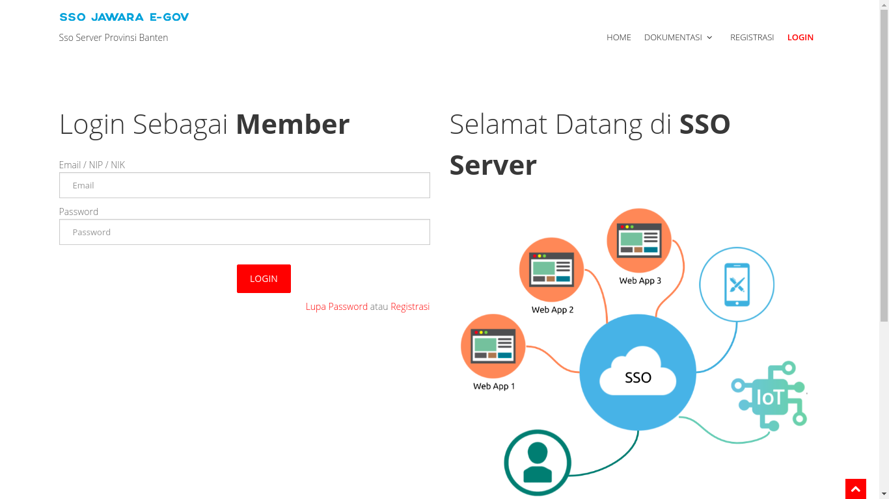
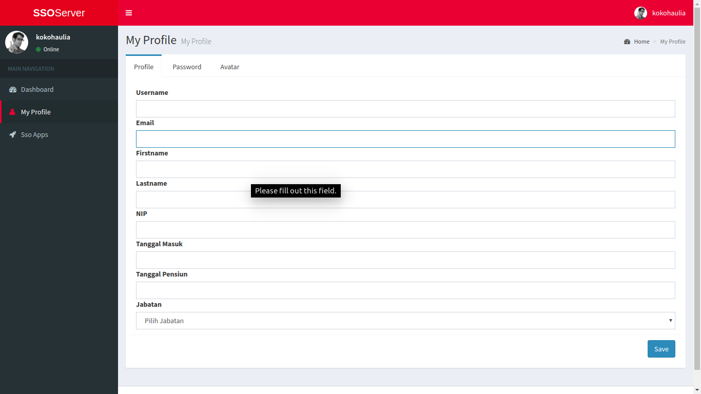
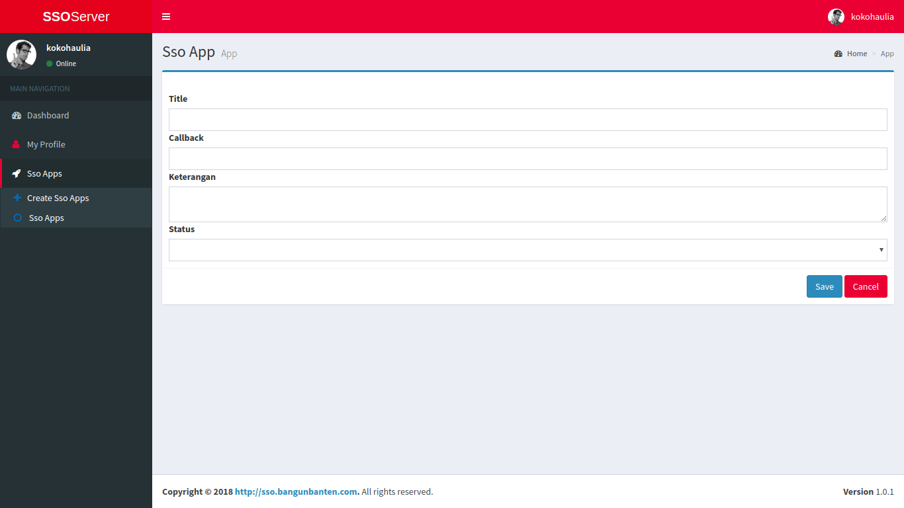

## Daftar Isi

[TOC]

## *Single Sign On* (SSO)

SSO (*Single Sign On*) adalah Sistem pada pemerintahan Provinsi Banten yang memungkinkan masyarakat khususnya pada Provinsi Banten untuk dapat mengakses semua fasilitas aplikasi dan layanan yang terdapat pada pemerintahan Provinsi Banten dengan melakukan otentikasi menggunakan satu akun id.

## 1. Pendahuluan

### 1.1 Tujuan Pembuatan Implementasi

Dokumen User Manual Apliksai SSO ini dibuat untuk tujuan sebagai berikut:

1. Menggambarkan dan menjelaskan penggunaan aplikasi SSO.
2. Sebagai panduan konfigurasi dan penggunaan aplikasi SSO.

### 1.2 Deskripsi Umum Sistem

1. Deskripsi Umum Aplikasi SSO adalah aplikasi yang berbasis web yang akan dipakai oleh setiap golongan masyarakat dalam memudahkan untuk mengakses setiap aplikasi yang terdapat di pemerintahan Provinsi Banten.
2. Deskripsi Umum Kebutuhan Aplikasi yang Akan Diimplementasikan meliputi semua informasi yang bersifat teknis dan menjadi acuan dalam pengembangan apliksi.

## 2. Struktur Menu

Adapun menu yang terdapat pada aplikasi SSO adalah Sebagai Berikut:

1. Menu Halaman Awal Aplikasi
- Home
- Dokumentasi
  - Web Redirect
  - Android
- Registrasi
- Login

2. Menu Member
- Dashboard
- My Profile
  - Profile
  - Password
  - Avatar
- SSO Apps
  - create SSO Apps
  - SSO Apps
  
3. Menu Superadmin
- Dashboard
- Member & Apps Management
  - Member
  - Apps
  
## 3. Penggunaan

Pada bagian ini akan dijelaskan langkah - langkah penggunaan dari menu - menu yang terdapat pada aplikasi SSO.

### 3.1 Halaman Awal SSO

#### 3.1.1 Home SSO

Untuk mengakses aplikasi SSO, *user* dapat membuka web browser (IE, Mozila Firefox atau yang lainnya) dengan menulis alamat url https://satulogin.bantenprov.go.id/ kemudian tekan Enter pada tombol keyboard atau klik tombol Go pada browser. Akan muncul tampilan halaman Home SSO seperti gambar dibawah ini.

Pada halaman Home ini *user* dapat melihat beberapa informasi yang terdapat pada aplikasi SSO seperti aplikasi - aplikasi yang telah terdaftar di SSO dan menu - menu yang terdapat pada aplikasi SSO.

#### 3.1.2 Dokumentasi

Halaman Dokumentasi ini dapat diakses oleh *user* dengan cara mengklik Dokumentasi pada kolom menu di aplikasi SSO yang terletak di kanan atas aplikasi. Pada halaman Dokumentasi terdapat 2 sub menu yaitu :

##### 3.1.2.1 Web Redirect

Halaman ini dapat diakses oleh *user* dengan mengklik sub menu Web Redirect pada menu Dokumentasi. Pada halaman ini menjelaskan tentang gambaran umum pemakaian aplikasi melalui website.

##### 3.1.2.2 Android

Halaman ini dapat diakses oleh *user* dengan mengklik sub menu Android pada menu Dokumentasi. Pada halaman ini menjelaskan tentang gambaran umum pemakaian aplikasi melalui Android.

#### 3.1.3 Registrasi

Halaman Registrasi ini dapat diakses oleh *user* dengan cara mengklik Registrasi pada kolom menu di aplikasi SSO yang terletak di kanan atas aplikasi. Pada halaman Registrasi ini terdapat form registrasi yang dapat digunakan oleh *user* untuk mendaftar sebagai member baru pada aplikasi.

Pada form registrasi member tersebut terdapat beberapa *field* yang harus diisi oleh *user* untuk mendaftar sebagai member, setelah semua *field* terisi member dapat mengklik tombol Registrasi.

#### 3.1.4 Login

Halaman Login ini dapat diakses oleh *user* dengan cara mengklik Login pada kolom menu di aplikasi SSO yang terletak di kanan atas aplikasi. Pada halaman Login ini terdapat form login yang dapat diisi oleh *user* untuk masuk kedalam dashboard *user* sesuai dengan role masing - masing.

Pada form Login tersebut terdapat 2 (dua) field yang harus diisi oleh *user* untuk melakukan login kepada aplikasi SSO.

### 3.2 Halaman Member SSO

#### 3.2.1 Dashboar Member

Halaman Dashboard ini adalah halaman yang pertama kali muncul ketika member aplikasi SSO berhasil melakukan login.

#### 3.2.2 My Profile

Halaman My Profile ini dapat diakses oleh member dengan mengklik My Profile pada daftar menu *Main Navigation* yang terletak pada sebelah kiri aplikasi. Pada modul My Profile ini terdapat beberapa 3 tab yaitu:

##### 3.2.2.1 Profile

Halaman Profile ini dapat diakses oleh member dengan memilih tab profile pada data yang ditampilkan oleh modul My Profile. pada tab tersebut terdapat beberapa field yang dapat diisi oleh member untuk melengkapi atau mengganti data member. Setelah terisi member dapat mengklik tombol Save yang terdapat pada kanan bawah dari tab profile tersebut untuk menyimpan perubahan.

##### 3.2.2.2 Password

Halaman Password ini dapat diakses oleh member dengan memilih tab password pada data yang ditampilkan oleh modul My Profile. pada tab password tersebut terdapat beberapa field untuk mengganti paswword member. Setelah terisi member dapat mengklik tombol Save yang terdapat pada kanan bawah dari tab paswword tersebut untuk menyimpan perubahan.

##### 3.2.2.3 Avatar

Halaman Avatar ini dapat diakses oleh member dengan memilih tab avatar pada data yang ditampilkan oleh modul My Profile. pada tab avatar tersebut terdapat field untuk mengganti avatar dari member. Setelah memilih avatar yang diinginkan member dapat mengklik tombol Save pada kanan bawah dari tab avatar tersebut untuk menyimpan perubahan.

#### 3.2.3 SSO Apps

Halaman SSO Apps ini dapat diakses oleh member dengan mengklik SSO Apps pada daftar menu *Main Navigation* yang terletak pada sebelah kiri aplikasi. Pada modul SSO Apps ini terdapat beberapa 2 sub modul yaitu:

##### 3.2.3.1 Create SSO Apps

Halaman Create SSO Apps ini dapat diakses oleh member dengan memilih sub modul Create SSO Apps pada modul SSO Apps. Pada sub modul Create SSO Apps ini member dapat mendaftarkan aplikasi ke dalam aplikasi SSO dengan mengisi form Create SSO Apps, setelah mengisi field - field yang tersedia member dapat mengklik tombol Save untuk menyimpan data atau mengklik tombol Cancel untuk menggagalkan pendaftaran.

##### 3.2.3.2 SSO Apps

Halaman SSO Apps ini dapat diakses oleh member dengan memilih sub modul SSO Apps pada modul SSO Apps. Pada sub modul ini member dapat melihat data apliaksi yang telah didaftarkan oleh member.

### 3.2 Halaman Superadmin SSO

#### 3.2.1 Dashboar Superadmin

Halaman Dashboard ini adalah halaman yang pertama kali muncul ketika Superadmin aplikasi SSO berhasil melakukan login.

#### 3.2.2 Member & Apps Management

Halaman Member & Apps Management ini dapat diakses oleh superadmin dengan mengklik Member & Apps Management pada daftar menu *Main Navigation* yang terletak pada sebelah kiri aplikasi. Pada modul SSO Apps ini terdapat beberapa 2 sub modul yaitu:

##### 3.2.2.1 Member

Halaman Member ini dapat diakses oleh superadmin dengan memilih sub modul Member pada modul Member & Apps Management. Pada sub modul ini superadmin dapat melihat data member yang telah mendaftar pada aplikasi SSO.

##### 3.2.2.1 Apps

Halaman Apps ini dapat diakses oleh superadmin dengan memilih sub modul Apps pada modul Member & Apps Management. Pada sub modul ini superadmin dapat melihat data aplikasi - aplikasi yang telah didaftarkan oleh member kedalam aplikasi SSO.
