## ABSTRAK
Sistem informasi saat ini semakin berkembang pesat membuat semua pekerjaan dikehidupan ini banyak yang sudah beralih dibantu oleh teknologi informasi. Teknologi yang dapat membatu lebih mudah, cepat, aman dan efektif jelas sangatlah membantu siapa saja yang memanfaatkannya. Termasuk didalamnya untuk membantu setiap orang dalam mencari informasi tentang pelayanan klinis maupun administratifnya didalam bidang kesehatan.
Rumah sakit merupakan salah satu instansi pelayanan umum yang memerlukan sistem informasi. Informasi tersebut berdampak langsung terhadap kualitas pelayanan kesehatan. Oleh karena itu rumah sakit memerlukan sebuah sistem-sistem informasi manajemen untuk meningkatkan mutu pellayanan medis yang terintergrasi dengan fungsi utama rumah sakit kedalam satu sistem terpadu yang tersimpan dalam pusat datebase sehingga dapat membantu masyarakat dalam mencari informasi secara cepat, efisien dan efektif.

## Daftar Isi
* Will be replaced with the ToC, excluding the "Contents" header
{:toc}

## 1. PENDAHULUAN
Melihat semain majunya perkembangan teknologi sekarang ini, dibutuhkan suatu sistem informasi yang bisa memudahkan serta meningkatkan efisiensi kinerja dalam berbagai hal. Hasil dari sistem informasi yang baik adalah sistem informasi yang memudahkan dan berguna bagi instasi yang menggunakan. Sistem kerja yang tertata sesuai struktur yang ada adalah hal yang bisa meningkatkan kinerja dari suatu instansi.
Seiring dengan berkembangnya teknologi informasi dengan pesat dan banyaknya kebutuhan dalam teknologi informasi, dimana banyak instansi yang ingin menggunakan teknologi yang ada secara optimal sesuai kebutuhan mencapai hasil kerja yang baik bagi instansi tersebut. Dengan melihat institusi rumah sakit selalu mendapatkan tekanan untuk dapat memperbaiki pelayanan medis, mengurasi kesalahan medis, menyediakan akses informasi yang tepat waktu, dan pada saat yang sama harus bisa memonitor aktifitas pelayanan serta mengendaliakan biaya operasional. Untuk dapat memenuhi tuntutan ini, rumah sakit harus memiliki sistem informasi manajemen ( SIM ) terintegrasi yang bisa sharing informasi real-time, tepat dan akurat. Sistem informasi manajemen ini tidak bisa berjalan secara otomatis apabila tidk didukung sistem perangat lunak (Software Systems) atau sistem enterprise (Enterprise Software) yang sudah terdaftar dalam server rumah sakit tersebut.

## 2. METODE PENELITIAN
Untuk memperoleh data yang dapat menunjang aplikasi ini, maka diperlukan data teoritis dan data instansi terkait untuk mendapatkan data dan informasi yang berhubung dengan aplikasi ini.
Adapun penyususan melakukan beberapa penelitian yang diakukan dengan :

### 2.1 Metode yang Digunakan
penulis mengunakan metode prorotype untuk melakukan perancangan aplikasi pengaduan berbasis web dan android ini.
•	Ilustrasi Alur Prototyping

### 2.2 Metode Pengumpulan Data
Untuk mengumpulan data yang diperlukan untuk membangun sistem ini diadakan wawancara dan studi pustaka. Pengumpulan data ini dilakukan untuk mengetahui permasalahan dan gambaran sistem yang sedang berjalan sehingga dapat mengembangkannya untuk membentuk sistem baru yang dapat mendukung sistem yang sedang berjalan.
•	Studi pustaka, melakukan pengumpulan informasi dari buku text, internet sebagai referensi.
•	Wawancara, melakukan pengumpulan informasi dari hasil diskusi dengan pihak terkait sebagai bahan referensi

### 2.3 Metode Analisis
Pada metode ini dibuat aplikasi dengan melakukan analisis terhadap sistem yang sedang berjalan, analisis permasalahan yang ada, dan diberikan solusi untuk mengatasi permasalahan yang ada.

### 2.4 Perancangan Aplikasi
Setelah mengetahui masalah yang masyarakat hadapi pada saat melakukan pengaduan, maka akan dirancang aplikasi yang sesuai dengan kebutuhan untuk mempermudah masyarakat mencari informasi tentang rumah sakit khususnya di Banten.
Berikut adalah delapan aturan emas dalam perancangan user interface dalam pembuatan aplikasi yang dikemukakan oleh Shneiderman dan Plaisant (2010: 74 ), yaitu:
1.	Berusaha untuk konsisten Konsisten serangkaian action harus ada disituaasi yang sama, dalam perancangan User Interface, konsistensi sangat dianjurkan agar para pengguna tidak akan bingung dengan desain yang kita buat.
2.	Kegunaan yang universal Mengenali kebutuhan dari berbagai user akan desain untuk kemudahan pemakai seperti misalnya, penggunaan shortcut untuk meningkatkan kecepatan interaksi dengan aplikasi yang kita buat.
3.	Memberikan Feedback yang informatif Untuk setiap tindakan pengguna, harus ada sistem feedback. Untuk setiap tindakan yang sering dilakukan dan tidak terlalu penting, dapat diberikan Feedback yang sederhana.
4.	Merancang dialog untuk menghasilkan suatu penutupaan Urutan tindakan sebaiknya diorganisir dalam suatu kelompok dengan bagian awal, tengah, dan akhir.
5.	Prevent Errors Sebiasa mungkin desain aplokasi kita agar pengguna tidak melakukan kesalahan fatal. Dan apabila pengguna melakukan kesalahan, maka aplikasi harus mendeteksi kesalahan dan menuntun pengguna untuk memperbaiki kesalah tersebut.
6.	Memudahkan untuk kembali ke tindakan sebelumnya. Hal ini dapat mengurangi kekhawatiran pengguna untuk mengambil tindakan. Karena, apabila terdapat kesalahan pengguna akan mudah kembali ketindakan sebelumnya.
7.	Mendukung kendali internal Memberikan pengguna kendali penuh terhadap aplikasi yang digunakan. Karena para pengguna lebih suka merasa bahwa mereka yang memegang kendali terhadap apikasi daripada mereka yang dikendali aplikasi.
8.	Mengurangi ingatan jangka pendek Jangan membuat para pengguna mengingat terlalu banyak akan tampilan halaman, kode, dan tombol-tombol. Sebaikya jadikan semua itu simple.

## 3. HASIL DAN PEMBAHASAN
### 3.1 Kebutuhan Software dan Hardware
Adapun alat bantu software dan hardware dalam melakukan analisis dan perancangan aadalah sebagai berikut:

#### 3.1.1 Software
•	Ubuntu 17.04
•	Typora (Markdown) & dillinger.io
•	Gliffy Diagram

#### 3.1.2 Hardware
Laptop dengan spesifikasi sebagai berikut:
•	Intel Celeron N2830 Speed 2.16 Ghz Turbo Boost 2.14 Ghz
•	Memori DDR3 2GB
•	Hard disk 500GB

### 3.2 Analisis Permasalahan
Permasalahan yang terjadi dalam masyarakat saat ini adalah sebagai berikut:
1.	Kurang efektif dalam hal waktu pada saat ingin melakukan konsultasi pasien harus bertemu dengan dokter dirumah sakit tanpa mengetahui apakah dokter tersebut hadir atau tidak
2.	Kurangnya informasi yang diterima oeh masyarakat tentang jumlah ruang rawat inap sehingga susah melarikan orang yang sedang sakit
3.	Kurangnya informasi tentang obat yang dikonsumsi oleh pasien

### 3.3 Solusi
Solusi yang kami tawarkan adalah pembuatan sebuah sistem informasi manajemen yang mencakup;
1.	Konten Konsultasi antara pasien dan dokter
2.	Konten jumlah ruang rawat inap yang tersedia di rumah sakit
3.	Konten obat yag memberikan info tentang obat yang terdapat di rumah sakit beserta harganya

### 3.4 Perancangan Aplikasi
"Aplikasi dan Perancangan Sistem Informasi Manajemen Rumah Sakit Provinsi Banten Berbasis Web" adalah sebuah aplikasi yang memberikan informasi tentang segala kegiatan pelayanan klinis maupun administratif rumah sakit yang terdapat di Banten. masyarakat dapat mengakses aplikasi ini dengan cara membuka aplikasi dari web. Semua informasi dapat di input oleh pihak rumah sakit, admin dan apoteker yang nanti akan tersimpan semua data kedalam pusat database.

### 3.5 Perancangan Database
pada database yang digunakan oleh single user atau hanya beberapa user saja, perancangan database tidak sulit. tetapi jika ukuran database yang sedang atau besar ( 25 - ratusan user yang berisikan jutaan bytes informasi dan melibatkan ratusan query dan program program aplikasi) perancangan database menjadi sangat komplek. Oleh karena itu para pemakai mengharapkan penggunaan database yang sedemikian rupa sehingga sistem harus dapat memenuhi kebutuhan-kebutuhan seluruh user tersebut.

#### 3.5.1 Tujuan perancangan database:
•	Untuk memenuhi informasi yang diberisikan kebutuhan-kebutuhan user secara khusus dan aplikasi-aplikasinya.
•	Memudahkan pengertian struktur informasi
•	Mendukung kebutuhan-kebutuhan pemrosesan dan beberapa obyek penampilan (response time, processing time dan storage space)

#### 3.5.2 Proses Perancangan Database
proses perancangan database terdiri dari 6 tahap:
•	Tahap 1, Pengumpulan data dan analisis
•	Tahap 2, Perancangan database secara konseptual
•	tahap 3, Pemilihan DBMS
•	Tahap 4, Perancangan Database secara logika (data model mapping)
•	Tahap 5, Perancangan database secara fisik
•	Tahap 6, Implementasi sistem database
semakin banyak permintaan kepada aplikasi dapat mempengaruhi data yg terdapat di database. Contoh relasi permintaan aplikasi dengan status dan log

[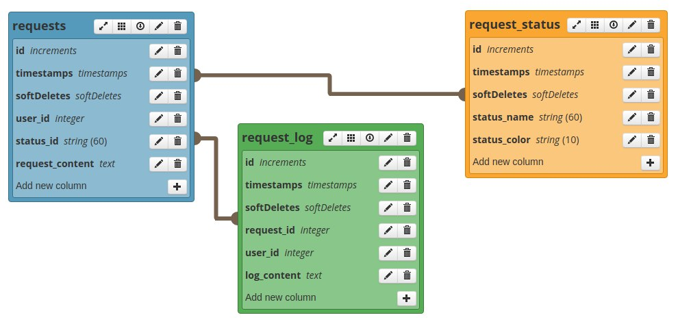](../images/yankes/desain-dan-perancangan/rancangan-database.jpg)

### 3.6 Perancangan Sistem
Permodelan rancangan sistem yang dgunakan adalah UML (Unified Modeling Language). Menurut Whitten dan Bentley (2007, p.381), Unified Modeling Language adalah kumpulan rancangan diagram untuk membangun sebuah sistem atau aplikasi yang dimana setiap diagram menyediakan sistem informasi kepada tim pengembang dengan berbagai sudut pandang yang berbeda-beda. UML yang kami gunakan terdiri dari use case diagram, activity diagram, sequence diagram, state chart diagram, class diagram, technology diagram dan deployment diagram.

#### 3.6.1 Super Admin
##### 3.6.1.1 Use Case Diagram Super Admin

##### 3.6.1.2 Activity Diagram Super Admin
###### 3.6.1.2.1 Super Admin Login

[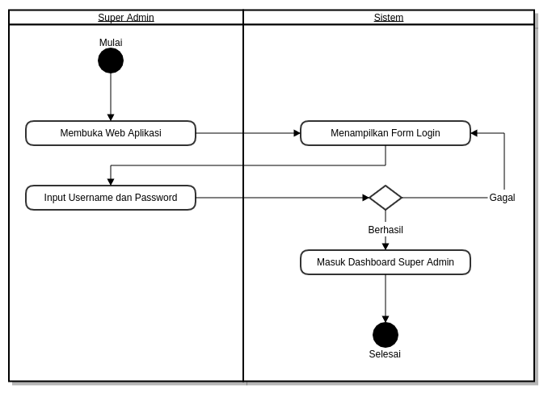](../images/yankes/desain-dan-perancangan/activity-diagram-login-super-admin.png)

##### 3.6.1.3 Sequence Diagram Super Admin

[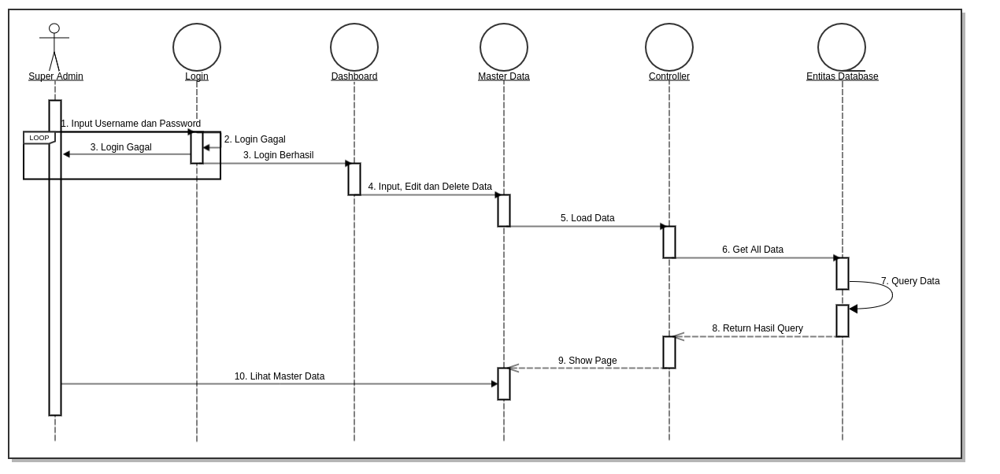](../images/yankes/desain-dan-perancangan/sequence-diagram-super-admin.png)

##### 3.6.1.4 State Chart Diagram Super Admin
###### 3.6.1.4.1 Super Admin Login

[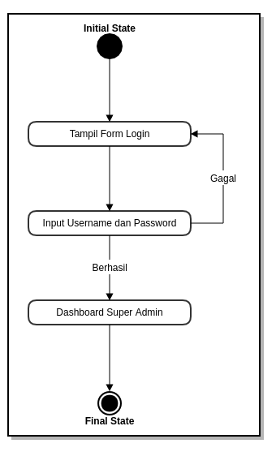](../images/yankes/desain-dan-perancangan/state-chart-diagram-super-admin-login.png)

###### 3.6.1.4.2 Super Admin Input Admin RS

[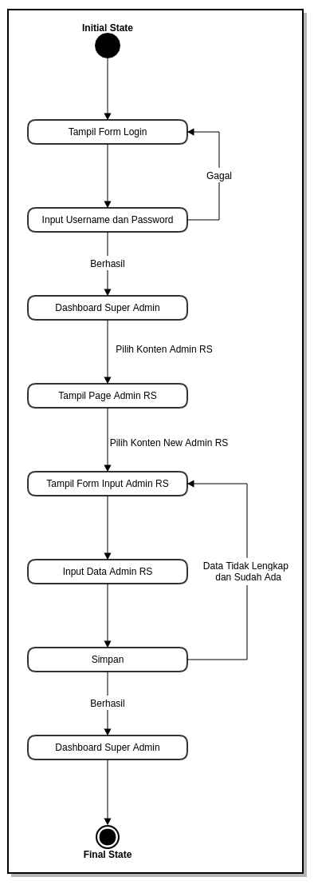](../images/yankes/desain-dan-perancangan/state-chart-diagram-super-admin-input-admin.png)

#### 3.6.2 Pasien
##### 3.6.2.1 Case Diagram Pasien

[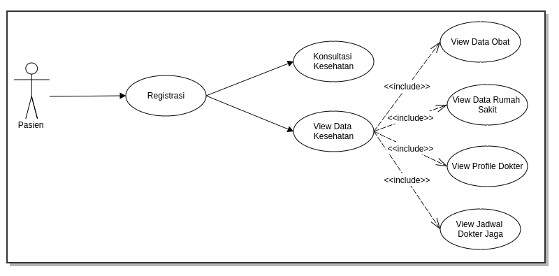](../images/yankes/desain-dan-perancangan/use-case-pasien.png)

##### 3.6.2.2 Activity Diagram Pasien
###### 3.6.2.2.1 Pasien Registrasi

[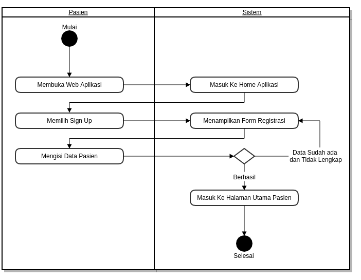](../images/yankes/desain-dan-perancangan/activity-diagram-pasien-registrasi.png)

###### 3.6.2.2.2 Pasien Login

[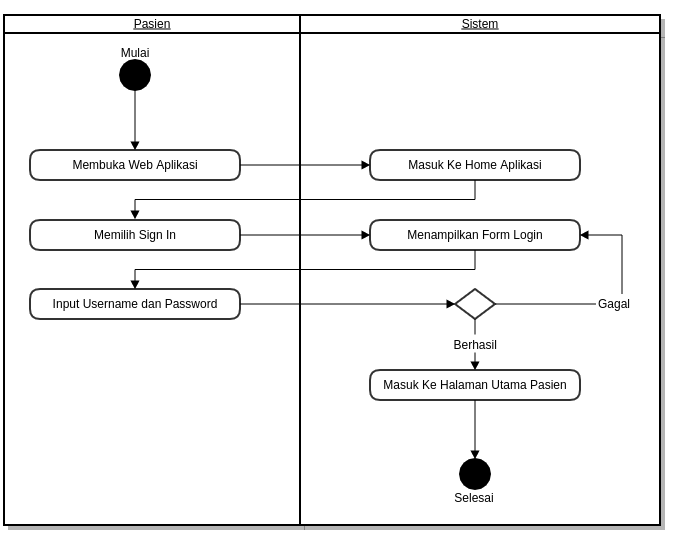](../images/yankes/desain-dan-perancangan/activity-diagram-pasien-login.png)

###### 3.6.2.2.3 Pasien Lihat Rumah Sakit

[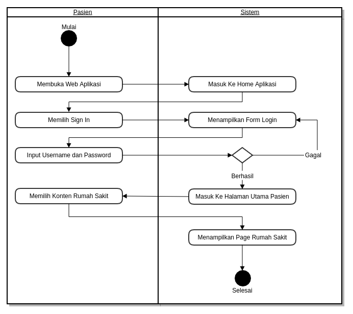](../images/yankes/desain-dan-perancangan/activity-diagram-pasien-view-rumah-sakit.png)

###### 3.6.2.2.4 Pasien Lihat Dokter

[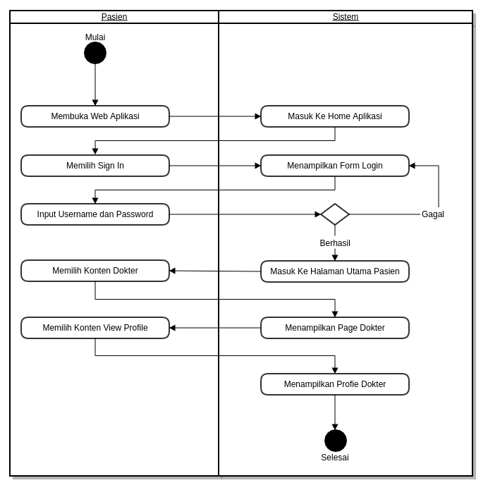](../images/yankes/desain-dan-perancangan/activity-diagram-pasien-view-profile-dokter.png)

###### 3.6.2.2.5 Pasien Lihat Kamar Inap

[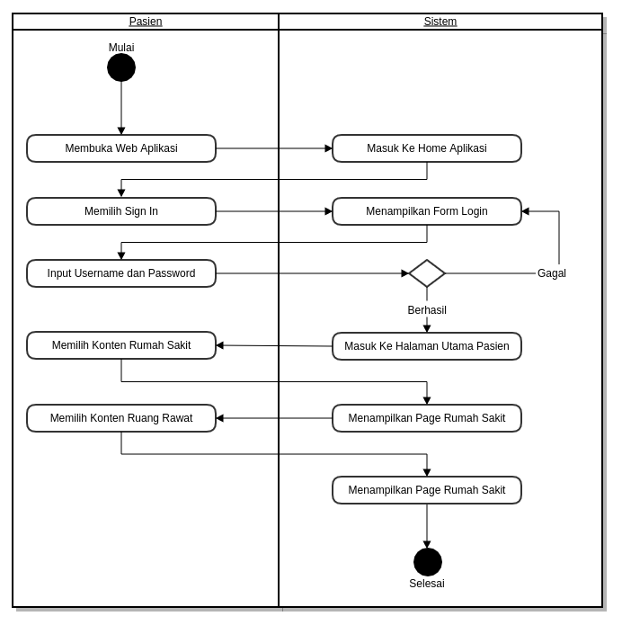](../images/yankes/desain-dan-perancangan/activity-diagram-pasien-view-ruang-rawat.png)

#### 3.6.3 Tampilan dalam Aplikasi Mobile (Android)
##### 3.6.3.1 Layout Tampilan Dashboard

[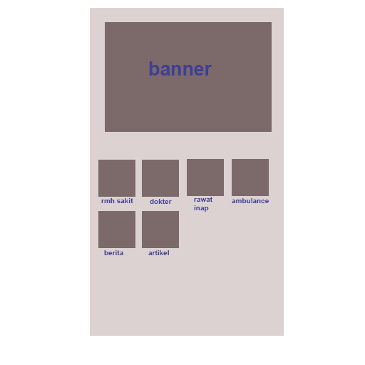](../images/yankes/desain-dan-perancangan/dashboard-yankes-mobile.png)

Dalam layout ini hanya ada tombol menu yang berada di bawah terdapat beberapa menu. Dalam layout ini juga terdapat image slider yang berfungsi untuk menampilkan banner yang akan berganti setiap 3 detik. Ada juga pilihan kategori laporan yang berbentuk grid atau baris, jumlah item dalam grid ini tergantung pada jumlah kategori yang ada dalam database.

##### 3.6.3.2 Layout Tampilan Menu Rumah Sakit

[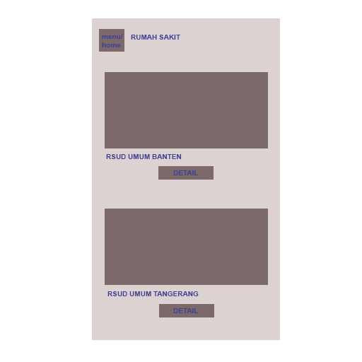](../images/yankes/desain-dan-perancangan/menu-rumah-sakit.png)

Layout tampilan menu rumah sakit hanya terdiri dari Gambar dan nama setiap Rumah Sakit yang berada di Provinsi Banten yang terdapat di Aplikasi Yankes, dan Detail dari setiap rumah sakit yang ada.

##### 3.6.3.3 Layout Tampilan Profile Rumah Sakit

[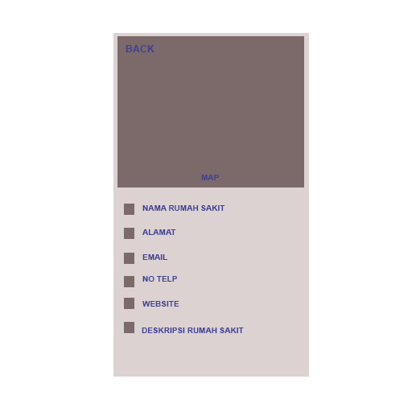](../images/yankes/desain-dan-perancangan/detail-rumah-sakit.png)

Dalam layout tampilan ini terdapat tombol kembali yang berbeda di pojok kiri atas foto profile rumah sakit, nama dari rumah sakit, alamat dari rumah sakit, email, no telpon, website serta informasi dari rumah sakit tersebut.

##### 3.6.3.4 Layout Tampilan Menu Dokter

Dalam layout ini hanya terdapat tombol menu di pojok kiri atas, dan Nama Dokter Spesialis diatas menunjukan bahwa anda masuk ke dalam tampilan menu dokter. Dalam tampilan ini juga terdarap setiap Layout yang menunjukan setiap nama-nama dari dokter serta spesialisnya.

##### 3.6.3.5 Layout Tampilan Profile Dokter

[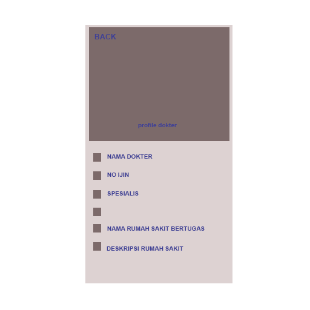](../images/yankes/desain-dan-perancangan/detail-dokter.png)

Layout ini tidak jauh beda dengan layout Profile Rumah Sakit, yang membedakannya hanya tampilan dan nama serta keterangan yang tersedia, seperti gambar diatas.

##### 3.6.3.6 Layout Tampilan Rawat Inap

[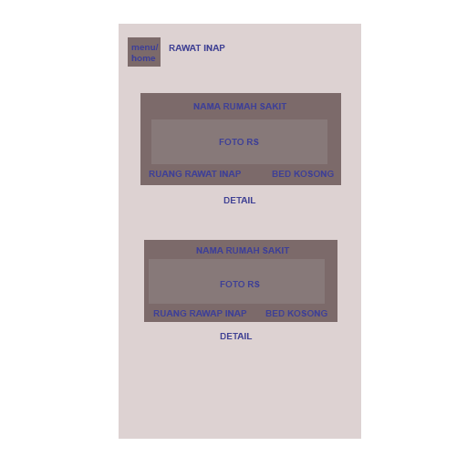](../images/yankes/desain-dan-perancangan/menu-rawat-inap.png)

Dalam tampilan ini, terdiri dari tombol kembali yang ada di pojok kiri atas, dan beberapa keterangan lain nya mengenai yang berhubungan dengan tersedia nya ruang rawat inap dari setiap rumah sakit yang ada.

##### 3.6.3.7 Layout Tampilan Detail Rawat Inap

[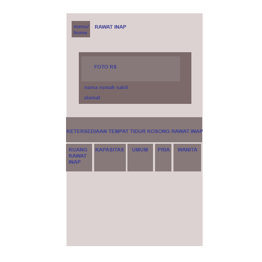](../images/yankes/desain-dan-perancangan/detail-rawat-inap.png)

Tampilan ini hanya terdiri dari list kategori rawat inap yang tersedia di rumah sakit.

##### 3.6.3.8 Layout Tampilan Ambulance

[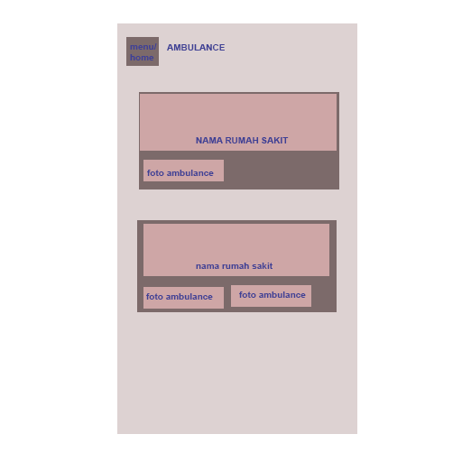](../images/yankes/desain-dan-perancangan/menu-ambulance.png)

Pada layout ini,terdiri dari nama rumah sakit dan ada berapa jumlah mobil Ambulance yang tersedia dari rumah sakit tersebut.

##### 3.6.3.9 Layout Tampilan Berita

Dalam tampilan ini berisi tentang berita atau blog-blog yang mengenai tentang kesehatan

##### 3.6.3.10  Layout Tampilan Artikel

[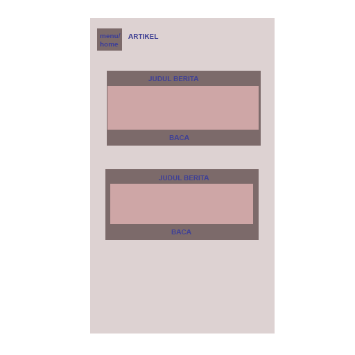](../images/yankes/desain-dan-perancangan/menu-artikel.png)

Pada tampilan ini hampir sama dengan tampilan pada menu berita mengenai tentang artikel-artikel tentang kesehatan dan rumah sakit.

## 4. PENUTUP
Dengan adanya pengembangan dari sistem informasi manajemen pelayanan kesehatan ini untuk meningkatkan kinerja sistem yang telah ada dan berjalan sebelumnya menjadi lebih rapih dan tertata sehingga dapat mempermudah dalam pengumpulan informasi dan pengaturan manejemen rumah sakit serta mempermudah masyarakat dalam mencari informasi. Aplikasi ini mempunyai kelebihan untuk memperoleh data yang cepat, tepat dan akurat mengenai info rumah sakit yang terdapat di Pemprov Banten. Sistem ini memberikan kemudahan dalam beberapa hal seperti : pencatatan data rumah sakit, pencatatan data dokter dan kemudahan dalam mencari informasi tentang pelayanan kesehatan.
